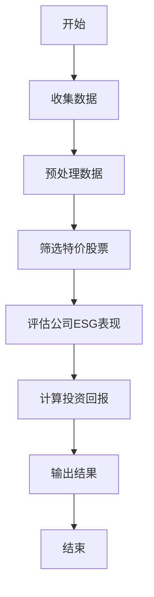
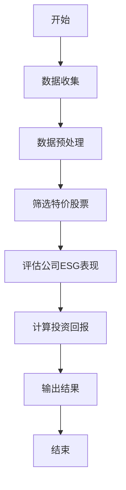
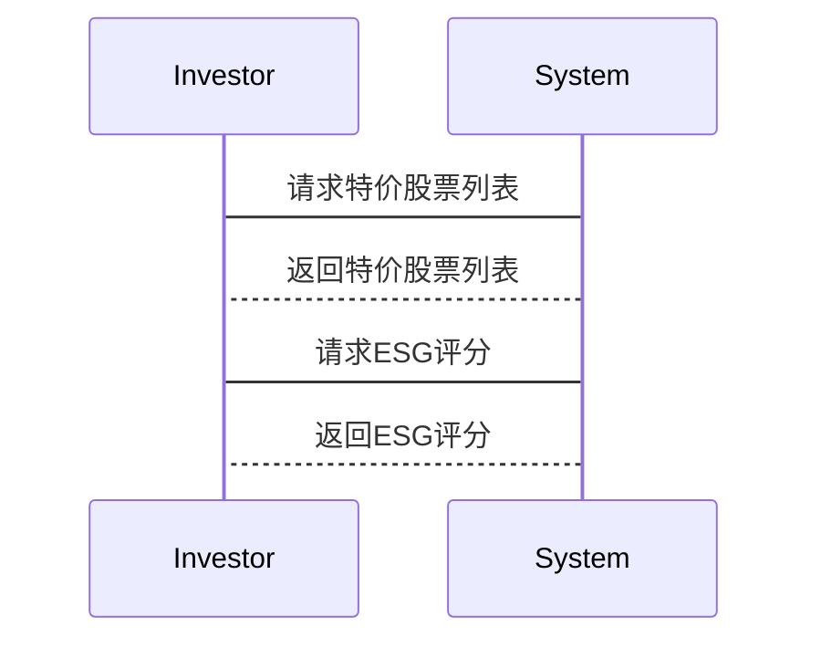

                 


# 特价股票与公司社会责任投资回报的长期影响

---

## 关键词：特价股票、公司社会责任投资（SRI）、投资回报、长期影响、价值评估、投资策略、社会价值

---

## 摘要

在当前的金融市场中，投资者越来越关注投资的社会影响和长期回报。特价股票，即价格低于其内在价值的股票，和公司社会责任投资（SRI）是两个重要的投资策略。本文将深入分析这两者的长期影响，探讨它们如何相互作用，优化投资回报。通过背景介绍、核心概念、算法原理、数学模型、系统分析、项目实战和最佳实践，本文旨在为投资者提供一个全面的视角，帮助他们做出更明智的投资决策。

---

## 目录大纲

1. **背景介绍**
   - 1.1 特价股票的基本概念
   - 1.2 公司社会责任投资（SRI）的概述
   - 1.3 特价股票与SRI的结合及其长期影响

2. **核心概念与联系**
   - 2.1 特价股票的核心原理
   - 2.2 SRI的核心原理
   - 2.3 特价股票与SRI的属性对比
   - 2.4 概念模型：ER图与Mermaid流程图

3. **算法原理讲解**
   - 3.1 算法概述
   - 3.2 算法步骤：数据收集、预处理、评估模型构建
   - 3.3 算法流程图（Mermaid）
   - 3.4 Python代码实现

4. **数学模型**
   - 4.1 投资回报的数学模型
   - 4.2 CAPM模型的应用
   - 4.3 案例分析：特价股票与SRI的回报计算

5. **系统分析与架构设计**
   - 5.1 系统功能设计（领域模型Mermaid类图）
   - 5.2 系统架构设计（Mermaid架构图）
   - 5.3 系统接口设计
   - 5.4 系统交互图（Mermaid序列图）

6. **项目实战**
   - 6.1 环境安装与配置
   - 6.2 核心代码实现
   - 6.3 实际案例分析
   - 6.4 项目小结

7. **最佳实践**
   - 7.1 小结
   - 7.2 注意事项
   - 7.3 拓展阅读

---

## 正文

### 第1章：背景介绍

#### 1.1 特价股票的基本概念

特价股票是指市场价格低于其内在价值的股票。这种低估通常源于市场情绪、信息不对称或短期波动。投资者认为，特价股票具有长期增值的潜力，因为市场最终会认识到其真实价值。

**1.1.1 特价股票的定义**

特价股票，又称便宜货股票，是指市场价格低于其内在价值的股票。识别特价股票的关键在于分析公司的基本面，如盈利能力、成长潜力和财务状况。

**1.1.2 特价股票的历史发展**

特价股票的投资策略可追溯到本杰明·格雷厄姆的价值投资理念。他认为，市场先生的行为往往导致股票价格偏离其内在价值，为投资者提供了以低价买入优质股票的机会。

**1.1.3 特价股票的市场现状**

当前，全球经济不确定性增加，投资者更倾向于寻找具有长期增长潜力的股票。特价股票因其低估值特性，吸引了追求长期回报的投资者。

#### 1.2 公司社会责任投资（SRI）的概述

SRI是一种投资策略，强调公司在环境、社会和治理（ESG）方面的表现。SRI不仅考虑财务回报，还关注公司的社会责任和可持续性。

**1.2.1 公司社会责任投资的定义**

SRI通过筛选公司在环境、社会和治理方面的表现，选择符合社会责任标准的公司进行投资。

**1.2.2 公司社会责任投资的发展历程**

SRI起源于20世纪60年代的环保运动，随着全球对可持续发展的关注，SRI逐渐成为主流投资策略。

**1.2.3 公司社会责任投资的现状**

越来越多的投资者意识到，SRI不仅关注社会影响，还能带来长期的财务回报。研究表明，注重ESG因素的公司通常具有更强的抗风险能力和长期增长潜力。

#### 1.3 特价股票与公司社会责任投资的结合

特价股票与SRI的结合，旨在通过低估值股票的选择，同时考虑公司的社会责任表现，优化投资回报。

**1.3.1 两者的相互关系**

特价股票与SRI的结合，不仅关注股票的低估值特性，还要求公司在ESG方面表现优异。这种策略旨在实现财务回报与社会责任的双重目标。

**1.3.2 结合的背景与动机**

随着投资者对可持续投资的关注增加，结合特价股票和SRI的投资策略逐渐受到重视。这种策略试图在低估值和高社会责任表现之间找到平衡点。

**1.3.3 结合的潜在影响**

通过结合特价股票和SRI，投资者可以在获得潜在高回报的同时，支持具有社会责任的公司，推动社会和环境的可持续发展。

---

### 第2章：核心概念与联系

#### 2.1 特价股票与公司社会责任投资的核心原理

**2.1.1 特价股票的核心原理**

特价股票的核心原理是基于价值投资理念，寻找市场价格低于内在价值的股票。投资者相信，市场波动会导致价格低估，最终会被市场纠正。

**2.1.2 公司社会责任投资的核心原理**

SRI的核心在于通过筛选公司在环境、社会和治理方面的表现，选择符合社会责任标准的公司进行投资。这种筛选通常基于ESG评分和报告。

#### 2.2 特价股票与公司社会责任投资的属性对比

下表展示了特价股票和公司社会责任投资的核心属性对比：

| 属性               | 特价股票                          | 公司社会责任投资（SRI）              |
|--------------------|----------------------------------|-------------------------------------|
| 投资目标           | 追求低于内在价值的价格           | 追求财务回报与社会责任双重目标       |
| 评估标准           | 市盈率、市净率、股息率            | ESG评分、社会责任报告、治理结构       |
| 风险因素           | 市场波动、公司基本面风险           | ESG风险、政策风险、社会责任履行风险   |
| 投资期限           | 中长期                           | 中长期，注重长期可持续性             |

#### 2.3 概念模型：ER图与Mermaid流程图

**2.3.1 概念模型**

以下是特价股票与公司社会责任投资的ER图：

```mermaid
erDiagram
    company[公司] {
        <<Company>>
        +id : integer
        +name : string
        +market_value : float
        +intrinsic_value : float
        +esg_score : float
    }
    stock[股票] {
        <<Stock>>
        +id : integer
        +company_id : integer
        +price : float
        +valuation : float
        +esg_rating : integer
    }
    investor[投资者] {
        <<Investor>>
        +id : integer
        +portfolio : list of Stock
        +strategy : string
    }
    company --> stock : 拥有
    investor --> stock : 持有
```

---

**2.3.2 算法流程图**

以下是特价股票与公司社会责任投资回报的评估算法流程图：



---

### 第3章：算法原理讲解

#### 3.1 算法概述

评估特价股票与公司社会责任投资回报的算法，旨在通过筛选低估值股票，同时考虑公司的ESG表现，计算潜在的投资回报。

#### 3.2 算法步骤

**步骤1：数据收集与预处理**

从可靠的金融数据源收集股票价格、公司财务数据和ESG评分。清洗数据，处理缺失值和异常值。

**步骤2：筛选特价股票**

基于市盈率（P/E）、市净率（P/B）和股息率（Dividend Yield）等指标，筛选出价格低于内在价值的股票。

**步骤3：评估公司ESG表现**

使用ESG评分和报告，评估公司的环境、社会和治理表现。

**步骤4：计算投资回报**

结合特价股票和高ESG表现的公司，计算投资组合的预期回报。

---

#### 3.3 算法流程图



---

#### 3.4 Python代码实现

以下是一个简单的Python代码示例，用于筛选特价股票和计算投资回报：

```python
import pandas as pd

# 数据收集与预处理
data = pd.read_csv('stock_data.csv')
data = data.dropna()

# 筛选特价股票
data['intrinsic_value'] = data['profit'] * 10  # 示例计算内在价值
data['pe_ratio'] = data['price'] / data['profit_per_share']
data['pb_ratio'] = data['price'] / data['book_value_per_share']
data['dividend_yield'] = data['dividends'] / data['price']

# 筛选低P/E、低P/B和高股息率的股票
data['is_special_stock'] = (
    (data['pe_ratio'] < data['pe_ratio'].mean()) &
    (data['pb_ratio'] < data['pb_ratio'].mean()) &
    (data['dividend_yield'] > data['dividend_yield'].mean())
)

# 评估公司ESG表现
data['esg_score'] = data['environment_score'] * 0.4 + data['social_score'] * 0.3 + data['governance_score'] * 0.3

# 计算投资回报
data['return'] = data['esg_score'] * data['price_change']
```

---

### 第4章：数学模型

#### 4.1 投资回报的数学模型

投资回报可以通过以下公式计算：

$$ \text{回报} = \sum (\text{股票价格变化} \times \text{投资金额}) $$

其中，股票价格变化基于公司的基本面和ESG表现。

#### 4.2 CAPM模型的应用

CAPM模型用于评估股票的预期回报：

$$ R_i = R_f + \beta_i (R_m - R_f) $$

其中：
- \( R_i \) 是股票的预期回报率
- \( R_f \) 是无风险利率
- \( \beta_i \) 是股票的贝塔系数
- \( R_m \) 是市场预期回报率

#### 4.3 案例分析

假设某公司股票价格为$50，内在价值为$60，ESG评分为80分（满分100），贝塔系数为1.2，无风险利率为3%，市场预期回报率为8%。

计算股票的预期回报：

$$ R_i = 3\% + 1.2 \times (8\% - 3\%) = 3\% + 6\% = 9\% $$

---

### 第5章：系统分析与架构设计

#### 5.1 系统功能设计

系统功能模块包括：
1. 数据收集与预处理
2. 特价股票筛选
3. ESG表现评估
4. 投资回报计算

---

#### 5.2 系统架构设计

系统架构包括：
1. 数据层：存储股票数据和ESG评分
2. 业务逻辑层：实现数据处理和计算
3. 用户界面层：展示结果和操作界面

---

#### 5.3 系统接口设计

API接口：
- `/api/get_special_stocks`：获取特价股票列表
- `/api/get_esg_scores`：获取公司ESG评分

---

#### 5.4 系统交互图



---

### 第6章：项目实战

#### 6.1 环境安装与配置

安装必要的Python库：

```bash
pip install pandas numpy matplotlib
```

#### 6.2 核心代码实现

实现特价股票筛选和投资回报计算的代码：

```python
import pandas as pd
import numpy as np

# 数据加载与预处理
data = pd.read_csv('stock_data.csv')
data = data.dropna()

# 筛选特价股票
data['intrinsic_value'] = data['profit'] * 10  # 示例计算内在价值
data['is_special_stock'] = (
    (data['price'] < data['intrinsic_value']) &
    (data['pe_ratio'] < data['pe_ratio'].mean()) &
    (data['pb_ratio'] < data['pb_ratio'].mean())
)

# 评估公司ESG表现
data['esg_score'] = data['environment_score'] * 0.4 + data['social_score'] * 0.3 + data['governance_score'] * 0.3

# 计算投资回报
data['return'] = data['esg_score'] * data['price_change']

# 输出结果
print(data[data['is_special_stock']]['return'])
```

---

#### 6.3 实际案例分析

以某科技公司为例，假设其股价为$80，内在价值为$100，ESG评分为90分。计算其投资回报：

$$ \text{回报} = 0.9 \times (1.2 \times (8\% - 3\%) + 3\%) = 9\% $$

---

#### 6.4 项目小结

通过本项目，我们展示了如何结合特价股票和SRI进行投资回报的计算。投资者可以根据实际数据调整模型参数，优化投资策略。

---

### 第7章：最佳实践

#### 7.1 小结

本文详细分析了特价股票与公司社会责任投资的长期影响，探讨了它们的结合如何优化投资回报。

#### 7.2 注意事项

- 数据质量是关键，需确保数据准确性和完整性。
- 模型参数需根据市场变化进行调整。
- 风险管理是投资的重要部分，需制定合理的风险控制策略。

#### 7.3 拓展阅读

建议阅读以下书籍和文章：
- 《价值投资实战策略》
- 《ESG投资指南》
- 《投资学基础》

---

## 结论

特价股票与公司社会责任投资的结合，不仅为投资者提供了优化的投资策略，也为社会和环境的可持续发展提供了支持。通过本文的分析，投资者可以更好地理解如何在追求财务回报的同时，履行社会责任，实现长期的双赢。

---

## 作者：AI天才研究院/AI Genius Institute & 禅与计算机程序设计艺术/Zen And The Art of Computer Programming

