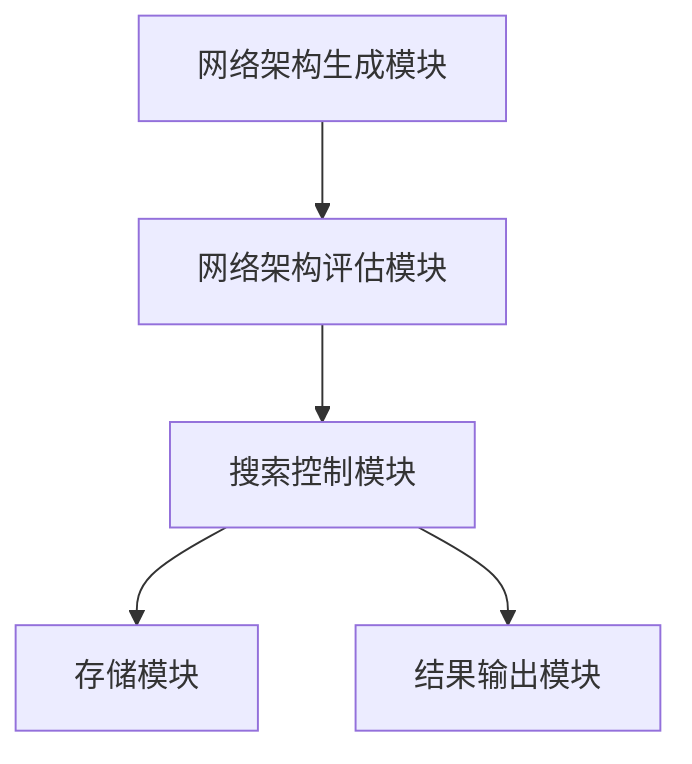
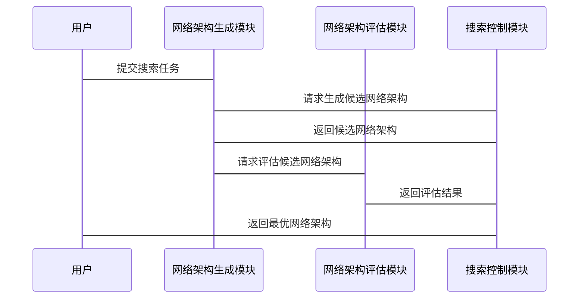

                 


# 神经网络架构搜索：为AI Agent找到最佳结构

> 关键词：神经网络架构搜索, AI Agent, 深度学习, 网络结构优化, 自动化机器学习

> 摘要：神经网络架构搜索（Neural Architecture Search, NAS）是一种通过自动搜索最优神经网络结构的方法，旨在为AI Agent提供高效、准确的解决方案。本文从背景介绍、核心概念、算法原理、系统架构、项目实战等多方面详细探讨NAS的技术原理和应用实践，帮助读者理解如何通过自动化方法找到最优的神经网络结构。

---

# 第1章 神经网络架构搜索概述

## 1.1 神经网络架构搜索的背景与意义

### 1.1.1 深度学习与AI Agent的发展背景

近年来，深度学习技术的快速发展推动了人工智能（AI）技术的广泛应用。AI Agent作为一种能够感知环境、自主决策的智能体，其核心依赖于高效的神经网络模型。然而，随着模型复杂度的增加，人工设计神经网络架构的效率逐渐成为瓶颈。神经网络架构搜索（NAS）技术的出现，为AI Agent的开发提供了新的可能性。

### 1.1.2 神经架构搜索的核心目标

神经架构搜索的目标是通过自动化的方法，寻找最优的神经网络架构，以最大化模型的性能（如准确率、速度等）。与传统的手动设计相比，NAS能够大幅减少开发时间，并帮助发现更优的模型结构。

### 1.1.3 神经架构搜索的价值与挑战

NAS技术的核心价值在于其高效性和通用性。通过自动化搜索，我们可以快速探索大量的网络架构，找到在特定任务和数据集上表现最佳的模型。然而，NAS也面临计算资源消耗大、搜索空间复杂等挑战，需要通过算法优化和策略改进来克服。

---

## 1.2 神经网络架构搜索的定义与目标

### 1.2.1 神经网络架构搜索的定义

神经网络架构搜索（NAS）是一种通过自动搜索算法，寻找最优神经网络结构的过程。它将网络架构表示为一系列操作（如卷积、激活函数等）的组合，并通过搜索算法在这些操作的组合空间中寻找最优解。

### 1.2.2 神经架构搜索的核心目标

1. **性能优化**：在给定任务和数据集上，找到性能最优的网络架构。
2. **效率提升**：减少人工设计网络架构的时间和成本。
3. **泛化能力**：通过自动化搜索，适应不同任务和数据集的需求。

### 1.2.3 神经架构搜索的优势与挑战

- **优势**：
  - **高效性**：通过自动化搜索减少人工设计的繁琐过程。
  - **多样性**：能够探索更多潜在的网络架构，发现新的最优结构。
- **挑战**：
  - **计算资源**：NAS需要大量的计算资源，尤其是对于大规模搜索空间。
  - **搜索空间**：复杂的搜索空间可能导致搜索效率低下。

---

## 1.3 神经网络架构搜索在AI Agent中的应用

### 1.3.1 AI Agent的定义与特点

AI Agent是一种能够感知环境、自主决策的智能体，广泛应用于自动驾驶、智能助手、机器人控制等领域。AI Agent的核心依赖于高效的感知和决策模型，而神经网络架构搜索技术为这些模型的设计提供了新的思路。

### 1.3.2 神经架构搜索在AI Agent中的作用

在AI Agent中，神经架构搜索技术主要用于优化感知模块（如视觉、语音处理）和决策模块（如路径规划、动作选择）的网络结构。通过自动化搜索，可以找到在特定任务中表现最优的网络架构，提升AI Agent的性能和效率。

### 1.3.3 神经架构搜索的实际应用案例

1. **图像识别任务**：通过NAS技术优化卷积神经网络架构，提升图像分类的准确率。
2. **自然语言处理**：通过NAS技术优化语言模型的架构，提升文本理解能力。
3. **机器人控制**：通过NAS技术优化动作规划网络的架构，提升机器人控制的效率和精度。

---

## 1.4 本章小结

本章主要介绍了神经网络架构搜索的背景、定义、目标以及在AI Agent中的应用。通过自动化搜索技术，NAS能够帮助我们快速找到最优的网络架构，提升AI Agent的性能和效率。然而，NAS技术也面临计算资源和搜索空间的挑战，需要进一步优化和改进。

---

# 第2章 神经网络架构搜索的核心概念

## 2.1 神经网络架构搜索的搜索空间

### 2.1.1 神经网络架构的表示方法

神经网络架构可以通过一系列操作（如卷积、激活函数、池化等）的组合来表示。例如，ResNet架构通过跳跃连接操作（skip connection）优化网络结构，提升了模型的性能。

### 2.1.2 搜索空间的结构与特点

搜索空间是指所有可能的网络架构的集合。为了高效地搜索最优架构，通常需要对搜索空间进行合理的定义和约束。例如，可以通过限制网络的深度和宽度，缩小搜索空间的规模。

### 2.1.3 搜索空间的优化策略

为了提高搜索效率，可以通过以下策略优化搜索空间：
1. **剪枝策略**：去除那些明显不优的网络架构。
2. **分层搜索**：将搜索空间分成多个层次，逐步细化搜索范围。
3. **共享计算资源**：在多个任务中共享部分网络架构，减少重复计算。

---

## 2.2 神经网络架构搜索的搜索策略

### 2.2.1 基于强化学习的搜索策略

强化学习是一种通过试错方法优化行为策略的技术。在NAS中，可以通过强化学习算法（如策略梯度方法）来优化网络架构的选择。

### 2.2.2 基于遗传算法的搜索策略

遗传算法是一种通过模拟自然进化过程来寻找最优解的技术。在NAS中，可以通过遗传算法对网络架构进行编码，并通过交叉和变异操作生成新的架构。

### 2.2.3 基于贝叶斯优化的搜索策略

贝叶斯优化是一种通过概率模型优化搜索空间的技术。在NAS中，可以通过贝叶斯模型预测网络架构的性能，并选择最有潜力的架构进行评估。

---

## 2.3 神经网络架构搜索的评估策略

### 2.3.1 架构性能的评估指标

网络架构的性能可以通过以下指标进行评估：
1. **准确率**：模型在测试集上的分类准确率。
2. **计算效率**：模型的计算速度和资源消耗。
3. **模型复杂度**：模型的参数数量和深度。

### 2.3.2 基于模型的评估方法

通过构建代理模型（如超网络）来预测网络架构的性能，减少实际评估的计算成本。

### 2.3.3 基于数据的评估方法

通过实际训练和测试数据，评估网络架构的性能。

---

## 2.4 神经网络架构搜索的优化方法

### 2.4.1 搜索空间的剪枝策略

通过剪枝策略减少搜索空间的规模，提高搜索效率。例如，可以通过删除那些明显不优的网络架构，缩小搜索范围。

### 2.4.2 搜索算法的加速方法

通过改进搜索算法（如并行搜索、分布式计算）加速搜索过程。

### 2.4.3 搜索结果的验证与调优

对搜索得到的最优架构进行验证和调优，确保其在实际任务中的表现。

---

## 2.5 本章小结

本章详细介绍了神经网络架构搜索的核心概念，包括搜索空间、搜索策略和评估策略。通过合理的搜索空间定义和优化策略，可以显著提高NAS的效率和效果。

---

# 第3章 神经网络架构搜索的算法原理

## 3.1 基于强化学习的神经架构搜索

### 3.1.1 强化学习的基本原理

强化学习通过智能体与环境的交互，逐步优化行为策略。在NAS中，强化学习算法可以通过选择和评估网络架构，逐步优化模型的性能。

### 3.1.2 神经架构搜索中的强化学习框架

常用的强化学习框架包括策略梯度（Policy Gradient）和Q-learning等。例如，可以通过策略梯度方法优化网络架构的选择概率。

### 3.1.3 强化学习在神经架构搜索中的应用

通过强化学习算法，可以动态调整网络架构的选择策略，实现高效的搜索过程。

---

## 3.2 基于遗传算法的神经架构搜索

### 3.2.1 遗传算法的基本原理

遗传算法通过模拟自然进化过程，逐步优化问题的解。在NAS中，可以通过编码网络架构，并通过交叉和变异操作生成新的架构。

### 3.2.2 遗传算法在神经架构搜索中的应用

通过遗传算法，可以有效地探索网络架构的多样性，并找到最优的网络结构。

---

## 3.3 基于贝叶斯优化的神经架构搜索

### 3.3.1 贝叶斯优化的基本原理

贝叶斯优化通过构建概率模型，预测网络架构的性能，并选择最有潜力的架构进行评估。

### 3.3.2 贝叶斯优化在神经架构搜索中的应用

通过贝叶斯优化，可以高效地缩小搜索空间，提高搜索效率。

---

## 3.4 神经网络架构搜索的数学模型

### 3.4.1 神经架构搜索的数学表示

网络架构可以通过图结构表示，节点表示操作，边表示数据流。例如，卷积操作可以表示为一个节点，输入和输出表示为边。

### 3.4.2 神经架构搜索的优化目标

优化目标通常是最小化损失函数或最大化准确率。例如，可以通过以下公式表示：

$$ \min_{\theta} \mathcal{L}(f(x, \theta), y) $$

其中，$\theta$ 表示网络架构参数，$f(x, \theta)$ 表示模型输出，$y$ 表示真实标签，$\mathcal{L}$ 表示损失函数。

---

## 3.5 本章小结

本章详细介绍了神经网络架构搜索的算法原理，包括强化学习、遗传算法和贝叶斯优化等方法。通过这些算法的结合，可以高效地搜索最优的网络架构。

---

# 第4章 神经网络架构搜索的系统分析与架构设计

## 4.1 问题场景分析

### 4.1.1 AI Agent的感知与决策需求

AI Agent需要感知环境并做出决策，因此对感知模块和决策模块的网络架构有较高的要求。

### 4.1.2 神经架构搜索的系统需求

系统需要支持高效的网络架构搜索，同时具备良好的扩展性和可定制性。

---

## 4.2 系统功能设计

### 4.2.1 领域模型设计

通过领域模型（Domain Model）明确系统的核心功能模块，例如：

- **网络架构生成模块**：负责生成候选网络架构。
- **网络架构评估模块**：负责评估候选网络架构的性能。
- **搜索控制模块**：负责协调搜索过程。

### 4.2.2 系统架构设计

通过系统架构图（如下所示）展示系统各模块之间的关系：



---

## 4.3 接口设计

### 4.3.1 系统接口定义

系统需要提供以下接口：

1. **生成候选网络架构**：接口接收搜索参数，返回候选网络架构。
2. **评估网络架构性能**：接口接收网络架构和数据集，返回性能指标。
3. **控制搜索过程**：接口协调搜索算法的执行。

### 4.3.2 交互流程设计

通过交互流程图（如下所示）展示系统的交互流程：



---

## 4.4 本章小结

本章通过系统分析与架构设计，明确了神经网络架构搜索系统的功能模块和交互流程。通过合理的系统设计，可以高效地实现网络架构搜索的目标。

---

# 第5章 神经网络架构搜索的项目实战

## 5.1 项目背景与目标

### 5.1.1 项目背景

以图像分类任务为例，通过神经网络架构搜索技术优化卷积神经网络架构，提升分类准确率。

### 5.1.2 项目目标

通过NAS技术找到最优的卷积神经网络架构，实现高效的图像分类。

---

## 5.2 项目环境配置

### 5.2.1 环境要求

- **硬件要求**：建议使用GPU加速计算。
- **软件要求**：安装Python、TensorFlow、Keras等深度学习框架。

### 5.2.2 安装依赖

通过以下命令安装所需的依赖：

```bash
pip install tensorflow keras numpy
```

---

## 5.3 核心代码实现

### 5.3.1 网络架构生成模块

```python
def generate_architecture(search_space):
    # 生成候选网络架构
    pass
```

### 5.3.2 网络架构评估模块

```python
def evaluate_architecture(architecture, dataset):
    # 评估候选网络架构的性能
    pass
```

### 5.3.3 搜索控制模块

```python
def search_architecture(search_space, dataset):
    # 控制搜索过程，返回最优网络架构
    pass
```

---

## 5.4 项目结果分析

### 5.4.1 实验结果

通过实验，找到最优的网络架构，并对比不同架构的性能指标。

### 5.4.2 结果解读

分析实验结果，总结最优网络架构的特点和优势。

---

## 5.5 本章小结

本章通过一个具体的项目实战，展示了神经网络架构搜索技术的应用过程。通过实际操作，读者可以更好地理解NAS技术的实现和应用。

---

# 第6章 总结与展望

## 6.1 总结

神经网络架构搜索技术通过自动化方法寻找最优的网络架构，显著提升了AI Agent的性能和效率。本文从背景、核心概念、算法原理、系统架构到项目实战，全面探讨了NAS技术的应用。

## 6.2 未来展望

尽管NAS技术已经取得了一定的成果，但仍然面临诸多挑战，例如计算资源的消耗和搜索空间的复杂性。未来的研究方向可能包括：
1. **优化搜索算法**：提高搜索效率和准确性。
2. **扩展应用场景**：探索NAS技术在更多领域的应用。
3. **结合领域知识**：通过引入领域知识，进一步优化网络架构。

---

## 6.3 最佳实践 Tips

1. **合理定义搜索空间**：根据具体任务和数据集，合理定义搜索空间，避免不必要的计算。
2. **选择合适的搜索算法**：根据实际需求，选择适合的搜索算法（如强化学习、遗传算法等）。
3. **优化评估策略**：通过合理的评估策略，减少计算成本，提高搜索效率。

---

## 6.4 本章小结

本文总结了神经网络架构搜索技术的核心内容，并展望了未来的发展方向。通过不断的优化和改进，NAS技术将为AI Agent的发展提供更多可能性。

---

# 作者：AI天才研究院/AI Genius Institute & 禅与计算机程序设计艺术 /Zen And The Art of Computer Programming

---

**本文由AI天才研究院（AI Genius Institute）出品，转载请注明出处。**

