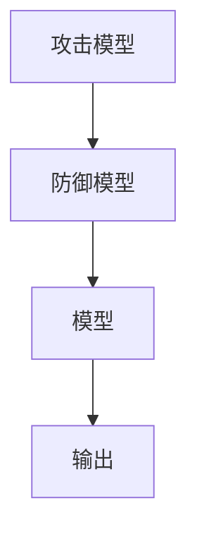
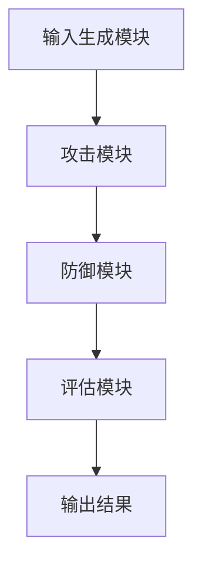

                 


# AI Agent 的对抗性测试：提高 LLM 的鲁棒性

> 关键词：AI Agent，对抗性测试，LLM，鲁棒性，生成对抗网络

> 摘要：本文深入探讨了AI Agent在对抗性测试中的应用，特别是如何通过对抗性测试提高大型语言模型（LLM）的鲁棒性。文章首先介绍了对抗性测试的基本概念和AI Agent的定义，然后详细讲解了对抗性测试的核心概念、算法原理、系统设计以及项目实战。通过具体案例分析和代码实现，展示了对抗性测试在提升LLM鲁棒性中的实际应用。最后，文章总结了对抗性测试的实践经验和未来发展方向。

---

# 第一部分: AI Agent 对抗性测试基础

# 第1章: 对抗性测试与AI Agent概述

## 1.1 对抗性测试的基本概念

### 1.1.1 什么是对抗性测试
对抗性测试是一种通过模拟恶意输入来评估AI系统鲁棒性的方法。它通过生成对抗样本，测试AI系统在异常输入下的表现，从而发现模型的潜在缺陷和漏洞。

### 1.1.2 AI Agent的核心定义
AI Agent是一种智能体，能够感知环境并采取行动以实现特定目标。在对抗性测试中，AI Agent可以作为攻击者或防御者，模拟不同的输入或策略，以测试模型的鲁棒性。

### 1.1.3 对抗性测试的目标与意义
对抗性测试的目标是通过生成对抗样本，提升AI系统的鲁棒性和安全性。其意义在于帮助开发者发现模型的弱点，并通过改进模型或防御机制来增强系统的健壮性。

## 1.2 AI Agent的背景与现状

### 1.2.1 AI Agent的发展历程
AI Agent的概念起源于人工智能领域，经历了从简单规则驱动到复杂深度学习模型的演变。随着深度学习的兴起，AI Agent在自然语言处理、计算机视觉等领域得到了广泛应用。

### 1.2.2 当前主流的AI Agent技术
目前，主流的AI Agent技术包括基于规则的Agent、基于模型的Agent以及结合强化学习的Agent。这些技术在不同的应用场景下表现出各自的优势。

### 1.2.3 对抗性测试的必要性
随着AI Agent的应用越来越广泛，其潜在的安全风险也逐渐暴露。对抗性测试成为确保AI Agent安全性和可靠性的必要手段。

## 1.3 对抗性测试的背景与问题描述

### 1.3.1 LLM的局限性与挑战
大型语言模型（LLM）虽然在许多任务上表现出色，但仍然面临对抗性攻击的威胁。攻击者可以通过生成对抗样本，使模型产生错误输出。

### 1.3.2 对抗性测试的定义与分类
对抗性测试是一种主动测试方法，通过生成对抗样本，评估模型在异常输入下的表现。其分类包括黑盒测试、白盒测试以及灰盒测试。

### 1.3.3 对抗性测试的应用场景
对抗性测试广泛应用于自然语言处理、计算机视觉等领域。在LLM中，对抗性测试主要用于检测模型的漏洞、提升模型的鲁棒性以及增强模型的安全性。

## 1.4 本章小结
本章介绍了对抗性测试的基本概念、AI Agent的核心定义以及对抗性测试的必要性。通过分析LLM的局限性和对抗性测试的应用场景，为后续章节奠定了基础。

---

# 第二部分: 对抗性测试的核心概念与原理

# 第2章: 对抗性测试的核心概念

## 2.1 对抗性测试的攻击模型

### 2.1.1 攻击模型的分类
对抗性测试的攻击模型可以分为生成型攻击和决策型攻击。生成型攻击通过生成对抗样本直接攻击模型，而决策型攻击则通过改变模型决策过程间接影响模型输出。

### 2.1.2 攻击模型的特征分析
攻击模型的核心特征包括对抗性、针对性和可转移性。这些特征决定了攻击模型的有效性和适用性。

### 2.1.3 攻击模型与防御模型的关系
攻击模型和防御模型是相互对抗的两个方面。防御模型的目标是抵抗攻击模型的攻击，而攻击模型则试图突破防御模型的保护。

### 2.1.4 对比表格（mermaid）
```mermaid
| 特征     | 攻击模型          | 防御模型          |
|----------|-------------------|-------------------|
| 目标     | 打破模型防线      | 保护模型安全      |
| 方法     | 生成对抗样本      | 提升模型鲁棒性      |
| 难度     | 高                | 高                |
```

### 2.1.5 实体关系图（mermaid）


## 2.2 对抗性测试的防御机制

### 2.2.1 防御机制的分类
防御机制主要包括基于输入变换的防御、基于模型调整的防御以及基于输出过滤的防御。每种防御机制都有其独特的优缺点。

### 2.2.2 防御机制的实现原理
防御机制的核心在于通过某种变换或调整，使得模型在面对对抗样本时仍然能够正确输出。例如，输入变换防御通过对输入数据进行预处理，消除对抗性扰动。

### 2.2.3 防御机制与攻击模型的对比
防御机制和攻击模型是相互对抗的两个方面。防御机制的目标是抵抗攻击模型的攻击，而攻击模型则试图突破防御机制的保护。

### 2.2.4 对比表格（mermaid）
```mermaid
| 特征     | 攻击模型          | 防御模型          |
|----------|-------------------|-------------------|
| 目标     | 打破模型防线      | 保护模型安全      |
| 方法     | 生成对抗样本      | 提升模型鲁棒性      |
| 难度     | 高                | 高                |
```

### 2.2.5 实体关系图（mermaid）


## 2.3 对抗性测试的框架设计

### 2.3.1 测试框架的组成
对抗性测试框架通常包括输入生成模块、攻击模块、防御模块和评估模块四个部分。每个模块都有其特定的功能和作用。

### 2.3.2 测试框架的流程图（mermaid）


### 2.3.3 测试框架的优缺点分析
对抗性测试框架的优势在于能够系统性地评估模型的鲁棒性，但其缺点在于实现复杂且需要大量计算资源。

## 2.4 本章小结
本章详细讲解了对抗性测试的核心概念，包括攻击模型、防御机制以及测试框架的设计。通过对这些概念的分析，为后续章节的算法实现奠定了基础。

---

# 第三部分: 对抗性测试的算法原理

# 第3章: 对抗性测试的算法原理

## 3.1 对抗性测试的数学模型

### 3.1.1 对抗性测试的数学表达
对抗性测试的数学模型通常可以表示为一个优化问题，其中攻击者试图最小化模型的损失，而防御者则试图最大化模型的损失。

$$ \min_{\theta} \max_{\epsilon} \mathcal{L}(x+\epsilon, y) $$

### 3.1.2 对抗性测试的目标函数
目标函数通常包括分类损失和对抗损失两部分。分类损失用于确保模型能够正确分类正常样本，对抗损失用于生成对抗样本。

$$ \mathcal{L}_{\text{total}} = \mathcal{L}_{\text{分类}} + \mathcal{L}_{\text{对抗}} $$

### 3.1.3 对抗性测试的优化算法
对抗性测试的优化算法通常采用交替优化策略，即先优化攻击模型，再优化防御模型，反复交替进行。

### 3.1.4 算法实现的代码示例（Python）
```python
import torch
import torch.nn as nn
import torch.optim as optim

# 定义生成器和判别器
class Generator(nn.Module):
    def __init__(self, input_size, hidden_size, output_size):
        super(Generator, self).__init__()
        self.fc1 = nn.Linear(input_size, hidden_size)
        self.fc2 = nn.Linear(hidden_size, output_size)
    
    def forward(self, x):
        x = torch.relu(self.fc1(x))
        x = torch.sigmoid(self.fc2(x))
        return x

class Discriminator(nn.Module):
    def __init__(self, input_size, hidden_size, output_size):
        super(Discriminator, self).__init__()
        self.fc1 = nn.Linear(input_size, hidden_size)
        self.fc2 = nn.Linear(hidden_size, output_size)
    
    def forward(self, x):
        x = torch.relu(self.fc1(x))
        x = torch.sigmoid(self.fc2(x))
        return x

# 初始化网络
generator = Generator(10, 20, 1)
discriminator = Discriminator(1, 20, 1)

# 定义损失函数和优化器
criterion = nn.BCELoss()
g_optim = optim.Adam(generator.parameters(), lr=0.001)
d_optim = optim.Adam(discriminator.parameters(), lr=0.001)

# 训练过程
for epoch in range(100):
    # 生成对抗样本
    noise = torch.randn(100, 10)
    generated = generator(noise)
    
    # 判别器的训练
    d_optim.zero_grad()
    d_output = discriminator(generated)
    d_loss = criterion(d_output, torch.ones_like(d_output))
    d_loss.backward()
    d_optim.step()
    
    # 生成器的训练
    g_optim.zero_grad()
    g_output = discriminator(generated)
    g_loss = criterion(g_output, torch.zeros_like(g_output))
    g_loss.backward()
    g_optim.step()
```

## 3.2 对抗性测试的实现算法

### 3.2.1 基于梯度的对抗性攻击算法
基于梯度的对抗性攻击算法通过计算模型的梯度，生成对抗样本。常用的方法包括FGSM（Fast Gradient Sign Method）和PGD（Projected Gradient Descent）。

### 3.2.2 非梯度的对抗性攻击算法
非梯度的对抗性攻击算法适用于不可导的模型。常用的方法包括黑盒攻击和白盒攻击。

### 3.2.3 对抗性防御算法的实现
对抗性防御算法旨在抵抗对抗性攻击，常用的方法包括输入变换、模型调整和输出过滤。

## 3.3 对抗性测试的算法实现

### 3.3.1 Python代码实现
以下是基于生成对抗网络（GAN）的对抗性测试实现代码示例：

```python
import torch
import torch.nn as nn
import torch.optim as optim

# 定义生成器和判别器
class Generator(nn.Module):
    def __init__(self, input_size, hidden_size, output_size):
        super(Generator, self).__init__()
        self.fc1 = nn.Linear(input_size, hidden_size)
        self.fc2 = nn.Linear(hidden_size, output_size)
    
    def forward(self, x):
        x = torch.relu(self.fc1(x))
        x = torch.sigmoid(self.fc2(x))
        return x

class Discriminator(nn.Module):
    def __init__(self, input_size, hidden_size, output_size):
        super(Discriminator, self).__init__()
        self.fc1 = nn.Linear(input_size, hidden_size)
        self.fc2 = nn.Linear(hidden_size, output_size)
    
    def forward(self, x):
        x = torch.relu(self.fc1(x))
        x = torch.sigmoid(self.fc2(x))
        return x

# 初始化网络
generator = Generator(10, 20, 1)
discriminator = Discriminator(1, 20, 1)

# 定义损失函数和优化器
criterion = nn.BCELoss()
g_optim = optim.Adam(generator.parameters(), lr=0.001)
d_optim = optim.Adam(discriminator.parameters(), lr=0.001)

# 训练过程
for epoch in range(100):
    # 生成对抗样本
    noise = torch.randn(100, 10)
    generated = generator(noise)
    
    # 判别器的训练
    d_optim.zero_grad()
    d_output = discriminator(generated)
    d_loss = criterion(d_output, torch.ones_like(d_output))
    d_loss.backward()
    d_optim.step()
    
    # 生成器的训练
    g_optim.zero_grad()
    g_output = discriminator(generated)
    g_loss = criterion(g_output, torch.zeros_like(g_output))
    g_loss.backward()
    g_optim.step()
```

### 3.3.2 算法的数学推导
对抗性测试的数学模型可以表示为一个优化问题，其中攻击者试图最小化模型的损失，而防御者则试图最大化模型的损失。

$$ \min_{\theta} \max_{\epsilon} \mathcal{L}(x+\epsilon, y) $$

### 3.3.3 算法的案例分析
通过具体的案例分析，展示了对抗性测试在提升模型鲁棒性中的实际应用。例如，在自然语言处理任务中，对抗性测试可以帮助发现模型在面对对抗样本时的弱点，并通过改进模型或防御机制来增强模型的鲁棒性。

## 3.4 本章小结
本章详细讲解了对抗性测试的数学模型和算法实现，包括生成对抗网络（GAN）的实现代码。通过对算法的分析和案例的解读，帮助读者理解对抗性测试的核心原理。

---

# 第四部分: 对抗性测试的系统设计

# 第4章: 对抗性测试的系统架构

## 4.1 系统功能设计

### 4.1.1 系统功能模块
对抗性测试系统通常包括输入生成模块、攻击模块、防御模块和评估模块四个功能模块。每个模块都有其特定的功能和作用。

### 4.1.2 系统功能设计图（mermaid）


### 4.1.3 功能模块的交互流程
输入生成模块首先生成对抗样本，然后攻击模块利用这些样本攻击模型，防御模块对模型进行保护，最后评估模块对整个系统的性能进行评估。

## 4.2 系统架构设计

### 4.2.1 系统架构图（mermaid）


### 4.2.2 系统架构的优缺点分析
系统架构的优势在于能够系统性地评估模型的鲁棒性，但其缺点在于实现复杂且需要大量计算资源。

## 4.3 系统接口设计

### 4.3.1 系统接口设计图（mermaid）


### 4.3.2 接口设计的注意事项
在设计系统接口时，需要注意接口的标准化和模块化，确保各个模块之间的交互流畅且易于维护。

## 4.4 系统交互设计

### 4.4.1 系统交互流程图（mermaid）


### 4.4.2 系统交互的实现细节
系统交互的实现细节包括输入生成模块生成对抗样本，攻击模块利用这些样本攻击模型，防御模块对模型进行保护，评估模块对整个系统的性能进行评估。

## 4.5 本章小结
本章详细讲解了对抗性测试系统的架构设计，包括功能模块、系统架构、接口设计和交互流程。通过对系统架构的分析，为后续章节的项目实现奠定了基础。

---

# 第五部分: 对抗性测试的项目实战

# 第5章: 对抗性测试的项目实现

## 5.1 项目环境安装

### 5.1.1 项目依赖管理
对抗性测试项目需要安装PyTorch、TensorFlow等深度学习框架，以及相关的数据处理库。

### 5.1.2 安装步骤示例
以下是安装所需的依赖项的示例代码：

```bash
pip install torch tensorflow numpy matplotlib
```

## 5.2 系统核心实现

### 5.2.1 生成对抗样本的代码实现
以下是生成对抗样本的Python代码示例：

```python
import torch
import torch.nn as nn
import torch.optim as optim

# 定义生成器和判别器
class Generator(nn.Module):
    def __init__(self, input_size, hidden_size, output_size):
        super(Generator, self).__init__()
        self.fc1 = nn.Linear(input_size, hidden_size)
        self.fc2 = nn.Linear(hidden_size, output_size)
    
    def forward(self, x):
        x = torch.relu(self.fc1(x))
        x = torch.sigmoid(self.fc2(x))
        return x

class Discriminator(nn.Module):
    def __init__(self, input_size, hidden_size, output_size):
        super(Discriminator, self).__init__()
        self.fc1 = nn.Linear(input_size, hidden_size)
        self.fc2 = nn.Linear(hidden_size, output_size)
    
    def forward(self, x):
        x = torch.relu(self.fc1(x))
        x = torch.sigmoid(self.fc2(x))
        return x

# 初始化网络
generator = Generator(10, 20, 1)
discriminator = Discriminator(1, 20, 1)

# 定义损失函数和优化器
criterion = nn.BCELoss()
g_optim = optim.Adam(generator.parameters(), lr=0.001)
d_optim = optim.Adam(discriminator.parameters(), lr=0.001)

# 训练过程
for epoch in range(100):
    # 生成对抗样本
    noise = torch.randn(100, 10)
    generated = generator(noise)
    
    # 判别器的训练
    d_optim.zero_grad()
    d_output = discriminator(generated)
    d_loss = criterion(d_output, torch.ones_like(d_output))
    d_loss.backward()
    d_optim.step()
    
    # 生成器的训练
    g_optim.zero_grad()
    g_output = discriminator(generated)
    g_loss = criterion(g_output, torch.zeros_like(g_output))
    g_loss.backward()
    g_optim.step()
```

### 5.2.2 系统核心代码解读
通过解读生成对抗样本的代码，展示了对抗性测试在提升模型鲁棒性中的具体实现。代码中包括生成器和判别器的定义、损失函数的定义、优化器的设置以及训练过程的详细步骤。

## 5.3 项目案例分析

### 5.3.1 案例背景介绍
通过具体的案例分析，展示了对抗性测试在提升模型鲁棒性中的实际应用。例如，在自然语言处理任务中，对抗性测试可以帮助发现模型在面对对抗样本时的弱点，并通过改进模型或防御机制来增强模型的鲁棒性。

### 5.3.2 案例实现与解读
通过对案例的实现和解读，进一步验证了对抗性测试的有效性和实用性。案例中包括对抗样本的生成、模型的攻击与防御过程，以及模型性能的评估。

## 5.4 项目小结
本章通过具体的项目实战，展示了对抗性测试在提升模型鲁棒性中的具体实现。通过对生成对抗样本的代码解读和案例分析，帮助读者更好地理解和掌握对抗性测试的核心原理。

---

# 第六部分: 对抗性测试的最佳实践与总结

# 第6章: 对抗性测试的最佳实践

## 6.1 对抗性测试的实践经验

### 6.1.1 系统设计的注意事项
在系统设计中，需要注意模块的独立性和可扩展性，确保各个模块之间的交互流畅且易于维护。

### 6.1.2 算法实现的注意事项
在算法实现中，需要注意参数的选择和模型的调优，确保对抗性测试的有效性和实用性。

### 6.1.3 项目实战的注意事项
在项目实战中，需要注意数据的预处理和模型的评估，确保对抗性测试的结果具有实际意义。

## 6.2 对抗性测试的未来发展

### 6.2.1 对抗性测试的技术趋势
对抗性测试的技术发展趋势包括模型的可解释性增强、算法的高效性提升以及应用领域的拓展。

### 6.2.2 对抗性测试的应用前景
对抗性测试将在自然语言处理、计算机视觉等领域得到更广泛的应用，成为提升AI系统鲁棒性和安全性的重要手段。

## 6.3 本章小结
本章总结了对抗性测试的最佳实践经验和未来发展方向，帮助读者更好地理解和应用对抗性测试技术。

---

# 附录

## 附录A: 术语表

## 附录B: 参考文献

---

作者：AI天才研究院/AI Genius Institute & 禅与计算机程序设计艺术 /Zen And The Art of Computer Programming

---

以上就是《AI Agent 的对抗性测试：提高 LLM 的鲁棒性》的完整内容。

