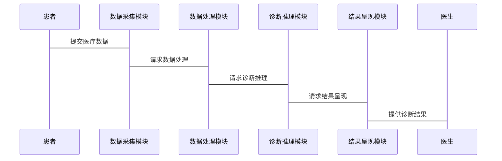

                 


# AI Agent在智能医疗诊断中的角色

## 关键词：AI Agent, 智能医疗, 医疗诊断, 机器学习, 深度学习, 系统架构, 项目实战

## 摘要：  
随着人工智能技术的快速发展，AI Agent（人工智能代理）在智能医疗诊断中的角色日益重要。本文从AI Agent的基本概念出发，深入分析其在医疗诊断中的核心作用，结合具体案例和系统架构设计，探讨AI Agent在智能医疗诊断中的实现原理、应用场景及未来发展趋势。通过本篇文章，读者将能够全面了解AI Agent如何助力医疗诊断，提升医疗效率和准确性。

---

# 第1章: AI Agent的基本概念与背景

## 1.1 AI Agent的定义与特点
### 1.1.1 AI Agent的定义  
AI Agent（人工智能代理）是一种能够感知环境、自主决策并执行任务的智能系统。在医疗领域，AI Agent可以通过分析医疗数据、诊断病情、提供治疗建议等方式辅助医生完成诊断任务。

### 1.1.2 AI Agent的核心特点  
- **自主性**：能够在没有人类干预的情况下自主完成任务。  
- **反应性**：能够实时感知环境变化并做出反应。  
- **学习能力**：通过机器学习算法不断优化自身的诊断能力。  
- **可解释性**：诊断结果需要能够被医生和患者理解。  

### 1.1.3 AI Agent与传统医疗诊断的区别  
| **维度**       | **AI Agent**                          | **传统医疗诊断**                          |  
|-----------------|--------------------------------------|--------------------------------------------|  
| 决策主体       | 机器学习算法驱动的AI系统             | 医生或医疗专家                            |  
| 决策速度       | 快速响应，秒级完成                   | 需要医生的主观判断和时间思考              |  
| 决策范围       | 可处理海量数据，覆盖多种疾病         | 受限于医生的知识和经验                    |  
| 可扩展性       | 可扩展至全球范围，支持多语言和文化   | 受限于医生的地理分布和语言能力          |  

---

## 1.2 智能医疗的发展现状
### 1.2.1 智能医疗的定义与范围  
智能医疗是指利用人工智能、大数据、物联网等技术，优化医疗流程、提高诊断效率、降低医疗成本的新型医疗模式。

### 1.2.2 当前智能医疗的主要技术手段  
- **机器学习**：用于疾病预测、诊断辅助。  
- **深度学习**：用于医学影像分析、自然语言处理（NLP）。  
- **自然语言处理（NLP）**：用于医疗文档分析和患者信息提取。  

### 1.2.3 AI Agent在智能医疗中的应用趋势  
AI Agent正在从单一的辅助工具向全栈式医疗解决方案发展，未来将与医疗物联网、远程医疗等技术深度融合。

---

## 1.3 AI Agent在医疗诊断中的角色
### 1.3.1 AI Agent在医疗诊断中的核心作用  
- **数据处理与分析**：快速处理患者的医疗数据，提取关键信息。  
- **诊断推理**：基于机器学习模型，辅助医生进行疾病诊断。  
- **结果呈现**：以可视化的方式输出诊断结果，帮助医生制定治疗方案。  

### 1.3.2 AI Agent与医疗专家的关系  
AI Agent作为医生的辅助工具，能够提高诊断效率，但无法完全替代医生的主观判断和临床经验。

### 1.3.3 AI Agent在医疗诊断中的优势与局限  
- **优势**：  
  - 高效性：能够在短时间内处理大量数据。  
  - 准确性：通过机器学习模型不断优化诊断准确率。  
  - 可扩展性：能够覆盖全球范围内的医疗需求。  

- **局限**：  
  - 需要依赖高质量的数据支持。  
  - 可能存在算法偏见，影响诊断结果。  
  - 对复杂病情的处理能力有限。  

---

## 1.4 本章小结  
本章主要介绍了AI Agent的基本概念、特点及其在智能医疗中的角色。通过对比AI Agent与传统医疗诊断的区别，我们可以看出AI Agent在医疗领域的潜力和优势，同时也需要关注其局限性。

---

# 第2章: AI Agent的核心概念

## 2.1 AI Agent的定义与分类
### 2.1.1 AI Agent的定义  
AI Agent是一种能够感知环境、自主决策并执行任务的智能系统，其核心在于通过算法实现对数据的处理和决策。

### 2.1.2 AI Agent的分类  
AI Agent可以根据功能、智能水平和应用场景进行分类：  
- **按功能分类**：  
  - 数据处理型：主要用于数据清洗、特征提取。  
  - 诊断推理型：主要用于疾病诊断和治疗方案推荐。  
  - 决策执行型：用于医疗决策的执行和反馈。  
- **按智能水平分类**：  
  - 基础型：基于规则的简单决策。  
  - 中级型：具备一定学习能力的代理。  
  - 高级型：具备深度学习能力的代理。  

### 2.1.3 各类AI Agent的特点对比（表格形式）  

| **分类维度**       | **基础型AI Agent**              | **中级型AI Agent**              | **高级型AI Agent**              |  
|---------------------|---------------------------------|---------------------------------|---------------------------------|  
| 决策方式           | 基于规则，无学习能力           | 基于规则和简单模型，有一定学习能力 | 基于深度学习模型，具备复杂决策能力 |  
| 应用场景           | 数据清洗、简单诊断             | 中度复杂诊断、治疗方案推荐       | 高度复杂诊断、个性化治疗方案     |  
| 诊断准确率         | 较低                           | 中等                           | 高                              |  

---

## 2.2 AI Agent的工作原理
### 2.2.1 信息感知与数据采集  
AI Agent通过传感器、数据库等渠道获取医疗数据，包括患者的症状、病史、影像资料等。

### 2.2.2 数据处理与分析  
- **数据清洗**：去除噪声数据，确保数据质量。  
- **特征提取**：从原始数据中提取关键特征，用于后续分析。  
- **模型训练**：基于机器学习算法，训练诊断模型。  

### 2.2.3 决策推理与结果输出  
- **决策推理**：基于训练好的模型，对患者数据进行推理，得出诊断结果。  
- **结果输出**：以可视化或文本形式呈现诊断结果，供医生参考。  

---

## 2.3 AI Agent与智能医疗的结合
### 2.3.1 医疗诊断中的信息流分析  
AI Agent通过整合患者数据、医疗知识库和诊断模型，构建完整的诊断信息流。

### 2.3.2 AI Agent在医疗诊断中的信息处理流程  
1. 数据采集：获取患者的医疗数据。  
2. 数据处理：清洗、特征提取。  
3. 模型推理：基于机器学习模型进行诊断。  
4. 结果输出：呈现诊断结果并提供治疗建议。  

### 2.3.3 AI Agent与医疗数据的关系  
AI Agent的诊断能力依赖于高质量的医疗数据，数据的质量直接影响诊断的准确率。

---

## 2.4 本章小结  
本章详细介绍了AI Agent的核心概念，包括其定义、分类和工作原理。通过对比不同类型的AI Agent，我们可以更好地理解其在智能医疗中的应用潜力。

---

# 第3章: AI Agent的核心算法原理

## 3.1 机器学习算法在AI Agent中的应用
### 3.1.1 监督学习  
- **定义**：通过标注数据训练模型，使其能够预测新数据的标签。  
- **应用**：用于疾病分类、诊断结果预测。  
- **公式**：  
  $$ \text{损失函数} = \sum (y - \hat{y})^2 $$  
  其中，\( y \) 是真实标签，\( \hat{y} \) 是模型预测值。  

### 3.1.2 无监督学习  
- **定义**：通过数据本身进行模式识别，无需标注数据。  
- **应用**：用于医疗数据的聚类分析。  
- **公式**：  
  $$ \text{聚类目标} = \sum \|x_i - c_j\| $$  
  其中，\( x_i \) 是数据点，\( c_j \) 是聚类中心。  

### 3.1.3 强化学习  
- **定义**：通过与环境互动，学习最优策略。  
- **应用**：用于医疗决策的动态优化。  
- **公式**：  
  $$ Q(s, a) = r + \gamma \max Q(s', a') $$  
  其中，\( s \) 是状态，\( a \) 是动作，\( r \) 是奖励，\( \gamma \) 是折扣因子。  

---

## 3.2 深度学习算法在AI Agent中的应用
### 3.2.1 卷积神经网络（CNN）  
- **定义**：用于处理图像数据，提取图像特征。  
- **应用**：用于医学影像分析，如X光片、MRI图像的诊断。  
- **流程图**：  
  ```mermaid
  graph LR
  A[输入图像] --> B[卷积层] --> C[池化层] --> D[全连接层] --> E[输出诊断结果]
  ```

### 3.2.2 循环神经网络（RNN）  
- **定义**：用于处理序列数据，如文本和时间序列。  
- **应用**：用于医疗文档分析和病情预测。  
- **公式**：  
  $$ h_t = \text{激活函数}(W h_{t-1} + U x_t) $$  
  其中，\( h_t \) 是隐藏状态，\( x_t \) 是输入数据。  

### 3.2.3 Transformer模型  
- **定义**：基于自注意力机制，用于处理长序列数据。  
- **应用**：用于医学影像分割和医疗文本处理。  
- **公式**：  
  $$ \text{注意力权重} = \frac{e^{k_j q_i}}{\sum e^{k_j q_i}} $$  
  其中，\( q_i \) 是查询向量，\( k_j \) 是键向量。  

---

## 3.3 算法选择与优化
### 3.3.1 算法选择的依据  
- 数据类型：图像数据选择CNN，文本数据选择RNN或Transformer。  
- 任务需求：分类任务选择监督学习，聚类任务选择无监督学习。  

### 3.3.2 算法优化策略  
- **数据增强**：增加数据多样性，防止过拟合。  
- **超参数调优**：通过网格搜索优化模型参数。  
- **模型集成**：结合多个模型的结果，提高准确率。  

### 3.3.3 算法性能评估指标  
- **准确率**：诊断正确的比例。  
- **召回率**：诊断出阳性病例的比例。  
- **F1分数**：综合准确率和召回率的指标。  

---

## 3.4 本章小结  
本章详细介绍了机器学习和深度学习算法在AI Agent中的应用，包括监督学习、无监督学习、强化学习以及CNN、RNN、Transformer等模型的原理和应用场景。

---

# 第4章: AI Agent的系统架构与设计

## 4.1 智能医疗诊断系统的架构设计
### 4.1.1 系统功能模块划分  
- **数据采集模块**：负责获取患者的医疗数据。  
- **数据处理模块**：清洗和特征提取。  
- **诊断推理模块**：基于机器学习模型进行诊断。  
- **结果呈现模块**：以可视化形式输出诊断结果。  

### 4.1.2 系统功能模块的ER实体关系图  
```mermaid
erDiagram
  patient/P_id[P_id]
  patient/P_name[P_name]
  patient/P_age[P_age]
  patient/P_gender[P_gender]
  diagnosis/D_id[D_id]
  diagnosis/Disease[疾病]
  doctor/D_id[D_id]
  doctor/D_name[D_name]
  doctor/D_expertise[D_expertise]
  patient-(1)->diagnosis
  doctor-(1)->diagnosis
```

### 4.1.3 系统架构设计的mermaid架构图  


---

## 4.2 系统接口设计与交互流程
### 4.2.1 系统接口设计  
- **输入接口**：接收患者的医疗数据。  
- **输出接口**：提供诊断结果和治疗建议。  

### 4.2.2 系统交互流程  


---

## 4.3 本章小结  
本章详细介绍了智能医疗诊断系统的架构设计，包括功能模块划分、系统接口设计和交互流程。通过mermaid图的展示，我们可以清晰地理解系统的整体架构。

---

# 第5章: AI Agent的项目实战

## 5.1 项目背景与目标
### 5.1.1 项目背景  
以肺癌诊断为例，AI Agent可以通过分析患者的CT影像数据，辅助医生进行诊断。

### 5.1.2 项目目标  
实现一个基于深度学习的肺癌诊断系统，提高诊断准确率和效率。

---

## 5.2 项目环境配置
### 5.2.1 系统环境  
- **操作系统**：Linux/Windows  
- **编程语言**：Python  
- **深度学习框架**：TensorFlow/Keras  
- **硬件要求**：GPU支持（NVIDIA显卡）  

### 5.2.2 数据集准备  
- **训练数据集**：标注的CT影像数据。  
- **测试数据集**：未标注的CT影像数据。  

---

## 5.3 系统核心实现
### 5.3.1 数据预处理  
```python
import numpy as np
import pandas as pd

# 读取数据
data = pd.read_csv('lung_cancer.csv')

# 数据清洗
data = data.dropna()
```

### 5.3.2 模型训练  
```python
import tensorflow as tf
from tensorflow.keras import layers

model = tf.keras.Sequential([
    layers.Conv2D(32, (3,3), activation='relu', input_shape=(224, 224, 3)),
    layers.MaxPooling2D((2,2)),
    layers.Conv2D(64, (3,3), activation='relu'),
    layers.MaxPooling2D((2,2)),
    layers.Flatten(),
    layers.Dense(128, activation='relu'),
    layers.Dense(1, activation='sigmoid')
])

model.compile(optimizer='adam', loss='binary_crossentropy', metrics=['accuracy'])
model.fit(data, labels, epochs=10, batch_size=32)
```

### 5.3.3 模型部署与测试  
```python
# 加载训练好的模型
model.load_weights('lung_cancer_model.h5')

# 预测新病例
new_patient = ...  # 输入新的CT影像数据
prediction = model.predict(new_patient)
```

---

## 5.4 项目小结  
通过本项目，我们实现了一个基于深度学习的肺癌诊断系统，验证了AI Agent在医疗诊断中的实际应用价值。

---

# 第6章: 最佳实践与未来展望

## 6.1 本章小结
AI Agent在智能医疗诊断中的应用前景广阔，其核心作用体现在数据处理、诊断推理和结果呈现三个方面。

## 6.2 AI Agent在医疗诊断中的注意事项
- **数据隐私**：确保患者数据的安全性和隐私性。  
- **模型可解释性**：提高诊断结果的透明度，便于医生理解和信任。  
- **算法优化**：不断优化算法性能，提高诊断准确率。  

## 6.3 未来展望
随着深度学习和大模型技术的不断进步，AI Agent在医疗诊断中的应用将更加广泛和深入。未来，AI Agent将与医疗物联网、远程医疗等技术深度融合，为医疗行业带来更大的变革。

---

# 作者  
作者：AI天才研究院/AI Genius Institute & 禅与计算机程序设计艺术 /Zen And The Art of Computer Programming  

---

以上是基于《AI Agent在智能医疗诊断中的角色》的技术博客文章，涵盖了从基础概念到实际应用的完整内容，希望对您有所帮助！

