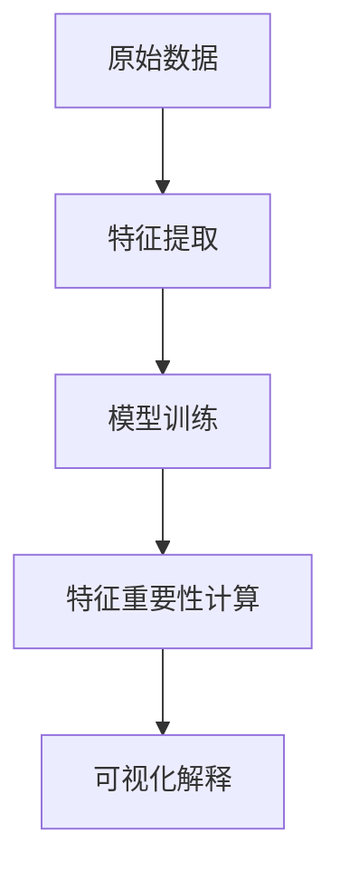
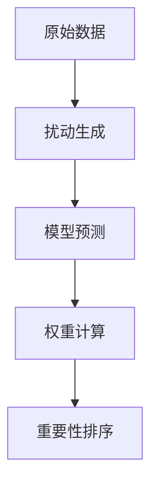
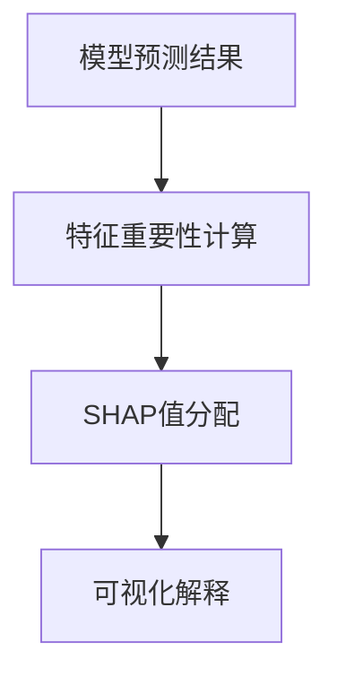
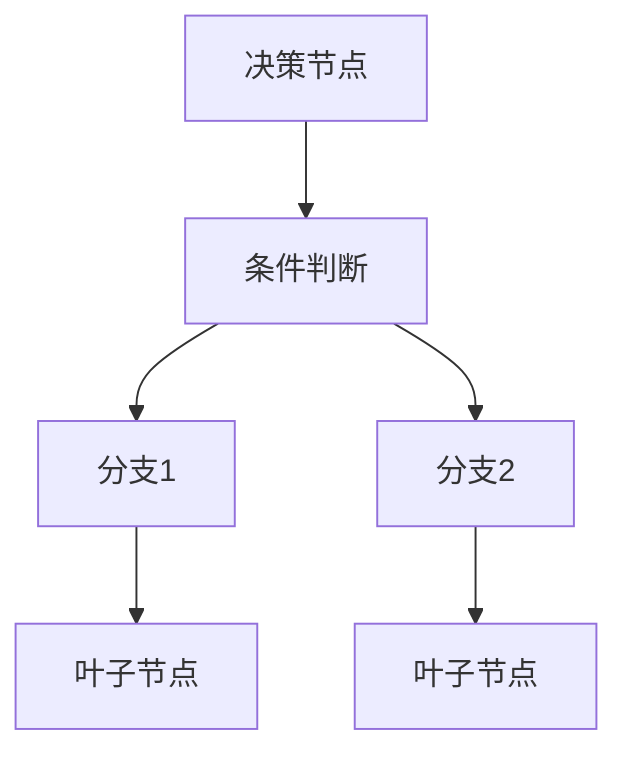
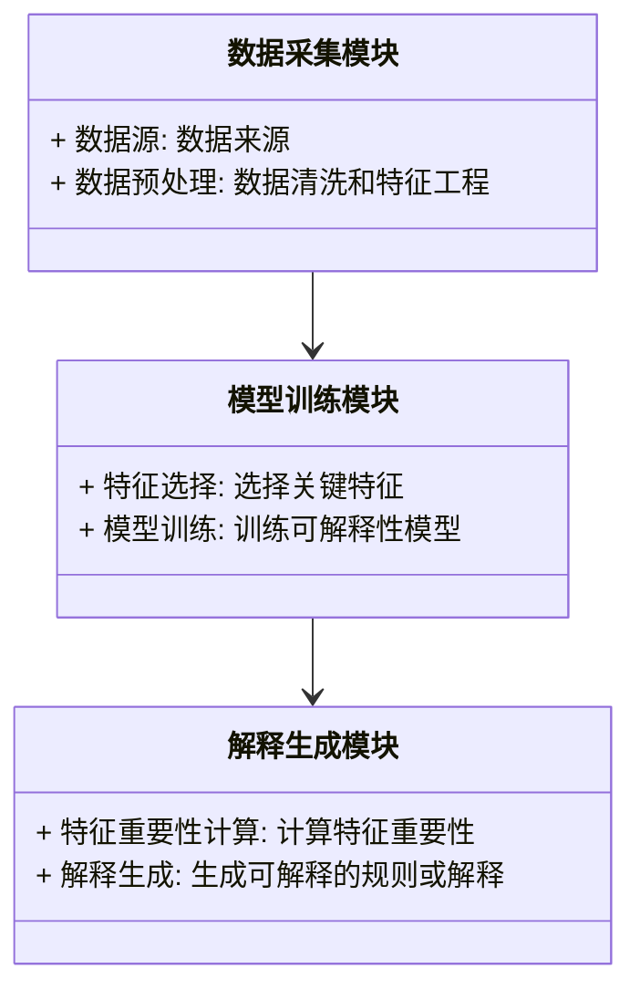
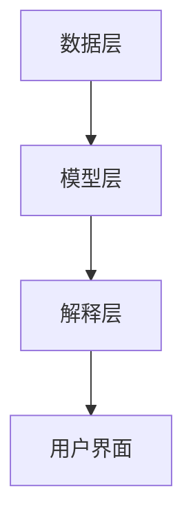
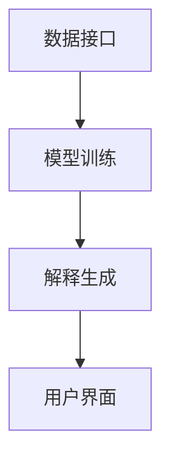
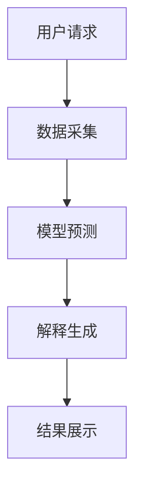

                 


# AI Agent的可解释性设计：提高模型决策的透明度

## 关键词：AI Agent，可解释性，透明度，算法解释，决策透明，系统架构，可解释性设计

## 摘要：AI Agent的可解释性设计是当前人工智能领域的重要研究方向。随着AI技术的广泛应用，模型决策的透明度和可解释性成为用户信任和实际应用的关键因素。本文从AI Agent的基本概念出发，深入探讨可解释性设计的核心技术和方法，结合实际案例，详细分析可解释性设计在算法、系统架构和项目实战中的应用。通过本文的学习，读者将能够理解并掌握如何设计出更具透明度和可解释性的AI Agent系统。

---

## 第1章: AI Agent与可解释性概述

### 1.1 AI Agent的基本概念

#### 1.1.1 AI Agent的定义与特点
AI Agent（人工智能代理）是指能够感知环境、自主决策并采取行动的智能体。AI Agent具有以下几个关键特点：
- **自主性**：能够自主决策，无需外部干预。
- **反应性**：能够实时感知环境并做出响应。
- **目标导向**：基于目标进行决策和行动。
- **社会能力**：能够与其他Agent或人类进行交互和协作。

#### 1.1.2 AI Agent的分类与应用场景
AI Agent可以根据不同的标准进行分类，常见的分类包括：
1. **简单反射型Agent**：基于简单的规则做出反应。
2. **基于模型的反射型Agent**：利用内部模型进行推理和决策。
3. **目标驱动型Agent**：基于明确的目标进行决策。
4. **实用驱动型Agent**：基于效用函数进行优化决策。

AI Agent的应用场景广泛，包括自动驾驶、智能助手、机器人控制、推荐系统等。

#### 1.1.3 可解释性在AI Agent中的重要性
AI Agent的决策过程需要透明和可解释，以便用户能够理解其行为并信任其决策。可解释性在以下方面尤为重要：
- **用户信任**：用户需要信任AI Agent的决策，尤其是在医疗、金融等高风险领域。
- **调试与优化**：可解释性有助于开发人员发现模型的错误并进行优化。
- **法律与伦理合规**：在某些领域，可解释性是法律和伦理合规的要求。

---

### 1.2 可解释性与AI Agent的关系

#### 1.2.1 可解释性的定义与核心要素
可解释性是指AI系统的行为能够被人类理解和解释的程度。核心要素包括：
- **透明度**：系统的行为和决策过程对用户可见。
- **可理解性**：用户能够理解系统决策的逻辑。
- **可追溯性**：能够追溯决策的来源和依据。

#### 1.2.2 可解释性在AI决策中的作用
可解释性在AI Agent的决策过程中起着关键作用：
- **提高用户信任**：通过透明的决策过程，增强用户对AI Agent的信任。
- **支持决策审查**：在高风险场景中，可解释性有助于审查决策的合法性和合理性。
- **促进技术发展**：可解释性设计推动了更透明和可信的AI技术的发展。

#### 1.2.3 可解释性与模型透明度的关系
可解释性依赖于模型的透明度。模型透明度越高，其决策过程越容易被理解和解释。然而，高透明度的模型通常复杂性较低，可能会影响模型的性能和效果。

---

### 1.3 可解释性设计的背景与挑战

#### 1.3.1 AI Agent在实际应用中的问题
AI Agent在实际应用中面临的主要问题包括：
- **黑箱问题**：复杂的模型（如深度神经网络）通常被视为“黑箱”，难以解释其决策过程。
- **用户信任缺失**：缺乏透明度导致用户对AI Agent的决策缺乏信任。
- **法律与伦理挑战**：在某些领域，AI Agent的决策需要符合特定的法律和伦理规范。

#### 1.3.2 可解释性设计的必要性
随着AI技术的广泛应用，可解释性设计的必要性日益凸显：
- **提升用户体验**：通过透明的决策过程，提升用户体验和满意度。
- **满足合规要求**：在金融、医疗等领域，可解释性是合规的必要条件。
- **促进技术采纳**：可解释性设计有助于推动AI技术在更多领域的采纳和应用。

#### 1.3.3 当前技术的局限性与未来方向
当前，AI Agent的可解释性设计还存在一些技术上的局限性：
- **复杂模型的解释性不足**：深度学习模型通常难以解释。
- **解释的准确性和全面性**：现有的解释方法可能存在片面性或不准确性。
- **跨领域挑战**：不同领域的可解释性需求和实现方式存在差异。

未来，可解释性设计需要在模型复杂性与解释性之间找到更好的平衡，并探索更高效和准确的解释方法。

---

## 第2章: 可解释性设计的核心概念

### 2.1 可解释性设计的理论基础

#### 2.1.1 从复杂模型到可解释模型的演进
AI模型的演进经历了从复杂到简单的可解释性需求的变化：
- **早期模型**：如决策树和线性回归模型，具有较高的可解释性。
- **复杂模型**：如深度神经网络，具有强大的表达能力但缺乏可解释性。
- **可解释模型**：如基于规则的模型和可解释增强的模型，兼顾性能和可解释性。

#### 2.1.2 可解释性设计的数学基础
可解释性设计需要一定的数学基础，主要包括：
- **线性代数**：用于表示模型的权重和特征重要性。
- **概率论**：用于评估模型的不确定性。
- **优化理论**：用于平衡模型性能和可解释性。

#### 2.1.3 可解释性与模型性能的平衡
在实际应用中，需要在模型性能和可解释性之间找到平衡点：
- **高可解释性，低性能**：适用于对可解释性要求高但对性能要求不高的场景。
- **高性能，低可解释性**：适用于对性能要求高但可解释性要求较低的场景。
- **中等可解释性，中等性能**：适用于大多数实际场景。

---

### 2.2 可解释性设计的关键技术

#### 2.2.1 属性重要性分析
属性重要性分析是可解释性设计的重要技术之一，主要用于确定每个特征对模型决策的影响程度。

##### 使用mermaid图展示属性重要性分析的流程


##### 使用LIME算法进行属性重要性分析
LIME（Local Interpretable Model-agnostic Explanations）是一种常用的属性重要性分析方法，适用于解释任何类型的模型。

##### 使用SHAP（Shapley Additive exPlanations）进行属性重要性分析
SHAP是一种基于博弈论的解释方法，能够准确反映每个特征对模型预测的贡献程度。

---

#### 2.2.2 决策过程可视化
决策过程可视化通过图形化的方式展示模型的决策逻辑，帮助用户更好地理解模型的行为。

##### 使用决策树可视化模型决策过程
决策树是一种直观的可视化工具，能够清晰地展示模型的决策路径。

##### 使用规则提取与解释技术
规则提取技术将复杂的模型转换为易于理解的规则，例如将深度神经网络转换为基于规则的决策树。

---

#### 2.2.3 模型解释的可理解性
模型解释的可理解性是可解释性设计的核心目标，主要包括：
- **局部解释**：解释单个预测的决策过程。
- **全局解释**：解释模型整体的决策逻辑。
- **用户友好性**：解释方式需要适合目标用户的认知水平。

---

### 2.3 可解释性设计的实现方法

#### 2.3.1 层次化解释方法
层次化解释方法通过分层的方式，逐步揭示模型的决策过程。

##### 使用层次化解释方法的步骤
1. **全局解释**：从整体上理解模型的行为。
2. **局部解释**：针对具体预测进行深入分析。
3. **细粒度解释**：分析单个特征对决策的影响。

#### 2.3.2 局部解释与全局解释
- **局部解释**：关注单个预测的决策过程，适用于详细分析。
- **全局解释**：关注模型整体的决策逻辑，适用于宏观理解。

#### 2.3.3 可解释性设计的验证与评估
验证与评估是确保可解释性设计有效性的关键步骤，主要包括：
- **解释的准确性和一致性**：评估解释的准确性和一致性。
- **解释的可理解性**：评估解释是否易于理解和接受。
- **解释的完整性**：评估解释是否全面覆盖了模型的决策过程。

---

## 第3章: 可解释性设计的核心算法原理

### 3.1 属性重要性分析算法

#### 3.1.1 LIME算法原理
LIME是一种基于扰动数据的局部解释方法，通过生成扰动数据并预测模型的输出，来计算每个特征对预测结果的贡献程度。

##### LIME算法的数学模型
$$
\text{权重} = \sum_{i=1}^{n} w_i \cdot x_i
$$

##### 使用mermaid图展示LIME算法流程


##### LIME算法的代码实现
```python
import lime
from lime import lime_tabular

explainer = lime_tabular.LimeTabularExplainer(X_train, feature_names=feature_names)
explanation = explainer.explain_instance(X_test[0], model.predict, num_features=5)
print(explanation.as_list())
```

---

#### 3.1.2 SHAP值的计算与解释
SHAP值是基于博弈论的特征重要性解释方法，能够准确反映每个特征对模型预测的贡献程度。

##### SHAP值的数学模型
$$
\text{SHAP值} = \phi_i = \text{特征} i \text{的贡献度}
$$

##### 使用mermaid图展示SHAP值计算流程


##### SHAP值的代码实现
```python
import shap
from sklearn.datasets import make_classification
from sklearn.ensemble import RandomForestClassifier

X, y = make_classification(n_samples=100, n_features=4, n_informative=2, random_state=0)
model = RandomForestClassifier().fit(X, y)
explainer = shap.TreeExplainer(model)
shap_values = explainer.shap_values(X)
shap.summary_plot(shap_values, X, plot_type='bar')
```

---

#### 3.1.3 使用mermaid图展示LIME算法流程


---

### 3.2 决策过程可视化算法

#### 3.2.1 决策树可视化
决策树是一种直观的可视化工具，能够清晰地展示模型的决策路径。

##### 使用mermaid图展示决策树结构


#### 3.2.2 使用规则提取与解释技术
规则提取与解释技术将复杂的模型转换为易于理解的规则，例如将深度神经网络转换为基于规则的决策树。

##### 使用规则提取技术的代码实现
```python
from sklearn.tree import export_graphviz
import graphviz

model = DecisionTreeClassifier().fit(X, y)
export_graphviz(model, out_file='tree.dot')
with open('tree.dot', 'r') as f:
    dot_data = f.read()
graphviz.Source(dot_data)
```

---

#### 3.2.3 使用mermaid图展示决策树结构


---

## 第4章: 可解释性设计的系统架构与实现

### 4.1 系统分析与架构设计

#### 4.1.1 系统功能设计
系统功能设计包括以下几个方面：
- **数据采集与处理**：收集和预处理数据。
- **模型训练与部署**：训练可解释性模型并部署到生产环境。
- **解释生成与展示**：生成模型的解释并展示给用户。

##### 使用mermaid图展示系统功能设计的类图


#### 4.1.2 系统架构设计
系统架构设计采用分层架构，包括数据层、模型层和解释层。

##### 使用mermaid图展示系统架构设计


---

### 4.2 系统接口设计与交互流程

#### 4.2.1 系统接口设计
系统接口设计包括以下几个方面：
- **数据接口**：提供数据输入和输出的接口。
- **模型接口**：提供模型训练和预测的接口。
- **解释接口**：提供解释生成和展示的接口。

##### 使用mermaid图展示系统接口设计


#### 4.2.2 使用mermaid图展示系统交互流程


---

## 第5章: 项目实战——基于可解释性设计的电商优惠券推荐系统

### 5.1 项目背景与目标
本项目旨在设计一个基于可解释性设计的电商优惠券推荐系统，通过分析用户行为数据，推荐合适的优惠券，并提供可解释的推荐理由。

---

### 5.2 环境安装与配置

#### 5.2.1 安装依赖
```bash
pip install scikit-learn lime python-shap
```

#### 5.2.2 配置开发环境
建议使用Jupyter Notebook进行开发，安装以下工具：
- Jupyter Notebook
- Python 3.8+
- scikit-learn
- lime
- python-shap

---

### 5.3 核心代码实现

#### 5.3.1 数据预处理与特征工程
```python
import pandas as pd
from sklearn.preprocessing import StandardScaler

# 加载数据
data = pd.read_csv('coupon_data.csv')

# 特征工程
features = data[['age', 'gender', 'purchase_history', 'category']]
target = data['coupon_choice']

# 数据标准化
scaler = StandardScaler()
features_scaled = scaler.fit_transform(features)
```

#### 5.3.2 模型训练与部署
```python
from sklearn.ensemble import RandomForestClassifier

# 训练模型
model = RandomForestClassifier().fit(features_scaled, target)

# 预测结果
predictions = model.predict(features_scaled)
```

#### 5.3.3 解释生成与展示
```python
import lime
from lime import lime_tabular

# 使用LIME进行解释
explainer = lime_tabular.LimeTabularExplainer(features_scaled, feature_names=features.columns)
explanation = explainer.explain_instance(features_scaled[0], model.predict, num_features=5)

# 可视化解释
print(explanation.as_list())
```

---

### 5.4 实际案例分析与详细解读

#### 5.4.1 案例分析
假设用户A的特征如下：
- 年龄：25岁
- 性别：女性
- 购买历史：电子产品
- 偏好类别：电子产品

模型预测用户A会选择电子产品类优惠券。

#### 5.4.2 解释分析
通过LIME解释，我们发现：
- 购买历史（电子产品）对预测结果的贡献度最高。
- 年龄和性别对预测结果的影响较小。

---

### 5.5 项目总结
通过本项目，我们成功实现了一个基于可解释性设计的电商优惠券推荐系统，验证了可解释性设计在实际应用中的可行性和有效性。

---

## 第6章: 可解释性设计的最佳实践与未来展望

### 6.1 最佳实践

#### 6.1.1 选择合适的可解释性方法
根据具体场景选择合适的可解释性方法，例如：
- 对于简单模型，可以选择直接的特征重要性分析。
- 对于复杂模型，可以选择LIME或SHAP等局部解释方法。

#### 6.1.2 注重用户反馈
通过用户反馈不断优化模型的解释性和用户体验。

#### 6.1.3 结合业务知识
结合业务知识，设计更符合实际需求的解释规则和流程。

---

### 6.2 小结与注意事项

#### 6.2.1 小结
可解释性设计是AI Agent系统设计中的重要环节，能够提升用户信任、支持决策审查并促进技术发展。

#### 6.2.2 注意事项
- **模型复杂性**：避免过度依赖复杂模型，尤其是在对可解释性要求较高的场景。
- **数据质量**：确保数据质量和完整性，避免因数据问题导致解释偏差。
- **用户教育**：通过用户教育和培训，提升用户对可解释性设计的理解和接受度。

---

### 6.3 未来展望

#### 6.3.1 技术发展
未来，可解释性设计将朝着更高效、更准确的方向发展，例如：
- **解释的自动化**：通过自动化工具生成和解释模型决策。
- **多模态解释**：结合文本、图像等多种形式进行解释。

#### 6.3.2 应用领域拓展
可解释性设计将在更多领域得到应用，例如：
- **医疗领域**：通过可解释性设计，提升诊断的准确性和信任度。
- **金融领域**：通过可解释性设计，满足合规要求并提升用户体验。

---

## 结语

通过本文的学习，读者将能够理解并掌握AI Agent的可解释性设计的核心技术和方法，能够在实际项目中设计出更具透明度和可解释性的AI系统。未来，随着技术的不断发展，可解释性设计将成为AI技术发展的重要方向，为更多领域带来创新和变革。

---

## 作者：AI天才研究院 & 禅与计算机程序设计艺术

---

希望这篇技术博客文章能够为读者提供有价值的信息和启发，帮助他们在实际项目中更好地理解和应用AI Agent的可解释性设计。

