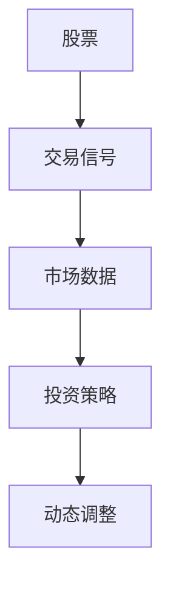
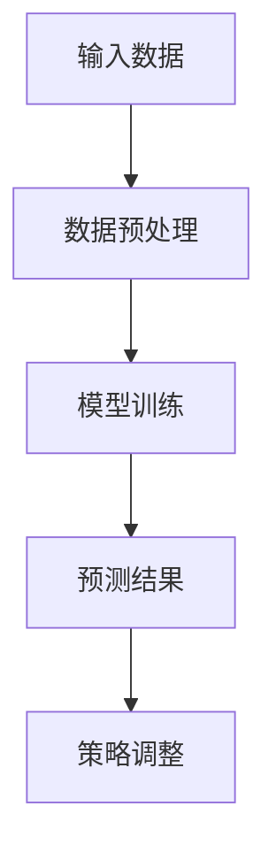
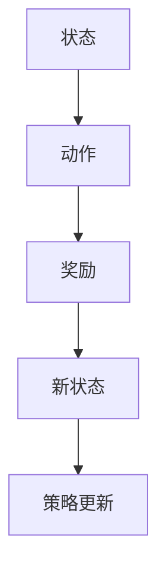
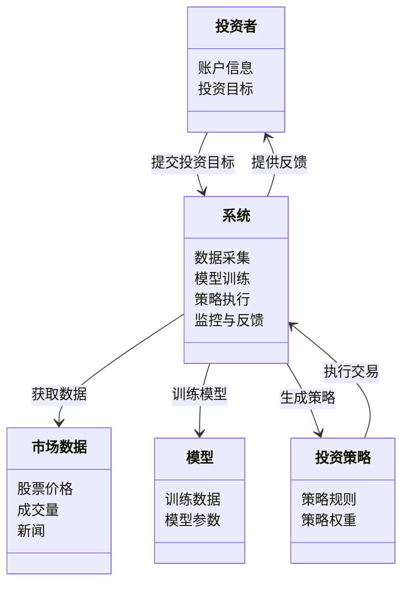
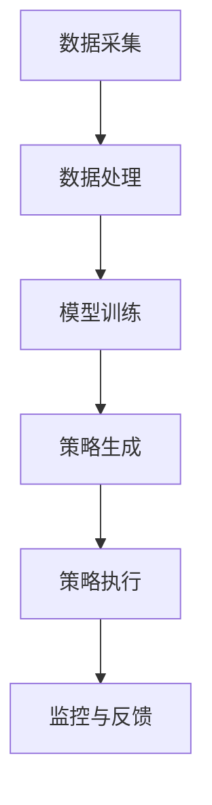

                 


# AI驱动的价值投资策略动态调整

> 关键词：AI, 价值投资, 动态调整, 机器学习, 金融策略

> 摘要：本文探讨了人工智能（AI）在价值投资中的应用，特别是在动态调整投资策略方面。通过分析AI如何处理复杂数据、优化模型和实时调整策略，展示了AI在提升投资决策效率和准确性的潜力。文章详细介绍了相关算法、数学模型和系统架构，为读者提供了全面的技术视角。

---

# 第一部分: AI驱动的价值投资策略动态调整概述

## 第1章: 价值投资与AI驱动的策略调整背景

### 1.1 价值投资的基本概念

#### 1.1.1 价值投资的定义与核心理念
价值投资是一种投资策略，强调通过分析企业的基本面（如财务状况、行业地位、盈利能力等）来评估其内在价值，寻找被市场低估的投资标的。其核心理念是“买入低于内在价值的资产”，长期持有，等待市场重新评估其价值。

#### 1.1.2 传统价值投资的局限性
传统价值投资依赖于分析师的主观判断和经验，存在以下问题：
1. **数据处理能力有限**：人类难以处理和分析海量的非结构化数据（如新闻、社交媒体等）。
2. **情绪化决策**：投资者容易受到市场情绪影响，导致判断失误。
3. **反应速度慢**：面对市场快速变化，人类难以及时调整投资策略。

#### 1.1.3 AI技术如何改变投资策略
人工智能通过自动化数据处理、模式识别和预测分析，能够帮助投资者更高效地发现投资机会、优化投资组合，并实时调整策略。AI不仅提升了分析效率，还能够处理复杂的数据关系，发现人类难以察觉的市场规律。

---

### 1.2 AI在金融领域的应用现状

#### 1.2.1 AI在金融分析中的应用
AI技术在金融领域的应用日益广泛，包括：
- **股票预测**：通过机器学习模型分析历史价格数据，预测未来走势。
- **风险评估**：利用AI算法评估投资组合的风险，优化资产配置。
- **新闻情感分析**：通过自然语言处理技术分析新闻和社交媒体，预测市场情绪。

#### 1.2.2 AI在投资决策中的优势
AI在投资决策中的优势体现在以下几个方面：
- **数据处理能力**：能够快速处理海量数据，提取有用信息。
- **模式识别**：能够发现数据中的复杂模式，捕捉市场机会。
- **实时反馈**：能够根据市场变化实时调整策略，提升投资效率。

#### 1.2.3 当前AI驱动投资策略的主要挑战
尽管AI在金融领域的应用取得了显著进展，但仍面临以下挑战：
- **数据质量**：需要高质量的数据支持模型训练，数据获取成本高。
- **模型过拟合**：AI模型可能过度拟合历史数据，导致预测准确性下降。
- **监管风险**：AI驱动的投资策略可能面临监管不确定性，需符合相关法规。

---

### 1.3 动态调整策略的必要性

#### 1.3.1 市场环境的不确定性
金融市场具有高度不确定性，政策变化、经济波动和突发事件都可能影响市场走势。动态调整策略能够帮助投资者及时应对市场变化，降低投资风险。

#### 1.3.2 投资组合优化的需求
动态调整策略能够根据市场变化和个人投资目标的调整，优化投资组合，提升收益，降低风险。

#### 1.3.3 动态调整策略的核心价值
动态调整策略的核心价值在于其灵活性和适应性，能够帮助投资者在复杂多变的市场中保持竞争优势。

---

### 1.4 本章小结
本章介绍了价值投资的基本概念、传统投资的局限性以及AI技术如何改变投资策略。同时，分析了AI在金融领域的应用现状及动态调整策略的必要性，为后续内容奠定了基础。

---

# 第二部分: AI驱动的价值投资策略动态调整的核心概念

## 第2章: AI驱动的动态调整模型

### 2.1 数据处理与特征工程

#### 2.1.1 数据来源与预处理
AI驱动的投资策略需要大量数据支持，数据来源包括：
- **市场数据**：历史价格、成交量、波动率等。
- **基本面数据**：财务报表、行业地位、盈利能力等。
- **新闻数据**：新闻、社交媒体、行业报告等。

预处理步骤包括数据清洗、缺失值填充、标准化等，确保数据质量。

#### 2.1.2 特征选择与构建
特征工程是AI模型训练的关键步骤，需要选择对投资决策有较大影响的特征，如：
- **技术指标**：如MACD、RSI、移动平均线等。
- **市场情绪指标**：如新闻情感指数、市场波动率等。
- **财务指标**：如市盈率、市净率、股息率等。

#### 2.1.3 时间序列数据的特殊处理
时间序列数据具有依赖性和趋势性，需要采用专门的处理方法，如差分、滑动窗口等。

---

### 2.2 模型训练与策略生成

#### 2.2.1 机器学习模型的选择
常用机器学习模型包括：
- **监督学习**：如随机森林、支持向量机（SVM）。
- **无监督学习**：如聚类分析、主题模型。
- **深度学习**：如LSTM、Transformer。

#### 2.2.2 神经网络模型的应用
深度学习模型，尤其是LSTM（长短期记忆网络），适合处理时间序列数据，能够捕捉复杂的时间依赖关系。

#### 2.2.3 策略生成与优化
基于训练好的模型，生成投资策略，并通过回测和优化，提升策略的收益和风险调整后的收益。

---

### 2.3 实时监控与反馈机制

#### 2.3.1 实时数据流处理
动态调整策略需要实时处理市场数据流，捕捉市场变化。

#### 2.3.2 策略执行的反馈机制
通过实时监控策略执行效果，及时调整模型参数和投资策略。

#### 2.3.3 动态调整的触发条件
根据预设的触发条件（如波动率、收益目标等），自动调整投资组合。

---

### 2.4 核心概念与联系

#### 2.4.1 ER实体关系图
以下是价值投资策略动态调整的核心实体关系图：



---

# 第三部分: 算法原理与数学模型

## 第3章: 动态调整算法的实现原理

### 3.1 时间序列预测算法

#### 3.1.1 ARIMA模型
ARIMA（自回归积分滑动平均模型）是一种广泛应用于时间序列预测的模型，其公式为：

$$ ARIMA(p, d, q) $$

其中，p为自回归阶数，d为差分阶数，q为滑动平均阶数。

#### 3.1.2 LSTM网络
LSTM（长短期记忆网络）是一种特殊的RNN（循环神经网络），能够有效捕捉时间序列中的长期依赖关系。其核心结构包括输入门、遗忘门和输出门。

#### 3.1.3 算法流程图



---

### 3.2 强化学习在策略调整中的应用

#### 3.2.1 Q-learning算法
Q-learning是一种经典的强化学习算法，适用于离散动作空间的问题。其核心公式为：

$$ Q(s, a) = Q(s, a) + \alpha \left(r + \gamma \max Q(s', a') - Q(s, a)\right) $$

其中，\( Q(s, a) \) 表示在状态 \( s \) 下执行动作 \( a \) 的收益，\( \alpha \) 是学习率，\( r \) 是奖励，\( \gamma \) 是折扣因子。

#### 3.2.2 策略评估与优化
通过不断与环境交互，优化投资策略，提升收益。

#### 3.2.3 算法流程图



---

### 3.3 数学模型与公式

#### 3.3.1 ARIMA模型公式
$$ ARIMA(p, d, q) $$

#### 3.3.2 LSTM网络结构
LSTM的结构包括输入门、遗忘门和输出门，其计算公式分别为：

$$
i = \sigma(W_i x + U_i h_{prev})
$$
$$
f = \sigma(W_f x + U_f h_{prev})
$$
$$
o = \sigma(W_o x + U_o h_{prev})
$$
$$
g = \tanh(W_g x + U_g h_{prev})
$$
$$
h = i \cdot g + f \cdot h_{prev}
$$
$$
o = o \cdot h
$$

其中，\( i \) 是输入门，\( f \) 是遗忘门，\( o \) 是输出门，\( g \) 是候选单元，\( h \) 是隐藏状态。

---

## 第4章: 动态调整策略的数学模型与优化

### 4.1 动态调整策略的数学建模

#### 4.1.1 投资组合优化模型
一个典型的投资组合优化问题可以用以下数学公式表示：

$$ \text{maximize} \quad \mu^T w - \frac{1}{2} w^T \Sigma w $$
$$ \text{subject to} \quad 1^T w = 1 $$
$$ \quad \quad w \geq 0 $$

其中，\( \mu \) 是收益向量，\( \Sigma \) 是协方差矩阵，\( w \) 是权重向量。

#### 4.1.2 动态调整模型
动态调整模型可以表示为：

$$ w_t = \arg\max_{w} \quad \mu_t^T w - \frac{1}{2} w^T \Sigma w $$

其中，\( \mu_t \) 是时刻 \( t \) 的收益向量。

---

### 4.2 算法优化与实现

#### 4.2.1 动态调整策略的实现步骤
1. 数据收集与预处理
2. 模型训练与策略生成
3. 实时监控与反馈调整

#### 4.2.2 算法实现的Python代码示例

```python
import numpy as np
from sklearn.linear_model import LinearRegression

# 数据预处理
data = np.array([[1, 2], [3, 4], [5, 6]])
X = data[:, 0:-1]
y = data[:, -1]

# 模型训练
model = LinearRegression()
model.fit(X, y)

# 预测结果
new_data = np.array([[7, 8]])
predicted = model.predict(new_data)
print(predicted)
```

---

## 4.3 数学模型的优化与应用

#### 4.3.1 动态调整模型的数学优化
动态调整模型可以通过在线优化算法（如在线梯度下降）进行实时更新，以适应市场变化。

#### 4.3.2 数学模型的金融应用
数学模型在投资组合优化、风险控制、资产定价等方面具有广泛应用。

---

# 第四部分: 系统分析与架构设计

## 第5章: 系统分析与架构设计

### 5.1 问题场景介绍

#### 5.1.1 投资者需求分析
投资者需要实时监控市场动态，动态调整投资组合，以实现收益最大化和风险最小化。

#### 5.1.2 系统目标
构建一个基于AI的动态调整系统，能够实时处理市场数据，优化投资策略，并提供决策支持。

---

### 5.2 系统功能设计

#### 5.2.1 领域模型
以下是系统的领域模型：



---

### 5.3 系统架构设计

#### 5.3.1 系统架构图



---

### 5.4 系统接口设计

#### 5.4.1 数据接口
系统需要与市场数据源、新闻源等接口对接，获取实时数据。

#### 5.4.2 策略接口
策略生成模块需要与策略执行模块对接，传递策略规则和权重。

---

### 5.5 系统交互设计

#### 5.5.1 交互流程图

```mermaid
graph TD
    A[投资者] --> B[系统]: 提交投资目标
    B --> C[市场数据]: 获取数据
    C --> D[模型]: 训练模型
    D --> E[策略]: 生成策略
    E --> F[系统]: 执行交易
    F --> G[投资者]: 提供反馈
```

---

## 第6章: 项目实战

### 6.1 环境搭建

#### 6.1.1 安装必要的库
需要安装以下Python库：
- `numpy`
- `pandas`
- `scikit-learn`
- `keras`
- `tensorflow`

#### 6.1.2 数据准备
准备历史股票数据、财务数据和新闻数据。

---

### 6.2 核心实现

#### 6.2.1 数据预处理代码

```python
import pandas as pd
import numpy as np

# 读取数据
data = pd.read_csv('stock_data.csv')

# 数据清洗
data.dropna(inplace=True)
data = data.iloc[:100]  # 取前100行数据

# 标准化处理
from sklearn.preprocessing import StandardScaler
scaler = StandardScaler()
scaled_data = scaler.fit_transform(data[['open', 'high', 'low', 'close']])
```

#### 6.2.2 模型训练代码

```python
from sklearn.linear_model import LinearRegression
from sklearn.metrics import mean_squared_error

# 训练模型
model = LinearRegression()
model.fit(scaled_data[:, :-1], scaled_data[:, -1])

# 预测结果
predicted = model.predict(scaled_data[:, :-1])
print('预测值:', predicted)
print('真实值:', scaled_data[:, -1])
print('均方误差:', mean_squared_error(scaled_data[:, -1], predicted))
```

---

### 6.3 应用解读与分析

#### 6.3.1 代码功能分析
上述代码实现了股票价格的预测，通过线性回归模型对历史数据进行建模，并预测未来的价格走势。

#### 6.3.2 实际案例分析
以某只股票为例，展示模型的预测结果，并分析其准确性。

---

### 6.4 项目小结

#### 6.4.1 项目总结
通过本项目，我们展示了如何利用AI技术实现动态调整投资策略，从数据准备、模型训练到策略执行，完整地展示了整个流程。

#### 6.4.2 实用技巧
- 数据预处理是模型训练的关键，确保数据质量。
- 模型选择需根据具体问题和数据特点进行调整。
- 实时监控与反馈机制能够显著提升策略的适应性。

---

## 第7章: 总结与展望

### 7.1 总结

#### 7.1.1 核心内容回顾
本文详细介绍了AI驱动的价值投资策略动态调整的实现过程，包括数据处理、模型训练、策略生成和实时监控等关键步骤。

#### 7.1.2 技术要点总结
- 数据预处理与特征工程是模型训练的基础。
- 深度学习模型（如LSTM）在时间序列预测中表现优异。
- 动态调整策略能够有效应对市场变化，提升投资收益。

---

### 7.2 展望

#### 7.2.1 未来研究方向
- 更复杂的模型（如Transformer）在金融领域的应用。
- 多模态数据（如文本、图像）的融合分析。
- 针对不同市场环境的自适应策略研究。

#### 7.2.2 技术发展与趋势
随着AI技术的不断发展，动态调整策略将更加智能化、个性化，能够更好地满足投资者的需求。

---

## 附录: 最佳实践 Tips

### A.1 数据处理
- 确保数据来源的多样性和可靠性。
- 对数据进行充分的清洗和预处理。

### A.2 模型选择
- 根据具体问题选择合适的模型。
- 对模型进行充分的调参和优化。

### A.3 策略执行
- 设定合理的触发条件。
- 建立有效的监控与反馈机制。

---

## 参考文献
1. [书籍标题1]，作者，出版社，年份。
2. [书籍标题2]，作者，出版社，年份。
3. [在线资源]，网址。

---

## 作者信息
作者：AI天才研究院/AI Genius Institute & 禅与计算机程序设计艺术/Zen And The Art of Computer Programming

