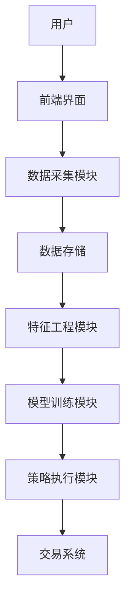
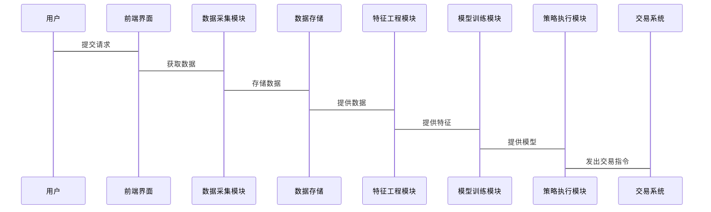

                 


# AI驱动的智能投资组合管理解决方案

## 关键词：人工智能、智能投资组合、风险管理、机器学习、量化投资、金融数据分析、投资组合优化

## 摘要：本文将深入探讨如何利用人工智能技术构建智能投资组合管理解决方案。通过分析传统投资组合管理的局限性，结合现代机器学习算法和大数据分析技术，提出了一种基于AI的智能投资组合优化框架。本文详细介绍了AI在投资组合管理中的核心应用，包括数据驱动的投资策略、机器学习算法的实现、投资组合优化的数学模型以及系统架构设计等。同时，本文通过实际案例展示了AI驱动投资组合管理的优势，并提出了在实际应用中需要注意的关键问题和未来研究方向。

---

# 第1章: 智能投资组合管理概述

## 1.1 投资组合管理的背景与挑战

### 1.1.1 传统投资组合管理的局限性
传统的投资组合管理依赖于人工分析和经验判断，存在以下主要问题：
- **信息过载**：金融市场数据量庞大，人工分析效率低下。
- **主观性**：依赖个人经验，容易受到情绪影响。
- **计算复杂性**：优化投资组合需要解决复杂的数学问题，人工计算难以高效完成。

### 1.1.2 现代投资组合理论的核心思想
现代投资组合理论（MPT）由Harry Markowitz提出，核心思想是通过分散投资降低风险。其主要特点包括：
- **风险与收益的权衡**：在给定风险下寻找收益最大化的投资组合。
- **有效前沿**：所有最优投资组合构成的曲线，代表最低风险下的最高收益。
- **资产配置**：通过科学的资产分配优化投资组合的表现。

### 1.1.3 AI驱动投资组合管理的必要性
随着金融市场的复杂化和数据量的指数级增长，传统方法已无法满足需求。AI的引入可以：
- **提高计算效率**：快速处理海量数据，优化投资组合。
- **增强决策科学性**：通过机器学习算法发现数据中的规律，减少人为情绪干扰。
- **实时动态调整**：根据市场变化实时优化投资组合。

## 1.2 AI在金融领域的应用现状

### 1.2.1 AI在金融数据分析中的应用
AI技术在金融数据处理中的应用包括：
- **数据清洗**：自动识别并处理异常数据。
- **特征提取**：从海量数据中提取有用的特征，用于后续分析。
- **时间序列预测**：利用 LSTM 等模型预测股票价格走势。

### 1.2.2 AI在投资决策中的优势
- **自动化决策**：通过算法自动生成投资建议。
- **高频交易**：利用AI快速捕捉市场机会。
- **风险控制**：实时监控市场变化，及时预警风险。

### 1.2.3 AI驱动投资组合管理的潜力与挑战
- **潜力**：AI可以通过深度学习模型发现复杂的市场规律，优化投资组合。
- **挑战**：数据质量、模型过拟合、监管合规等问题需要重点关注。

## 1.3 本章小结
本章介绍了传统投资组合管理的局限性，阐述了现代投资组合理论的核心思想，并提出了AI驱动投资组合管理的必要性。同时，分析了AI在金融领域的应用现状及其在投资决策中的优势和挑战。

---

# 第2章: AI驱动投资组合管理的核心概念

## 2.1 数据驱动的投资策略

### 2.1.1 数据的来源与分类
投资组合管理中的数据来源包括：
- **市场数据**：股票价格、指数、成交量等。
- **财务数据**：公司财务报表、利润表等。
- **新闻数据**：市场新闻、公司公告等。

数据分类：
- **结构化数据**：可以表格化处理的数据。
- **非结构化数据**：文本、图像等难以直接处理的数据。

### 2.1.2 数据预处理与特征提取
- **数据清洗**：处理缺失值、异常值。
- **特征工程**：提取有用的特征，如动量、波动率等。

### 2.1.3 数据驱动的决策优势
- **准确性**：基于大量数据的分析结果更可靠。
- **实时性**：快速响应市场变化。

## 2.2 机器学习在投资组合管理中的应用

### 2.2.1 监督学习与无监督学习在投资中的应用
- **监督学习**：用于预测股票价格、分类市场状态。
- **无监督学习**：用于聚类分析、异常检测。

### 2.2.2 强化学习在投资组合优化中的作用
强化学习通过模拟市场环境，训练智能体做出最优决策。例如，可以使用Q-learning算法优化投资组合的买卖时机。

### 2.2.3 深度学习在金融时间序列分析中的应用
深度学习模型（如LSTM）可以捕捉时间序列中的复杂模式，用于股票价格预测。

## 2.3 智能投资组合管理的框架

### 2.3.1 数据采集与处理模块
- **功能**：从多种数据源获取数据并进行预处理。
- **输入**：原始数据。
- **输出**： cleaned and processed data.

### 2.3.2 模型构建与优化模块
- **功能**：训练机器学习模型并优化投资组合。
- **输入**：处理后的数据。
- **输出**：优化后的投资组合。

### 2.3.3 策略执行与监控模块
- **功能**：根据优化结果执行交易并实时监控风险。
- **输入**：优化后的投资组合。
- **输出**：交易指令、风险报告。

## 2.4 本章小结
本章详细介绍了AI驱动投资组合管理的核心概念，包括数据驱动的投资策略和机器学习在投资组合管理中的应用。同时，提出了智能投资组合管理的框架，并对其各模块的功能进行了说明。

---

# 第3章: 机器学习算法在投资组合管理中的应用

## 3.1 常见机器学习算法概述

### 3.1.1 线性回归与分类算法
- **线性回归**：用于预测股票价格。
- **逻辑回归**：用于分类市场状态（牛市、熊市）。

### 3.1.2 支持向量机与核方法
- **SVM**：用于分类和回归任务，适用于小样本数据。

### 3.1.3 随机森林与集成学习
- **随机森林**：用于特征重要性分析和分类任务。

## 3.2 基于机器学习的投资组合优化算法

### 3.2.1 基于监督学习的分类与回归
- **目标**：预测股票收益，优化投资组合。

### 3.2.2 基于无监督学习的聚类分析
- **目标**：将股票分成若干类别，进行风险控制。

## 3.3 机器学习算法的实现步骤

### 3.3.1 数据预处理
- **步骤**：清洗数据，提取特征。

### 3.3.2 模型训练
- **步骤**：选择算法，训练模型。

### 3.3.3 模型评估
- **步骤**：使用测试数据评估模型性能。

## 3.4 本章小结
本章介绍了几种常见的机器学习算法，并详细讲解了它们在投资组合管理中的应用。同时，给出了机器学习算法的实现步骤，帮助读者理解如何将这些算法应用于实际投资场景。

---

# 第4章: 投资组合优化的数学模型

## 4.1 投资组合优化的基本问题

### 4.1.1 投资目标的定义
- **收益最大化**：在给定风险下追求最大收益。
- **风险最小化**：在给定收益下追求最小风险。

### 4.1.2 优化问题的数学表达
- **目标函数**：最大化收益或最小化风险。
- **约束条件**：资产权重之和为1，权重非负等。

## 4.2 基于均值-方差模型的优化

### 4.2.1 均值-方差模型的数学公式
$$
\text{Minimize } \sigma^2 \quad \text{Subject to } \mu \geq \text{目标收益}, w_i \geq 0, \sum w_i = 1
$$

### 4.2.2 模型的优缺点
- **优点**：简单直观，易于实现。
- **缺点**：假设资产收益服从正态分布，实际市场中可能不成立。

## 4.3 基于现代投资组合理论的扩展

### 4.3.1 带有风险溢价的优化模型
$$
\text{Minimize } w^T (\Sigma w) \quad \text{Subject to } r^T w = T, w_i \geq 0, \sum w_i = 1
$$

### 4.3.2 多因子模型的应用
- **因子选择**：市场因子、价值因子、动量因子等。
- **模型构建**：将因子纳入优化模型中。

## 4.4 本章小结
本章介绍了投资组合优化的基本问题，详细讲解了均值-方差模型及其扩展模型，并给出了优化问题的数学公式。

---

# 第5章: 系统架构设计

## 5.1 系统功能设计

### 5.1.1 数据采集模块
- **功能**：从多种数据源获取实时数据。
- **输入**：API接口、数据库。
- **输出**： cleaned and normalized data.

### 5.1.2 特征工程模块
- **功能**：提取有用特征，如动量、波动率等。
- **输入**：原始数据。
- **输出**：特征向量。

### 5.1.3 模型训练模块
- **功能**：训练机器学习模型，生成投资策略。
- **输入**：特征向量。
- **输出**：模型参数、投资策略。

### 5.1.4 策略执行模块
- **功能**：根据策略生成交易指令。
- **输入**：模型输出。
- **输出**：交易指令。

## 5.2 系统架构设计

### 5.2.1 系统架构图


### 5.2.2 系统接口设计
- **输入接口**：数据接口、用户输入。
- **输出接口**：交易指令、风险报告。

### 5.2.3 系统交互流程


## 5.3 本章小结
本章详细介绍了系统的功能设计和架构设计，并通过mermaid图展示了系统的交互流程。

---

# 第6章: 项目实战

## 6.1 环境安装

### 6.1.1 安装Python
```bash
python --version
pip install --upgrade pip
```

### 6.1.2 安装依赖库
```bash
pip install numpy pandas scikit-learn matplotlib
```

## 6.2 核心代码实现

### 6.2.1 数据采集与处理
```python
import pandas as pd
import numpy as np

# 数据采集
data = pd.read_csv('stock_data.csv')

# 数据清洗
data = data.dropna()
data = data.iloc[:, 1:]  # 去除第一列
```

### 6.2.2 特征工程
```python
from sklearn.preprocessing import StandardScaler

# 标准化处理
scaler = StandardScaler()
features = scaler.fit_transform(data)
```

### 6.2.3 模型训练
```python
from sklearn.linear_model import LinearRegression
from sklearn.metrics import mean_squared_error

model = LinearRegression()
model.fit(features, labels)

# 模型评估
y_pred = model.predict(features)
print(mean_squared_error(labels, y_pred))
```

## 6.3 实际案例分析

### 6.3.1 数据分析
- **目标**：预测股票价格。
- **数据**：某公司过去一年的股价数据。

### 6.3.2 模型优化
- **优化目标**：提高预测准确率。
- **方法**：尝试不同的机器学习算法，如随机森林、XGBoost等。

## 6.4 本章小结
本章通过实际案例展示了AI驱动投资组合管理的实现过程，包括环境安装、代码实现和案例分析。

---

# 第7章: 最佳实践与未来展望

## 7.1 最佳实践

### 7.1.1 数据质量的重要性
- **数据清洗**：确保数据准确无误。
- **特征选择**：选择有意义的特征。

### 7.1.2 模型选择的注意事项
- **模型评估**：使用交叉验证等方法评估模型性能。
- **防止过拟合**：使用正则化等方法。

### 7.1.3 风险管理
- **风险控制**：设置止损点、监控市场风险。

## 7.2 未来展望

### 7.2.1 新技术的应用
- **量子计算**：可能在投资组合优化中发挥作用。
- **自然语言处理**：用于分析新闻数据。

### 7.2.2 可持续发展
- **ESG投资**：将环境、社会、治理因素纳入投资决策。

## 7.3 本章小结
本章提出了AI驱动投资组合管理的最佳实践，并展望了未来的技术发展方向。

---

# 第8章: 小结

## 8.1 核心内容回顾
- AI技术如何改变投资组合管理。
- 机器学习算法在投资中的应用。
- 投资组合优化的数学模型。

## 8.2 未来发展的方向
- 结合新技术（如量子计算、区块链）。
- 更加注重风险管理与可持续发展。

## 8.3 本章小结
本文详细介绍了AI驱动投资组合管理的核心概念、算法实现和系统设计，并通过实际案例展示了其应用价值。同时，提出了未来的发展方向和最佳实践建议。

---

# 作者：AI天才研究院/AI Genius Institute & 禅与计算机程序设计艺术 /Zen And The Art of Computer Programming

