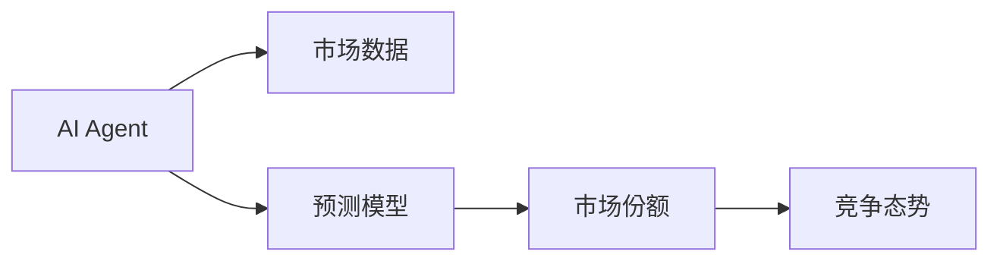
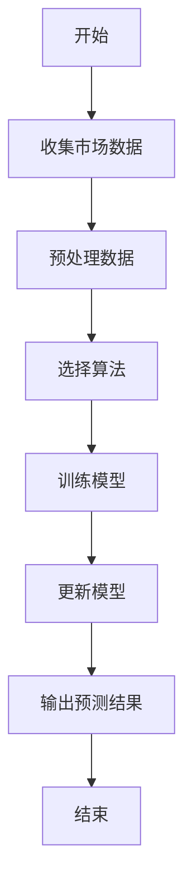
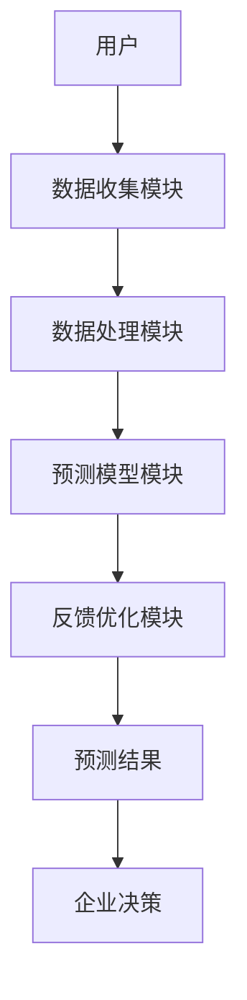

                 


# 利用AI agents构建动态市场份额预测模型：把握竞争态势

## 关键词：AI agents，市场份额预测，动态模型，竞争态势，系统架构，Python实现

## 摘要：本文详细探讨了利用AI代理构建动态市场份额预测模型的方法，分析了AI代理在动态预测中的优势，并通过系统架构设计和项目实战展示了模型的实现过程。文章结合数学模型和实际案例，帮助读者理解如何利用AI技术把握竞争态势。

---

# 第一部分：动态市场份额预测模型的背景与核心概念

## 第1章：动态市场份额预测模型的背景与问题描述

### 1.1 问题背景
#### 1.1.1 市场竞争分析的复杂性
现代市场竞争日益激烈，企业需要实时了解市场动态，以做出快速反应。传统的市场份额预测方法依赖于静态数据和假设，难以捕捉市场变化的动态性。例如，一家公司可能因为新产品发布、价格调整或竞争对手的战略变化而迅速失去市场份额。

#### 1.1.2 传统市场份额预测的局限性
传统的市场份额预测方法通常基于历史数据和统计分析，难以应对市场环境的快速变化。这些方法往往忽略了实时数据和动态因素，导致预测结果的准确性有限。例如，线性回归模型虽然简单，但无法捕捉市场趋势的变化。

#### 1.1.3 AI agents在动态预测中的优势
AI代理（AI agents）是一种能够自主感知环境、做出决策并采取行动的智能体。通过AI代理，我们可以实时收集市场数据，动态调整预测模型，从而更准确地预测市场份额变化。例如，AI代理可以实时监控社交媒体上的消费者反馈，动态更新市场情绪指数，从而影响市场份额预测。

### 1.2 问题描述
#### 1.2.1 市场份额预测的核心目标
市场份额预测的核心目标是帮助企业预测其在市场中的份额占比，以便制定更有效的市场策略。例如，企业可以根据预测结果调整产品定价、优化营销策略或重新分配资源。

#### 1.2.2 动态竞争环境的特征
动态竞争环境具有高度不确定性，市场参与者的行为和外部因素（如政策变化、经济波动）都会影响市场份额。例如，新冠疫情导致许多行业的市场结构发生了巨大变化，传统的市场份额预测方法难以适应这种变化。

#### 1.2.3 AI agents在动态预测中的应用场景
AI代理可以在动态竞争环境中实时收集和分析数据，动态更新预测模型。例如，AI代理可以实时监控竞争对手的价格变化、消费者行为和市场趋势，从而动态调整预测模型。

### 1.3 问题解决与边界
#### 1.3.1 AI agents如何解决动态预测问题
AI代理可以通过实时数据收集、动态分析和自主决策来解决动态预测问题。例如，AI代理可以实时分析社交媒体数据，动态更新市场情绪指数，从而影响市场份额预测结果。

#### 1.3.2 模型的边界与适用范围
动态市场份额预测模型的边界包括实时数据收集的范围、预测的时间窗口和模型的复杂度。例如，模型可能仅适用于特定行业的市场预测，且预测时间窗口通常为短期（如1-3个月）。

#### 1.3.3 核心要素与组成结构
动态市场份额预测模型的核心要素包括实时数据源、AI代理、预测模型和反馈机制。例如，模型需要实时数据源（如社交媒体、销售数据）作为输入，AI代理负责数据处理和预测，预测模型基于历史数据和实时数据进行动态调整，反馈机制用于优化模型。

### 1.4 核心概念与联系
#### 1.4.1 AI agents的基本原理
AI代理是一种能够感知环境、做出决策并采取行动的智能体。AI代理的核心功能包括感知、决策和行动。例如，AI代理可以通过传感器或API接口收集市场数据，分析数据后做出预测，并根据预测结果采取相应的行动（如调整价格或优化营销策略）。

#### 1.4.2 市场份额预测模型的构建逻辑
市场份额预测模型通常基于历史数据和实时数据，利用统计学和机器学习算法进行预测。例如，模型可能使用线性回归、时间序列分析或神经网络等方法。

#### 1.4.3 AI agents与市场份额预测的结合方式
AI代理与市场份额预测模型的结合主要体现在数据收集、模型更新和决策优化方面。例如，AI代理可以实时收集市场数据，动态更新预测模型，并根据预测结果优化企业的市场策略。

## 第2章：AI agents与市场份额预测的核心概念

### 2.1 核心概念原理
#### 2.1.1 AI agents的基本属性
AI代理具有自主性、反应性、目标导向性和社交能力。例如，AI代理可以自主决策，根据环境变化做出反应，并与外部系统或人员进行交互。

#### 2.1.2 动态市场份额预测模型的数学基础
动态市场份额预测模型通常基于时间序列分析、回归分析或机器学习算法。例如，模型可能使用ARIMA（自回归积分滑动平均模型）进行时间序列预测，或使用神经网络进行非线性预测。

#### 2.1.3 AI agents在预测中的角色
AI代理在市场份额预测中主要扮演数据收集者、预测模型优化者和决策支持者的角色。例如，AI代理可以实时收集市场数据，动态优化预测模型，并为企业提供实时的市场预测和决策建议。

### 2.2 核心概念对比表
| 概念       | 描述                                   |
|------------|--------------------------------------|
| AI agents   | 具有自主决策能力的智能体             |
| 市场份额预测 | 预测市场中各竞争者所占的份额         |
| 动态模型    | 能够实时更新和适应变化的预测模型     |

### 2.3 实体关系图


## 2.4 本章小结
本章介绍了AI代理的基本原理及其在市场份额预测中的作用，分析了动态市场份额预测模型的核心概念和相关术语。通过对比表和实体关系图，明确了AI代理与市场份额预测模型之间的关系。

---

# 第二部分：动态市场份额预测模型的算法原理

## 第3章：动态市场份额预测模型的算法原理

### 3.1 算法原理概述
#### 3.1.1 基于AI agents的预测逻辑
AI代理通过实时收集市场数据，利用机器学习算法进行预测，并根据预测结果优化企业的市场策略。例如，AI代理可以实时分析社交媒体数据，动态更新市场情绪指数，并预测未来市场份额变化。

#### 3.1.2 动态更新机制
动态市场份额预测模型的核心在于实时更新预测结果。模型通过不断收集新的数据点，利用在线学习算法（如在线随机梯度下降）更新预测模型。例如，模型可以在每分钟更新一次预测结果，以反映最新的市场动态。

#### 3.1.3 多因素分析方法
市场份额的变化通常受到多种因素的影响，包括价格、产品特性、品牌忠诚度、消费者偏好和市场趋势等。动态市场份额预测模型需要同时考虑多个因素，并利用多元回归分析或神经网络等方法进行综合预测。

### 3.2 算法流程图


### 3.3 算法实现代码
```python
import pandas as pd
from sklearn.linear_model import SGDRegressor
from sklearn.metrics import mean_squared_error

# 收集市场数据
data = pd.read_csv('market_data.csv')

# 数据预处理
X = data[['price', 'product_features', 'consumer_preference']]
y = data['market_share']

# 选择算法
model = SGDRegressor()

# 训练模型
model.fit(X, y)

# 动态更新模型
new_data = pd.read_csv('new_market_data.csv')
model.partial_fit(new_data[['price', 'product_features', 'consumer_preference']], new_data['market_share'])

# 输出预测结果
predictions = model.predict(X)
print(mean_squared_error(y, predictions))
```

### 3.4 算法数学模型
市场份额预测模型的数学表达式可以表示为：

$$ \hat{y}_t = \beta_0 + \beta_1x_{1,t} + \beta_2x_{2,t} + \dots + \beta_nx_{n,t} + \epsilon_t $$

其中，$\hat{y}_t$ 是第 $t$ 时刻的预测市场份额，$x_{i,t}$ 是第 $i$ 个影响市场份额的因素在第 $t$ 时刻的值，$\epsilon_t$ 是误差项。通过在线学习算法，模型可以实时更新参数 $\beta$，以适应市场变化。

### 3.5 本章小结
本章详细讲解了动态市场份额预测模型的算法原理，包括AI代理的预测逻辑、动态更新机制和多因素分析方法。通过流程图和Python代码，展示了算法实现的步骤和具体操作。同时，利用数学公式解释了模型的预测机制，帮助读者理解算法的核心原理。

---

# 第三部分：动态市场份额预测模型的系统架构设计

## 第4章：动态市场份额预测模型的系统架构设计

### 4.1 系统功能设计
#### 4.1.1 数据收集模块
数据收集模块负责实时收集市场数据，包括竞争对手的价格、产品特性、消费者行为和市场趋势等。例如，模块可以从社交媒体、电商平台和新闻网站中抓取数据。

#### 4.1.2 数据处理模块
数据处理模块对收集到的数据进行预处理，包括数据清洗、特征提取和数据转换。例如，模块可以将文本数据转换为数值特征，以便模型进行预测。

#### 4.1.3 预测模型模块
预测模型模块负责训练和更新动态市场份额预测模型。模块使用机器学习算法（如在线随机梯度下降）进行实时更新，以反映最新的市场动态。

#### 4.1.4 反馈优化模块
反馈优化模块根据预测结果和实际市场份额的变化，优化预测模型的参数。例如，模块可以根据预测误差调整模型的权重，以提高预测准确性。

### 4.2 系统架构图


### 4.3 系统接口设计
系统接口设计包括数据接口、模型接口和用户接口。数据接口用于与外部数据源（如社交媒体和电商平台）交互，模型接口用于与企业的其他系统（如ERP和CRM）集成，用户接口用于向企业决策者展示预测结果和优化建议。

### 4.4 系统交互流程图


## 4.5 本章小结
本章详细描述了动态市场份额预测模型的系统架构设计，包括各个模块的功能、系统架构图和系统交互流程图。通过系统的整体设计，展示了AI代理在动态预测中的应用。

---

# 第四部分：动态市场份额预测模型的项目实战

## 第5章：动态市场份额预测模型的项目实战

### 5.1 环境安装与配置
为了运行动态市场份额预测模型，需要安装以下工具和库：
- Python 3.8+
- Jupyter Notebook
- pandas、numpy、scikit-learn
- requests、beautifulsoup4（用于数据抓取）

### 5.2 核心代码实现
以下是一个简单的动态市场份额预测模型的Python代码示例：

```python
import pandas as pd
import requests
from bs4 import BeautifulSoup
from sklearn.linear_model import SGDRegressor
from sklearn.metrics import mean_squared_error

# 数据收集模块
def collect_data():
    url = 'https://example.com/market_data'
    response = requests.get(url)
    soup = BeautifulSoup(response.text, 'html.parser')
    data = []
    for item in soup.find_all('div', class_='data_item'):
        price = float(item.find('span', class_='price').text)
        features = float(item.find('span', class_='features').text)
        consumer_preference = float(item.find('span', class_='consumer_preference').text)
        data.append([price, features, consumer_preference])
    return data

# 数据处理模块
def preprocess_data(data):
    df = pd.DataFrame(data, columns=['price', 'features', 'consumer_preference'])
    return df

# 预测模型模块
def train_model(data, labels):
    model = SGDRegressor()
    model.fit(data, labels)
    return model

# 反馈优化模块
def optimize_model(model, new_data, new_labels):
    model.partial_fit(new_data, new_labels)
    return model

# 主程序
def main():
    data = collect_data()
    df = preprocess_data(data)
    labels = df['market_share']
    features = df.drop('market_share', axis=1)
    model = train_model(features, labels)
    new_data = collect_new_data()
    new_labels = preprocess_new_data(new_data)
    optimized_model = optimize_model(model, new_data, new_labels)
    predictions = optimized_model.predict(features)
    print(mean_squared_error(labels, predictions))

if __name__ == '__main__':
    main()
```

### 5.3 代码解释与分析
- 数据收集模块：通过网络请求和BeautifulSoup库抓取市场数据。
- 数据处理模块：将抓取的数据转换为DataFrame，并进行预处理。
- 预测模型模块：使用在线随机梯度下降算法训练模型。
- 反馈优化模块：实时更新模型参数，以适应市场变化。

### 5.4 实际案例分析
假设我们有一个电子商务平台，竞争对手每天调整其产品价格和促销活动。通过动态市场份额预测模型，我们可以实时监控竞争对手的价格变化和消费者行为，动态调整我们的定价策略，以最大化市场份额。

### 5.5 本章小结
本章通过实际案例分析，展示了动态市场份额预测模型的实现过程和应用场景。通过代码示例，读者可以理解模型的实现细节和具体操作步骤。

---

# 第五部分：动态市场份额预测模型的优化与扩展

## 第6章：动态市场份额预测模型的优化与扩展

### 6.1 最佳实践
- 数据质量：确保数据的准确性和及时性，可以通过数据清洗和特征工程提高模型的预测精度。
- 模型选择：根据具体的市场环境和数据特点，选择合适的机器学习算法（如LSTM用于时间序列预测）。
- 模型优化：通过超参数调优和模型集成（如堆叠模型）提高预测准确率。

### 6.2 小结
动态市场份额预测模型的优化需要从数据、算法和系统架构等多个方面入手，通过不断实验和调整，找到最优的实现方案。

### 6.3 注意事项
- 数据隐私：在收集和处理市场数据时，需要注意数据隐私和合规性问题。
- 模型解释性：动态预测模型的解释性可能较差，需要通过可视化和模型解释技术（如SHAP值）提高模型的可解释性。

### 6.4 拓展阅读
- 《Machine Learning: A Probabilistic Perspective》
- 《Deep Learning》
- 《Pattern Recognition and Machine Learning》

## 6.5 本章小结
本章总结了动态市场份额预测模型的优化方法和注意事项，提供了进一步学习和拓展的方向。

---

# 结语

通过本文的详细讲解，读者可以了解如何利用AI代理构建动态市场份额预测模型，并在实际应用中把握竞争态势。从背景介绍到系统架构设计，再到项目实战，本文为读者提供了一个完整的实现框架。希望本文能够为企业的市场预测和决策优化提供有价值的参考。

---

# 作者：AI天才研究院/AI Genius Institute & 禅与计算机程序设计艺术/Zen And The Art of Computer Programming

---

本文通过详细的章节内容，系统地介绍了动态市场份额预测模型的构建过程和应用场景。从理论到实践，从算法到系统设计，本文为读者提供了全面的指导。希望读者能够通过本文，掌握利用AI代理进行动态市场份额预测的核心方法，并在实际工作中灵活应用。

