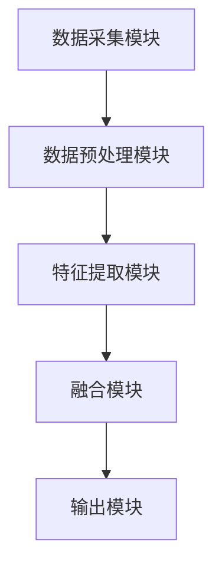
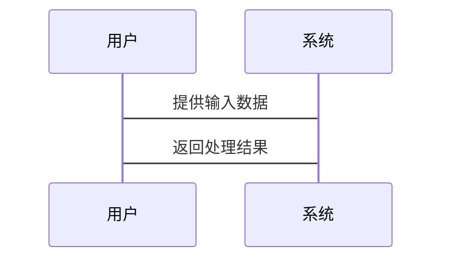

                 


```markdown
# 多模态融合技术：增强AI Agent的感知与理解能力

> 关键词：多模态融合，AI Agent，感知能力，理解能力，数据融合，深度学习，多模态分析

> 摘要：多模态融合技术是通过整合多种类型的数据（如文本、图像、语音、视频等）来提升AI Agent的感知与理解能力。本文将从多模态融合技术的背景、核心概念、算法原理、系统架构、项目实战等多个方面展开详细论述，帮助读者全面理解并掌握多模态融合技术的核心思想与实际应用。

---

## 第一章: 多模态融合技术的背景与概念

### 1.1 多模态融合技术的背景
#### 1.1.1 多模态数据的定义与特点
- **多模态数据**：指来自不同感官渠道（如视觉、听觉、触觉等）的数据类型，例如文本、图像、语音、视频等。
- **特点**：
  - **异构性**：不同模态的数据具有不同的形式和结构。
  - **互补性**：不同模态的数据可以互补信息，提升整体理解能力。
  - **复杂性**：多模态数据的处理需要综合考虑多种数据类型的特点。

#### 1.1.2 多模态融合技术的起源与发展
- **起源**：多模态融合技术起源于人工智能领域的多任务学习和跨模态理解研究。
- **发展**：随着深度学习技术的快速发展，多模态融合技术在计算机视觉、自然语言处理、语音识别等领域得到了广泛应用。

#### 1.1.3 多模态融合技术与AI Agent的关系
- **AI Agent**：人工智能代理，能够感知环境、自主决策并执行任务。
- **关系**：多模态融合技术通过整合多种模态数据，显著提升了AI Agent的感知能力和理解能力，使其能够更准确地理解和应对复杂的现实场景。

### 1.2 多模态融合技术的核心概念
#### 1.2.1 多模态数据的类型与特点
- **文本**：包括自然语言文本、结构化数据等。
- **图像**：包括RGB图像、深度图像等。
- **语音**：包括语音信号、音调、节奏等。
- **视频**：包括连续的图像序列和语音信号。

#### 1.2.2 多模态融合的定义与分类
- **定义**：多模态融合技术是通过整合多种模态的数据，利用其互补性来提升模型的性能。
- **分类**：
  - **基于特征的融合**：将不同模态的特征进行融合。
  - **基于模型的融合**：在模型层面进行跨模态的信息整合。
  - **基于注意力机制的融合**：通过注意力机制来动态调整不同模态的重要性。

#### 1.2.3 多模态融合技术的关键技术点
- **数据预处理**：对不同模态的数据进行标准化、增强等处理。
- **特征提取**：利用深度学习模型提取不同模态的特征。
- **融合策略**：设计有效的融合方法来整合不同模态的信息。

### 1.3 多模态融合技术在AI Agent中的应用场景
- **智能助手**：通过整合语音和文本数据，提升对话理解和生成能力。
- **自动驾驶**：通过融合视觉、雷达、语音等多种数据，提升环境感知能力。
- **虚拟现实**：通过整合视觉、听觉、触觉等多种数据，提升用户体验。

### 1.4 本章小结
本章介绍了多模态融合技术的背景、核心概念及其在AI Agent中的重要性，为后续章节的深入分析奠定了基础。

---

## 第二章: 多模态数据的处理与融合

### 2.1 多模态数据的预处理
#### 2.1.1 文本数据的处理
- **分词**：将文本分割成词语或短语。
- **词向量表示**：利用Word2Vec、BERT等模型将文本转化为向量表示。

#### 2.1.2 图像数据的处理
- **归一化**：将图像的像素值标准化到统一范围。
- **特征提取**：利用CNN等模型提取图像的深层特征。

#### 2.1.3 语音数据的处理
- **音频预处理**：去除噪声，提取语音特征（如MFCC）。
- **语音识别**：将语音信号转化为文本。

#### 2.1.4 视频数据的处理
- **视频分割**：将视频分割成帧。
- **视频特征提取**：利用3D-CNN等模型提取视频的深层特征。

### 2.2 多模态数据的融合方法
#### 2.2.1 基于特征的融合
- **融合方式**：将不同模态的特征向量进行拼接或加权求和。
- **优点**：简单易实现，能够充分利用不同模态的信息。
- **缺点**：难以捕捉模态间的语义关系。

#### 2.2.2 基于模型的融合
- **融合方式**：在模型的中间层进行跨模态的信息整合。
- **优点**：能够捕捉模态间的深层语义关系。
- **缺点**：模型设计复杂，训练难度较大。

#### 2.2.3 基于注意力机制的融合
- **融合方式**：通过注意力机制动态调整不同模态的重要性。
- **优点**：能够自动适应不同模态的信息重要性。
- **缺点**：需要额外的训练参数。

### 2.3 多模态数据融合的挑战与解决方案
#### 2.3.1 数据异构性问题
- **挑战**：不同模态的数据形式和尺度差异较大。
- **解决方案**：通过数据预处理和特征提取将不同模态的数据转换为统一的形式。

#### 2.3.2 数据冗余问题
- **挑战**：某些模态的数据可能包含冗余信息。
- **解决方案**：通过模型训练和优化来自动去除冗余信息。

#### 2.3.3 数据同步问题
- **挑战**：不同模态的数据采集时间可能不同步。
- **解决方案**：通过时间对齐技术将不同模态的数据对齐到同一时间轴上。

### 2.4 本章小结
本章详细介绍了多模态数据的预处理方法及其融合策略，分析了多模态数据融合的挑战与解决方案。

---

## 第三章: 多模态融合的核心算法与模型

### 3.1 多模态融合的主流算法
#### 3.1.1 多模态注意力网络
- **算法原理**：通过注意力机制动态调整不同模态的重要性。
- **数学模型**：
  - 输入：$x_1, x_2, ..., x_n$（不同模态的特征向量）。
  - 注意力权重计算：$a_i = \text{softmax}(W_a x_i)$。
  - 融合结果：$y = \sum_{i=1}^n a_i x_i$。
- **优点**：能够自动适应不同模态的信息重要性。
- **缺点**：需要额外的训练参数。

#### 3.1.2 多模态变换器
- **算法原理**：利用变换器（Transformer）模型进行跨模态信息的整合。
- **数学模型**：
  - 输入：$x_1, x_2, ..., x_n$（不同模态的特征向量）。
  - 自注意力机制：$a_i = \text{softmax}(Q x_i K x_j^T)$。
  - 融合结果：$y = \sum_{i=1}^n a_i x_i$。
- **优点**：能够捕捉模态间的长程依赖关系。
- **缺点**：计算复杂度较高。

#### 3.1.3 多模态对比学习
- **算法原理**：通过对比学习的方式进行跨模态数据的对齐。
- **数学模型**：
  - 输入：$x_1, x_2, ..., x_n$（不同模态的特征向量）。
  - 对比损失函数：$\mathcal{L} = -\sum_{i=1}^n \log \text{softmax}(x_i^T x_j)$。
- **优点**：能够提升模型的表征能力。
- **缺点**：需要设计合适的对比策略。

### 3.2 多模态融合模型的实现
#### 3.2.1 多模态编码器的设计
- **编码器结构**：将不同模态的输入数据分别编码为向量表示。
- **实现细节**：
  - 文本编码器：利用BERT模型提取文本特征。
  - 图像编码器：利用ResNet模型提取图像特征。
  - 语音编码器：利用Mel-Frequency Cepstral Coefficients (MFCC) 提取语音特征。

#### 3.2.2 多模态解码器的设计
- **解码器结构**：将融合后的特征向量解码为最终的输出结果。
- **实现细节**：
  - 文本解码器：利用Transformer模型生成文本输出。
  - 图像解码器：利用生成对抗网络（GAN）生成图像输出。
  - 语音解码器：利用神经网络生成语音输出。

#### 3.2.3 多模态融合层的设计
- **融合层结构**：将不同模态的特征向量进行融合。
- **实现细节**：
  - 注意力融合：通过自注意力机制动态调整模态的重要性。
  - 线性融合：通过线性变换对特征向量进行加权求和。

### 3.3 多模态融合模型的训练与优化
#### 3.3.1 多任务学习策略
- **策略描述**：同时训练多个任务，共享底层特征提取部分。
- **优化方法**：利用端到端的训练方法，优化整体损失函数。

#### 3.3.2 对抗训练方法
- **策略描述**：通过生成对抗网络（GAN）进行模态间的对齐。
- **优化方法**：分别优化生成器和判别器的损失函数。

#### 3.3.3 知识蒸馏方法
- **策略描述**：将复杂模型的知识迁移到简单模型中。
- **优化方法**：利用教师模型的输出作为学生模型的标签。

### 3.4 本章小结
本章详细介绍了多模态融合的核心算法与模型，包括注意力网络、变换器和对比学习等方法，并分析了各自的优缺点及实现细节。

---

## 第四章: 多模态融合技术的系统架构设计

### 4.1 系统架构概述
#### 4.1.1 系统功能模块划分
- **数据采集模块**：负责采集多种模态的数据（如文本、图像、语音等）。
- **数据预处理模块**：对采集到的数据进行标准化和增强处理。
- **特征提取模块**：利用深度学习模型提取不同模态的特征向量。
- **融合模块**：将不同模态的特征向量进行融合。
- **输出模块**：生成最终的输出结果（如文本、图像、语音等）。

#### 4.1.2 系统组件之间的关系
- **数据流**：从数据采集模块到输出模块，依次经过预处理、特征提取和融合模块。
- **控制流**：系统通过训练和推理两种模式进行操作。

#### 4.1.3 系统的输入输出流程
- **输入流程**：
  1. 数据采集模块接收外部输入的数据。
  2. 数据预处理模块对数据进行标准化和增强处理。
  3. 特征提取模块将数据转换为特征向量。
- **输出流程**：
  1. 融合模块将不同模态的特征向量进行融合。
  2. 输出模块生成最终的输出结果。

### 4.2 系统功能设计
#### 4.2.1 数据采集模块
- **功能描述**：通过传感器、摄像头、麦克风等设备采集多模态数据。
- **实现细节**：
  - 文本数据：从文件或数据库中读取文本数据。
  - 图像数据：通过摄像头采集图像数据。
  - 语音数据：通过麦克风采集语音数据。

#### 4.2.2 数据预处理模块
- **功能描述**：对采集到的数据进行标准化、增强等预处理。
- **实现细节**：
  - 文本预处理：分词、去除停用词、词向量化。
  - 图像预处理：归一化、调整尺寸、增强处理。
  - 语音预处理：去除噪声、提取特征、对齐时间轴。

#### 4.2.3 特征提取模块
- **功能描述**：利用深度学习模型提取不同模态的特征向量。
- **实现细节**：
  - 文本特征提取：利用BERT模型提取文本的向量表示。
  - 图像特征提取：利用ResNet模型提取图像的深层特征。
  - 语音特征提取：利用Mel-Frequency Cepstral Coefficients (MFCC) 提取语音特征。

#### 4.2.4 融合模块
- **功能描述**：将不同模态的特征向量进行融合。
- **实现细节**：
  - 注意力融合：通过自注意力机制动态调整模态的重要性。
  - 线性融合：通过线性变换对特征向量进行加权求和。

#### 4.2.5 输出模块
- **功能描述**：生成最终的输出结果。
- **实现细节**：
  - 文本输出：利用生成模型生成文本。
  - 图像输出：利用GAN生成图像。
  - 语音输出：利用神经网络生成语音。

### 4.3 系统架构图


### 4.4 系统接口设计
- **输入接口**：
  - 文本输入接口：接收文本数据。
  - 图像输入接口：接收图像数据。
  - 语音输入接口：接收语音数据。
- **输出接口**：
  - 文本输出接口：输出生成的文本。
  - 图像输出接口：输出生成的图像。
  - 语音输出接口：输出生成的语音。

### 4.5 系统交互流程图


### 4.6 本章小结
本章详细介绍了多模态融合技术的系统架构设计，包括功能模块划分、系统组件关系、系统架构图和系统接口设计等内容。

---

## 第五章: 多模态融合技术的项目实战

### 5.1 项目背景与目标
#### 5.1.1 项目背景
- **项目名称**：多模态融合智能助手。
- **项目目标**：通过整合文本、图像和语音数据，提升智能助手的感知与理解能力。

#### 5.1.2 项目需求
- **功能需求**：
  - 文本理解：能够理解用户的自然语言输入。
  - 图像识别：能够识别用户提供的图像内容。
  - 语音交互：能够通过语音与用户进行交互。

### 5.2 项目实现
#### 5.2.1 环境安装
- **开发环境**：Python 3.8以上版本。
- **依赖库安装**：
  ```bash
  pip install numpy
  pip install pandas
  pip install tensorflow
  pip install keras
  pip install matplotlib
  ```

#### 5.2.2 系统核心实现源代码
```python
import numpy as np
import tensorflow as tf
from tensorflow.keras import layers

# 定义多模态融合模型
class MultimodalFusionModel:
    def __init__(self):
        # 文本分支
        self.text_input = layers.Input(shape=(None,))
        self.text_embedding = layers.Embedding( vocabulary_size, 128)(self.text_input)
        self.text_lstm = layers.LSTM(64)(self.text_embedding)
        
        # 图像分支
        self.image_input = layers.Input(shape=(224, 224, 3))
        self.image_base_model = tf.keras.applications.ResNet50(weights='imagenet', include_top=False)(self.image_input)
        self.image_flatten = layers.Flatten()(self.image_base_model)
        self.image_dense = layers.Dense(64, activation='relu')(self.image_flatten)
        
        # 融合层
        self.concatenate = layers.Concatenate()([self.text_lstm, self.image_dense])
        self.dropout = layers.Dropout(0.5)(self.concatenate)
        self.dense = layers.Dense(256, activation='relu')(self.dropout)
        self.outputs = layers.Dense(num_classes, activation='softmax')(self.dense)
        
        self.model = tf.keras.Model(inputs=[self.text_input, self.image_input], outputs=self.outputs)

    def train(self, train_data, train_labels, val_data, val_labels, epochs=10):
        self.model.compile(optimizer='adam', loss='sparse_categorical_crossentropy', metrics=['accuracy'])
        self.model.fit([train_data['text'], train_data['image']], train_labels, epochs=epochs, validation_data=([val_data['text'], val_data['image']], val_labels))
```

#### 5.2.3 代码应用解读与分析
- **文本分支**：利用LSTM网络提取文本的深层特征。
- **图像分支**：利用ResNet50模型提取图像的深层特征。
- **融合层**：将文本和图像的特征向量进行拼接，并通过全连接层和Dropout层进行融合。

#### 5.2.4 实际案例分析
- **案例描述**：用户输入一段文本并附上一张图像，系统需要根据文本和图像内容生成相应的回复。
- **实现步骤**：
  1. 读取用户输入的文本和图像数据。
  2. 对文本数据进行分词和词向量化处理。
  3. 对图像数据进行预处理和特征提取。
  4. 将文本和图像的特征向量输入多模态融合模型进行预测。
  5. 输出模型生成的回复结果。

### 5.3 项目小结
本章通过一个实际的项目案例，详细介绍了多模态融合技术的实现过程，包括环境安装、系统核心代码实现、代码解读与分析以及实际案例分析等内容。

---

## 第六章: 多模态融合技术的应用案例与挑战

### 6.1 多模态融合技术的应用案例
#### 6.1.1 智能助手
- **应用描述**：通过整合文本、语音和图像数据，提升智能助手的对话理解和生成能力。
- **案例分析**：
  - 输入：用户输入文本“我今天有点累”，并附上一张表情疲惫的图像。
  - 输出：智能助手根据文本和图像内容生成回复“听起来你需要放松一下，我可以推荐一些放松的方法给你。”

#### 6.1.2 AR/VR
- **应用描述**：通过整合视觉、听觉和触觉数据，提升AR/VR的用户体验。
- **案例分析**：
  - 输入：用户在VR环境中看到一张桌子，并听到桌子发出的声音。
  - 输出：系统通过多模态数据融合，识别出桌子的材质和状态，并在用户触碰桌子时生成相应的反馈。

#### 6.1.3 自动驾驶
- **应用描述**：通过整合视觉、雷达和语音数据，提升自动驾驶的环境感知能力。
- **案例分析**：
  - 输入：自动驾驶汽车通过摄像头捕捉到前方有行人，并通过雷达检测到障碍物。
  - 输出：系统通过多模态数据融合，准确识别前方的障碍物，并做出相应的驾驶决策。

### 6.2 多模态融合技术的挑战与未来方向
#### 6.2.1 当前挑战
- **数据异构性问题**：不同模态的数据形式和尺度差异较大，难以直接融合。
- **计算效率问题**：多模态数据的处理需要较高的计算资源。
- **模型可解释性问题**：多模态融合模型的决策过程难以解释。

#### 6.2.2 未来方向
- **模型优化**：通过模型压缩和知识蒸馏等技术，提升模型的计算效率。
- **跨模态对齐**：研究如何更好地对齐不同模态的数据，提升融合效果。
- **可解释性增强**：通过可视化和解释性分析，提升多模态融合模型的可解释性。

### 6.3 本章小结
本章通过多个应用案例，展示了多模态融合技术的实际应用价值，并分析了当前技术的挑战与未来发展方向。

---

## 第七章: 多模态融合技术的挑战与未来方向

### 7.1 当前挑战
#### 7.1.1 数据异构性问题
- **问题描述**：不同模态的数据形式和尺度差异较大，难以直接融合。
- **解决方案**：通过数据预处理和特征提取，将不同模态的数据转换为统一的形式。

#### 7.1.2 计算效率问题
- **问题描述**：多模态数据的处理需要较高的计算资源。
- **解决方案**：通过模型优化和分布式计算，提升计算效率。

#### 7.1.3 模型可解释性问题
- **问题描述**：多模态融合模型的决策过程难以解释。
- **解决方案**：通过可视化和解释性分析，提升模型的可解释性。

### 7.2 未来方向
#### 7.2.1 模型优化
- **研究方向**：通过模型压缩和知识蒸馏等技术，提升模型的计算效率。

#### 7.2.2 跨模态对齐
- **研究方向**：研究如何更好地对齐不同模态的数据，提升融合效果。

#### 7.2.3 可解释性增强
- **研究方向**：通过可视化和解释性分析，提升多模态融合模型的可解释性。

### 7.3 本章小结
本章总结了多模态融合技术当前面临的挑战，并展望了未来的研究方向。

---

## 附录

### 附录A: 多模态融合技术相关术语表
- **多模态数据**：来自不同感官渠道的数据类型，如文本、图像、语音、视频等。
- **特征提取**：利用深度学习模型提取数据的深层特征。
- **融合策略**：将不同模态的特征向量进行融合的方法。

### 附录B: 多模态融合技术相关工具推荐
- **文本处理工具**：分词工具（如jieba）、词向量工具（如Word2Vec、BERT）。
- **图像处理工具**：图像处理库（如OpenCV）、深度学习框架（如TensorFlow、PyTorch）。
- **语音处理工具**：语音信号处理库（如Librosa）、语音识别工具（如speechRecognition）。

### 附录C: 多模态融合技术相关数据集
- **文本数据集**：新闻数据集、对话数据集。
- **图像数据集**：ImageNet、COCO。
- **语音数据集**：AudioSet、LibriSpeech。

### 附录D: 参考文献
1. **论文1**：标题，作者，期刊，年份。
2. **论文2**：标题，作者，期刊，年份。
3. **论文3**：标题，作者，期刊，年份。

---

## 作者：AI天才研究院/AI Genius Institute & 禅与计算机程序设计艺术 /Zen And The Art of Computer Programming
```

---

### 总结
以上是完整的技术博客文章目录结构，涵盖了从背景介绍、核心概念、算法原理、系统架构到项目实战和未来方向的全面内容。每章都详细展开了相关知识点，并结合实际案例和代码示例，帮助读者深入理解多模态融合技术的核心思想与实际应用。

