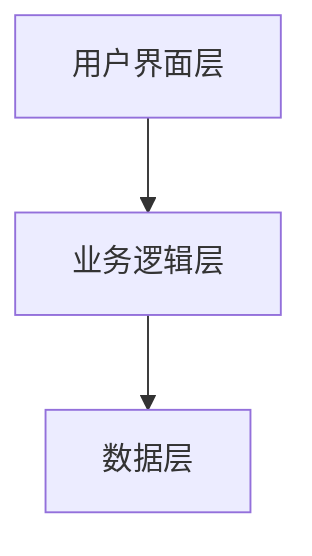
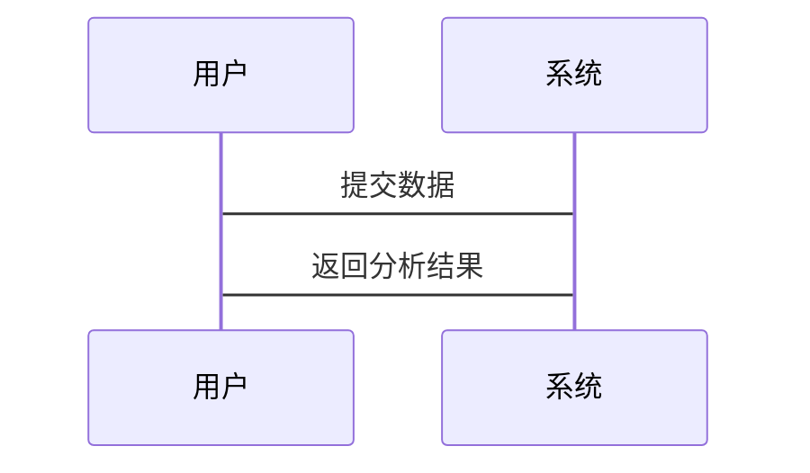

                 


# 巴菲特的品牌忠诚度分析：区块链技术对消费者行为的影响

> 关键词：巴菲特，品牌忠诚度，区块链技术，消费者行为，智能合约，分布式账本，信任机制

> 摘要：本文探讨了巴菲特的品牌忠诚度分析，结合区块链技术对消费者行为的影响。通过分析品牌忠诚度的形成机制、区块链技术的核心原理及其对消费者信任和参与度的提升，本文揭示了区块链技术如何改变消费者行为，并增强品牌忠诚度。通过实际案例和系统设计，本文为品牌管理者提供了基于区块链技术的消费者行为分析和品牌忠诚度管理的最佳实践。

---

## 第一章：引言

### 1.1 巴菲特的品牌忠诚度分析

#### 1.1.1 巴菲特投资理念概述

沃伦·巴菲特是全球著名投资家，其投资理念强调长期价值、企业基本面分析以及品牌忠诚度。巴菲特认为，品牌的忠诚度是企业长期成功的关键因素之一。消费者对品牌的忠诚度越高，企业的市场份额和长期盈利能力越强。

#### 1.1.2 品牌忠诚度的定义与重要性

品牌忠诚度是指消费者对特定品牌的一贯选择和偏好。在竞争激烈的市场环境中，品牌忠诚度能够帮助企业建立长期竞争优势，降低营销成本，并在市场波动中保持稳定性。

#### 1.1.3 区块链技术的兴起及其潜力

区块链技术作为一种分布式账本技术，具有去中心化、透明性和不可篡改的特点。随着技术的发展，区块链在多个领域的应用潜力逐渐显现，特别是在品牌忠诚度管理和消费者行为分析方面。

---

### 1.2 区块链技术的基本概念

#### 1.2.1 区块链的定义与核心原理

区块链是一种分布式账本技术，通过去中心化的节点网络记录和验证数据。其核心原理包括分布式账本、共识机制和智能合约。

#### 1.2.2 区块链的特点与优势

区块链的特点包括去中心化、透明性、不可篡改性和高效性。其优势在于能够提升数据的安全性、透明度和信任度，从而为品牌忠诚度管理提供技术支持。

#### 1.2.3 区块链在品牌忠诚度管理中的应用前景

通过区块链技术，品牌可以实现消费者数据的透明化管理，增强消费者信任，从而提升品牌忠诚度。区块链还可以通过智能合约实现自动化激励机制，进一步促进消费者行为与品牌忠诚度的结合。

---

### 1.3 本章小结

本章介绍了巴菲特的品牌忠诚度分析和区块链技术的基本概念，探讨了两者结合的可能性和潜力。通过理解品牌忠诚度的形成机制和区块链技术的核心原理，我们可以更好地理解区块链技术对消费者行为的影响。

---

## 第二章：品牌忠诚度的形成机制

### 2.1 消费者行为分析

#### 2.1.1 消费者决策过程

消费者的决策过程包括需求识别、信息收集、评估、购买决策和购买后行为。品牌忠诚度的形成与消费者在这些阶段的行为密切相关。

#### 2.1.2 品牌认知与品牌忠诚度的关系

品牌认知是消费者对品牌的初步理解和记忆，而品牌忠诚度则是在多次购买和使用中形成的。品牌认知的深度和广度直接影响品牌忠诚度的高低。

#### 2.1.3 影响品牌忠诚度的因素

影响品牌忠诚度的因素包括产品质量、价格、服务、品牌声誉和消费者情感等因素。其中，信任和情感因素在品牌忠诚度的形成中起着重要作用。

---

### 2.2 区块链技术对消费者行为的影响

#### 2.2.1 透明度提升与信任增强

区块链技术通过记录所有交易的不可篡改性，提高了品牌与消费者之间的信任度。消费者可以通过区块链技术实时查看产品信息和交易记录，从而增强对品牌的信任。

#### 2.2.2 消费者数据的隐私保护

区块链技术可以通过加密和权限管理，保护消费者的隐私数据。消费者可以放心地提供个人信息，从而增强品牌忠诚度。

#### 2.2.3 消费者参与度的提升

区块链技术可以通过智能合约实现消费者参与的激励机制，例如积分奖励、优惠券发放等。这种互动方式能够有效提升消费者的参与度和品牌忠诚度。

---

### 2.3 本章小结

本章分析了品牌忠诚度的形成机制和区块链技术对消费者行为的影响。通过提升透明度和信任度，区块链技术能够增强消费者对品牌的信任和忠诚度，从而为企业创造更大的价值。

---

## 第三章：区块链技术的核心原理

### 3.1 分布式账本技术

#### 3.1.1 区块链的分布式账本结构

区块链的分布式账本由多个节点共同维护，每个节点都有一份完整的账本副本。通过去中心化的结构，区块链能够确保数据的安全性和一致性。

#### 3.1.2 区块链的数据存储方式

区块链数据以区块为单位存储，每个区块包含交易记录和时间戳。区块之间通过哈希值链接，形成一条不可篡改的链式结构。

#### 3.1.3 区块链的安全性保障

区块链的安全性主要依赖于密码学和共识机制。通过加密算法和数学验证，区块链能够防止数据篡改和攻击。

---

### 3.2 智能合约

#### 3.2.1 智能合约的定义与功能

智能合约是区块链上的自动执行程序，用于实现预设的条件和规则。它可以在没有中间人的情况下，自动执行合同条款。

#### 3.2.2 智能合约的执行流程

智能合约的执行流程包括触发条件、验证、执行和记录。通过智能合约，品牌可以实现自动化激励机制，例如自动发放积分或优惠券。

#### 3.2.3 智能合约在品牌忠诚度管理中的应用

通过智能合约，品牌可以实现消费者行为的自动化管理。例如，当消费者完成特定行为（如购买商品）时，智能合约会自动发放积分或优惠券，从而激励消费者行为。

---

### 3.3 区块链的共识机制

#### 3.3.1 共识机制的定义与作用

共识机制是区块链中的关键组成部分，用于确保所有节点对账本状态达成一致。常见的共识机制包括工作量证明（PoW）和权益证明（PoS）。

#### 3.3.2 常见的共识算法（如PoW、PoS）

工作量证明（PoW）通过计算哈希值来验证交易，而权益证明（PoS）通过持有代币的数量来验证交易。不同的共识算法适用于不同的场景。

#### 3.3.3 共识机制对品牌忠诚度的影响

通过共识机制，区块链能够确保品牌忠诚度数据的准确性和一致性。消费者可以信任品牌的数据透明性，从而增强品牌忠诚度。

---

### 3.4 本章小结

本章详细介绍了区块链技术的核心原理，包括分布式账本、智能合约和共识机制。通过这些技术，区块链能够为品牌忠诚度管理提供高效、安全和透明的解决方案。

---

## 第四章：区块链技术对消费者行为的影响分析

### 4.1 消费者信任与品牌忠诚度

#### 4.1.1 区块链如何增强消费者信任

通过区块链技术，消费者可以实时查看品牌的产品信息和交易记录，从而增强对品牌的信任。

#### 4.1.2 信任提升对品牌忠诚度的积极影响

信任是品牌忠诚度的重要基础。通过区块链技术增强信任，品牌可以吸引更多的忠诚消费者。

#### 4.1.3 案例分析：区块链在零售业的应用

以零售业为例，区块链技术可以用于记录产品的来源和质量信息。消费者可以通过区块链技术查询产品的详细信息，从而增强对品牌的信任。

---

### 4.2 消费者数据的透明与隐私保护

#### 4.2.1 区块链技术如何实现数据透明

通过区块链技术，品牌可以实现消费者数据的透明化管理，消费者可以随时查看自己的数据。

#### 4.2.2 数据隐私保护的实现机制

区块链技术通过加密和权限管理，保护消费者的隐私数据。消费者可以放心地提供个人信息，从而增强品牌忠诚度。

#### 4.2.3 对消费者行为的具体影响

数据透明和隐私保护能够提升消费者的信任和参与度，从而增强品牌忠诚度。

---

### 4.3 消费者参与度的提升

#### 4.3.1 区块链如何促进消费者参与

通过智能合约和区块链技术，品牌可以实现消费者行为的自动化激励机制，例如积分奖励和优惠券发放。

#### 4.3.2 消费者参与对品牌忠诚度的促进作用

消费者的积极参与能够增强他们对品牌的认同感和忠诚度。区块链技术通过激励机制，有效促进了消费者的参与。

#### 4.3.3 案例分析：区块链在会员管理系统中的应用

以会员管理系统为例，品牌可以通过区块链技术实现会员积分的自动化管理。消费者可以通过区块链技术实时查看自己的积分，并享受相应的优惠。

---

### 4.4 本章小结

本章分析了区块链技术对消费者行为的具体影响，包括信任提升、数据透明和消费者参与度的提升。通过这些影响，区块链技术能够有效增强品牌忠诚度。

---

## 第五章：消费者行为分析的算法原理

### 5.1 数据

#### 5.1.1 消费者行为数据的来源

消费者行为数据可以通过多种渠道获取，包括销售数据、社交媒体数据和问卷调查数据等。

#### 5.1.2 数据预处理与特征提取

数据预处理包括数据清洗、数据转换和特征提取。特征提取是将原始数据转化为有意义的特征，以便后续分析。

#### 5.1.3 数据分析方法

数据分析方法包括统计分析、机器学习和深度学习等。通过这些方法，可以更好地理解消费者行为的规律。

---

### 5.2 消费者行为分析的算法原理

#### 5.2.1 线性回归模型

线性回归模型是一种常用的回归分析方法，适用于预测消费者行为的线性关系。

#### 5.2.2 支持向量机（SVM）

支持向量机（SVM）是一种监督学习算法，适用于分类和回归问题。它可以用于消费者行为的分类和预测。

#### 5.2.3 随机森林

随机森林是一种基于决策树的集成学习算法，适用于分类和回归问题。它可以用于消费者行为的分类和预测。

---

### 5.3 算法实现

#### 5.3.1 线性回归模型的实现

以下是线性回归模型的Python代码示例：

```python
import numpy as np
from sklearn.linear_model import LinearRegression

# 生成示例数据
X = np.array([1, 2, 3, 4, 5])
y = np.array([2, 4, 5, 4, 5])

# 训练模型
model = LinearRegression()
model.fit(X.reshape(-1, 1), y)

# 预测结果
print(model.predict(X.reshape(-1, 1)))
```

#### 5.3.2 支持向量机（SVM）的实现

以下是支持向量机（SVM）的Python代码示例：

```python
from sklearn import svm

# 生成示例数据
X = np.array([[1, 2], [3, 4], [5, 6], [7, 8], [9, 10]])
y = np.array([1, 2, 3, 4, 5])

# 训练模型
model = svm.SVC()
model.fit(X, y)

# 预测结果
print(model.predict(X))
```

---

### 5.4 本章小结

本章介绍了消费者行为分析的算法原理，包括线性回归模型和随机森林等算法的实现。通过这些算法，我们可以更好地理解消费者行为的规律，从而为品牌忠诚度管理提供技术支持。

---

## 第六章：系统设计与实现

### 6.1 系统功能设计

#### 6.1.1 系统功能概述

系统功能包括消费者数据录入、数据分析和品牌忠诚度管理等模块。

#### 6.1.2 系统功能模块设计

系统功能模块包括数据采集模块、数据分析模块和品牌忠诚度管理模块。

---

### 6.2 系统架构设计

#### 6.2.1 系统架构概述

系统架构采用分层架构，包括数据层、业务逻辑层和用户界面层。

#### 6.2.2 系统架构图

以下是系统架构图的Mermaid图示：



---

### 6.3 系统接口设计

#### 6.3.1 系统接口概述

系统接口包括数据采集接口、数据分析接口和品牌忠诚度管理接口。

#### 6.3.2 系统接口设计

数据采集接口用于采集消费者行为数据，数据分析接口用于分析数据，品牌忠诚度管理接口用于管理品牌忠诚度。

---

### 6.4 系统交互设计

#### 6.4.1 系统交互流程

系统交互流程包括数据采集、数据分析和品牌忠诚度管理三个阶段。

#### 6.4.2 系统交互图

以下是系统交互图的Mermaid图示：



---

### 6.5 本章小结

本章详细介绍了系统的功能设计、架构设计和交互设计。通过这些设计，我们可以实现基于区块链技术的消费者行为分析和品牌忠诚度管理。

---

## 第七章：项目实战与案例分析

### 7.1 项目环境搭建

#### 7.1.1 环境搭建概述

项目环境搭建包括区块链平台搭建和数据分析工具安装。

#### 7.1.2 环境搭建步骤

1. 安装区块链平台（如Ethereum）
2. 安装数据分析工具（如Python和Pandas）

---

### 7.2 核心代码实现

#### 7.2.1 区块链智能合约实现

以下是智能合约的Solidity代码示例：

```solidity
pragma solidity ^0.5.0;

contract Loyalty {
    mapping(address => uint) public points;

    function addPoints(address _address, uint _amount) public {
        points[_address] += _amount;
    }

    function getPoints(address _address) public view returns (uint) {
        return points[_address];
    }
}
```

#### 7.2.2 数据分析代码实现

以下是数据分析的Python代码示例：

```python
import pandas as pd

# 读取数据
data = pd.read_csv('consumer_behavior.csv')

# 数据分析
print(data.describe())
```

---

### 7.3 项目小结

本章通过项目实战，展示了区块链技术和数据分析工具的具体应用。通过智能合约和数据分析代码的实现，我们可以更好地理解区块链技术对消费者行为的影响。

---

## 第八章：结论与展望

### 8.1 研究总结

通过本文的分析，我们发现区块链技术能够有效提升消费者信任和参与度，从而增强品牌忠诚度。区块链技术的应用为品牌忠诚度管理提供了新的思路和方法。

---

### 8.2 未来展望

未来，随着区块链技术的不断发展，其在品牌忠诚度管理中的应用潜力将更加广泛。例如，区块链技术可以通过智能合约实现更加个性化的消费者激励机制，从而进一步提升品牌忠诚度。

---

## 作者信息

作者：AI天才研究院/AI Genius Institute & 禅与计算机程序设计艺术 /Zen And The Art of Computer Programming

---

通过本文的分析，我们深入探讨了巴菲特的品牌忠诚度分析和区块链技术对消费者行为的影响。通过结合区块链技术的核心原理和消费者行为分析的算法原理，我们可以更好地理解区块链技术对品牌忠诚度管理的潜力和应用。希望本文能够为品牌管理者和技术研究者提供有价值的参考和启示。

