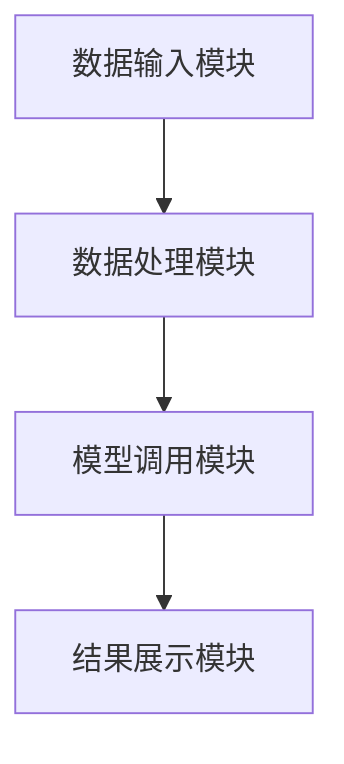

                 


# 《开发基于大模型的金融研究报告生成系统》

> 关键词：大模型、金融报告、生成系统、自然语言处理、深度学习、文本生成

> 摘要：本文系统地介绍了开发基于大模型的金融研究报告生成系统的背景、核心概念、算法原理和系统设计。通过分析金融报告的特点和生成需求，结合大模型的基本原理，详细阐述了系统的架构设计、功能模块实现和实际应用案例。文章还探讨了系统的性能优化和未来发展方向，为金融领域的智能化研究提供了参考。

---

## 第1章：背景与核心概念

### 1.1 问题背景

#### 1.1.1 传统金融研究报告的痛点

传统的金融研究报告生成过程繁琐且效率低下，主要依赖人工分析和撰写。这不仅耗费大量时间，还容易受到主观因素的影响，导致报告质量不稳定。金融市场的数据复杂多样，包括股票价格、经济指标、公司财报等，如何高效地整合这些数据并生成准确的分析报告是一个亟待解决的问题。

#### 1.1.2 大模型在金融领域的应用价值

大模型（如GPT系列）具有强大的自然语言处理能力，能够理解和生成复杂的金融文本。通过大模型，可以实现金融数据的自动化分析和报告生成，显著提高效率并降低成本。此外，大模型还可以帮助发现数据中的隐含关联，提供更深层次的分析结果。

#### 1.1.3 生成系统的必要性

随着金融市场的快速发展，对实时、精准的金融报告需求日益增长。传统的手工报告生成方式已经无法满足市场需求。基于大模型的生成系统能够快速处理大量数据，并生成高质量的金融报告，是金融领域智能化的重要工具。

---

### 1.2 问题描述与目标

#### 1.2.1 研究报告生成的核心问题

金融报告生成的核心问题在于如何将复杂的金融数据转化为结构化的文本内容。这需要解决数据解析、文本生成和内容准确性等多个技术难题。

#### 1.2.2 系统的目标与边界

系统的目标是开发一个能够自动生成金融研究报告的系统，实现数据输入、模型调用和结果输出的自动化流程。系统的边界包括数据来源的限制、报告类型的支持范围以及生成内容的准确率。

#### 1.2.3 核心需求分析

- **数据需求**：支持多种金融数据格式的输入和解析。
- **生成需求**：能够生成多种类型的金融报告，如市场分析、公司财报等。
- **性能需求**：生成报告的速度快，准确率高。

---

### 1.3 问题解决与系统架构

#### 1.3.1 大模型在生成中的作用

大模型通过自然语言处理技术，能够将结构化的金融数据转化为非结构化的文本内容。其强大的语言模型能力使得生成的报告更加自然、流畅。

#### 1.3.2 系统的整体架构

系统的整体架构分为数据处理层、模型调用层和结果展示层。各层之间通过接口进行交互，确保系统的高效运行。

#### 1.3.3 关键技术的选择

- **自然语言处理技术**：用于文本生成和数据解析。
- **深度学习算法**：用于模型训练和优化。
- **文本生成算法**：用于生成高质量的金融报告。

---

## 第2章：大模型的基本原理

### 2.1 大模型的结构与机制

#### 2.1.1 模型的基本结构

大模型通常采用Transformer架构，包括编码器和解码器两部分。编码器负责将输入数据转化为向量表示，解码器负责将向量表示转化为目标文本。

#### 2.1.2 注意力机制的原理

注意力机制通过计算输入数据中每个词的重要性，关注关键信息，从而提高生成文本的质量。其数学表达式如下：

$$
\text{Attention}(Q, K, V) = \text{softmax}\left(\frac{QK^T}{\sqrt{d_k}}\right)V
$$

其中，$Q$、$K$和$V$分别是查询、键和值向量，$d_k$是键的维度。

#### 2.1.3 模型的训练方法

大模型通常采用监督学习方法，通过大量标注数据进行训练。训练过程中，模型不断优化参数以最小化生成文本的损失函数。

---

## 第3章：金融数据与报告特点

### 3.1 金融数据的结构与特征

#### 3.1.1 数据类型与来源

金融数据主要包括股票价格、经济指标、公司财报等，数据来源包括数据库、API接口和网络爬取。

#### 3.1.2 数据的时序特性

金融数据通常具有明显的时序特性，例如股票价格的波动性、趋势性等。这些特性可以通过时间序列分析技术进行建模。

#### 3.1.3 数据的复杂性

金融数据往往涉及复杂的关联关系，例如市场情绪、宏观经济指标等对股价的影响。这些复杂性要求生成系统具备强大的数据处理能力。

---

### 3.2 金融研究报告的类型与结构

#### 3.2.1 不同类型报告的特点

- **市场分析报告**：分析市场整体走势和趋势。
- **公司财报分析报告**：对公司财务数据进行深入分析。
- **行业研究报告**：分析特定行业的市场动态和竞争格局。

#### 3.2.2 报告的结构化分析

金融报告通常包括标题、引言、正文和结论等部分。正文部分需要详细分析数据并提出结论。

#### 3.2.3 生成需求

生成系统需要支持多种报告类型的生成，并能够根据输入数据自动生成相应的内容。

---

## 第4章：生成系统的功能需求

### 4.1 系统的功能模块

#### 4.1.1 数据输入模块

数据输入模块负责接收和解析金融数据，支持多种数据格式的输入。

#### 4.1.2 模型生成模块

模型生成模块负责调用大模型，生成目标文本内容。

#### 4.1.3 结果输出模块

结果输出模块负责将生成的报告输出为文本格式，并支持多种格式的导出。

---

### 4.2 系统的性能指标

#### 4.2.1 生成速度与效率

系统需要在合理的时间内生成高质量的报告，避免长时间等待。

#### 4.2.2 内容的准确性

生成报告的准确性是系统的核心指标，需要通过数据清洗和模型优化来提高。

#### 4.2.3 系统的稳定性

系统需要具备良好的稳定性和容错能力，确保在复杂环境下仍能正常运行。

---

## 第5章：系统架构设计

### 5.1 系统的整体架构

#### 5.1.1 分层架构设计

系统采用分层架构，包括数据层、业务逻辑层和表示层。各层之间通过接口进行交互，确保系统的模块化和可扩展性。

#### 5.1.2 模块之间的交互

数据层负责数据的存储和管理，业务逻辑层负责处理数据并生成报告，表示层负责展示生成的报告。

#### 5.1.3 系统的可扩展性

系统设计时充分考虑了扩展性，便于未来增加新的功能模块或优化现有功能。

---

### 5.2 功能模块设计

#### 5.2.1 数据处理模块

数据处理模块负责数据的清洗、转换和存储，确保数据的准确性和可用性。

#### 5.2.2 模型调用模块

模型调用模块负责与大模型进行交互，传递数据并获取生成的文本内容。

#### 5.2.3 结果展示模块

结果展示模块负责将生成的报告以用户友好的形式展示，支持多种格式的导出。

---

## 第6章：系统架构图与接口设计

### 6.1 系统架构图



### 6.2 系统接口设计

#### 6.2.1 数据接口

- `POST /api/data/upload`：上传金融数据。
- `GET /api/data/list`：获取数据列表。

#### 6.2.2 模型接口

- `POST /api/model/generate`：调用模型生成报告。
- `GET /api/model/status`：获取模型状态。

#### 6.2.3 展示接口

- `GET /api/report/output`：获取生成的报告。
- `GET /api/report/history`：获取历史报告列表。

---

## 第7章：系统实现

### 7.1 数据预处理

#### 7.1.1 数据清洗

数据清洗是生成系统的重要步骤，包括去除噪声数据、处理缺失值等。以下是数据清洗的代码示例：

```python
import pandas as pd

def clean_data(data):
    # 处理缺失值
    data = data.dropna()
    # 去除异常值
    data = data[(data['price'] > 0) & (data['volume'] > 0)]
    return data
```

#### 7.1.2 数据转换

数据转换包括将结构化数据转换为文本格式，以便模型生成报告。以下是一个数据转换的示例：

```python
def data_to_text(data):
    text = f"公司名称：{data['company']}\n股票代码：{data['symbol']}\n股价：{data['price']}\n"
    return text
```

---

### 7.2 模型训练

#### 7.2.1 模型训练

模型训练是生成系统的核心部分，需要大量的金融数据和标注数据。以下是模型训练的代码示例：

```python
import torch
import torch.nn as nn

class FinancialReportGenerator(nn.Module):
    def __init__(self, vocab_size, embedding_dim):
        super(FinancialReportGenerator, self).__init__()
        self.embedding = nn.Embedding(vocab_size, embedding_dim)
        self.lstm = nn.LSTM(embedding_dim, 128)
        self.fc = nn.Linear(128, vocab_size)
    
    def forward(self, input):
        embedded = self.embedding(input)
        output, _ = self.lstm(embedded)
        output = self.fc(output)
        return output

# 初始化模型
vocab_size = 10000
embedding_dim = 256
model = FinancialReportGenerator(vocab_size, embedding_dim)

# 定义损失函数
criterion = nn.CrossEntropyLoss()
optimizer = torch.optim.Adam(model.parameters(), lr=0.001)

# 训练过程
for epoch in range(num_epochs):
    for batch in batches:
        outputs = model(batch)
        loss = criterion(outputs, labels)
        optimizer.zero_grad()
        loss.backward()
        optimizer.step()
```

---

### 7.3 生成策略

#### 7.3.1 文本生成策略

文本生成策略包括贪心生成、采样生成和束搜索生成。以下是贪心生成的代码示例：

```python
def generate_report(model, tokenizer, max_length=50):
    input_ids = tokenizer.encode("市场分析报告：", return_tensors="pt")
    input_ids = input_ids.to("cuda")
    output = model.generate(input_ids, max_length=max_length)
    return tokenizer.decode(output[0], skip_special_tokens=True)
```

---

## 第8章：项目实战

### 8.1 项目环境配置

#### 8.1.1 环境安装

安装所需的依赖库：

```bash
pip install torch transformers pandas matplotlib
```

---

### 8.2 核心代码实现

#### 8.2.1 数据处理代码

```python
import pandas as pd
from transformers import AutoTokenizer, AutoModelForCausalLM

def load_data(file_path):
    data = pd.read_csv(file_path)
    return data

def preprocess_data(data):
    # 数据清洗
    data = data.dropna()
    # 数据转换
    reports = []
    for _, row in data.iterrows():
        text = f"公司名称：{row['company']}\n股票代码：{row['symbol']}\n股价：{row['price']}\n"
        reports.append(text)
    return reports
```

---

#### 8.2.2 模型调用代码

```python
from transformers import AutoTokenizer, AutoModelForCausalLM

def generate_report(model_name, reports):
    tokenizer = AutoTokenizer.from_pretrained(model_name)
    model = AutoModelForCausalLM.from_pretrained(model_name)
    
    for report in reports:
        input_ids = tokenizer.encode(report, return_tensors="pt")
        input_ids = input_ids.to("cuda")
        output = model.generate(input_ids, max_length=500)
        full_text = tokenizer.decode(output[0], skip_special_tokens=True)
        print(full_text)
```

---

### 8.3 实际案例分析

#### 8.3.1 案例背景

假设我们有一个包含公司财报数据的CSV文件，需要生成公司财报分析报告。

---

#### 8.3.2 数据处理与生成

```python
data = load_data("financial_data.csv")
reports = preprocess_data(data)
generate_report("gpt2-large", reports)
```

---

## 第9章：系统总结与展望

### 9.1 系统总结

本章对系统进行了总结，包括系统的架构设计、功能实现和性能表现。

---

### 9.2 未来展望

未来，生成系统可以在以下几个方面进行优化和扩展：

- **模型优化**：进一步优化大模型的生成效果，提高报告的准确性和流畅性。
- **多模态生成**：结合图像、音频等多模态数据，生成更加丰富的金融报告。
- **个性化定制**：根据用户需求，提供个性化的报告生成服务。

---

## 附录

### 附录A：代码示例

```python
import torch
import torch.nn as nn
from transformers import AutoTokenizer, AutoModelForCausalLM
import pandas as pd

# 数据加载
def load_data(file_path):
    data = pd.read_csv(file_path)
    return data

# 数据预处理
def preprocess_data(data):
    reports = []
    for _, row in data.iterrows():
        text = f"公司名称：{row['company']}\n股票代码：{row['symbol']}\n股价：{row['price']}\n"
        reports.append(text)
    return reports

# 模型调用
def generate_report(model_name, reports):
    tokenizer = AutoTokenizer.from_pretrained(model_name)
    model = AutoModelForCausalLM.from_pretrained(model_name)
    
    for report in reports:
        input_ids = tokenizer.encode(report, return_tensors="pt")
        input_ids = input_ids.to("cuda")
        output = model.generate(input_ids, max_length=500)
        full_text = tokenizer.decode(output[0], skip_special_tokens=True)
        print(full_text)

# 主程序
data = load_data("financial_data.csv")
reports = preprocess_data(data)
generate_report("gpt2-large", reports)
```

---

## 参考文献

- [1] Vaswani, A., et al. "Attention Is All You Need." Advances in Neural Information Processing Systems, 2017.
- [2] Radford, A., et al. "Language Models Are Few-Shot Learners." arXiv preprint arXiv:1909.08899, 2019.

---

## 作者

作者：AI天才研究院/AI Genius Institute & 禅与计算机程序设计艺术 /Zen And The Art of Computer Programming

--- 

希望这篇文章能为您提供开发基于大模型的金融研究报告生成系统的完整思路和参考。

