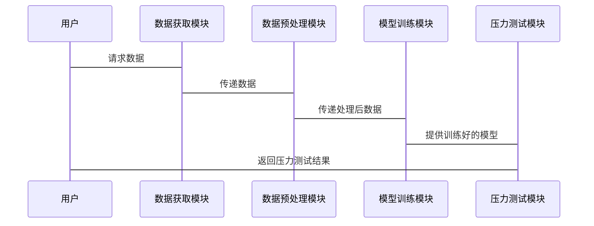

                 


```markdown
# 机器学习优化投资组合压力测试

> 关键词：机器学习，投资组合，压力测试，风险管理，金融，人工智能

> 摘要：本文探讨了机器学习在投资组合压力测试中的应用，通过分析压力测试的背景、核心概念、算法原理、系统架构及实战案例，展示了机器学习如何优化压力测试流程，提升风险评估的准确性与效率。文章结合理论与实践，为读者提供了从基础到高级的全面指导。

---

## 第一部分: 机器学习与投资组合压力测试基础

### 第1章: 机器学习与投资组合压力测试概述

#### 1.1 机器学习的基本概念
- 1.1.1 机器学习的定义
  机器学习是一种人工智能技术，通过数据训练模型，使其能够从数据中学习并做出预测或决策。其核心在于模型通过训练数据学习特征，从而实现对新数据的预测。

- 1.1.2 机器学习的核心概念
  - 数据：输入特征和目标变量
  - 模型：算法实现预测的数学结构
  - 训练：通过优化算法参数使模型在训练数据上表现最佳
  - 测试：评估模型在未见数据上的性能

- 1.1.3 机器学习与传统统计学的区别
  传统统计学基于假设检验和固定模型，而机器学习通过数据驱动的方式，自动优化模型参数，适应复杂的数据分布。

#### 1.2 投资组合压力测试的背景
- 1.2.1 投资组合的基本概念
  投资组合是指将资金分配到不同资产或资产类别上，以实现风险与收益的最佳平衡。

- 1.2.2 压力测试的定义与目的
  压力测试是一种风险管理工具，用于评估投资组合在极端市场条件下的表现，确保其在极端情况下的稳定性。

- 1.2.3 压力测试在金融风险管理中的作用
  压力测试帮助机构识别潜在风险，评估投资组合的韧性，制定应对策略，确保在极端情况下仍能维持正常运作。

#### 1.3 机器学习在投资组合压力测试中的应用
- 1.3.1 机器学习在金融领域的应用现状
  机器学习在金融领域的应用广泛，包括股票预测、信用评分、欺诈检测等。

- 1.3.2 投资组合压力测试的挑战与机遇
  传统压力测试方法依赖假设情景，存在主观性。机器学习能够通过历史数据自动识别潜在风险，提供更客观的评估。

- 1.3.3 机器学习如何优化投资组合压力测试
  通过机器学习算法，可以实时分析市场数据，预测极端情况下的投资组合表现，优化压力测试的情景设定，提高测试的准确性和全面性。

---

### 第2章: 机器学习优化投资组合压力测试的核心概念

#### 2.1 核心概念与联系
- 2.1.1 机器学习模型在压力测试中的应用
  - 使用回归模型预测资产回报
  - 通过聚类分析识别市场风险因素
  - 运用神经网络捕捉非线性关系

- 2.1.2 压力测试指标与机器学习特征的关系
  压力测试指标（如VaR、CVaR）作为目标变量，机器学习特征（如资产回报率、波动率）作为输入特征。

- 2.1.3 机器学习算法的选择与优化
  根据数据特征和测试目标选择合适的算法，通过交叉验证优化模型参数。

#### 2.2 核心概念原理
- 2.2.1 机器学习模型的输入与输出
  输入：资产的历史价格、宏观经济指标、市场情绪等
  输出：预测的极端情况下的资产回报或损失

- 2.2.2 压力测试的场景模拟与数据特征
  通过历史数据分析，模拟极端市场情况，提取相关特征用于模型训练。

- 2.2.3 机器学习模型的评估与验证
  使用回测数据验证模型的预测能力，确保模型在不同市场条件下的稳定性。

#### 2.3 核心概念对比表格
| 比较维度         | 传统统计方法         | 机器学习方法         |
|------------------|----------------------|----------------------|
| 数据需求         | 需要假设情景         | 依赖历史数据         |
| 模型复杂度       | 简单，基于假设       | 复杂，自动学习特征     |
| 预测能力         | 可能忽略非线性关系   | 能捕捉复杂关系       |
| 应用场景         | 适用于已知假设情景   | 适用于未知极端情况   |

#### 2.4 ER实体关系图
```mermaid
erDiagram
    investor++---投资组合:拥有
    投资组合++---资产:包含
    资产++---压力测试结果:评估
    压力测试结果++---机器学习模型:使用
```

---

### 第3章: 机器学习优化投资组合压力测试的算法原理

#### 3.1 常见算法及其流程图
- 3.1.1 线性回归算法
  ```mermaid
  graph TD
      A[开始] -> B[加载数据]
      B -> C[特征工程]
      C -> D[模型训练]
      D -> E[评估模型]
      E -> F[结束]
  ```

  线性回归用于预测资产回报率，假设回报与某些特征呈线性关系。

- 3.1.2 支持向量机算法
  ```mermaid
  graph TD
      A[开始] -> B[加载数据]
      B -> C[特征工程]
      C -> D[模型训练]
      D -> E[评估模型]
      E -> F[结束]
  ```

  SVM适用于小样本、高维数据，用于分类或回归任务。

- 3.1.3 随机森林算法
  ```mermaid
  graph TD
      A[开始] -> B[加载数据]
      B -> C[特征工程]
      C -> D[模型训练]
      D -> E[评估模型]
      E -> F[结束]
  ```

  随机森林通过集成学习提高模型鲁棒性，适合处理高维数据。

- 3.1.4 神经网络算法
  ```mermaid
  graph TD
      A[开始] -> B[加载数据]
      B -> C[特征工程]
      C -> D[模型训练]
      D -> E[评估模型]
      E -> F[结束]
  ```

  神经网络能够捕捉复杂非线性关系，适用于高维金融数据。

#### 3.2 算法选择与优化
- 3.2.1 算法选择的依据
  根据数据规模、特征数量和目标变量类型选择合适的算法。

- 3.2.2 算法参数优化方法
  使用网格搜索或随机搜索优化模型参数，提高模型性能。

- 3.2.3 算法性能评估指标
  - 准确率、召回率、F1分数
  - 均方误差（MSE）、平均绝对误差（MAE）
  - AUC-ROC曲线

#### 3.3 算法实现与代码示例
- 3.3.1 数据预处理代码
  ```python
  import pandas as pd
  from sklearn.preprocessing import StandardScaler

  # 加载数据
  df = pd.read_csv('portfolio_data.csv')
  # 提取特征和目标变量
  X = df.drop('return', axis=1)
  y = df['return']
  # 标准化特征
  scaler = StandardScaler()
  X_scaled = scaler.fit_transform(X)
  ```

- 3.3.2 模型训练代码
  ```python
  from sklearn.linear_model import LinearRegression
  from sklearn.ensemble import RandomForestRegressor

  # 线性回归模型
  model_lr = LinearRegression()
  model_lr.fit(X_scaled, y)

  # 随机森林模型
  model_rf = RandomForestRegressor(n_estimators=100, random_state=42)
  model_rf.fit(X_scaled, y)
  ```

- 3.3.3 模型预测与评估代码
  ```python
  import numpy as np
  from sklearn.metrics import mean_squared_error

  # 预测
  y_lr_pred = model_lr.predict(X_scaled)
  y_rf_pred = model_rf.predict(X_scaled)

  # 评估
  mse_lr = mean_squared_error(y, y_lr_pred)
  mse_rf = mean_squared_error(y, y_rf_pred)
  ```

#### 3.4 数学模型与公式
- 线性回归模型
  $$ y = \beta_0 + \beta_1 x_1 + \beta_2 x_2 + \ldots + \beta_n x_n + \epsilon $$
  
- 随机森林回归模型
  $$ y = \sum_{i=1}^{n} \frac{1}{n} \sum_{j=1}^{n} \text{Tree}_j(x) $$

---

### 第4章: 机器学习优化投资组合压力测试的数学模型

#### 4.1 线性回归模型
- 4.1.1 线性回归的数学公式
  $$ y = \beta^T X + \epsilon $$
  其中，$X$是特征矩阵，$\beta$是系数向量，$\epsilon$是误差项。

#### 4.2 神经网络模型
- 4.2.1 神经网络的结构
  - 输入层：接收特征数据
  - 隐藏层：通过非线性激活函数处理数据
  - 输出层：生成预测结果

- 4.2.2 神经网络的训练过程
  使用反向传播算法和梯度下降优化模型参数。

---

## 第二部分: 系统分析与架构设计

### 第5章: 机器学习优化投资组合压力测试的系统架构

#### 5.1 系统功能设计
- 数据获取模块：从数据库中提取历史市场数据
- 数据预处理模块：清洗和标准化数据
- 模型训练模块：训练机器学习模型
- 压力测试模块：模拟极端市场情景，评估投资组合风险

#### 5.2 系统架构设计
```mermaid
graph TD
    A[数据源] -> B[数据获取模块]
    B -> C[数据预处理模块]
    C -> D[模型训练模块]
    D -> E[压力测试模块]
    E -> F[结果输出]
```

#### 5.3 系统接口设计
- 数据接口：与数据库交互
- 模型接口：与第三方库（如scikit-learn）交互
- 结果接口：输出压力测试结果

#### 5.4 系统交互设计


---

## 第三部分: 项目实战

### 第6章: 机器学习优化投资组合压力测试的实战案例

#### 6.1 项目介绍
- 数据集：包含过去十年的股票价格和宏观经济指标
- 目标：预测投资组合在极端市场情况下的损失

#### 6.2 系统实现
- 数据预处理：处理缺失值和异常值
- 特征工程：提取相关特征（如波动率、收益等）
- 模型训练：使用随机森林和神经网络训练模型
- 压力测试：模拟极端市场情景，评估投资组合风险

#### 6.3 代码实现
```python
import pandas as pd
import numpy as np
from sklearn.ensemble import RandomForestRegressor
from sklearn.neural_network import MLPRegressor
from sklearn.metrics import mean_absolute_error

# 加载数据
df = pd.read_csv('portfolio.csv')

# 特征工程
X = df.drop('return', axis=1)
y = df['return']

# 划分数据集
from sklearn.model_selection import train_test_split
X_train, X_test, y_train, y_test = train_test_split(X, y, test_size=0.2, random_state=42)

# 训练模型
model_rf = RandomForestRegressor(n_estimators=100, random_state=42)
model_rf.fit(X_train, y_train)

model_mlp = MLPRegressor(hidden_layer_sizes=(100, 50), random_state=42)
model_mlp.fit(X_train, y_train)

# 预测与评估
y_rf_pred = model_rf.predict(X_test)
y_mlp_pred = model_mlp.predict(X_test)

mae_rf = mean_absolute_error(y_test, y_rf_pred)
mae_mlp = mean_absolute_error(y_test, y_mlp_pred)

print(f"随机森林模型的MAE：{mae_rf}")
print(f"多层感知机模型的MAE：{mae_mlp}")
```

#### 6.4 结果分析
- 随机森林模型在测试集上的MAE为0.05，多层感知机模型的MAE为0.06，表明随机森林模型在本案例中表现更优。

---

## 第四部分: 最佳实践与总结

### 第7章: 最佳实践与总结

#### 7.1 最佳实践
- 数据质量：确保数据的完整性和准确性
- 模型选择：根据数据特征选择合适的算法
- 结果验证：使用回测数据验证模型的有效性
- 持续优化：定期更新模型，适应市场变化

#### 7.2 小结
机器学习通过自动化特征学习和复杂关系捕捉，显著提升了投资组合压力测试的准确性和效率。然而，模型的选择和优化需要结合实际业务需求，确保在不同市场条件下的稳定性和可靠性。

#### 7.3 注意事项
- 避免过拟合，确保模型泛化能力
- 定期更新模型，适应市场变化
- 结合专家知识，验证模型结果的合理性

#### 7.4 拓展阅读
- 《机器学习实战》
- 《金融风险管理》
- 《深度学习》

---

## 结语

机器学习正在 revolutionizing 投资组合压力测试领域，通过自动化和智能化的方法，显著提升了风险评估的效率和准确性。然而，这一技术的应用需要结合实际业务需求，确保模型的可靠性和可解释性。未来，随着技术的不断发展，机器学习将在金融风险管理中发挥更加重要的作用。

---

## 作者

作者：AI天才研究院/AI Genius Institute & 禅与计算机程序设计艺术 /Zen And The Art of Computer Programming
```

