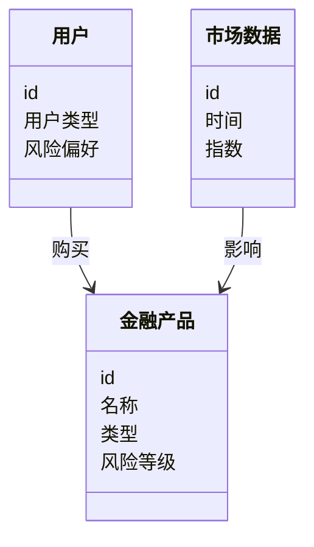

                 


# 构建基于知识图谱的金融产品推荐引擎

> 关键词：知识图谱，金融产品推荐，图神经网络，推荐系统，金融数据分析

> 摘要：本文详细介绍了如何利用知识图谱构建金融产品推荐引擎。首先，阐述了知识图谱在金融推荐中的背景和优势，接着深入探讨了知识图谱的核心概念和构建算法，最后通过实际案例展示了如何基于知识图谱设计和实现一个高效的金融产品推荐系统。文章内容包括背景介绍、核心概念、算法原理、系统架构设计、项目实战以及最佳实践等部分。

---

# 第一部分: 知识图谱与金融产品推荐概述

## 第1章: 知识图谱与金融推荐系统背景

### 1.1 知识图谱的概念与特点

#### 1.1.1 知识图谱的定义
知识图谱是一种用于表示知识的图结构，由节点（实体）和边（关系）组成，能够描述实体之间的语义关系。知识图谱通过结构化的数据形式，将分散在不同数据源中的信息整合起来，形成一个统一的知识网络。

#### 1.1.2 知识图谱的核心特点
- **结构化**：知识图谱通过节点和边的形式，将实体和关系明确表示出来。
- **语义化**：节点和边的语义信息丰富，能够捕捉实体之间的复杂关系。
- **可扩展性**：知识图谱可以动态扩展，支持新增实体和关系。
- **语义关联**：通过语义分析技术，自动发现实体之间的隐含关系。

#### 1.1.3 知识图谱与传统推荐系统的区别
传统的推荐系统主要基于用户行为数据（如购买记录、点击记录）进行推荐，而知识图谱推荐系统结合了实体的语义信息，能够更好地理解金融产品的特性和用户需求。

### 1.2 金融产品推荐系统的背景

#### 1.2.1 金融产品推荐的背景与意义
金融产品推荐系统是金融领域的核心应用之一，能够帮助用户快速找到符合其需求的金融产品，如基金、股票、保险等。传统推荐系统基于协同过滤和基于内容的推荐方法，但在处理复杂金融场景时存在局限性。

#### 1.2.2 传统金融推荐系统的局限性
- **数据稀疏性**：金融产品的用户评价数据通常较少，导致推荐结果不够精准。
- **缺乏语义理解**：传统推荐系统无法充分理解金融产品的特性和用户需求的复杂性。
- **实时性不足**：金融市场的动态变化快，传统推荐系统难以实时更新。

#### 1.2.3 知识图谱在金融推荐中的优势
知识图谱能够整合金融产品的特性、市场数据、用户行为等多种信息，构建一个语义丰富的知识网络，从而提升推荐系统的精准度和可解释性。

### 1.3 知识图谱在金融领域的应用现状

#### 1.3.1 知识图谱在金融领域的应用案例
- **智能投顾**：通过知识图谱分析用户的财务状况和市场数据，提供个性化的投资建议。
- **风险评估**：利用知识图谱发现金融产品之间的关联性，评估潜在风险。
- **产品推荐**：基于知识图谱分析用户需求和产品特性，推荐合适的金融产品。

#### 1.3.2 金融知识图谱构建的挑战与机遇
- **挑战**：金融数据复杂多样，构建高质量的知识图谱需要解决数据清洗、实体识别、关系抽取等问题。
- **机遇**：知识图谱能够提升金融推荐系统的智能化水平，为金融机构提供差异化服务。

#### 1.3.3 知识图谱在金融产品推荐中的潜力
知识图谱能够将金融产品的特性、市场动态、用户需求等信息有机结合，为金融产品推荐提供更全面的语义理解能力。

---

## 第2章: 知识图谱与金融产品推荐的核心概念

### 2.1 知识图谱的核心概念

#### 2.1.1 实体与关系的定义
- **实体**：金融产品、用户、市场数据等。
- **关系**：用户购买金融产品、市场数据影响金融产品价格等。

#### 2.1.2 知识图谱的构建流程
1. 数据采集与清洗。
2. 实体识别与链接。
3. 关系抽取与构建。

#### 2.1.3 知识图谱的存储与表示
- **存储**：使用图数据库（如Neo4j）存储知识图谱。
- **表示**：通过节点和边的形式表示实体和关系。

### 2.2 金融产品推荐系统的架构

#### 2.2.1 金融产品推荐系统的组成
- 数据层：用户行为数据、金融产品数据、市场数据。
- 知识图谱层：构建金融知识图谱。
- 推荐算法层：基于知识图谱的推荐算法。
- 用户交互层：用户界面和推荐结果展示。

#### 2.2.2 知识图谱在推荐系统中的角色
知识图谱作为语义信息的载体，帮助推荐系统理解金融产品的特性和用户需求。

#### 2.2.3 知识图谱与推荐算法的结合
推荐算法（如基于图的推荐算法）利用知识图谱中的语义信息，生成更精准的推荐结果。

### 2.3 核心概念对比与ER实体关系图

#### 2.3.1 核心概念对比表
| 实体/关系 | 定义 | 示例 |
|---------|------|------|
| 金融产品 | 具体金融产品，如基金、股票 | 基金A |
| 用户 | 使用金融产品的用户 | 用户1 |
| 交易记录 | 用户购买金融产品的记录 | 用户1购买基金A |
| 市场数据 | 影响金融产品的市场数据 | 市场指数 |

#### 2.3.2 知识图谱的ER实体关系图
```mermaid
er
    entity(金融产品) {
        id
        名称
        类型
        风险等级
    }
    entity(用户) {
        id
        用户类型
        风险偏好
    }
    entity(交易记录) {
        id
        时间
        金额
    }
    entity(市场数据) {
        id
        时间
        指数
    }
    relation(属于) {
        用户 --> 金融产品
    }
    relation(影响) {
        市场数据 --> 金融产品
    }
```

---

## 第3章: 知识图谱构建的算法原理

### 3.1 知识图谱构建的流程

#### 3.1.1 数据采集与预处理
- 数据来源：用户行为数据、金融产品数据、市场数据。
- 数据清洗：去除重复数据、填充缺失值、去除异常值。

#### 3.1.2 实体识别与链接
- 实体识别：通过自然语言处理技术识别文本中的实体。
- 实体链接：将实体映射到知识图谱中的具体节点。

#### 3.1.3 关系抽取与构建
- 关系抽取：识别文本中的关系（如“影响”、“属于”）。
- 关系构建：将关系添加到知识图谱中。

### 3.2 知识图谱嵌入表示

#### 3.2.1 图嵌入的基本概念
图嵌入是将图结构中的节点映射到低维向量空间的技术，能够保留图的结构信息和语义信息。

#### 3.2.2 基于深度学习的图嵌入算法
- **GraphSAGE**：通过归纳式图卷积网络（GCN）生成节点嵌入。
- **GAT**：基于注意力机制的图嵌入算法。

#### 3.2.3 知识图谱嵌入的数学模型
$$E_{node} = G_{\theta}(A, X)$$
其中，$A$ 是图的邻接矩阵，$X$ 是节点特征矩阵，$G_{\theta}$ 是图神经网络模型。

---

## 第4章: 基于知识图谱的推荐算法

### 4.1 基于知识图谱的推荐算法原理

#### 4.1.1 基于图的推荐算法
- **GraphSAGE**：通过图嵌入生成节点表示，计算节点之间的相似性。
- **GAT**：利用注意力机制捕捉节点之间的关系，生成推荐结果。

#### 4.1.2 知识图谱增强的推荐算法
- **知识图谱融合推荐**：结合知识图谱和用户行为数据，生成推荐结果。

### 4.2 算法实现步骤

#### 4.2.1 数据预处理
- 数据清洗：去除缺失值和异常值。
- 特征提取：提取用户特征、产品特征、市场特征。

#### 4.2.2 知识图谱构建
- 实体识别：识别用户、产品、市场数据中的实体。
- 关系抽取：抽取实体之间的关系。

#### 4.2.3 算法实现
- 图嵌入：使用GraphSAGE生成节点嵌入。
- 推荐计算：基于节点嵌入计算相似性，生成推荐列表。

---

## 第5章: 系统分析与架构设计

### 5.1 系统功能设计

#### 5.1.1 系统功能模块
- 数据采集模块：采集用户行为数据、金融产品数据、市场数据。
- 知识图谱构建模块：构建金融知识图谱。
- 推荐算法模块：基于知识图谱生成推荐结果。
- 用户交互模块：展示推荐结果。

#### 5.1.2 领域模型设计


### 5.2 系统架构设计

#### 5.2.1 系统架构图


#### 5.2.2 系统接口设计
- 接口1：获取用户信息。
- 接口2：获取金融产品信息。
- 接口3：获取市场数据。
- 接口4：生成推荐结果。

---

## 第6章: 项目实战

### 6.1 环境安装

#### 6.1.1 安装依赖
```bash
pip install neo4j
pip install tensorflow
pip install py2neo
```

#### 6.1.2 数据准备
- 用户数据：用户ID、用户类型、风险偏好。
- 金融产品数据：产品ID、产品名称、产品类型、风险等级。
- 市场数据：市场ID、时间、指数。

### 6.2 系统核心实现

#### 6.2.1 数据预处理
```python
import pandas as pd

# 读取数据
users = pd.read_csv('users.csv')
products = pd.read_csv('products.csv')
market = pd.read_csv('market.csv')

# 数据清洗
users.dropna(inplace=True)
products.dropna(inplace=True)
market.dropna(inplace=True)
```

#### 6.2.2 知识图谱构建
```python
from py2neo import Graph, Node, Relationship

# 连接图数据库
graph = Graph("bolt://localhost:7687", auth=("neo4j", "password"))

# 创建节点
user1 = Node('User', id='u1', name='User 1')
product1 = Node('Product', id='p1', name='Product 1')

# 创建关系
relation = Relationship(user1, 'PURCHASED', product1)
graph.create(relation)
```

#### 6.2.3 推荐算法实现
```python
import tensorflow as tf
from tensorflow.keras.models import Model
from tensorflow.keras.layers import Input, Dense, Dropout, Concatenate

# 输入层
input_user = Input(shape=(128,))
input_product = Input(shape=(128,))

# 模型层
merged = Concatenate()([input_user, input_product])
dense_layer = Dense(64, activation='relu')(merged)
dropout_layer = Dropout(0.5)(dense_layer)
output_layer = Dense(1, activation='sigmoid')(dropout_layer)

# 定义模型
model = Model(inputs=[input_user, input_product], outputs=output_layer)
model.compile(optimizer='adam', loss='binary_crossentropy', metrics=['accuracy'])
```

### 6.3 案例分析

#### 6.3.1 案例背景
用户A，风险偏好为保守型，历史购买记录显示偏好低风险产品。

#### 6.3.2 知识图谱分析
- 用户A属于低风险用户。
- 低风险用户偏好债券型基金。
- 当前市场数据表明债券型基金风险较低。

#### 6.3.3 推荐结果
推荐债券型基金Product B。

---

## 第7章: 最佳实践与总结

### 7.1 最佳实践

#### 7.1.1 数据质量管理
- 确保数据准确性、完整性、一致性。
- 定期更新数据。

#### 7.1.2 模型优化
- 调整图神经网络的超参数。
- 引入领域知识优化模型。

#### 7.1.3 可解释性
- 提供推荐理由，增强用户体验。
- 通过可视化展示知识图谱，提升可解释性。

### 7.2 小结

知识图谱在金融产品推荐中的应用，不仅提升了推荐系统的精准度，还增强了推荐结果的可解释性。通过构建金融知识图谱，结合深度学习算法，能够为用户提供更智能、更个性化的金融产品推荐服务。

### 7.3 注意事项

- 数据隐私保护：确保用户数据和金融数据的安全性。
- 模型调优：定期监控模型性能，及时调整参数。
- 技术创新：关注领域前沿技术，保持系统的先进性。

### 7.4 拓展阅读

- 图神经网络相关论文。
- 知识图谱构建技术书籍。
- 金融推荐系统的相关研究。

---

# 作者：AI天才研究院/AI Genius Institute & 禅与计算机程序设计艺术 /Zen And The Art of Computer Programming

---

以上是《构建基于知识图谱的金融产品推荐引擎》的技术博客文章的完整目录和内容概述。文章通过详细讲解知识图谱的构建、推荐算法的设计以及系统架构的实现，为读者提供了一个全面的视角，帮助他们理解如何利用知识图谱技术提升金融产品的推荐效果。

