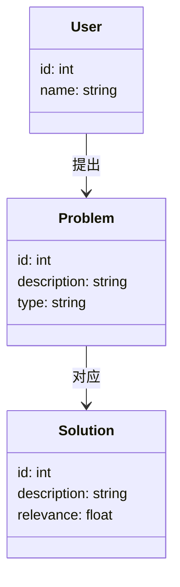
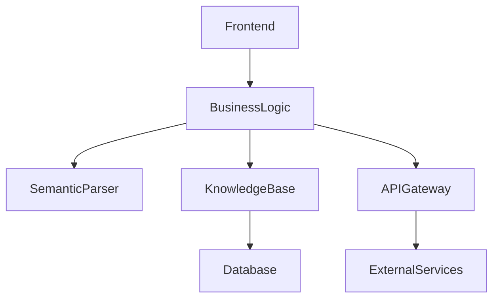

                 


# AI Agent的语言理解：提升LLM的语义解析能力

> **关键词**：AI Agent, LLM, 语义解析, 语言理解, 自然语言处理

> **摘要**：本文深入探讨了AI Agent在语言理解中的应用，重点分析了如何通过提升大语言模型（LLM）的语义解析能力来增强AI Agent的交互能力和任务执行效率。文章从AI Agent与语言理解的关系入手，详细解析了语义解析的核心概念、关键技术及其在LLM中的实现方法，并通过实际案例展示了如何通过算法优化和系统设计来提升语义解析能力。

---

## 第1章 AI Agent与语言理解概述

### 1.1 AI Agent的基本概念

#### 1.1.1 AI Agent的定义与特点
- **定义**：AI Agent（人工智能代理）是指能够感知环境、自主决策并执行任务的智能体。它能够通过与用户交互或观察环境变化，动态调整其行为以达到目标。
- **特点**：
  - **自主性**：能够在没有外部干预的情况下独立运作。
  - **反应性**：能够实时感知环境并做出响应。
  - **社会性**：能够与其他Agent或用户进行交互和协作。
  - **学习性**：能够通过经验或数据不断优化自身的性能。

#### 1.1.2 语言理解在AI Agent中的重要性
- **重要性**：
  - 语言理解是AI Agent与人类交互的基础，决定了其能否准确理解用户意图。
  - 语言理解能力直接影响AI Agent的任务执行效率和用户体验。

#### 1.1.3 AI Agent的应用场景与挑战
- **应用场景**：
  - 智能助手（如Siri、Alexa）：帮助用户完成日常任务，如设置提醒、查询信息等。
  - 智能客服：通过自然语言处理技术为用户提供自动化服务。
  - 智能教育：为学生提供个性化的学习建议和辅导。
- **挑战**：
  - 复杂的语义理解：如何准确解析用户的深层意图。
  - 动态上下文：如何在多变的对话中保持一致的理解能力。
  - 实时性要求：在交互过程中需要快速响应，这对计算资源提出了更高要求。

---

### 1.2 大语言模型（LLM）的概述

#### 1.2.1 LLM的定义与发展历程
- **定义**：大语言模型（LLM）是指基于深度学习技术构建的大型神经网络模型，能够理解和生成人类语言。典型的LLM包括GPT系列、BERT等。
- **发展历程**：
  - **早期模型**：基于词袋模型和语言模型的初步尝试。
  - **神经网络模型**：如RNN和LSTM的引入，提升了模型的序列建模能力。
  - **Transformer架构**：以BERT、GPT为代表的Transformer模型在自然语言处理领域取得了突破性进展。
  - **多模态模型**：结合视觉、听觉等多模态信息的LLM正在成为研究热点。

#### 1.2.2 LLM的核心技术与优势
- **核心技术**：
  - **自注意力机制**：通过计算输入序列中每个词与其他词的相关性，捕获长距离依赖关系。
  - **预训练与微调**：通过大量数据预训练模型，然后在特定任务上进行微调以适应具体需求。
  - **多任务学习**：同一模型可以同时处理多种自然语言处理任务，如分类、生成、问答等。
- **优势**：
  - **强大的生成能力**：能够生成连贯且自然的文本。
  - **上下文理解**：能够处理复杂的上下文信息，捕捉语义关联。
  - **可扩展性**：通过微调可以快速适应不同领域和任务。

#### 1.2.3 LLM在语言理解中的应用现状
- **现状**：
  - **文本生成**：广泛应用于内容生成、对话系统等领域。
  - **问答系统**：用于智能客服、知识库问答等场景。
  - **文本摘要**：用于信息抽取、新闻摘要等任务。
  - **情感分析**：用于用户反馈分析、市场调研等。

---

### 1.3 AI Agent与LLM的结合

#### 1.3.1 AI Agent中语言理解的必要性
- **必要性**：
  - 语言理解是AI Agent与用户交互的核心能力，决定了其能否准确理解用户意图并执行相应操作。
  - 通过语言理解，AI Agent可以将用户的自然语言输入转化为可执行的任务或指令。

#### 1.3.2 LLM如何赋能AI Agent的语言能力
- **赋能方式**：
  - **语义解析**：利用LLM强大的上下文理解和生成能力，准确解析用户的意图。
  - **对话生成**：基于LLM的生成能力，AI Agent可以进行自然流畅的对话交互。
  - **知识推理**：结合外部知识库，LLM可以帮助AI Agent进行复杂问题的推理和解答。

#### 1.3.3 当前AI Agent语言理解的瓶颈与未来方向
- **瓶颈**：
  - **语义理解的不准确性**：现有模型在处理复杂语义时仍存在误解的可能性。
  - **领域适应性不足**：LLM通常是在通用数据集上训练的，难以适应特定领域的专业需求。
  - **实时性与计算资源限制**：复杂的语义理解需要大量计算资源，可能影响实时响应速度。
- **未来方向**：
  - **多模态融合**：结合视觉、听觉等信息，提升语义理解的准确性和丰富性。
  - **领域微调**：通过在特定领域数据上的微调，提升模型在专业场景中的表现。
  - **动态适应性优化**：优化模型的实时响应能力，使其更适合实时交互场景。

---

## 第2章 语言理解的核心问题与挑战

### 2.1 语言理解的基本问题

#### 2.1.1 什么是语言理解
- **语言理解**：指系统能够准确解析输入语言的语义信息，包括意图、实体、情感倾向等。
- **层次划分**：
  - **词汇理解**：识别文本中的词语及其基本含义。
  - **句法理解**：分析句子的语法结构，理解词语之间的关系。
  - **语义理解**：捕捉句子的深层含义，包括意图、情感等。

#### 2.1.2 语义解析的关键问题
- **关键问题**：
  - **意图识别**：准确识别用户的意图，如“查询天气”、“预订机票”等。
  - **实体识别**：从文本中提取出关键实体，如人名、地名、时间等。
  - **关系抽取**：识别文本中实体之间的关系，如“在...之后”、“和...相关”等。
  - **情感分析**：判断文本中表达的情感倾向，如正面、负面或中性。

---

### 2.2 当前LLM在语言理解中的局限性

#### 2.2.1 语义理解的不准确性
- **问题表现**：
  - LLM在处理模糊、歧义或复杂语境时，可能无法准确理解用户的意图。
  - 例如，用户说“我今天下午有会议”，模型需要理解“下午”是指当前时间，而不是抽象的时间段。

#### 2.2.2 领域知识的局限性
- **问题表现**：
  - LLM通常基于通用数据集训练，缺乏对特定领域知识的深入理解。
  - 在专业领域中，模型可能无法准确解析行业术语或特定场景下的语义。

#### 2.2.3 对上下文理解的不足
- **问题表现**：
  - 在长对话中，模型可能无法有效维护上下文信息，导致语义理解出现偏差。
  - 例如，在一个多轮对话中，模型需要记住之前讨论的内容，才能准确理解当前用户的输入。

---

### 2.3 提升LLM语义解析能力的必要性

#### 2.3.1 提升语义解析能力的动机
- **动机**：
  - 提升语义解析能力可以提高AI Agent的交互准确性和用户体验。
  - 通过更准确的理解，AI Agent能够更高效地执行任务，减少错误率。

#### 2.3.2 语义解析能力对AI Agent的影响
- **影响**：
  - 更准确的语义解析能力可以提升AI Agent的任务执行效率。
  - 用户对AI Agent的信任和满意度会随着交互质量的提升而增加。

#### 2.3.3 提升语义解析能力的技术路径
- **技术路径**：
  - **模型优化**：改进LLM的结构和训练方法，提升语义理解能力。
  - **知识增强**：结合外部知识库（如知识图谱），增强模型的语义推理能力。
  - **多模态融合**：利用视觉、听觉等多模态信息，辅助语言理解。

---

## 第3章 语义解析的核心概念与原理

### 3.1 语义解析的基本原理

#### 3.1.1 什么是语义解析
- **定义**：语义解析是指从输入文本中提取出有意义的信息，包括意图、实体、关系等。
- **过程**：
  1. **文本预处理**：对输入文本进行分词、句法分析等预处理。
  2. **语义分析**：利用模型或算法提取文本中的语义信息。
  3. **结果解析**：将提取的语义信息转化为可执行的任务或指令。

#### 3.1.2 语义解析的关键步骤
- **关键步骤**：
  - **意图识别**：确定用户的意图或目标。
  - **实体识别**：从文本中提取关键实体。
  - **关系抽取**：识别实体之间的关系。
  - **情感分析**：判断文本的情感倾向。

#### 3.1.3 语义解析的数学模型
- **数学模型**：
  - **基于概率的模型**：如马尔可夫链，用于建模序列中的概率关系。
  - **基于深度学习的模型**：如卷积神经网络（CNN）、循环神经网络（RNN）和Transformer架构，用于捕捉长距离依赖关系。

---

### 3.2 LLM在语义解析中的作用

#### 3.2.1 LLM的特征表示能力
- **特征表示能力**：
  - LLM能够将文本转化为高维向量，捕捉词语的语义信息。
  - 例如，通过词嵌入技术（如Word2Vec、BERT）将词语映射到向量空间。

#### 3.2.2 LLM的上下文理解能力
- **上下文理解能力**：
  - 基于自注意力机制，LLM能够有效捕捉上下文信息，理解语境中的关系。
  - 例如，在对话系统中，模型可以基于之前的对话历史，准确理解当前用户的意图。

#### 3.2.3 LLM的推理与生成能力
- **推理与生成能力**：
  - LLM不仅能够理解输入文本，还能够基于理解结果生成相应的回应或执行任务。
  - 例如，在问答系统中，模型能够根据问题内容生成准确的回答。

---

### 3.3 语义解析的关键技术

#### 3.3.1 基于上下文的语义分析
- **基于上下文的语义分析**：
  - 方法：通过分析文本的上下文信息，理解语义的多层含义。
  - 应用：在对话系统中，保持上下文一致性，确保语义理解的连贯性。

#### 3.3.2 基于知识图谱的语义推理
- **基于知识图谱的语义推理**：
  - 方法：结合知识图谱中的实体和关系，进行语义推理。
  - 应用：在智能客服中，基于知识库进行复杂问题的推理和解答。

#### 3.3.3 基于规则的语义匹配
- **基于规则的语义匹配**：
  - 方法：通过预定义的规则或模式匹配，进行语义理解。
  - 应用：在特定领域中，通过规则匹配快速识别意图或实体。

---

## 第4章 提升LLM语义解析能力的算法原理

### 4.1 基于上下文的语义增强算法

#### 4.1.1 上下文表示的增强方法
- **增强方法**：
  - **上下文嵌入**：通过编码器将上下文信息转化为向量表示。
  - **注意力机制**：在编码过程中，通过注意力机制增强关键信息的权重。

#### 4.1.2 基于注意力机制的语义增强
- **注意力机制**：
  - 通过计算输入序列中每个词与其他词的相关性，增强关键信息的表示。
  - 例如，在对话系统中，通过注意力机制，模型能够聚焦于用户输入的关键部分。

#### 4.1.3 上下文信息的融合策略
- **融合策略**：
  - **加性融合**：将上下文向量与当前词向量相加，得到增强的词表示。
  - **乘性融合**：将上下文向量与当前词向量相乘，得到增强的词表示。
  - **注意力融合**：通过自注意力机制，动态调整上下文信息的权重。

---

### 4.2 基于知识图谱的语义推理算法

#### 4.2.1 知识图谱的构建与表示
- **知识图谱的构建与表示**：
  - **构建**：通过爬取、抽取和整合多源数据，构建领域知识图谱。
  - **表示**：使用节点和边表示实体及其关系，构建图结构。
  - **示例**：如Freebase、Wikidata等。

#### 4.2.2 基于知识图谱的推理模型
- **推理模型**：
  - **基于规则的推理**：通过预定义的逻辑规则进行推理。
  - **基于图的推理**：利用图遍历算法（如BFS、DFS）进行推理。
  - **基于神经网络的推理**：结合深度学习模型（如GNN）进行推理。

#### 4.2.3 知识图谱与LLM的结合方法
- **结合方法**：
  - **联合训练**：将知识图谱嵌入到LLM中，共同优化。
  - **推理增强**：在LLM的基础上，利用知识图谱进行推理增强。

---

### 4.3 基于规则的语义匹配算法

#### 4.3.1 规则的制定与优化
- **规则的制定与优化**：
  - **规则制定**：根据具体任务，制定相应的语义匹配规则。
  - **规则优化**：通过测试和反馈，不断优化规则的准确性和效率。

#### 4.3.2 语义匹配的具体实现
- **具体实现**：
  - **正则表达式匹配**：通过预定义的正则表达式，匹配特定的语义模式。
  - **关键词匹配**：通过关键词匹配，快速识别特定意图或实体。
  - **句法模式匹配**：通过分析句子的句法结构，匹配特定的语义模式。

---

## 第5章 系统分析与架构设计方案

### 5.1 问题场景介绍

#### 5.1.1 问题背景
- **背景**：在智能客服系统中，用户通过自然语言提问，系统需要准确理解用户意图并提供相应服务。
- **挑战**：如何在复杂对话中准确理解用户意图，并高效完成任务。

#### 5.1.2 系统功能需求
- **需求**：
  - 用户输入：支持多种输入方式，如文本、语音等。
  - 语义理解：准确解析用户的意图、实体等信息。
  - 任务执行：根据理解结果，执行相应任务，如查询知识库、调用API等。
  - 反馈输出：生成自然语言回应或执行结果。

---

### 5.2 系统功能设计

#### 5.2.1 领域模型设计
- **领域模型**：
  - **实体**：用户、问题类型、解决方案等。
  - **关系**：用户与问题的关系，问题与解决方案的关系等。
  - **类图表示**：使用Mermaid绘制领域模型类图。



#### 5.2.2 系统架构设计
- **系统架构**：
  - **前端层**：用户交互界面，接收用户输入并显示输出结果。
  - **业务逻辑层**：处理用户的输入，调用后端服务进行语义解析和任务执行。
  - **后端服务层**：包括语义解析引擎、知识库查询服务、API调用服务等。
  - **数据存储层**：存储用户数据、知识库数据等。
  - **架构图表示**：使用Mermaid绘制系统架构图。



#### 5.2.3 系统接口设计
- **系统接口**：
  - **输入接口**：接收用户的自然语言输入。
  - **输出接口**：生成自然语言输出或执行结果。
  - **知识库接口**：与知识库进行交互，获取相关数据。
  - **API接口**：调用外部服务，如天气查询API、日历API等。

#### 5.2.4 系统交互流程
- **交互流程**：
  1. **用户输入**：用户通过前端界面输入自然语言请求。
  2. **语义解析**：系统对输入文本进行语义解析，识别意图和实体。
  3. **任务执行**：根据解析结果，调用相应服务执行任务。
  4. **反馈输出**：系统生成反馈结果并返回给用户。

---

### 5.3 项目实战

#### 5.3.1 环境安装
- **环境要求**：
  - 操作系统：Linux/Windows/MacOS
  - Python版本：3.6+
  - 依赖库：TensorFlow、PyTorch、Hugging Face库等。
  - 其他工具：Jupyter Notebook、IDE（如PyCharm）

#### 5.3.2 核心代码实现
- **代码实现**：
  - **语义解析模块**：
    ```python
    import torch
    import torch.nn as nn
    from transformers import BertTokenizer, BertModel

    class SemanticParser:
        def __init__(self, model_name='bert-base-uncased'):
            self.tokenizer = BertTokenizer.from_pretrained(model_name)
            self.model = BertModel.from_pretrained(model_name)

        def parse_semantics(self, text):
            inputs = self.tokenizer(text, return_tensors='pt')
            with torch.no_grad():
                outputs = self.model(**inputs)
            # 提取语义向量
            semantic_vector = outputs.last_hidden_state[:, 0, :].squeeze()
            return semantic_vector
    ```
  - **意图识别模块**：
    ```python
    import torch.nn.functional as F

    class IntentClassifier(nn.Module):
        def __init__(self, input_dim, output_dim):
            super(IntentClassifier, self).__init__()
            self.fc = nn.Linear(input_dim, output_dim)
            self.softmax = nn.Softmax(dim=1)

        def forward(self, x):
            x = self.fc(x)
            x = self.softmax(x)
            return x
    ```

---

### 5.4 案例分析与实现

#### 5.4.1 案例分析
- **案例背景**：用户询问“明天北京的天气如何？”
- **语义解析**：
  - **意图识别**：查询天气信息。
  - **实体识别**：地点是“北京”，时间是“明天”。

#### 5.4.2 代码实现
- **代码实现**：
  ```python
  parser = SemanticParser()
  text = "明天北京的天气如何？"
  semantic_vector = parser.parse_semantics(text)
  # 预训练好的意图分类器
  classifier = IntentClassifier(input_dim=768, output_dim=5)
  intent_scores = classifier(semantic_vector.unsqueeze(0))
  predicted_intent = torch.argmax(intent_scores, dim=1).item()
  print(f"预测的意图是：{predicted_intent}")
  ```

---

## 第6章 最佳实践与总结

### 6.1 最佳实践 Tips

#### 6.1.1 模型优化建议
- **模型优化建议**：
  - **数据增强**：通过数据增强技术（如同义词替换、句式变换）提升模型的泛化能力。
  - **领域微调**：在特定领域数据上进行微调，提升模型的适应性。
  - **模型压缩**：通过模型剪枝、知识蒸馏等技术，降低模型的计算复杂度。

#### 6.1.2 系统设计建议
- **系统设计建议**：
  - **模块化设计**：将系统划分为多个独立模块，便于维护和扩展。
  - **容错设计**：设计容错机制，确保系统在异常情况下的稳定运行。
  - **性能优化**：通过缓存、异步处理等技术，提升系统的响应速度。

#### 6.1.3 交互设计建议
- **交互设计建议**：
  - **简洁性**：设计简洁直观的用户界面，降低用户的使用门槛。
  - **反馈机制**：提供清晰的反馈信息，帮助用户理解系统的响应状态。
  - **个性化设置**：支持用户自定义交互方式，提升用户体验。

---

### 6.2 全文总结

#### 6.2.1 核心内容回顾
- **核心内容**：
  - AI Agent需要具备强大的语言理解能力，才能与用户进行有效的交互。
  - LLM通过其强大的生成能力和上下文理解能力，为AI Agent的语义解析提供了有力支持。
  - 提升LLM的语义解析能力需要结合上下文分析、知识图谱推理和基于规则的语义匹配等多种技术。

#### 6.2.2 未来展望
- **未来展望**：
  - **多模态融合**：未来的AI Agent将更加注重多模态信息的融合，提升语义理解的准确性和丰富性。
  - **实时性优化**：通过优化算法和计算资源，提升AI Agent的实时响应能力。
  - **个性化服务**：基于用户的个性化需求，提供定制化的语言理解服务。

#### 6.2.3 致谢
- **致谢**：
  - 感谢所有为AI Agent和自然语言处理领域做出贡献的 researcher 和开发者。
  - 感谢读者的支持与关注，希望本文对您理解AI Agent的语言理解能力有所帮助。

---

## 作者信息

**作者**：AI天才研究院/AI Genius Institute & 禅与计算机程序设计艺术 /Zen And The Art of Computer Programming

---

通过以上详细的内容，我们可以看到，提升LLM的语义解析能力是一个复杂的系统工程，需要从模型优化、系统设计、算法创新等多个方面入手。希望本文能够为读者提供一个清晰的思路，并为实际应用提供有价值的参考。

