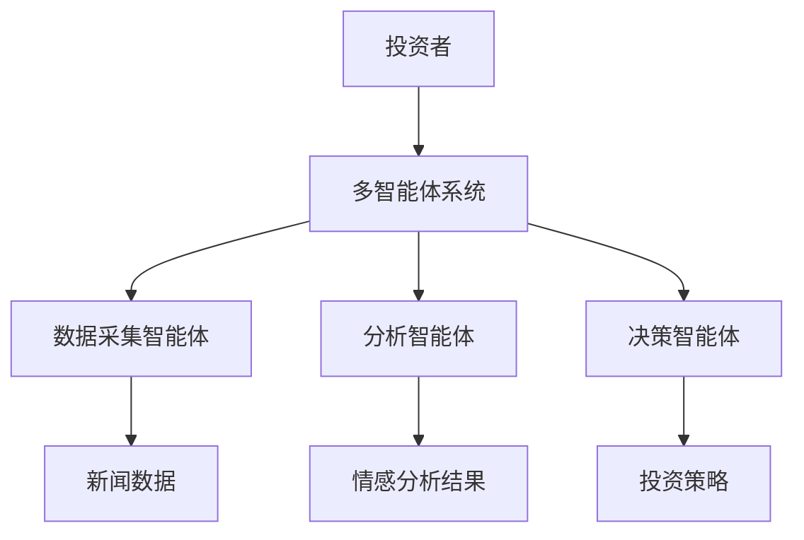
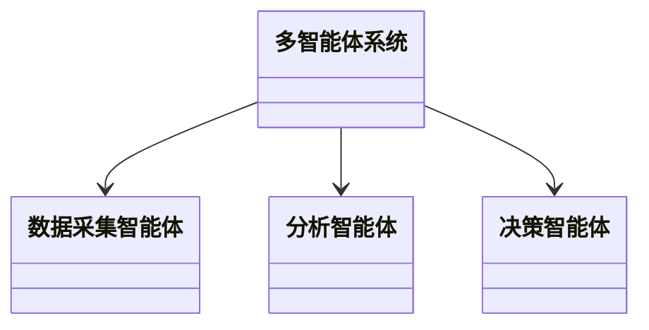
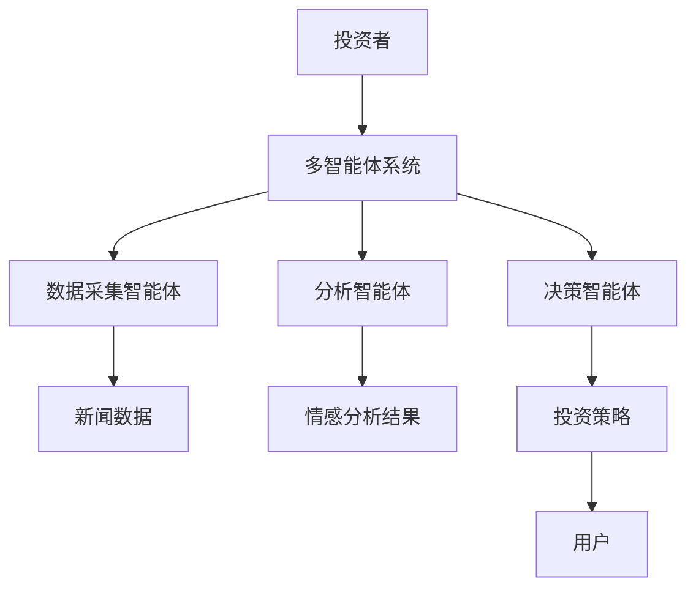

                 


# AI多智能体在价值投资中的自然语言处理应用

> 关键词：AI多智能体，价值投资，自然语言处理，金融分析，投资决策

> 摘要：本文探讨了AI多智能体在价值投资中的自然语言处理应用，分析了多智能体系统与NLP技术的结合，详细讲解了算法原理、系统架构设计及项目实战案例，展示了如何通过AI技术提升投资决策的效率和准确性。

---

# 第1章: AI多智能体与自然语言处理的背景介绍

## 1.1 问题背景与问题描述

### 1.1.1 传统投资分析的局限性
传统的投资分析主要依赖于分析师的主观判断和经验，这种方法存在以下问题：
- 数据处理能力有限：难以处理海量非结构化数据。
- 信息滞后性：人工分析耗时长，难以及时捕捉市场变化。
- 人为偏差：分析师的主观判断可能影响决策的客观性。

### 1.1.2 多智能体在投资决策中的优势
多智能体系统通过协同合作，能够高效处理复杂问题：
- 并行处理能力：多个智能体可以同时处理不同数据源。
- 自适应性：能够根据市场变化快速调整策略。
- 分工协作：每个智能体专注于特定任务，提高整体效率。

### 1.1.3 自然语言处理在金融分析中的应用潜力
NLP技术能够从文本中提取关键信息：
- 情感分析：判断市场情绪。
- 实体识别：提取公司名称、财务数据等。
- 文本分类：识别新闻类型，预测市场趋势。

---

## 1.2 问题解决与边界

### 1.2.1 多智能体系统的核心思想
多智能体系统通过通信与协作，共同完成复杂任务：
- 分布式计算：每个智能体独立运行，减少单点故障。
- 协作优化：通过信息共享，提高整体决策的准确性。

### 1.2.2 自然语言处理的应用范围
NLP在金融领域的应用包括：
- 财务报表分析：提取财务数据，评估公司业绩。
- 市场情绪分析：分析社交媒体和新闻，预测市场波动。
- 信息披露：自动提取监管文件中的关键信息。

### 1.2.3 价值投资中的边界与外延
多智能体与NLP结合的应用场景包括：
- 长期投资策略：基于基本面分析，寻找被低估的股票。
- 风险管理：实时监控市场风险，及时调整投资组合。

---

## 1.3 核心概念结构与组成

### 1.3.1 多智能体系统的基本构成
多智能体系统由以下部分组成：
- **智能体**：独立决策的个体，负责特定任务。
- **通信机制**：智能体之间交换信息的方式。
- **协作协议**：定义智能体之间的合作规则。

### 1.3.2 自然语言处理的关键技术
NLP的核心技术包括：
- **词嵌入**：将词语转化为向量表示（如Word2Vec、GloVe）。
- **序列模型**：用于处理时序数据（如LSTM、Transformer）。
- **注意力机制**：聚焦关键信息（如BERT模型）。

### 1.3.3 价值投资的核心要素
价值投资的关键要素包括：
- **基本面分析**：公司财务状况、行业地位等。
- **市场情绪**：投资者的心理和行为对市场的影响。
- **长期收益**：寻找具有持续增长潜力的公司。

---

# 第2章: AI多智能体与自然语言处理的核心概念

## 2.1 多智能体系统原理

### 2.1.1 多智能体的定义与特点
多智能体是多个智能体的集合，具有以下特点：
- **自主性**：每个智能体独立决策。
- **反应性**：能够实时感知环境变化。
- **协作性**：通过通信机制协同完成任务。

### 2.1.2 多智能体的通信与协作机制
智能体之间的通信可以通过以下方式实现：
- **共享黑板**：所有智能体共享同一块内存空间。
- **消息传递**：通过消息队列进行信息交换。
- **分布式计算**：智能体之间通过网络进行通信。

### 2.1.3 多智能体在金融领域的应用案例
例如，多个智能体可以分别负责：
- 数据采集：实时抓取新闻、财报等信息。
- 情感分析：分析市场情绪。
- 投资决策：基于分析结果制定投资策略。

---

## 2.2 自然语言处理原理

### 2.2.1 自然语言处理的基本流程
NLP的基本流程包括：
1. **文本预处理**：分词、去除停用词等。
2. **特征提取**：将文本转化为数值表示。
3. **模型训练**：训练分类器或生成模型。
4. **结果解释**：将模型输出转化为人类可理解的形式。

### 2.2.2 常见的NLP技术与模型
- **文本分类**：用于分类新闻类型（如财经、科技）。
- **情感分析**：判断市场情绪（如乐观、悲观）。
- **实体识别**：提取公司名称、金额等信息。

### 2.2.3 NLP在金融文本分析中的挑战
- **数据稀疏性**：某些事件或术语出现频率低。
- **领域特定性**：金融术语需要专门处理。
- **实时性要求**：需要快速处理海量数据。

---

## 2.3 多智能体与NLP结合的创新点

### 2.3.1 多智能体在金融决策中的角色
- **数据采集智能体**：实时抓取新闻、财报等信息。
- **分析智能体**：对文本进行情感分析、实体识别。
- **决策智能体**：基于分析结果制定投资策略。

### 2.3.2 NLP在金融文本分析中的作用
- **信息提取**：从财报中提取关键财务指标。
- **市场情绪分析**：分析社交媒体上的投资者情绪。
- **风险预警**：识别潜在的市场风险。

### 2.3.3 多智能体与NLP结合的优势
- **高效性**：多个智能体协同工作，提高处理速度。
- **准确性**：结合多智能体的分析结果，提高决策的准确性。
- **适应性**：能够快速响应市场变化，调整投资策略。

---

# 第3章: AI多智能体与自然语言处理的算法原理

## 3.1 多智能体算法概述

### 3.1.1 多智能体系统的通信协议
智能体之间的通信可以通过以下协议实现：
- ** publish-subscribe 模型**：智能体发布信息，其他智能体订阅。
- ** 请求-响应模型**：智能体之间通过请求和响应进行通信。

### 3.1.2 基于强化学习的多智能体协作
强化学习是一种通过试错来优化决策的算法：
- **奖励机制**：智能体根据行动获得奖励或惩罚。
- **策略优化**：通过不断调整策略，提高决策的准确性。

### 3.1.3 多智能体的决策机制
多智能体的决策机制包括：
- **分布式决策**：每个智能体独立决策。
- **集中式决策**：由一个中央智能体统一决策。
- **混合式决策**：结合分布式和集中式决策。

---

## 3.2 自然语言处理算法

### 3.2.1 基于Transformer的NLP模型
Transformer模型是一种基于注意力机制的模型：
- **编码器**：将输入文本转化为向量表示。
- **解码器**：根据编码器的输出生成目标文本。

### 3.2.2 文本分类与情感分析算法
- **文本分类**：将文本分为不同的类别（如正面、负面）。
- **情感分析**：判断文本的情感倾向（如积极、消极）。

### 3.2.3 实体识别与关系抽取算法
- **实体识别**：识别文本中的命名实体（如人名、公司名）。
- **关系抽取**：识别实体之间的关系（如“苹果收购了公司X”）。

---

## 3.3 多智能体与NLP结合的算法实现

### 3.3.1 多智能体协同的NLP任务分配
- **任务分解**：将NLP任务分解为多个子任务。
- **任务分配**：根据智能体的专长分配任务。

### 3.3.2 基于NLP的多智能体决策优化
- **信息共享**：智能体之间共享NLP分析结果。
- **决策优化**：基于共享信息，优化投资决策。

### 3.3.3 多智能体与NLP结合的算法流程图


---

# 第4章: 价值投资中的系统分析与架构设计

## 4.1 价值投资系统场景介绍

### 4.1.1 价值投资的核心流程
价值投资的核心流程包括：
- **数据采集**：收集公司财报、新闻等信息。
- **数据分析**：对数据进行清洗、分析。
- **投资决策**：基于分析结果制定投资策略。

### 4.1.2 AI多智能体在价值投资中的应用场景
- **实时监控**：实时监控市场动态，及时调整投资策略。
- **风险预警**：识别潜在的市场风险，提前采取措施。
- **长期投资**：基于基本面分析，寻找具有长期增长潜力的公司。

### 4.1.3 自然语言处理在金融分析中的具体需求
- **信息提取**：从非结构化文本中提取关键信息。
- **市场情绪分析**：分析社交媒体和新闻，预测市场趋势。
- **信息披露**：自动提取监管文件中的关键信息。

---

## 4.2 系统功能设计

### 4.2.1 多智能体协同模块
多智能体协同模块包括：
- **数据采集智能体**：实时抓取新闻、财报等信息。
- **分析智能体**：对文本进行情感分析、实体识别。
- **决策智能体**：基于分析结果制定投资策略。

### 4.2.2 自然语言处理模块
自然语言处理模块包括：
- **文本预处理**：分词、去除停用词等。
- **特征提取**：将文本转化为数值表示。
- **模型训练**：训练分类器或生成模型。

### 4.2.3 价值投资决策模块
价值投资决策模块包括：
- **基本面分析**：分析公司财务状况、行业地位等。
- **市场情绪分析**：分析市场情绪，预测市场趋势。
- **投资策略制定**：基于分析结果制定投资策略。

---

## 4.3 系统架构设计

### 4.3.1 领域模型（类图）


### 4.3.2 系统架构图


### 4.3.3 系统接口设计
- **数据接口**：与数据源（如新闻网站、财报数据库）对接。
- **用户接口**：供投资者查看分析结果和投资策略。
- **智能体接口**：智能体之间通过API进行通信。

---

## 4.4 系统交互设计

### 4.4.1 系统交互流程图


---

# 第5章: 项目实战

## 5.1 环境安装与配置

### 5.1.1 安装Python环境
- 使用Anaconda安装Python 3.8及以上版本。
- 安装必要的Python包（如numpy、pandas、transformers）。

### 5.1.2 安装NLP工具
- 安装Hugging Face的Transformers库：
  ```bash
  pip install transformers
  ```

### 5.1.3 安装多智能体框架
- 安装基于Python的多智能体框架（如Multi-Agent Framework）：
  ```bash
  pip install multi-agent
  ```

---

## 5.2 系统核心实现

### 5.2.1 数据采集智能体实现
```python
from multi_agent import Agent

class NewsCollector(Agent):
    def __init__(self):
        super().__init__()
        self.news_data = []
    
    def receive(self, message):
        if message['type'] == 'news':
            self.news_data.append(message['content'])
```

### 5.2.2 自然语言处理模块实现
```python
from transformers import pipeline

nlp = pipeline("text-classification", model="bert-base-uncased")
def analyze_sentiment(text):
    result = nlp(text)
    return result[0]['label']
```

### 5.2.3 投资决策智能体实现
```python
class InvestmentDecision(Agent):
    def __init__(self):
        super().__init__()
        self.sentiment_results = []
    
    def receive(self, message):
        if message['type'] == 'sentiment':
            self.sentiment_results.append(message['content'])
    
    def make_decision(self):
        positive_count = sum(1 for result in self.sentiment_results if result == 'POSITIVE')
        if positive_count > len(self.sentiment_results) * 0.6:
            return 'Buy'
        else:
            return 'Hold'
```

---

## 5.3 实际案例分析

### 5.3.1 案例背景
假设我们有一个新闻数据集，包含多条关于某公司的新闻。

### 5.3.2 数据采集与分析
```python
news_collector = NewsCollector()
news_collector.send({'type': 'news', 'content': 'Company Q1 revenue beats expectations'})
news_collector.send({'type': 'news', 'content': 'Industry reports negative outlook'})
news_collector.start()

# 获取情感分析结果
sentiment = analyze_sentiment('Company Q1 revenue beats expectations')
print(sentiment)  # 输出：'POSITIVE'
```

### 5.3.3 投资决策
```python
investment_decision = InvestmentDecision()
investment_decision.send({'type': 'sentiment', 'content': 'POSITIVE'})
investment_decision.send({'type': 'sentiment', 'content': 'POSITIVE'})
investment_decision.send({'type': 'sentiment', 'content': 'NEGATIVE'})
investment_decision.make_decision()  # 输出：'Buy'
```

---

## 5.4 项目小结

### 5.4.1 项目实现的关键点
- **多智能体协同**：智能体之间的通信与协作。
- **NLP模型选择**：选择适合任务的NLP模型。
- **系统集成**：将各模块集成到一个系统中。

### 5.4.2 项目实现的优势
- **高效性**：多智能体协同工作，提高处理速度。
- **准确性**：结合NLP分析结果，提高决策的准确性。
- **可扩展性**：系统可以根据需要扩展智能体数量。

---

# 第6章: 总结与展望

## 6.1 全文总结
本文详细探讨了AI多智能体在价值投资中的自然语言处理应用，分析了多智能体系统与NLP技术的结合，展示了如何通过AI技术提升投资决策的效率和准确性。

---

## 6.2 未来展望

### 6.2.1 研究方向
- **多模态分析**：结合图像、视频等多模态数据进行分析。
- **自适应算法**：开发能够自适应市场变化的算法。
- **实时性优化**：提高系统的实时处理能力。

### 6.2.2 技术发展趋势
- **边缘计算**：在边缘设备上进行实时分析。
- **分布式计算**：利用分布式计算框架提高处理能力。
- **量子计算**：利用量子计算的优势加速分析。

---

## 6.3 最佳实践 Tips

### 6.3.1 实践建议
- **数据质量**：确保数据来源可靠，数据清洗充分。
- **模型选择**：根据具体任务选择合适的NLP模型。
- **系统优化**：定期优化系统架构，提高处理效率。

### 6.3.2 注意事项
- **隐私保护**：注意数据隐私和合规性。
- **系统稳定性**：确保系统稳定运行，避免中断。
- **持续学习**：定期更新模型和算法，保持技术领先。

---

## 6.4 作者寄语
AI技术正在深刻改变金融行业，通过多智能体与自然语言处理的结合，我们可以更好地理解和预测市场动态，做出更明智的投资决策。未来，随着技术的不断发展，AI在金融领域的应用将更加广泛和深入。

---

# 附录

## 附录A: 项目代码示例
```python
# 附录A.1: 多智能体系统实现
from multi_agent import Agent

class NewsCollector(Agent):
    def __init__(self):
        super().__init__()
        self.news_data = []
    
    def receive(self, message):
        if message['type'] == 'news':
            self.news_data.append(message['content'])
    
    def send_news(self, news):
        self.send({'type': 'news', 'content': news})

# 附录A.2: 自然语言处理模块实现
from transformers import pipeline

nlp = pipeline("text-classification", model="bert-base-uncased")
def analyze_sentiment(text):
    result = nlp(text)
    return result[0]['label']

# 附录A.3: 投资决策智能体实现
class InvestmentDecision(Agent):
    def __init__(self):
        super().__init__()
        self.sentiment_results = []
    
    def receive(self, message):
        if message['type'] == 'sentiment':
            self.sentiment_results.append(message['content'])
    
    def make_decision(self):
        positive_count = sum(1 for result in self.sentiment_results if result == 'POSITIVE')
        if positive_count > len(self.sentiment_results) * 0.6:
            return 'Buy'
        else:
            return 'Hold'
```

## 附录B: 工具与库
- **Python**：编程语言。
- **Transformers**：NLP模型库。
- **Multi-Agent**：多智能体框架。

---

## 附录C: 参考文献
1. 刘军, 等.《机器学习实战》.
2. TensorFlow官方文档.
3. Hugging Face Transformers库官方文档.

---

# 作者信息

作者：AI天才研究院（AI Genius Institute） & 禅与计算机程序设计艺术（Zen And The Art of Computer Programming）

---

**感谢您的耐心阅读！希望本文能为您提供有价值的技术见解！**

