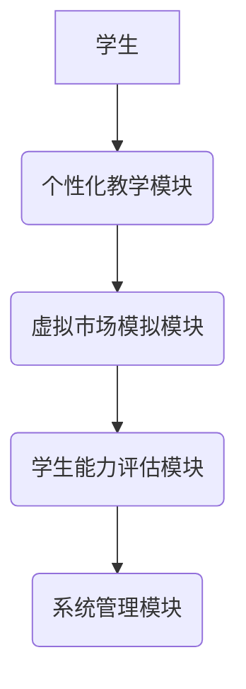

                 


# AI多智能体系统如何改进传统的价值投资师资培养模式

> 关键词：AI多智能体系统，价值投资，师资培养，教育创新，人工智能，协作学习

> 摘要：本文探讨了AI多智能体系统如何改进传统的价值投资师资培养模式。通过分析传统教育模式的局限性，介绍了AI多智能体系统的核心概念、算法原理及其在教育中的应用。文章详细讲解了多智能体系统的协作机制、价值评估算法和系统架构设计，并通过实际案例展示了AI多智能体系统在价值投资教育中的优势。最后，文章总结了当前的成果，并展望了未来的应用方向。

---

## 第一部分：价值投资与传统师资培养模式的背景

### 第1章：价值投资与传统师资培养模式概述

#### 1.1 价值投资的核心概念

- **价值投资的定义与核心原则**
  价值投资是一种以基本面分析为基础的投资策略，强调购买被市场低估的资产，长期持有，等待其价值回归。其核心原则包括：
  - **安全边际**：购买价格低于内在价值。
  - **长期视角**：关注企业的长期盈利能力。
  - **逆向思维**：在市场恐慌时寻找机会。

  **数学公式：**  
  内在价值公式：  
  $$\text{内在价值} = \frac{\text{现金流}}{\text{折现率}}$$  

- **价值投资在金融领域的应用**
  价值投资广泛应用于股票、房地产等领域。投资者通过分析财务报表、行业趋势等，寻找具有长期增长潜力的企业。

- **价值投资师资培养的现状与挑战**
  当前价值投资师资培养面临以下问题：
  - 教学资源分散，缺乏系统性。
  - 实践机会有限，学生难以将理论应用于实际。
  - 个性化教学不足，难以满足不同学生的需求。

#### 1.2 传统师资培养模式的局限性

- **传统教育模式的不足**
  传统教育模式通常采用统一的教学大纲和考核标准，忽视了学生的个性化需求。学生的能力差异较大，但教学方式却千篇一律。

- **传统师资培养中的资源分配问题**
  在教育资源分配上，往往存在不均衡现象。优质资源集中于少数学生，而大部分学生得不到足够的关注和指导。

- **传统模式下学生能力与市场需求的脱节**
  由于教学内容与实际市场需求脱节，学生毕业后往往需要较长时间适应职场环境。特别是在金融领域，实践能力尤为重要，但传统教育难以提供足够的实践机会。

#### 1.3 AI多智能体系统在教育领域的潜力

- **AI技术在教育中的应用现状**
  AI技术在教育领域的应用包括智能 tutoring系统、个性化学习推荐、教育数据分析等。AI能够根据学生的学习情况，提供个性化的教学方案。

- **多智能体系统的优势与特点**
  多智能体系统通过多个智能体的协作，能够更好地模拟真实市场环境。每个智能体代表一个投资者，能够根据市场变化做出决策，从而提供更真实的实践环境。

- **多智能体系统在价值投资教育中的创新应用**
  在价值投资教育中，多智能体系统可以模拟真实的市场环境，学生可以在虚拟市场中进行投资操作，系统会根据市场反馈调整策略。这种实践性学习能够有效提升学生的实际操作能力。

---

### 第2章：AI多智能体系统的概念与核心原理

#### 2.1 AI多智能体系统的定义与特点

- **多智能体系统的定义**
  多智能体系统是由多个智能体组成的协作系统，每个智能体都能独立决策并与其他智能体协作完成任务。

- **多智能体系统与传统AI的区别**
  传统AI系统通常是单点决策，而多智能体系统强调多个智能体之间的协作与通信。

- **多智能体系统的核心属性与特征**
  - 分布式：智能体独立运行，但通过通信协作完成任务。
  - 协作性：智能体之间需要协作，共同完成目标。
  - 动态性：系统环境动态变化，智能体需要实时调整策略。

#### 2.2 多智能体系统的核心原理

- **多智能体系统的协作机制**
  协作机制是多智能体系统的核心。常见的协作机制包括：
  - 分层协作：将任务分解为多个层次，每个层次由不同的智能体负责。
  - 联合学习：智能体之间共享数据，共同优化模型。

- **多智能体系统的通信与协调**
  智能体之间需要通过通信协议进行信息交换，协调各自的行动。常用的通信方式包括发布-订阅模型和点对点通信。

- **多智能体系统的决策与学习**
  智能体需要根据环境信息做出决策，并通过强化学习等方法不断优化决策策略。强化学习通过奖励机制，引导智能体做出更优决策。

#### 2.3 多智能体系统在价值投资教育中的应用

- **多智能体系统模拟真实市场环境**
  通过多智能体系统模拟股票市场，每个智能体代表一个投资者，能够根据市场变化做出买卖决策。学生可以在模拟环境中观察市场波动，学习投资策略。

- **多智能体系统用于学生能力评估**
  系统可以根据学生在模拟环境中的表现，评估其投资能力。例如，根据收益率、风险控制等指标，对学生进行综合评估。

- **多智能体系统在个性化教学中的应用**
  系统可以根据学生的知识水平和能力，动态调整教学内容。例如，对于基础薄弱的学生，系统可以提供更基础的训练任务；对于高级学生，则提供更具挑战性的任务。

---

### 第3章：AI多智能体系统的算法原理

#### 3.1 多智能体协作算法

- **分布式协作算法**
  分布式协作算法通过将任务分解为多个子任务，分配给不同的智能体完成。每个智能体负责一部分任务，最终将结果汇总。

- **联合学习（Federated Learning）**
  联合学习是一种分布式机器学习方法，多个智能体各自在本地数据上训练模型，然后将模型参数汇总到中心服务器，更新全局模型。

- **多智能体强化学习（Multi-Agent Reinforcement Learning）**
  多智能体强化学习是一种通过智能体与环境交互，学习策略的方法。每个智能体通过试错，逐步优化决策策略。

#### 3.2 多智能体系统中的价值评估算法

- **基于强化学习的价值评估**
  强化学习通过智能体在虚拟市场中的操作，评估其投资决策的优劣。例如，智能体可以通过买卖操作，获得奖励或惩罚，从而优化投资策略。

- **基于博弈论的价值评估**
  博弈论方法将市场视为一个博弈环境，多个智能体之间相互竞争，通过博弈结果评估每个智能体的策略优劣。

- **基于深度学习的价值评估模型**
  深度学习模型可以分析市场数据，预测股票价格走势，为投资者提供决策参考。例如，使用LSTM网络分析时间序列数据，预测股票价格。

#### 3.3 多智能体系统中的优化算法

- **分层优化算法**
  分层优化算法将问题分解为多个层次，每个层次分别优化，最终达到全局最优。

- **并行优化算法**
  并行优化算法通过并行计算，加速优化过程。适用于任务分解和分布式计算环境。

- **分布式优化算法**
  分布式优化算法将任务分配给多个智能体，每个智能体负责一部分优化任务，最终汇总结果。

---

### 第4章：AI多智能体系统在价值投资教育中的架构设计

#### 4.1 系统总体架构

- **系统功能模块划分**
  - 学生能力评估模块：评估学生的学习成果。
  - 个性化教学模块：根据学生能力提供定制化教学内容。
  - 虚拟市场模拟模块：模拟真实股票市场环境，供学生实践。

- **系统架构图（Mermaid图）**



#### 4.2 系统功能设计

- **学生能力评估模块**
  - 收集学生在虚拟市场中的表现数据，如收益率、风险指标等。
  - 使用机器学习模型评估学生能力，生成评估报告。

- **个性化教学模块**
  - 根据学生评估结果，动态调整教学内容和难度。
  - 提供定制化的学习资源，如视频教程、案例分析等。

- **虚拟市场模拟模块**
  - 模拟真实股票市场，提供实时市场数据。
  - 学生可以在虚拟市场中进行投资操作，系统根据操作结果给予反馈。

#### 4.3 系统接口设计

- **系统内部接口**
  - 学生能力评估模块与个性化教学模块之间的接口。
  - 个性化教学模块与虚拟市场模拟模块之间的接口。

- **系统与用户交互接口**
  - 学生登录界面。
  - 个性化教学模块的用户界面。

- **系统与外部数据源接口**
  - 与股票市场数据源的接口，获取实时市场数据。

#### 4.4 系统交互设计（Mermaid序列图）

```mermaid
sequenceDiagram
    participant 学生
    participant 系统管理模块
    participant 个性化教学模块
    participant 虚拟市场模拟模块
    student -> 系统管理模块: 登录
    系统管理模块 -> 个性化教学模块: 获取学生信息
    个性化教学模块 -> 虚拟市场模拟模块: 提供虚拟市场环境
    student <-> 虚拟市场模拟模块: 进行投资操作
    虚拟市场模拟模块 -> 个性化教学模块: 提供反馈
    个性化教学模块 -> 系统管理模块: 更新学生评估结果
    系统管理模块 -> 学生: 提供评估报告
```

---

### 第5章：项目实战

#### 5.1 环境安装

- 安装Python环境：建议使用Anaconda。
- 安装相关库：如numpy、pandas、tensorflow、keras等。

#### 5.2 核心代码实现

- **价值评估模型**

```python
import numpy as np
import tensorflow as tf

class ValueModel(tf.keras.Model):
    def __init__(self):
        super(ValueModel, self).__init__()
        self.dense1 = tf.keras.layers.Dense(64, activation='relu')
        self.dense2 = tf.keras.layers.Dense(32, activation='relu')
        self.value = tf.keras.layers.Dense(1)

    def call(self, inputs):
        x = self.dense1(inputs)
        x = self.dense2(x)
        value = self.value(x)
        return value
```

- **强化学习算法**

```python
class DQN:
    def __init__(self, state_space, action_space):
        self.state_space = state_space
        self.action_space = action_space
        self.model = ValueModel()
        self.optimizer = tf.keras.optimizers.Adam(learning_rate=0.001)
        self.memory = []

    def remember(self, state, action, reward, next_state):
        self.memory.append((state, action, reward, next_state))

    def act(self, state):
        prediction = self.model.predict(state)
        action = np.argmax(prediction[0])
        return action

    def replay(self, batch_size):
        mini_batch = random.sample(self.memory, batch_size)
        for state, action, reward, next_state in mini_batch:
            target = reward + self.model.predict(next_state)[0]
            target = np.array([target])
            loss = self.model.train_on_batch(state, target)
```

#### 5.3 代码功能解读

- **价值评估模型**：用于评估市场状态的价值，帮助智能体做出决策。
- **强化学习算法**：通过试错学习，优化智能体的投资策略。

#### 5.4 实际案例分析

- **案例：虚拟股票市场中的投资策略优化**
  模拟一个虚拟股票市场，学生可以在系统中进行投资操作，系统根据市场反馈调整策略。例如，学生购买某只股票，系统根据市场变化自动调整持仓比例，优化投资组合。

#### 5.5 项目小结

- 通过项目实战，学生可以掌握AI多智能体系统的实际应用。
- 系统能够根据学生的表现，动态调整教学内容，提供个性化的学习体验。
- 通过虚拟市场模拟，学生能够在安全的环境中进行投资实践，提升实际操作能力。

---

### 第6章：总结与展望

#### 6.1 最佳实践 tips

- 在使用AI多智能体系统进行价值投资教育时，建议结合实际市场数据，提供真实的市场环境。
- 定期更新系统模型，确保其适应市场变化。
- 提供多种学习路径，满足不同学生的需求。

#### 6.2 小结

本文详细介绍了AI多智能体系统在价值投资教育中的应用，包括系统架构、算法原理和项目实战。通过AI多智能体系统的应用，传统教育模式的不足得到了有效改善，学生的实践能力和个性化需求得到了更好满足。

#### 6.3 注意事项

- 系统设计时需考虑数据安全和隐私保护。
- 系统上线前需进行充分的测试，确保其稳定性和可靠性。
- 在实际应用中，需根据具体需求进行系统优化。

#### 6.4 拓展阅读

- 阅读相关文献，深入了解多智能体系统的最新研究成果。
- 关注AI在教育领域的其他应用，如智能辅导系统、教育数据分析等。

---

## 作者：AI天才研究院/AI Genius Institute & 禅与计算机程序设计艺术 /Zen And The Art of Computer Programming

---

这篇文章详细探讨了AI多智能体系统在价值投资教育中的应用，从理论到实践，为读者提供了全面的指导。通过系统的架构设计、算法实现和项目实战，展示了AI技术在教育领域的巨大潜力。希望这篇文章能为读者提供有价值的参考，推动传统教育模式的创新与发展。

