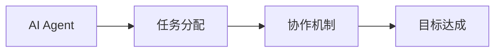
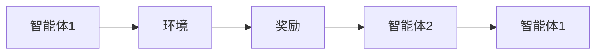
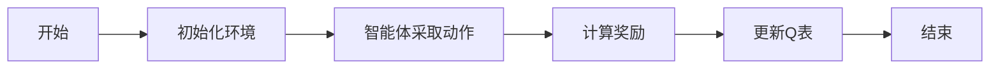
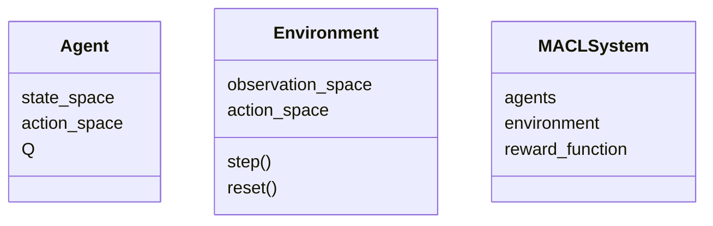
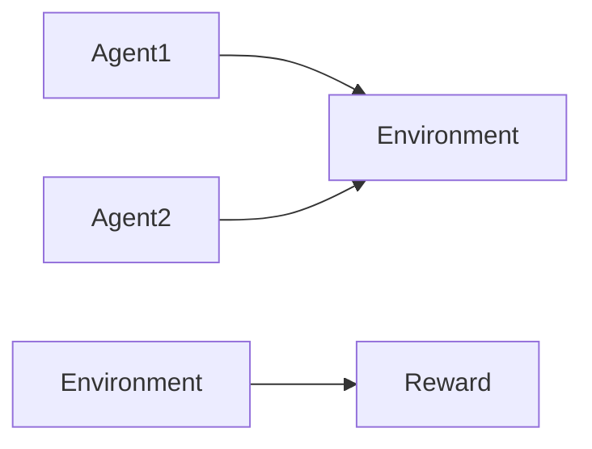
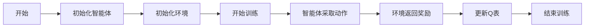
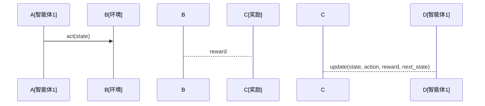

                 


# 开发AI Agent的多智能体协作学习系统

> 关键词：AI Agent, 多智能体协作学习, 强化学习, 系统架构, 项目实战

> 摘要：本文详细探讨了AI Agent的多智能体协作学习系统的开发过程，从背景介绍、核心概念、算法原理、系统架构到项目实战和最佳实践，为读者提供了一套全面的开发指南。通过系统化的分析和实际案例，帮助读者掌握多智能体协作学习的核心原理和实现方法。

---

# 第一部分: 背景与概念

## 第1章: AI Agent与多智能体协作学习概述

### 1.1 问题背景
#### 1.1.1 多智能体协作学习的定义
多智能体协作学习（Multi-Agent Collaborative Learning, MACL）是指多个智能体在共同的目标下，通过协作和交互来优化各自的策略或行为的过程。这种学习方式强调智能体之间的协作与信息共享，以实现整体目标的最优或次优解。

#### 1.1.2 多智能体协作学习的核心问题
- **通信机制**：智能体之间如何有效地交换信息。
- **任务分配**：如何将任务分配给不同的智能体，以最大化整体效率。
- **决策协调**：如何协调多个智能体的决策以避免冲突并实现协作。

#### 1.1.3 多智能体协作学习的边界与外延
多智能体协作学习的边界包括：
- 智能体的数量：通常指多个智能体。
- 协作范围：智能体之间的协作可能涉及任务分配、信息共享、策略同步等。
- 目标：协作目标通常是全局最优或整体收益最大化。

### 1.2 多智能体协作学习的核心概念
#### 1.2.1 AI Agent的定义与特点
- **定义**：AI Agent是一个能够感知环境并采取行动以实现目标的实体。
- **特点**：
  - 自主性：能够在没有外部干预的情况下独立运作。
  - 反应性：能够根据环境的变化调整自己的行为。
  - 社会性：能够与其他智能体或人类进行交互和协作。

#### 1.2.2 多智能体协作学习的系统结构
- **智能体层**：负责具体任务的执行。
- **协作层**：负责智能体之间的协作与信息共享。
- **管理层**：负责任务分配、资源分配和监控。

#### 1.2.3 多智能体协作学习的实现机制
- **通信机制**：通过消息传递、共享内存等方式进行信息交换。
- **协作机制**：通过任务分配、分工合作等方式实现协作。
- **决策机制**：通过强化学习、博弈论等方式优化决策。

### 1.3 问题描述与解决
#### 1.3.1 多智能体协作学习的目标
- 实现多个智能体在共同目标下的协作。
- 优化整体性能，实现全局最优。

#### 1.3.2 多智能体协作学习的问题建模
- **环境建模**：定义环境的状态、动作和奖励。
- **智能体建模**：定义每个智能体的策略和行为。
- **协作建模**：定义智能体之间的协作规则和通信方式。

#### 1.3.3 多智能体协作学习的解决方案
- **分布式强化学习**：通过分布式算法实现多个智能体的协作。
- **纳什均衡**：通过博弈论中的纳什均衡实现策略的稳定性。

---

## 第2章: 多智能体协作学习的核心概念与联系

### 2.1 核心概念原理
#### 2.1.1 AI Agent的行为模型
- **反应式模型**：基于当前感知做出反应。
- **规划式模型**：基于预定义的目标和计划做出决策。
- **混合式模型**：结合反应式和规划式模型的优势。

#### 2.1.2 多智能体协作学习的通信机制
- **直接通信**：智能体之间直接交换信息。
- **间接通信**：通过中间媒介（如共享内存）进行信息交换。

#### 2.1.3 多智能体协作学习的决策过程
- **集中式决策**：由一个中央控制器统一决策。
- **分布式决策**：每个智能体独立决策，通过协作实现全局目标。

### 2.2 核心概念对比
#### 2.2.1 AI Agent与传统单智能体的区别
| 属性       | 单智能体            | 多智能体            |
|------------|--------------------|--------------------|
| 独立性      | 高                 | 中                 |
| 通信       | 无或有限           | 有                 |
| 协作        | 无                 | 有                 |

#### 2.2.2 多智能体协作学习与分布式计算的对比
| 属性       | 多智能体协作学习    | 分布式计算          |
|------------|--------------------|--------------------|
| 目标        | 全局最优            | 任务分解           |
| 通信方式    | 高度依赖           | 较低               |
| 协作性      | 强                 | 弱                 |

#### 2.2.3 多智能体协作学习与强化学习的联系
- 强化学习是多智能体协作学习的基础。
- 多智能体协作学习通过强化学习实现智能体的策略优化。

### 2.3 实体关系图


---

# 第三部分: 算法原理

## 第3章: 多智能体协作学习的算法原理

### 3.1 强化学习基础
#### 3.1.1 Q-learning算法
Q-learning是一种经典的强化学习算法，通过更新Q值表来学习最优策略。

$$ Q(s, a) = (1 - \alpha) Q(s, a) + \alpha (r + \gamma \max Q(s', a')) $$

其中：
- \( \alpha \) 是学习率。
- \( \gamma \) 是折扣因子。

#### 3.1.2 多智能体强化学习的挑战
- **状态空间的复杂性**：多个智能体的状态组合可能导致状态空间爆炸。
- **动作空间的冲突**：多个智能体的动作可能相互干扰。
- **通信开销**：智能体之间的通信可能导致额外的计算开销。

### 3.2 多智能体协作学习算法
#### 3.2.1 多智能体Q-learning算法


数学模型：
$$ Q_i(s, a) = (1 - \alpha) Q_i(s, a) + \alpha (r_i + \gamma \max Q_j(s', a')) $$

其中：
- \( i \) 表示智能体编号。
- \( j \) 表示其他智能体编号。

#### 3.2.2 纳什均衡算法
纳什均衡是一种博弈论中的概念，表示在多个智能体协作中，每个智能体的策略都是最优的。

$$ \forall i, Q_i(s, a_i) \geq Q_i(s, a_i') $$

其中：
- \( Q_i \) 是智能体i的收益函数。
- \( a_i \) 是智能体i的最优策略。

### 3.3 算法实现
#### 3.3.1 环境搭建
- 安装必要的库：`numpy`, `gym`, `tensorflow`

#### 3.3.2 核心代码
```python
import numpy as np

class Agent:
    def __init__(self, state_space, action_space):
        self.state_space = state_space
        self.action_space = action_space
        self.Q = np.zeros((state_space, action_space))

    def act(self, state):
        return np.argmax(self.Q[state])

    def update(self, state, action, reward, next_state):
        self.Q[state, action] = self.Q[state, action] * 0.9 + reward + 0.1 * np.max(self.Q[next_state])
```

---

## 第4章: 算法实现与优化

### 4.1 算法实现
#### 4.1.1 环境搭建
```bash
pip install numpy gym tensorflow
```

#### 4.1.2 核心代码
```python
import gym
from gym import spaces
import numpy as np

class MACLEnv(gym.Env):
    def __init__(self):
        self.agents = [Agent(5, 3), Agent(5, 3)]
        self.observation_space = spaces.Tuple([spaces.Box(0, 5, shape=(1,)), spaces.Box(0, 5, shape=(1,)])
        self.action_space = spaces.Tuple([spaces.Discrete(3), spaces.Discrete(3)])
        self.state = (0, 0)

    def step(self, action):
        # 执行动作
        reward = self.compute_reward(action)
        next_state = self.compute_next_state(action)
        return next_state, reward, False, {}

    def compute_reward(self, action):
        # 假设任务分配是正确的，每个智能体的奖励是1
        return 1

    def compute_next_state(self, action):
        # 假设状态是简单的递增
        return (self.state[0] + 1, self.state[1] + 1)
```

#### 4.1.3 算法流程图


### 4.2 算法优化
#### 4.2.1 并行计算
- 使用多线程或分布式计算来加速训练过程。
- 示例代码：
```python
import threading

class ParallelAgent(Agent):
    def __init__(self, state_space, action_space):
        super().__init__(state_space, action_space)
        self.thread = threading.Thread(target=self.train)

    def train(self):
        while True:
            self.update(...)
```

#### 4.2.2 异步更新
- 通过异步更新Q表来提高训练效率。
- 示例代码：
```python
import asyncio

async def update_Q(agent, state, action, reward, next_state):
    await asyncio.sleep(0)
    agent.Q[state, action] = agent.Q[state, action] * 0.9 + reward + 0.1 * np.max(agent.Q[next_state])
```

---

# 第四部分: 系统分析与架构设计

## 第5章: 系统分析与架构设计

### 5.1 问题场景介绍
- **场景描述**：多个智能体需要协作完成任务。
- **目标**：实现全局最优或次优解。

### 5.2 系统功能设计
#### 5.2.1 领域模型


#### 5.2.2 系统架构设计


### 5.3 系统架构图


### 5.4 接口设计
- **智能体接口**：`act(state)`, `update(state, action, reward, next_state)`
- **环境接口**：`step(action)`, `reset()`

### 5.5 交互流程


---

## 第6章: 项目实战

### 6.1 项目介绍
- **项目名称**：多智能体协作学习系统
- **项目目标**：实现多个智能体协作完成任务。

### 6.2 核心代码实现
```python
class Agent:
    def __init__(self, state_space, action_space):
        self.state_space = state_space
        self.action_space = action_space
        self.Q = np.zeros((state_space, action_space))

    def act(self, state):
        return np.argmax(self.Q[state])

    def update(self, state, action, reward, next_state):
        self.Q[state, action] = self.Q[state, action] * 0.9 + reward + 0.1 * np.max(self.Q[next_state])
```

### 6.3 案例分析
- **案例1**：任务分配问题
  - **问题描述**：多个智能体需要分配任务。
  - **解决方案**：使用多智能体Q-learning算法实现任务分配。

### 6.4 项目总结
- **优点**：实现简单，易于扩展。
- **缺点**：通信开销大，可能影响性能。

---

## 第7章: 总结与展望

### 7.1 总结
- 多智能体协作学习是一种有效的协作方式。
- 通过强化学习和分布式计算实现协作。

### 7.2 展望
- **改进方向**：优化通信机制，降低计算开销。
- **未来研究**：探索更多协作学习算法，如基于图的协作学习。

### 7.3 最佳实践
- **通信机制**：选择合适的通信方式。
- **任务分配**：合理分配任务，提高效率。
- **性能优化**：通过并行计算和异步更新优化性能。

---

# 作者

作者：AI天才研究院/AI Genius Institute & 禅与计算机程序设计艺术 /Zen And The Art of Computer Programming

