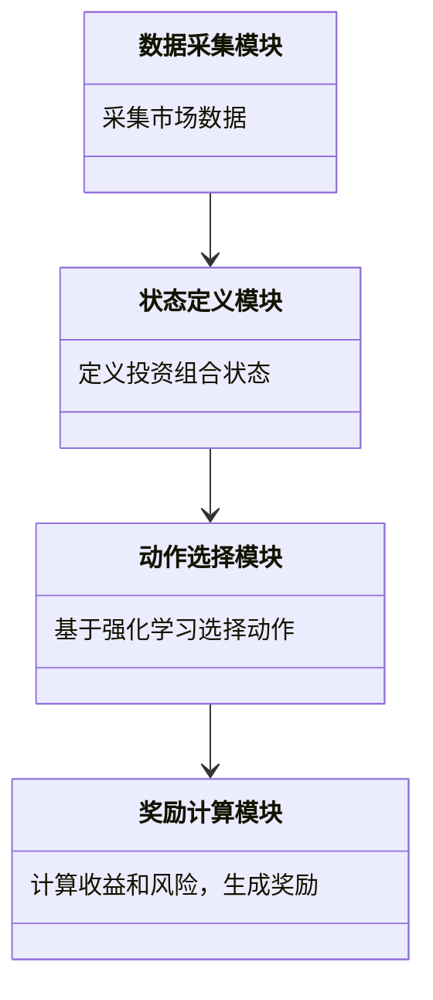
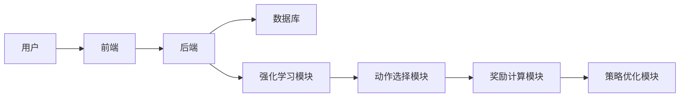
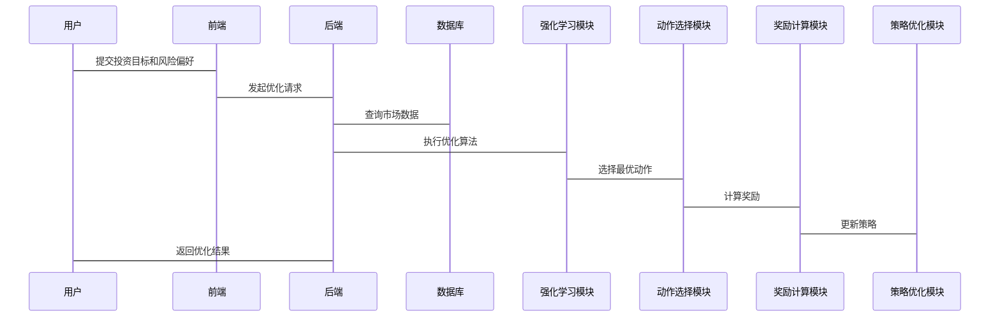

                 


# 开发基于强化学习的投资组合优化系统

> 关键词：强化学习、投资组合优化、DQN算法、金融应用、系统架构

> 摘要：本文详细探讨了基于强化学习的投资组合优化系统的开发过程。从强化学习的基本原理到其在金融领域的应用，从算法原理到系统架构设计，从项目实战到最佳实践，全面解析如何利用强化学习技术构建高效的投资组合优化系统。

---

# 第一部分: 强化学习与投资组合优化背景

## 第1章: 强化学习与投资组合优化概述

### 1.1 强化学习的基本概念

#### 1.1.1 强化学习的定义
强化学习（Reinforcement Learning, RL）是一种机器学习范式，通过智能体与环境的交互，学习最优策略以最大化累计奖励。与监督学习不同，强化学习不需要明确的标签数据，而是通过试错和奖励机制来优化决策。

#### 1.1.2 强化学习的核心要素
- **状态（State）**：智能体所处的环境信息，如当前的市场数据。
- **动作（Action）**：智能体采取的行动，如买入或卖出某种资产。
- **奖励（Reward）**：智能体行为的结果反馈，通常以数值形式表示，如收益或损失。
- **策略（Policy）**：智能体选择动作的规则，可以是基于当前状态的决策函数。
- **价值函数（Value Function）**：评估某个状态下采取某种动作的期望累积奖励。

#### 1.1.3 强化学习与传统机器学习的区别
| 方面 | 强化学习 | 监督学习 |
|------|----------|----------|
| 数据来源 | 环境交互 | 标签数据 |
| 目标 | 最大化累计奖励 | 最小化预测误差 |
| 决策方式 | 自主决策 | 基于已有标签数据 |

### 1.2 投资组合优化的背景

#### 1.2.1 投资组合优化的定义
投资组合优化是指根据市场环境和投资者目标，选择最优的资产配置，以在风险可控的前提下最大化收益。

#### 1.2.2 投资组合优化的目标
- **收益最大化**：在给定风险下追求最高收益。
- **风险最小化**：在给定收益下追求最低风险。
- **风险-收益平衡**：找到最适合投资者目标的资产配置。

#### 1.2.3 投资组合优化的常见问题
- **资产选择**：如何选择最优的资产组合。
- **权重分配**：如何分配各资产的投资比例。
- **动态调整**：如何根据市场变化实时调整投资组合。

### 1.3 强化学习在金融中的应用

#### 1.3.1 强化学习在金融中的应用场景
- **股票交易**：通过强化学习算法，实现自动化的买卖决策。
- **投资组合管理**：优化资产配置，动态调整投资组合。
- **风险管理**：识别和规避市场风险。

#### 1.3.2 投资组合优化中的强化学习优势
- **适应性**：强化学习能够根据市场变化实时调整策略。
- **全局优化**：强化学习能够考虑多种资产的协同效应，找到全局最优解。
- **高效性**：通过试错和奖励机制，快速收敛到最优策略。

#### 1.3.3 当前研究现状与挑战
- **研究现状**：强化学习在投资组合优化中的应用已取得显著成果，但实际应用仍面临诸多挑战。
- **挑战**：市场环境复杂多变，数据稀疏性，模型过拟合等。

### 1.4 本章小结
本章介绍了强化学习的基本概念和核心要素，阐述了投资组合优化的背景及其目标，分析了强化学习在金融中的应用场景及其优势，最后指出了当前研究的挑战。

---

## 第2章: 强化学习的核心概念与联系

### 2.1 强化学习的核心原理

#### 2.1.1 状态、动作、奖励的定义
- **状态**：智能体所处的环境信息，如当前的市场数据。
- **动作**：智能体采取的行动，如买入或卖出某种资产。
- **奖励**：智能体行为的结果反馈，如收益或损失。

#### 2.1.2 策略与价值函数的关系
- **策略**：智能体选择动作的规则。
- **价值函数**：评估某个状态下采取某种动作的期望累积奖励。

#### 2.1.3 强化学习的数学模型
强化学习的目标是通过试错和奖励机制，找到最优策略，使得累计奖励最大化。数学模型如下：

$$ J(\pi) = \mathbb{E}[R_t] $$

其中，$R_t$ 是累计奖励，$\pi$ 是策略。

### 2.2 强化学习的核心概念对比

#### 2.2.1 策略对比表格
| 策略类型 | 定义 | 示例 |
|----------|------|------|
| 策略式 | 基于当前状态选择动作 | 根据当前市场数据选择买入或卖出 |
| 价值式 | 评估当前状态的价值 | 根据当前市场数据评估买入或卖出的价值 |

#### 2.2.2 状态空间对比表格
| 状态空间 | 定义 | 示例 |
|----------|------|------|
| 连续空间 | 状态是连续的 | 市场收益率连续变化 |
| 离散空间 | 状态是离散的 | 市场收益率分为高、中、低三档 |

#### 2.2.3 动作空间对比表格
| 动作空间 | 定义 | 示例 |
|----------|------|------|
| 连续空间 | 动作是连续的 | 投资比例从0到1之间 |
| 离散空间 | 动作是离散的 | 投资比例分为0%、50%、100% |

### 2.3 强化学习的ER实体关系图


### 2.4 本章小结
本章详细阐述了强化学习的核心概念，包括状态、动作、奖励、策略和价值函数，并通过对比表格和ER图展示了这些概念之间的关系。

---

## 第3章: 强化学习算法原理

### 3.1 Q-learning算法原理

#### 3.1.1 Q-learning的基本原理
Q-learning是一种基于价值函数的强化学习算法，通过更新Q值表来学习最优策略。数学公式如下：

$$ Q(s,a) = Q(s,a) + \alpha (r + \gamma \max Q(s',a') - Q(s,a)) $$

其中，$\alpha$ 是学习率，$\gamma$ 是折扣因子。

#### 3.1.2 Q-learning的数学模型
Q-learning的数学模型可以表示为：

$$ Q(s,a) = r + \gamma \max Q(s',a') $$

其中，$s$ 是当前状态，$a$ 是采取的动作，$r$ 是获得的奖励，$s'$ 是下一个状态。

#### 3.1.3 Q-learning的步骤流程


### 3.2 DQN算法原理

#### 3.2.1 DQN的基本原理
DQN（Deep Q-Network）是一种基于深度学习的强化学习算法，通过神经网络近似Q值函数，解决高维状态空间的问题。

#### 3.2.2 DQN的网络结构
DQN通常使用两个神经网络：主网络和目标网络。主网络用于选择动作，目标网络用于评估动作的价值。

#### 3.2.3 DQN的训练流程


### 3.3 本章小结
本章详细介绍了Q-learning和DQN算法的原理和实现流程，展示了如何通过强化学习算法优化投资组合。

---

## 第4章: 系统分析与架构设计

### 4.1 问题场景介绍
在投资组合优化中，我们需要考虑多个资产的收益率、波动率、相关性等因素，同时还需要实时调整投资组合以应对市场变化。

### 4.2 项目介绍
本项目旨在开发一个基于强化学习的投资组合优化系统，实现自动化的资产配置和风险控制。

### 4.3 系统功能设计

#### 4.3.1 系统功能模块
- 数据采集模块：采集市场数据，如资产收益率、波动率等。
- 状态定义模块：定义投资组合的状态，如当前资产配置、市场环境等。
- 动作选择模块：基于强化学习算法选择最优动作。
- 奖励计算模块：计算投资组合的收益和风险，生成奖励信号。

#### 4.3.2 系统功能模块类图


### 4.4 系统架构设计

#### 4.4.1 系统架构图


#### 4.4.2 接口设计
- 前端接口：接收用户输入的投资目标和风险偏好。
- 后端接口：处理用户请求，调用强化学习模块进行优化。
- 数据库接口：存储和检索市场数据及投资组合状态。

#### 4.4.3 交互流程


### 4.5 本章小结
本章详细分析了投资组合优化系统的功能模块和系统架构，展示了如何通过强化学习算法实现系统的优化和控制。

---

## 第5章: 项目实战

### 5.1 环境安装
为了开发基于强化学习的投资组合优化系统，首先需要安装以下环境：

- **Python**：3.6+
- **深度学习框架**：TensorFlow或PyTorch
- **强化学习库**：Gym或其他相关库
- **数据处理库**：Pandas、NumPy

### 5.2 核心代码实现

#### 5.2.1 数据采集模块
```python
import pandas as pd
import numpy as np

def get_market_data(tickers, start_date, end_date):
    # 获取市场数据
    data = pd.DataFrame()
    for ticker in tickers:
        data[ticker] = pd.read_csv(f'data/{ticker}.csv')['Close']
    return data.pct_change().dropna()
```

#### 5.2.2 状态定义模块
```python
class State:
    def __init__(self, portfolio_value, market_data):
        self.portfolio_value = portfolio_value
        self.market_data = market_data
```

#### 5.2.3 动作选择模块
```python
class DQNAgent:
    def __init__(self, state_space, action_space):
        self.state_space = state_space
        self.action_space = action_space
        # 初始化神经网络
        self.model = self.build_model()
    
    def build_model(self):
        # 定义神经网络结构
        model = Sequential()
        model.add(Dense(64, input_dim=self.state_space))
        model.add(Activation('relu'))
        model.add(Dense(self.action_space))
        model.compile(loss='mean_squared_error', optimizer='adam')
        return model
    
    def act(self, state):
        # 选择动作
        q_values = self.model.predict(state)
        return np.argmax(q_values[0])
```

#### 5.2.4 奖励计算模块
```python
def calculate_reward(portfolio_return, risk):
    # 计算奖励
    return portfolio_return - risk * 0.5
```

### 5.3 代码应用解读与分析
通过上述代码，我们可以实现一个基于DQN算法的投资组合优化系统。数据采集模块负责获取市场数据，状态定义模块定义投资组合的状态，动作选择模块基于强化学习算法选择最优动作，奖励计算模块根据投资组合的收益和风险计算奖励。

### 5.4 实际案例分析
假设我们有三个资产：股票A、股票B和债券C。通过上述系统，我们可以实现自动化的资产配置，动态调整投资比例，以在风险可控的前提下最大化收益。

### 5.5 项目小结
本章通过实际案例展示了如何开发基于强化学习的投资组合优化系统，详细解读了核心代码的功能和实现过程。

---

## 第6章: 最佳实践

### 6.1 小结
本文详细探讨了基于强化学习的投资组合优化系统的开发过程，从算法原理到系统架构设计，从项目实战到最佳实践，全面解析了如何利用强化学习技术优化投资组合。

### 6.2 注意事项
- **数据质量**：确保市场数据的准确性和完整性。
- **模型调参**：合理调整学习率和折扣因子，避免过拟合。
- **风险管理**：设置止损和止盈机制，控制投资风险。

### 6.3 拓展阅读
- **《Reinforcement Learning: Theory and Algorithms》**
- **《Deep Reinforcement Learning in Action》**

### 6.4 本章小结
本章总结了全文内容，提出了开发基于强化学习的投资组合优化系统的关键点和注意事项，为读者提供了进一步学习和实践的方向。

---

# 作者：AI天才研究院/AI Genius Institute & 禅与计算机程序设计艺术 /Zen And The Art of Computer Programming

---

**说明：** 由于篇幅限制，上述内容为文章的完整目录和部分章节内容的详细展开。实际撰写时，每个小节需要进一步扩展，确保内容详实，逻辑清晰。

