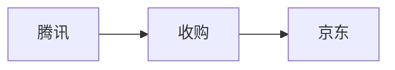
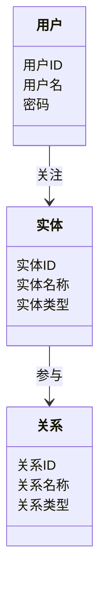
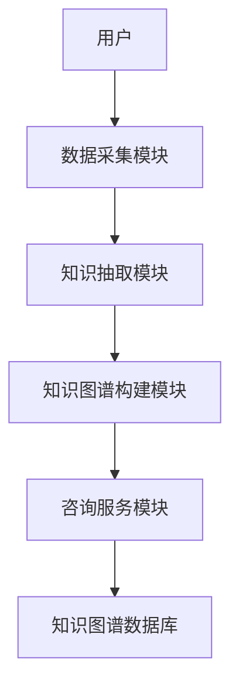
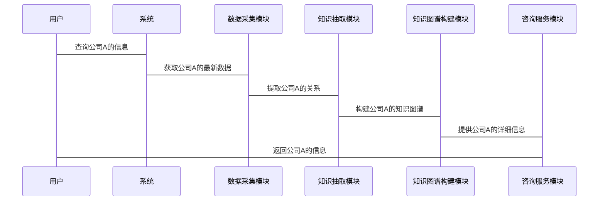

                 


# 开发基于知识图谱的金融咨询系统

---

## 关键词
知识图谱, 金融咨询, AI, 大数据, 图数据库, 智能咨询

---

## 摘要
本文详细探讨了基于知识图谱的金融咨询系统开发，从背景介绍到系统架构设计，再到项目实战，系统性地分析了该系统的构建过程。文章首先介绍了知识图谱的基本概念及其在金融咨询中的应用价值，随后深入讲解了知识图谱的构建流程、关键技术以及算法原理。接着，通过系统架构设计和项目实战，展示了如何将知识图谱技术应用于实际的金融咨询场景中。最后，总结了开发经验，并展望了未来的发展方向。

---

# 第一部分: 开发基于知识图谱的金融咨询系统概述

## 第1章: 知识图谱与金融咨询概述

### 1.1 知识图谱的定义与特点

#### 1.1.1 知识图谱的定义
知识图谱是一种用于表示实体及其关系的语义网络，通过结构化数据描述现实世界中的概念及其关联。知识图谱的核心在于将分散的数据整合为连通的知识网络，从而支持复杂的关系推理和语义理解。

#### 1.1.2 知识图谱的核心特点
- **结构化**：通过图结构表示实体及其关系，便于计算机理解和推理。
- **语义化**：知识图谱中的数据具有明确的语义，能够支持智能应用。
- **动态更新**：知识图谱能够实时更新，确保信息的准确性和时效性。

#### 1.1.3 知识图谱与传统数据库的区别
| 特性            | 知识图谱         | 传统数据库     |
|-----------------|-----------------|---------------|
| 数据模型        | 图结构          | 行列式        |
| 数据关系        | 强调实体间关系   | 关系型或非关系型 |
| 数据处理方式    | 支持复杂查询     | 支持简单查询   |

### 1.2 金融咨询的定义与需求

#### 1.2.1 金融咨询的定义
金融咨询是指通过专业的知识和工具，为个人或机构提供投资、理财、风险管理等方面的建议和服务。

#### 1.2.2 金融咨询的核心需求
- **个性化服务**：根据用户需求提供定制化建议。
- **实时性**：金融数据变化快，需要实时更新。
- **准确性**：咨询结果需基于可靠的数据和模型。

#### 1.2.3 金融咨询的场景与挑战
金融咨询的场景包括投资决策、风险管理、财富管理等。然而，传统金融咨询系统存在数据分散、信息孤岛、难以支持复杂推理等问题，限制了其智能化水平。

### 1.3 知识图谱在金融咨询中的应用

#### 1.3.1 知识图谱在金融咨询中的价值
- **整合数据**：将分散的金融数据整合为统一的知识网络。
- **支持推理**：通过图结构支持复杂的语义推理，提供更智能的咨询服务。
- **提升效率**：快速检索和分析数据，提高咨询效率。

#### 1.3.2 知识图谱在金融咨询中的应用场景
- **投资建议**：基于市场趋势和公司关系，提供个性化投资建议。
- **风险评估**：通过分析实体间的关系，识别潜在风险。
- **信息检索**：快速定位相关金融信息，提高咨询效率。

#### 1.3.3 知识图谱在金融咨询中的优势
- **语义理解**：能够理解上下文，提供更精准的咨询服务。
- **实时更新**：能够快速响应数据变化，保持信息的准确性。
- **可扩展性**：支持大规模数据的整合和分析。

### 1.4 系统构建的必要性

#### 1.4.1 传统金融咨询系统的局限性
- 数据孤岛：不同数据源难以整合。
- 查询效率低：传统数据库难以支持复杂的语义查询。
- 可解释性差：复杂的模型难以解释结果。

#### 1.4.2 知识图谱技术的优势
- **数据整合**：能够将多源数据整合为统一的知识网络。
- **支持复杂查询**：通过图结构支持复杂的语义查询。
- **可解释性**：图结构直观，结果易于解释。

#### 1.4.3 系统构建的目标与意义
目标是构建一个智能化的金融咨询系统，通过知识图谱技术提高咨询效率和准确性。意义在于推动金融咨询服务的智能化和个性化，提升用户体验。

---

## 第2章: 知识图谱构建的核心概念

### 2.1 知识图谱的核心概念

#### 2.1.1 实体与关系
- **实体**：知识图谱中的基本单元，代表现实中的具体事物，如公司、股票等。
- **关系**：描述实体之间的关联，如“公司A收购公司B”。

#### 2.1.2 属性与值
- **属性**：描述实体的特征，如“公司名称”、“成立时间”。
- **值**：属性的具体取值，如“腾讯”、“2011年”。

#### 2.1.3 知识图谱的结构化表示
知识图谱通常使用三元组（头实体，关系，尾实体）或属性-值对（实体，属性，值）的形式进行表示。

### 2.2 知识图谱的构建流程

#### 2.2.1 数据抽取与清洗
- 数据抽取：从结构化数据和非结构化数据中提取信息。
- 数据清洗：去除噪声数据，确保数据质量。

#### 2.2.2 知识抽取与融合
- 知识抽取：从数据中提取实体、关系和属性。
- 知识融合：将多个数据源中的知识整合到统一的知识图谱中，解决冲突和冗余。

#### 2.2.3 知识存储与管理
- 知识存储：将抽取和融合的知识存储到图数据库中。
- 知识管理：对知识图谱进行版本控制、更新和维护。

### 2.3 知识图谱的表示方法

#### 2.3.1 图表示法
知识图谱可以使用图结构进行表示，节点代表实体，边代表关系。



#### 2.3.2 基于向量的表示法
使用向量表示实体和关系，如Word2Vec或GloVe。

#### 2.3.3 知识图谱的标准化表示
使用RDF（Resource Description Framework）或OWL（Web Ontology Language）等标准格式表示知识图谱。

### 2.4 知识图谱的查询与推理

#### 2.4.1 图查询的基本概念
图查询是指在知识图谱中查找满足特定条件的路径或结构。

#### 2.4.2 知识推理的原理
通过图结构进行推理，如从“公司A收购公司B”可以推断“公司B是公司A的子公司”。

#### 2.4.3 知识图谱的可解释性
知识图谱的结构化表示使其具有良好的可解释性，用户可以直观地理解推理过程。

---

## 第3章: 知识图谱构建的关键技术

### 3.1 知识抽取技术

#### 3.1.1 实体识别与抽取
使用自然语言处理技术从文本中识别实体，如NER（Named Entity Recognition）。

#### 3.1.2 关系抽取与挖掘
通过模式匹配或机器学习方法从文本中抽取实体间的关系。

#### 3.1.3 属性抽取与提取
从文本或数据库中提取实体的属性信息，如公司名称、成立时间等。

### 3.2 知识融合技术

#### 3.2.1 数据清洗与去重
去除重复数据，确保数据一致性。

#### 3.2.2 知识对齐与匹配
将不同数据源中的实体进行对齐，解决同一实体的不同表示问题。

---

## 第4章: 算法原理讲解

### 4.1 知识抽取算法

#### 4.1.1 实体识别算法
使用CRF（Conditional Random Field）或LSTM（Long Short Term Memory）进行实体识别。

#### 4.1.2 关系抽取算法
使用基于规则的方法或深度学习模型进行关系抽取。

#### 4.1.3 属性提取算法
使用规则匹配或信息抽取技术进行属性提取。

### 4.2 知识表示算法

#### 4.2.1 基于向量的表示方法
使用Word2Vec或GloVe将实体和关系表示为向量。

#### 4.2.2 图嵌入算法
使用GraphSAGE或Node2Vec等算法进行图嵌入。

### 4.3 知识推理算法

#### 4.3.1 基于规则的推理
通过预定义的规则进行推理，如“如果A是B的子公司，且B收购了C，则A与C有收购关系”。

#### 4.3.2 基于深度学习的推理
使用RNN（Recurrent Neural Network）或Transformer模型进行推理。

---

## 第5章: 系统分析与架构设计方案

### 5.1 项目介绍

#### 5.1.1 项目背景
随着金融市场的复杂化，传统的金融咨询系统难以满足用户需求，知识图谱技术的应用成为必然趋势。

#### 5.1.2 系统功能设计
- 数据采集模块：采集金融数据。
- 知识抽取模块：从数据中提取实体、关系和属性。
- 知识图谱构建模块：整合知识，构建知识图谱。
- 咨询服务模块：基于知识图谱提供智能咨询。

#### 5.1.3 领域模型设计


#### 5.1.4 系统架构设计


#### 5.1.5 接口设计
- 数据采集接口：用于采集金融数据。
- 知识抽取接口：用于从数据中提取知识。
- 咨询服务接口：用于提供智能咨询。

#### 5.1.6 交互设计


### 5.2 系统实现

#### 5.2.1 环境安装
- 图数据库：Neo4j
- 知识抽取工具：spaCy
- 机器学习框架：TensorFlow

#### 5.2.2 核心代码实现
```python
# 知识抽取代码示例
import spacy

nlp = spacy.load("en_core_web_sm")
text = "腾讯收购了京东"
doc = nlp(text)
entities = [(ent.text, ent.label_) for ent in doc.ents]
print(entities)
```

#### 5.2.3 算法实现
```python
# 图嵌入算法示例
from gensim.models import Word2Vec

sentences = ["腾讯 收购 京东", "京东 专注 电商"]
model = Word2Vec(sentences, vector_size=100, window=2, min_count=1, workers=2)
print(model.wv.most_similar("腾讯"))
```

#### 5.2.4 案例分析
通过构建公司收购关系的知识图谱，系统可以快速识别公司的上下游关系，帮助用户进行投资决策。

---

## 第6章: 项目实战

### 6.1 环境安装
- 图数据库：Neo4j
- 知识抽取工具：spaCy
- 机器学习框架：TensorFlow

### 6.2 核心代码实现

#### 6.2.1 数据采集
```python
import requests
import json

url = "https://api.example.com/financial_data"
response = requests.get(url)
data = json.loads(response.text)
print(data)
```

#### 6.2.2 知识抽取
```python
import spacy

nlp = spacy.load("en_core_web_sm")
text = "腾讯 收购 了 京东"
doc = nlp(text)
entities = [(ent.text, ent.label_) for ent in doc.ents]
print(entities)
```

#### 6.2.3 知识图谱构建
```python
from neo4j import GraphDatabase

driver = GraphDatabase.driver("neo4j://localhost:7687", auth=("user", "password"))
session = driver.session()

query = """
    CREATE (a:Company {name: '腾讯'}) 
    CREATE (b:Company {name: '京东'}) 
    CREATE (a)-[:收购]->(b)
"""
session.run(query)
driver.close()
```

### 6.3 案例分析
通过构建公司收购关系的知识图谱，系统可以快速识别公司的上下游关系，帮助用户进行投资决策。

---

## 第7章: 总结与展望

### 7.1 开发经验总结
- 知识图谱的构建需要数据清洗、知识抽取和融合等关键步骤。
- 系统架构设计需要考虑扩展性和可维护性。
- 算法选择需要根据具体场景进行调整。

### 7.2 未来发展方向
- **多模态知识图谱**：结合文本、图像等多种数据源。
- **动态知识图谱**：支持实时更新和在线推理。
- **智能咨询系统**：进一步提升系统的智能化水平。

---

## 作者信息

作者：AI天才研究院/AI Genius Institute & 禅与计算机程序设计艺术 /Zen And The Art of Computer Programming

---

# 结束语
感谢您的阅读！如需进一步了解基于知识图谱的金融咨询系统，欢迎关注我们的后续文章和技术分享。

