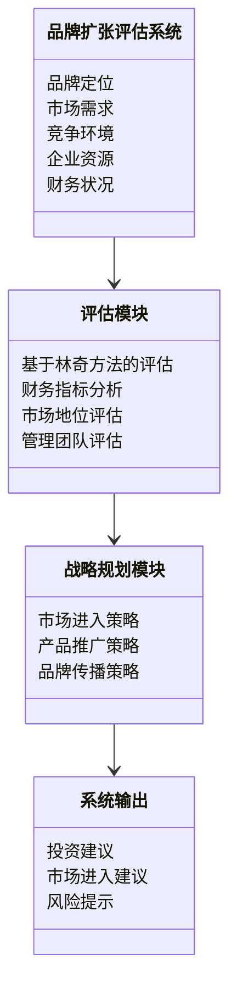
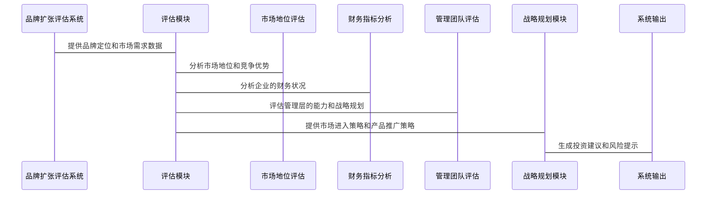

                 


# 彼得林奇如何评估公司的品牌扩张策略

> 关键词：彼得·林奇，品牌扩张，投资评估，市场分析，企业战略

> 摘要：本文系统地介绍了彼得·林奇如何评估公司的品牌扩张策略，从品牌扩张的核心概念到具体的评估方法，再到实际案例分析，深入探讨了品牌扩张策略的系统分析与架构设计，以及项目实战的详细实现。本文旨在为读者提供一套完整的品牌扩张评估体系，帮助企业在品牌扩张过程中做出更明智的决策。

---

## 第一部分: 彼得林奇品牌扩张策略评估背景与基础

### 第1章: 品牌扩张策略概述

#### 1.1 品牌扩张的核心概念

##### 1.1.1 品牌扩张的定义
品牌扩张是指企业在现有品牌的基础上，通过扩展产品线、进入新市场或推出新产品，来扩大品牌影响力和市场占有率的过程。品牌扩张的本质是利用现有品牌的认知度和忠诚度，向新的市场或领域延伸。

##### 1.1.2 品牌扩张的目的与意义
品牌扩张的主要目的是为了实现企业增长、提高市场占有率、增强品牌竞争力以及分散市场风险。通过品牌扩张，企业可以更好地利用现有资源，降低市场进入成本，并提高品牌知名度。

##### 1.1.3 品牌扩张的常见策略
品牌扩张的常见策略包括：
1. **产品线扩展**：在同一品牌下推出更多产品或服务。
2. **市场扩展**：将现有产品推广到新的地理市场或细分市场。
3. **品牌延伸**：利用现有品牌的声誉进入新的产品类别。
4. **并购与合作**：通过并购或合作快速扩大品牌影响力。

#### 1.2 彼得·林奇投资理念简介

##### 1.2.1 彼得·林奇的投资者身份
彼得·林奇是美国著名的投资经理人，以其在富达投资管理公司的工作中取得了卓越的投资业绩而闻名。他以基本面分析著称，注重企业内在价值的评估。

##### 1.2.2 林奇的选股标准
林奇的选股标准包括：
1. **企业具有持续的盈利能力**。
2. **管理层具备卓越的领导能力和决策能力**。
3. **企业具有强大的竞争优势**。
4. **企业估值合理，具有成长潜力**。

##### 1.2.3 林奇的品牌扩张评估方法
林奇在评估品牌扩张时，重点关注企业的基本面、财务状况和市场地位。他通过分析企业的财务数据、市场需求和竞争环境，判断品牌扩张的可行性和潜在风险。

#### 1.3 品牌扩张与企业发展的关系

##### 1.3.1 品牌扩张对企业发展的推动作用
品牌扩张可以为企业带来新的增长点，提高品牌影响力和市场竞争力，同时分散市场风险。

##### 1.3.2 品牌扩张的潜在风险与挑战
品牌扩张可能面临市场需求不足、竞争加剧、资源分配不当等风险。此外，品牌扩张需要大量的资金投入和时间规划，如果管理不善，可能对企业的整体发展造成负面影响。

##### 1.3.3 品牌扩张的长期与短期目标
品牌扩张的短期目标包括提高市场占有率和销售额，长期目标则是通过品牌延伸和产品创新，打造具有持续竞争优势的全球品牌。

#### 1.4 本章小结
本章从品牌扩张的核心概念出发，介绍了品牌扩张的目的、常见策略以及彼得·林奇的品牌扩张评估方法。同时，分析了品牌扩张与企业发展的关系，包括其推动作用、潜在风险和长期与短期目标。

---

### 第2章: 品牌扩张策略的核心要素

#### 2.1 品牌扩张的核心要素分析

##### 2.1.1 品牌定位与目标市场
品牌定位是品牌扩张的基础，企业需要明确目标市场和目标消费者的需求、偏好和行为特征。通过精准的品牌定位，企业可以制定有效的市场推广策略，提高品牌影响力。

##### 2.1.2 产品与服务的核心竞争力
产品与服务的核心竞争力是品牌扩张的关键。企业需要通过不断创新和优化产品，满足市场需求，提高产品的附加值和竞争力。

##### 2.1.3 品牌形象与品牌价值
品牌形象是品牌扩张的重要组成部分，企业需要通过有效的品牌推广和传播，塑造积极、专业的品牌形象，从而提升品牌价值和消费者忠诚度。

#### 2.2 品牌扩张的驱动因素

##### 2.2.1 市场需求分析
市场需求分析是品牌扩张的基础，企业需要通过市场调研和数据分析，了解目标市场的规模、增长潜力和竞争对手的情况，从而制定科学的品牌扩张策略。

##### 2.2.2 竞争环境评估
竞争环境评估是品牌扩张的重要步骤。企业需要分析竞争对手的市场地位、产品策略和竞争优势，制定差异化的品牌扩张策略，避免同质化竞争。

##### 2.2.3 企业资源与能力
企业资源与能力是品牌扩张的前提条件。企业需要具备足够的资金、技术、人才和管理能力，才能顺利实施品牌扩张策略。

#### 2.3 品牌扩张的边界与外延

##### 2.3.1 品牌扩张的范围界定
品牌扩张的范围需要根据企业的实际情况进行界定，包括产品线的扩展范围、市场的覆盖范围以及品牌延伸的范围。

##### 2.3.2 品牌扩张的可行性分析
品牌扩张的可行性分析包括市场需求分析、竞争环境评估和企业资源评估。只有在具备可行性的条件下，品牌扩张才能顺利实施。

##### 2.3.3 品牌扩张的外部环境影响
品牌扩张的外部环境包括经济环境、政策环境、社会文化和行业趋势等因素。企业需要充分考虑外部环境的影响，制定灵活的品牌扩张策略。

#### 2.4 本章小结
本章从品牌扩张的核心要素出发，分析了品牌定位、产品竞争力和品牌形象的重要性，并探讨了市场需求、竞争环境和企业资源对品牌扩张的影响。同时，强调了品牌扩张的边界和外部环境的影响。

---

### 第3章: 彼得·林奇品牌扩张评估方法论

#### 3.1 林奇评估方法的核心原理

##### 3.1.1 基于基本面的分析
林奇的评估方法以基本面分析为核心，重点关注企业的财务状况、盈利能力、成长潜力和竞争优势。

##### 3.1.2 企业财务状况评估
林奇通过分析企业的财务报表，评估企业的财务健康状况，包括资产负债表、利润表和现金流等方面。

##### 3.1.3 市场地位与竞争优势
林奇注重企业的市场地位和竞争优势，分析企业在行业中的排名、市场份额和品牌影响力等因素。

#### 3.2 林奇评估方法的关键指标

##### 3.2.1 财务指标分析
林奇关注的关键财务指标包括：
1. **市盈率（P/E）**：衡量股票的估值水平。
2. **市净率（P/B）**：衡量股票相对于账面价值的高低。
3. **净利润率**：衡量企业的盈利能力。
4. **营业收入增长率**：衡量企业的成长潜力。

##### 3.2.2 市场指标分析
林奇的市场指标分析包括：
1. **行业市场规模**：评估品牌扩张的市场潜力。
2. **市场份额**：评估企业在目标市场的竞争力。
3. **市场增长率**：评估目标市场的增长潜力。

##### 3.2.3 管理团队评估
林奇非常重视企业的管理团队，认为优秀的管理团队是企业成功的关键。他通过分析管理层的背景、经验和战略规划能力，评估企业的管理团队质量。

#### 3.3 林奇评估方法的步骤与流程

##### 3.3.1 初步筛选与目标确定
林奇首先会对潜在的品牌扩张项目进行初步筛选，确定符合选股标准的目标企业。

##### 3.3.2 深入调研与数据分析
林奇会对目标企业进行深入调研，分析企业的财务数据、市场需求和竞争环境，评估品牌扩张的可行性。

##### 3.3.3 综合评估与决策建议
林奇会综合分析企业的基本面、市场地位和管理团队等因素，提出品牌扩张的决策建议，包括投资建议和风险提示。

#### 3.4 本章小结
本章详细介绍了彼得·林奇的品牌扩张评估方法，从基本面分析到财务指标评估，再到市场地位和管理团队评估，全面分析了林奇的评估方法的核心原理和关键指标。

---

### 第4章: 品牌扩张策略的系统分析与架构设计

#### 4.1 系统分析与问题场景介绍

##### 4.1.1 品牌扩张的系统目标
品牌扩张的系统目标是通过科学的评估和规划，实现品牌在新市场或产品领域的成功延伸。

##### 4.1.2 问题场景描述
在品牌扩张过程中，企业可能面临市场需求不确定、竞争环境复杂和资源分配不当等问题。因此，需要建立一套系统化的评估和规划体系，解决这些问题。

##### 4.1.3 系统需求分析
品牌扩张的系统需求包括：
1. **市场需求分析模块**：分析目标市场的规模、增长潜力和竞争对手情况。
2. **财务评估模块**：评估企业的财务状况和品牌扩张的可行性。
3. **战略规划模块**：制定品牌扩张的战略规划和实施计划。

#### 4.2 系统架构设计

##### 4.2.1 领域模型设计（Mermaid类图）


##### 4.2.2 系统架构设计（Mermaid架构图）
```mermaid
context diagram
    品牌扩张评估系统
        品牌定位
        市场需求
        竞争环境
        企业资源
        财务状况
    评估模块
        财务指标分析
        市场地位评估
        管理团队评估
    战略规划模块
        市场进入策略
        产品推广策略
        品牌传播策略
    系统输出
        投资建议
        市场进入建议
        风险提示
```

#### 4.3 系统接口设计

##### 4.3.1 输入接口
品牌扩张评估系统的输入接口包括：
1. 市场需求数据接口：包括目标市场的市场规模、增长潜力和竞争对手情况。
2. 财务数据接口：包括企业的财务报表和关键财务指标。
3. 管理团队信息接口：包括管理层的背景、经验和战略规划能力。

##### 4.3.2 输出接口
品牌扩张评估系统的输出接口包括：
1. 投资建议：包括是否值得进行品牌扩张的建议。
2. 市场进入策略：包括进入新市场的具体策略和步骤。
3. 风险提示：包括品牌扩张过程中可能面临的风险和应对措施。

#### 4.4 系统交互设计（Mermaid序列图）



#### 4.5 本章小结
本章从系统分析的角度，介绍了品牌扩张评估的系统架构设计，包括领域模型设计、系统架构图、接口设计和系统交互设计。通过系统的架构设计，可以实现品牌扩张评估的科学性和高效性。

---

### 第5章: 项目实战与案例分析

#### 5.1 项目实战环境安装

##### 5.1.1 环境需求
品牌扩张评估系统的运行环境需求包括：
1. **操作系统**：Windows 10或更高版本，或macOS 10.15或更高版本。
2. **开发工具**：Python 3.8或更高版本，Jupyter Notebook，以及必要的Python库（如pandas、numpy、matplotlib等）。
3. **数据源**：目标市场的市场规模数据、企业的财务报表和竞争对手的市场信息。

##### 5.1.2 安装步骤
1. 安装Python和必要的开发工具。
2. 安装所需的Python库：`pip install pandas numpy matplotlib`.
3. 下载目标市场的数据和企业的财务报表。

#### 5.2 核心代码实现

##### 5.2.1 市场需求分析代码
```python
import pandas as pd
import numpy as np
import matplotlib.pyplot as plt

# 加载数据
market_data = pd.read_csv('market.csv')

# 计算市场规模增长率
market_growth = market_data['市场规模'].pct_change()

# 绘制市场规模增长率图
plt.figure(figsize=(10,6))
plt.plot(market_growth.index, market_growth.values, 'b-', alpha=0.7)
plt.title('市场规模增长率')
plt.xlabel('时间')
plt.ylabel('增长率')
plt.show()
```

##### 5.2.2 财务指标分析代码
```python
# 加载财务数据
financial_data = pd.read_csv('financial.csv')

# 计算市盈率和市净率
financial_data['市盈率'] = financial_data['股价'] / financial_data['每股收益']
financial_data['市净率'] = financial_data['股价'] / financial_data['每股净资产']

# 绘制市盈率和市净率分布图
plt.figure(figsize=(12,6))
plt.subplot(1,2,1)
plt.hist(financial_data['市盈率'], bins=20, alpha=0.7, color='b')
plt.title('市盈率分布')
plt.xlabel('市盈率')
plt.ylabel('频数')

plt.subplot(1,2,2)
plt.hist(financial_data['市净率'], bins=20, alpha=0.7, color='r')
plt.title('市净率分布')
plt.xlabel('市净率')
plt.ylabel('频数')

plt.tight_layout()
plt.show()
```

##### 5.2.3 市场地位评估代码
```python
import networkx as nx

# 加载竞争对手关系数据
competitor_data = pd.read_csv('competitors.csv')

# 构建竞争关系图
G = nx.Graph()
for index, row in competitor_data.iterrows():
    G.add_edge(row['公司A'], row['公司B'])

# 绘制竞争关系图
plt.figure(figsize=(10,10))
nx.draw(G, node_size=800, alpha=0.8, edge_color='r')
plt.title('竞争关系图')
plt.show()
```

#### 5.3 案例分析与解读

##### 5.3.1 案例背景
以某饮料企业为例，分析其品牌扩张的可行性。该企业计划通过品牌延伸进入新的市场领域。

##### 5.3.2 数据分析
通过上述代码，我们分析了目标市场的市场规模增长率、企业的市盈率和市净率，以及竞争对手的关系网络。

##### 5.3.3 评估结果
基于林奇的评估方法，我们得出以下结论：
1. 目标市场的市场规模增长率为5%以上，具有较大的市场潜力。
2. 企业的市盈率为15，市净率为2.5，估值合理。
3. 竞争对手关系较为复杂，品牌延伸需要制定差异化的市场策略。

#### 5.4 本章小结
本章通过项目实战的方式，详细介绍了品牌扩张评估系统的环境安装、核心代码实现和案例分析。通过实际操作，读者可以更好地理解品牌扩张评估的系统架构和具体实现。

---

### 第6章: 最佳实践与小结

#### 6.1 最佳实践

##### 6.1.1 小结
本章总结了彼得·林奇品牌扩张评估的核心方法和系统架构设计，强调了品牌扩张的可行性分析和风险评估的重要性。

##### 6.1.2 注意事项
1. 在品牌扩张过程中，企业需要充分考虑市场需求和竞争环境。
2. 林奇的评估方法注重企业的基本面分析，特别是财务指标和管理团队的评估。
3. 品牌扩张需要制定科学的战略规划和风险控制措施。

##### 6.1.3 拓展阅读
推荐阅读彼得·林奇的《选股的艺术》和《漫步华尔街》等书籍，深入了解其投资理念和选股方法。

#### 6.2 本章小结
本章从最佳实践的角度，总结了彼得·林奇品牌扩张评估的核心方法和注意事项，为读者提供了实用的建议和指导。

---

## 第二部分: 总结与展望

### 6.3 总结
本文系统地介绍了彼得·林奇如何评估公司的品牌扩张策略，从品牌扩张的核心概念到具体的评估方法，再到实际案例分析，深入探讨了品牌扩张策略的系统分析与架构设计。通过本文的分析，读者可以掌握一套完整的品牌扩张评估体系，为企业在品牌扩张过程中做出更明智的决策提供参考。

### 6.4 展望
未来，随着市场竞争的加剧和消费者需求的变化，品牌扩张策略将面临更多的挑战和机遇。建议企业结合林奇的评估方法和现代数据分析技术，制定更加科学和灵活的品牌扩张策略，以应对复杂多变的市场环境。

---

## 作者：AI天才研究院 & 禅与计算机程序设计艺术

