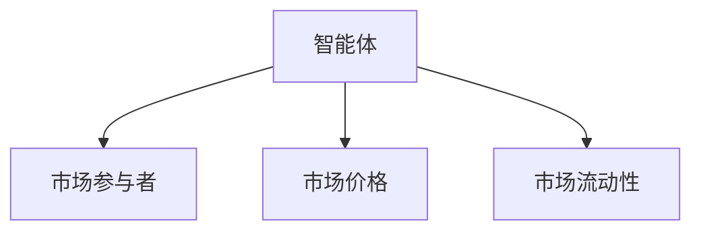
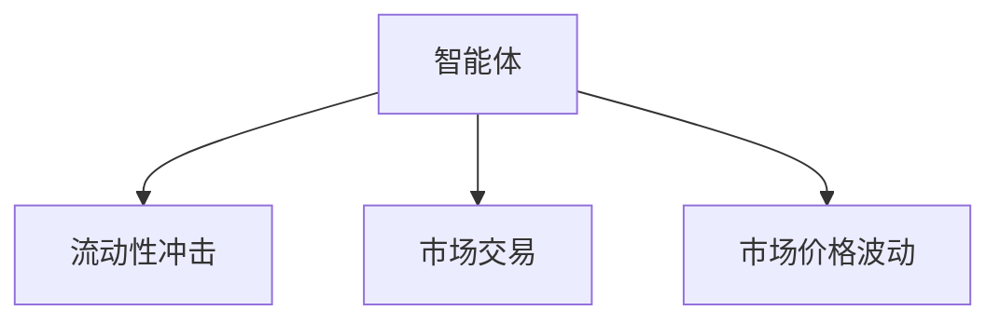
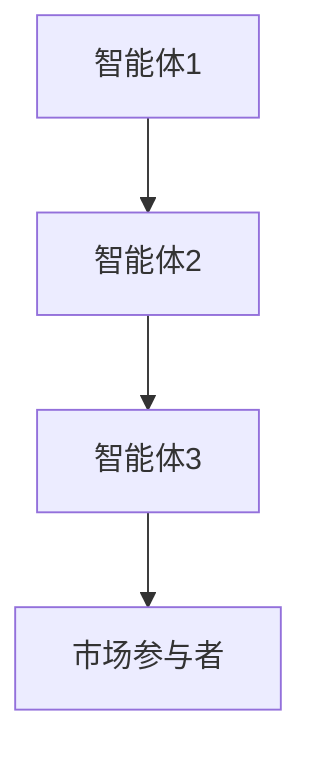
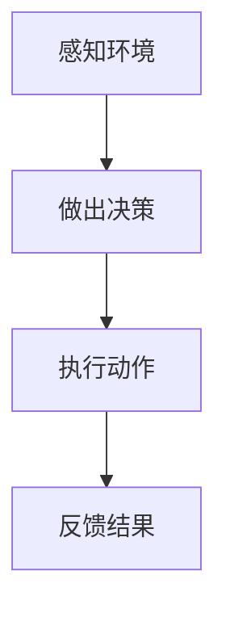
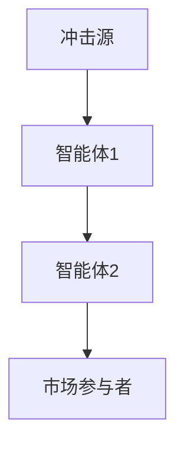
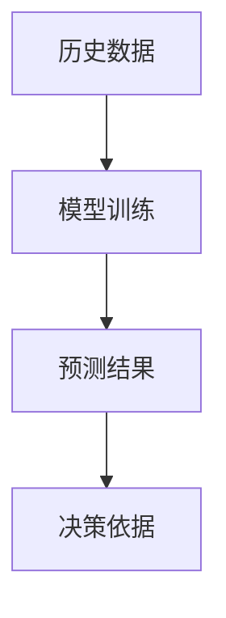
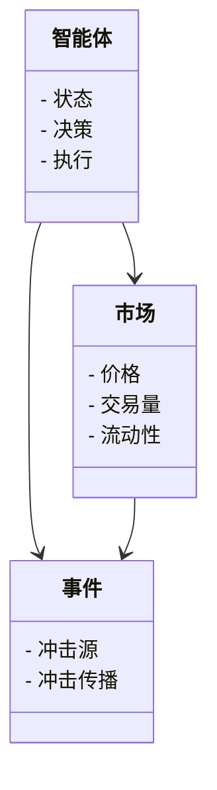
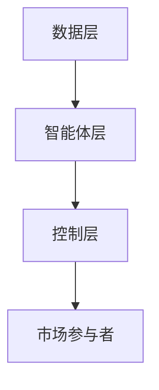
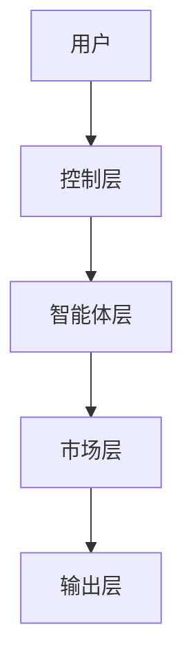

                 


# 智能体群体在模拟市场流动性冲击中的应用

## 关键词：智能体群体，市场流动性冲击，强化学习，博弈论，系统架构设计，金融市场模拟

## 摘要：本文探讨了智能体群体在模拟市场流动性冲击中的应用，从背景、核心概念、算法原理到系统架构设计，详细阐述了如何利用智能体群体模拟市场流动性冲击，并通过实际案例分析和代码实现，展示了其在金融市场中的实际应用价值。

---

## 第一部分: 智能体群体与市场流动性冲击基础

### 第1章: 智能体群体与市场流动性冲击概述

#### 1.1 问题背景与描述
##### 1.1.1 金融市场中的流动性问题
金融市场中的流动性是指资产能够快速买卖而不影响其市场价格的能力。流动性冲击则是指市场中突然出现的大额交易或极端事件，导致市场价格剧烈波动、流动性下降的现象。流动性冲击对市场参与者（如投资者、机构）造成重大影响，可能导致资产损失或交易成本上升。

##### 1.1.2 流动性冲击的定义与特征
流动性冲击可以定义为市场中突然发生的大量买卖交易，导致市场价格出现剧烈波动、买卖价差扩大、交易量骤减的现象。其主要特征包括：
- 突发性：冲击往往在短时间内发生，具有不可预测性。
- 波动性：市场价格的剧烈波动。
- 流动性下降：市场深度不足，难以迅速成交。

##### 1.1.3 智能体群体的概念与特点
智能体（Agent）是指具有感知环境、自主决策、执行动作能力的实体。智能体群体则是多个智能体协同工作的集合。其特点包括：
- 分布式：智能体独立决策，但通过交互协同工作。
- 自适应：能够根据环境变化调整行为。
- 协作性：通过协作实现复杂任务。

#### 1.2 智能体群体在金融市场中的应用
##### 1.2.1 智能体群体的基本属性与特征
智能体在金融市场中的应用具有以下基本属性：
- 智能体具有决策能力，能够根据市场信息做出买卖决策。
- 智能体具有记忆能力，能够记录历史交易数据。
- 智能体具有社交能力，能够与其他智能体或市场参与者交互。

##### 1.2.2 智能体群体在金融市场中的角色
智能体群体可以模拟市场中的多种参与者，包括：
- 投资者：基于市场信息做出买卖决策。
- 机构：管理大量资金，影响市场价格。
- 市场监管者：监控市场行为，维护市场秩序。

##### 1.2.3 智能体群体与流动性冲击的关系
智能体群体通过模拟市场参与者的行为，可以帮助研究流动性冲击的传播机制和影响。例如：
- 智能体的集体行为可能导致市场流动性下降。
- 智能体的协同决策可以缓解流动性冲击的影响。

#### 1.3 问题解决与边界
##### 1.3.1 智能体群体模拟流动性冲击的目标
智能体群体模拟流动性冲击的主要目标包括：
- 研究流动性冲击的传播机制。
- 评估市场参与者的行为对流动性的影响。
- 提供应对流动性冲击的策略建议。

##### 1.3.2 智能体群体模拟的边界与外延
智能体群体模拟流动性冲击的边界包括：
- 模拟范围：限于特定市场或资产。
- 时间范围：限于特定时间段。
- 智能体数量：限于可计算的范围。

##### 1.3.3 智能体群体模拟的可行性与挑战
智能体群体模拟流动性冲击的可行性体现在：
- 智能体群体可以模拟市场参与者的多样性。
- 智能体群体可以动态调整行为，适应市场变化。

挑战包括：
- 模拟复杂性：需要考虑多种市场参与者的互动。
- 数据需求：需要大量市场数据支持模拟。
- 计算资源：需要高性能计算资源。

### 第2章: 智能体群体的核心概念与联系

#### 2.1 智能体与市场流动性冲击的核心概念
##### 2.1.1 智能体的定义与分类
智能体可以分为以下几类：
- **简单智能体**：基于规则做出决策。
- **复杂智能体**：基于强化学习或博弈论做出决策。

##### 2.1.2 市场流动性冲击的定义与分类
流动性冲击可以分为以下几类：
- **短期冲击**：由突发事件引发，持续时间较短。
- **长期冲击**：由市场结构变化引发，持续时间较长。

##### 2.1.3 智能体与流动性冲击的关系
智能体的行为可以加剧或缓解流动性冲击。例如：
- 智能体的集体抛售行为可能导致市场流动性下降。
- 智能体的协同投资行为可以缓解市场流动性压力。

#### 2.2 核心概念的属性对比
##### 2.2.1 智能体的属性特征
| 属性 | 描述 |
|------|------|
| 独立性 | 每个智能体独立决策 |
| 协作性 | 智能体之间可以协作 |
| 记忆性 | 智能体可以记录历史信息 |

##### 2.2.2 流动性冲击的属性特征
| 属性 | 描述 |
|------|------|
| 突发性 | 冲击往往在短时间内发生 |
| 波动性 | 价格波动剧烈 |
| 流动性下降 | 市场深度不足 |

##### 2.2.3 智能体与流动性冲击的属性对比表
| 属性 | 智能体 | 流动性冲击 |
|------|------|------------|
| 独立性 | 是 | 否 |
| 协作性 | 是 | 否 |
| 突发性 | 否 | 是 |

#### 2.3 实体关系与架构
##### 2.3.1 智能体与市场的实体关系图


##### 2.3.2 智能体与流动性冲击的实体关系图


##### 2.3.3 智能体群体的协作关系图


---

## 第二部分: 智能体群体模拟流动性冲击的算法原理

### 第3章: 智能体群体的算法原理

#### 3.1 智能体的决策机制
##### 3.1.1 基于强化学习的智能体决策
强化学习是一种通过试错机制来优化决策的算法。智能体通过与环境交互，学习最优策略。例如，Q-learning算法：
$$ Q(s, a) = Q(s, a) + \alpha (r + \gamma \max Q(s', a') - Q(s, a)) $$

##### 3.1.2 基于博弈论的智能体决策
博弈论通过分析智能体之间的互动，找到最优策略。例如，纳什均衡是智能体群体达到稳定状态的条件。

##### 3.1.3 智能体的多目标优化算法
智能体需要在多个目标之间进行权衡，例如：
$$ \text{最大化收益} - \text{最小化风险} $$

#### 3.2 流动性冲击的模拟算法
##### 3.2.1 基于Agent的流动性模拟模型
智能体群体模拟流动性冲击的过程：
1. 智能体根据市场信息做出交易决策。
2. 交易行为影响市场价格和流动性。
3. 市场价格和流动性变化反馈给智能体。

##### 3.2.2 基于网络流的流动性冲击传播模型
流动性冲击可以通过网络传播，例如：
$$ \text{冲击传播} = \sum_{i=1}^{n} w_i \cdot x_i $$
其中，$w_i$ 是权重，$x_i$ 是冲击源。

##### 3.2.3 基于时间序列的流动性预测模型
时间序列模型可以预测流动性变化，例如ARIMA模型：
$$ \phi(B)y_t = \theta(B)\epsilon_t $$

#### 3.3 算法流程图
##### 3.3.1 智能体决策流程图


##### 3.3.2 流动性冲击传播流程图


##### 3.3.3 流动性预测流程图


---

## 第三部分: 智能体群体模拟流动性冲击的系统架构设计

### 第4章: 系统分析与架构设计

#### 4.1 问题场景介绍
智能体群体模拟流动性冲击的场景包括：
- 模拟市场参与者的行为。
- 分析流动性冲击的传播机制。
- 提供应对流动性冲击的策略建议。

#### 4.2 系统功能设计
##### 4.2.1 领域模型
智能体群体模拟的领域模型包括：
- 智能体类：负责感知环境、决策、执行动作。
- 市场类：负责管理市场价格、交易量、流动性。
- 事件类：负责管理市场事件、冲击传播。



##### 4.2.2 系统架构设计
智能体群体模拟系统的架构包括：
- **数据层**：管理市场数据、交易数据。
- **智能体层**：实现智能体的感知、决策、执行。
- **控制层**：协调智能体的行为，管理事件。



##### 4.2.3 系统接口设计
智能体群体模拟系统的接口包括：
- 数据接口：提供市场数据、交易数据。
- 控制接口：管理智能体的行为。
- 输出接口：展示模拟结果。

##### 4.2.4 系统交互流程图


---

## 第四部分: 项目实战

### 第5章: 项目实战

#### 5.1 环境安装
智能体群体模拟环境的安装步骤包括：
1. 安装Python和相关库（如NumPy、Pandas、Matplotlib）。
2. 安装强化学习库（如TensorFlow、Keras）。
3. 安装网络模拟库（如NetworkX）。

#### 5.2 系统核心实现源代码
##### 5.2.1 智能体类实现
```python
class Agent:
    def __init__(self, id):
        self.id = id
        self.state = "neutral"
        self.memory = []
    
    def perceive(self, market_price, liquidity):
        # 感知环境，返回决策
        pass
    
    def decide(self, market_price, liquidity):
        # 基于感知做出决策
        pass
    
    def act(self, decision):
        # 执行决策
        pass
```

##### 5.2.2 流动性冲击传播模拟
```python
def simulate_shock(source, agents):
    # 初始化冲击
    shock = 1
    # 传播冲击
    for agent in agents:
        if agent.id == source:
            agent.receive_shock(shock)
            shock *= 1.5
```

#### 5.3 案例分析与代码实现
##### 5.3.1 案例分析
案例分析：模拟智能体群体在市场下跌中的行为。
1. 初始化智能体群体。
2. 设置市场初始状态。
3. 模拟市场下跌事件。
4. 分析智能体群体的反应。

##### 5.3.2 代码实现
```python
class Market:
    def __init__(self, agents):
        self.agents = agents
        self.price = 100
        self.liquidity = 1000
    
    def update(self):
        # 更新价格和流动性
        pass

# 初始化智能体
agents = [Agent(i) for i in range(10)]

# 初始化市场
market = Market(agents)

# 模拟市场下跌
market_price = 90
liquidity = 800

for agent in agents:
    agent.perceive(market_price, liquidity)
    agent.decide(market_price, liquidity)
    agent.act(agent.decide())
```

##### 5.3.3 代码应用解读与分析
代码实现中，智能体群体感知市场价格和流动性，做出买卖决策，并执行交易。市场状态不断更新，反映智能体群体的行为对市场流动性的影响。

#### 5.4 项目小结
通过项目实战，我们验证了智能体群体模拟流动性冲击的可行性，并展示了其在金融市场中的实际应用价值。

---

## 第五部分: 最佳实践、小结、注意事项与扩展阅读

### 第6章: 最佳实践与总结

#### 6.1 最佳实践
##### 6.1.1 算法选择
根据具体场景选择合适的智能体决策算法，例如：
- 强化学习适用于复杂决策问题。
- 博弈论适用于多智能体互动问题。

##### 6.1.2 系统设计
系统设计需要考虑以下方面：
- 智能体的独立性与协作性。
- 系统的可扩展性与可维护性。

##### 6.1.3 数据处理
数据处理需要考虑以下方面：
- 数据的实时性与准确性。
- 数据的存储与管理。

#### 6.2 小结
本文通过理论分析、算法设计、系统架构和项目实战，全面探讨了智能体群体在模拟市场流动性冲击中的应用。

#### 6.3 注意事项
##### 6.3.1 数据质量
数据质量直接影响模拟结果的准确性，需要确保数据的完整性和准确性。
##### 6.3.2 算法选择
算法选择需要根据具体问题和场景，避免选择不合适的算法。
##### 6.3.3 系统性能
系统性能需要满足模拟需求，特别是大规模智能体模拟需要高性能计算资源。

#### 6.4 拓展阅读
##### 6.4.1 推荐书籍
- 《强化学习：理论与算法》
- 《分布式系统：原理与设计》
##### 6.4.2 推荐工具
- Python的强化学习库（如TensorFlow、Keras）。
- 网络模拟工具（如NetworkX）。

---

## 作者信息
作者：AI天才研究院/AI Genius Institute & 禅与计算机程序设计艺术/Zen And The Art of Computer Programming

