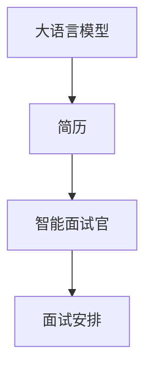
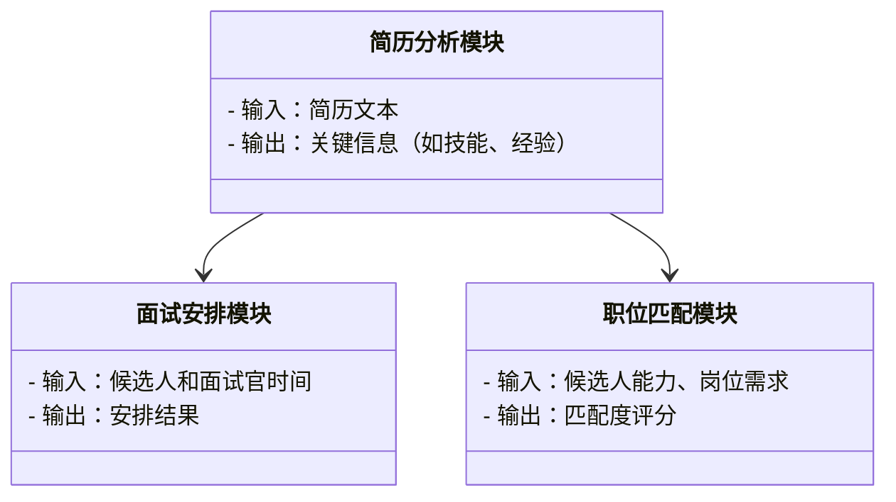
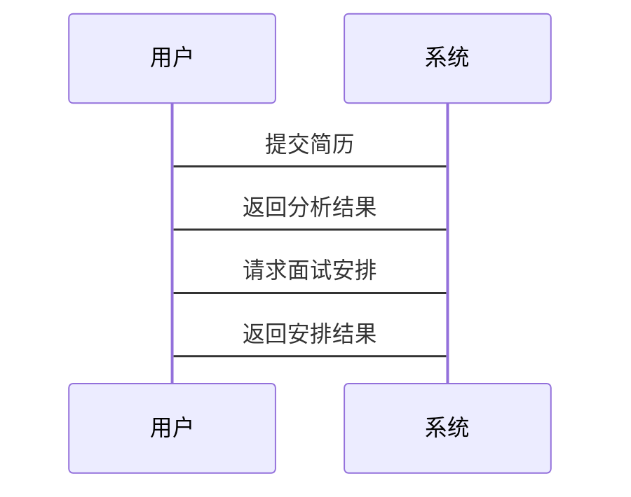

                 


# 智能面试官 AI Agent：LLM 辅助招聘流程

## 关键词
- LLM（Large Language Model）
- 智能面试官
- 招聘流程
- 自然语言处理
- 人工智能

## 摘要
随着人工智能技术的快速发展，招聘流程中的自动化和智能化成为企业提高效率和竞争力的重要手段。本文详细探讨了大语言模型（LLM）在招聘中的应用，特别是智能面试官的实现。通过分析LLM的核心原理、系统架构设计、项目实战以及最佳实践，本文为读者提供了一套全面的解决方案，帮助企业在招聘流程中实现智能化转型。

---

## 第一部分: 背景介绍

### 第1章: 智能面试官与LLM的背景与概念

#### 1.1 问题背景

##### 1.1.1 招聘流程中的痛点
- **招聘效率低**：企业通常需要处理大量简历，但人工筛选耗时且效率低下。
- **面试官资源不足**：高级岗位的面试官需求量大，但企业往往缺乏足够的面试官。
- **面试质量不稳定**：不同面试官的风格和能力差异可能导致面试结果不一致。

##### 1.1.2 LLM在招聘中的应用潜力
- **自动化简历筛选**：通过LLM快速分析简历内容，识别关键信息。
- **智能面试安排**：自动匹配合适的候选人和时间，减少协调成本。
- **职位匹配推荐**：根据候选人能力和岗位需求，推荐最适合的职位。

#### 1.2 核心概念

##### 1.2.1 LLM的定义与特点
- **大语言模型的定义**：LLM是一种基于深度学习的自然语言处理模型，能够理解和生成人类语言。
- **模型的通用性和可扩展性**：LLM可以应用于多种任务，如翻译、问答、文本生成等。
- **模型的训练与推理机制**：通过大量数据训练，模型能够学习语言的结构和语义。

##### 1.2.2 智能面试官的定义与特点
- **智能面试官的定义**：一种基于LLM的AI系统，能够模拟人类面试官进行对话，评估候选人能力。
- **智能面试官的核心功能**：简历分析、行为面试、专业知识考察、模拟压力面试等。
- **智能面试官与传统面试官的区别**：24/7可用、无情绪波动、可量化评估。

#### 1.3 问题描述

##### 1.3.1 招聘流程中的问题
- **简历筛选效率低**：手动筛选耗时且容易出错。
- **面试安排复杂**：协调候选人和面试官的时间困难。
- **面试官能力参差不齐**：不同面试官的评估标准不一致。

##### 1.3.2 LLM在招聘中的应用问题
- **模型准确性问题**：LLM的输出可能包含偏见或不准确的信息。
- **模型的可解释性问题**：复杂的模型难以解释其决策过程。
- **模型的实时性问题**：大规模应用中可能出现延迟。

#### 1.4 问题解决

##### 1.4.1 LLM在招聘中的解决方案
- **自动化简历筛选**：使用LLM快速分析简历内容，提高筛选效率。
- **智能面试安排**：通过LLM协调候选人和面试官的时间，简化流程。
- **职位匹配推荐**：基于LLM的能力评估，推荐适合的岗位。

##### 1.4.2 智能面试官的实现方案
- **自然语言处理技术**：用于理解和生成自然语言对话。
- **机器学习算法**：用于评估候选人的能力和表现。
- **知识图谱构建**：用于存储和检索岗位要求和相关知识。

#### 1.5 边界与外延

##### 1.5.1 智能面试官的应用边界
- **招聘流程中的具体环节**：主要应用于简历筛选、面试安排和评估阶段。
- **模型的能力限制**：LLM无法完全替代人类的判断，特别是在复杂情境下。
- **适用的行业和岗位类型**：适合标准化程度高的岗位，如技术岗位、客服岗位等。

##### 1.5.2 智能面试官的外延
- **拓展到其他领域**：如销售、市场等需要特定技能的岗位。
- **模型的持续优化**：通过反馈不断优化模型的准确性和可解释性。
- **技术的未来发展**：随着LLM技术的进步，智能面试官的功能将更加丰富。

#### 1.6 概念结构与核心要素

##### 1.6.1 核心概念的结构化表示
- **LLM作为技术基础**：提供自然语言处理和生成能力。
- **智能面试官作为应用形态**：将LLM应用于招聘流程中的具体环节。
- **招聘流程作为应用场景**：智能面试官在招聘中的具体应用。

##### 1.6.2 核心要素的组成
- **数据输入**：候选人简历、岗位要求、历史面试数据。
- **模型处理**：LLM对输入数据进行分析、理解和生成。
- **结果输出**：生成评估报告、面试安排建议或职位匹配推荐。

---

## 第二部分: 核心概念与联系

### 第2章: LLM与智能面试官的核心概念联系

#### 2.1 核心概念原理

##### 2.1.1 LLM的工作原理
- **模型的训练过程**：通过大量数据（如书籍、网页）进行监督学习，学习语言的结构和语义。
- **模型的推理过程**：基于训练好的参数，生成符合上下文的文本。
- **模型的优化过程**：通过微调和增量学习，提高模型在特定任务上的表现。

##### 2.1.2 智能面试官的工作原理
- **简历分析**：LLM分析简历内容，提取关键信息（如教育背景、工作经验）。
- **面试安排**：根据候选人和面试官的时间表，自动安排面试。
- **职位匹配**：基于候选人能力和岗位需求，推荐最适合的职位。

#### 2.2 概念属性特征对比

| 概念       | 输入       | 输出       | 核心技术                 |
|------------|------------|------------|--------------------------|
| LLM        | 文本数据   | 文本生成   | 大语言模型               |
| 智能面试官 | 简历、时间表 | 面试安排、评估报告 | 自然语言处理、机器学习   |

#### 2.3 ER实体关系图


---

## 第三部分: 算法原理与数学模型

### 第3章: 算法原理与数学模型

#### 3.1 算法原理

##### 3.1.1 LLM的训练过程
- **监督学习**：模型通过大量标注数据进行训练，学习语言的规律。
- **微调**：在特定任务上进行微调，提高模型的性能。
- **增量学习**：在已有模型的基础上，逐步添加新的数据进行训练。

##### 3.1.2 智能面试官的实现步骤
1. **简历分析**：将简历内容输入LLM，提取关键信息。
2. **对话生成**：根据岗位要求，生成面试问题。
3. **评估与反馈**：根据候选人的回答，评估其能力和匹配度。

#### 3.2 数学模型

##### 3.2.1 变量定义
- **输入向量**：$x \in \mathbb{R}^{d}$，其中$d$是词向量的维度。
- **输出向量**：$y \in \mathbb{R}^{m}$，其中$m$是模型的输出维度。

##### 3.2.2 模型结构
$$
f(x) = Wx + b
$$
其中，$W$是权重矩阵，$b$是偏置向量。

##### 3.2.3 损失函数
$$
L(y, \hat{y}) = \frac{1}{n}\sum_{i=1}^{n}(y_i - \hat{y}_i)^2
$$

##### 3.2.4 优化算法
使用随机梯度下降（SGD）优化模型参数：
$$
W \leftarrow W - \eta \frac{\partial L}{\partial W}
$$
$$
b \leftarrow b - \eta \frac{\partial L}{\partial b}
$$
其中，$\eta$是学习率。

#### 3.3 代码实现

##### 3.3.1 环境安装
```bash
pip install transformers
```

##### 3.3.2 核心代码
```python
from transformers import AutoTokenizer, AutoModelForCausalLM

model_name = "gpt2"
tokenizer = AutoTokenizer.from_pretrained(model_name)
model = AutoModelForCausalLM.from_pretrained(model_name)

def generate_response(prompt):
    inputs = tokenizer.encode(prompt, return_tensors="pt")
    outputs = model.generate(inputs, max_length=50, do_sample=True)
    response = tokenizer.decode(outputs[0], skip_special_tokens=True)
    return response

# 示例：生成面试问题
prompt = "请生成五个关于技术能力的问题。"
print(generate_response(prompt))
```

---

## 第四部分: 系统分析与架构设计

### 第4章: 系统分析与架构设计

#### 4.1 问题场景介绍
- **场景描述**：企业招聘部门需要高效、智能地筛选和评估候选人。
- **目标**：通过LLM实现自动化简历筛选、智能面试安排和职位匹配推荐。

#### 4.2 系统功能设计

##### 4.2.1 领域模型


#### 4.3 系统架构设计

##### 4.3.1 架构图
```mermaid
graph TD
    UI[用户界面] --> API Gateway[API网关]
    API Gateway --> Service1[简历分析服务]
    API Gateway --> Service2[面试安排服务]
    API Gateway --> Service3[职位匹配服务]
```

##### 4.3.2 接口设计
- **输入接口**：
  - 简历上传接口：`POST /api/upload/cv`
  - 面试安排请求接口：`POST /api/schedule/interview`
- **输出接口**：
  - 简历分析结果：`GET /api/cv/analysis`
  - 面试安排确认：`GET /api/schedule/status`

#### 4.4 系统交互流程

##### 4.4.1 序列图


---

## 第五部分: 项目实战

### 第5章: 项目实战

#### 5.1 环境安装
```bash
pip install transformers
pip install schedule
```

#### 5.2 核心代码实现

##### 5.2.1 简历分析模块
```python
import os
from transformers import AutoTokenizer, AutoModelForCausalLM

model_name = "gpt2"
tokenizer = AutoTokenizer.from_pretrained(model_name)
model = AutoModelForCausalLM.from_pretrained(model_name)

def analyze_cv(cv_text):
    inputs = tokenizer.encode(cv_text, return_tensors="pt")
    outputs = model.generate(inputs, max_length=200, do_sample=True)
    analysis = tokenizer.decode(outputs[0], skip_special_tokens=True)
    return analysis

# 示例：分析简历
cv_text = "..."
print(analyze_cv(cv_text))
```

##### 5.2.2 面试安排模块
```python
import schedule
import time

def schedule_interview(candidate, interviewer):
    # 示例：简单的时间安排逻辑
    time_now = time.time()
    schedule_time = time_now + 3600
    print(f"Interview scheduled at {schedule_time} for {candidate} and {interviewer}")

# 示例：安排面试
schedule.every(1).day.at("10:00").do(schedule_interview, "候选人A", "面试官1")
```

#### 5.3 实际案例分析
- **案例描述**：某科技公司使用智能面试官进行技术岗位招聘。
- **实施步骤**：
  1. 简历筛选：自动分析简历，提取技术关键词。
  2. 面试安排：根据候选人和面试官的时间表，自动安排面试。
  3. 职位匹配：基于候选人能力和岗位需求，推荐最适合的职位。

#### 5.4 项目小结
- **项目总结**：通过LLM实现招聘流程的智能化，显著提高了效率和准确性。
- **经验分享**：在实际应用中，需要不断优化模型，并结合人工审核确保结果的准确性。

---

## 第六部分: 总结与扩展

### 第6章: 总结与扩展

#### 6.1 最佳实践 tips
- **数据质量**：确保训练数据的多样性和代表性。
- **模型优化**：定期更新模型，提升准确性和可解释性。
- **人机结合**：结合人工审核，确保评估的准确性。

#### 6.2 小结
通过本文的介绍，读者可以全面了解LLM在招聘中的应用，特别是智能面试官的实现。从背景介绍到系统设计，再到项目实战，每一步都详细展开，为读者提供了理论和实践的双重指导。

#### 6.3 注意事项
- **数据隐私**：在处理简历等敏感数据时，必须遵守相关隐私保护法规。
- **模型伦理**：确保模型的输出符合伦理规范，避免偏见和歧视。

#### 6.4 拓展阅读
- **推荐书籍**：《Effective Python》
- **推荐博客**：深入理解大语言模型的工作原理（链接）

---

## 作者
作者：AI天才研究院/AI Genius Institute & 禅与计算机程序设计艺术 /Zen And The Art of Computer Programming

---

以上是《智能面试官 AI Agent：LLM 辅助招聘流程》的技术博客文章的大纲和内容。希望这篇博客能够为读者提供有价值的信息和实践指导，帮助他们在招聘流程中更好地应用人工智能技术。

