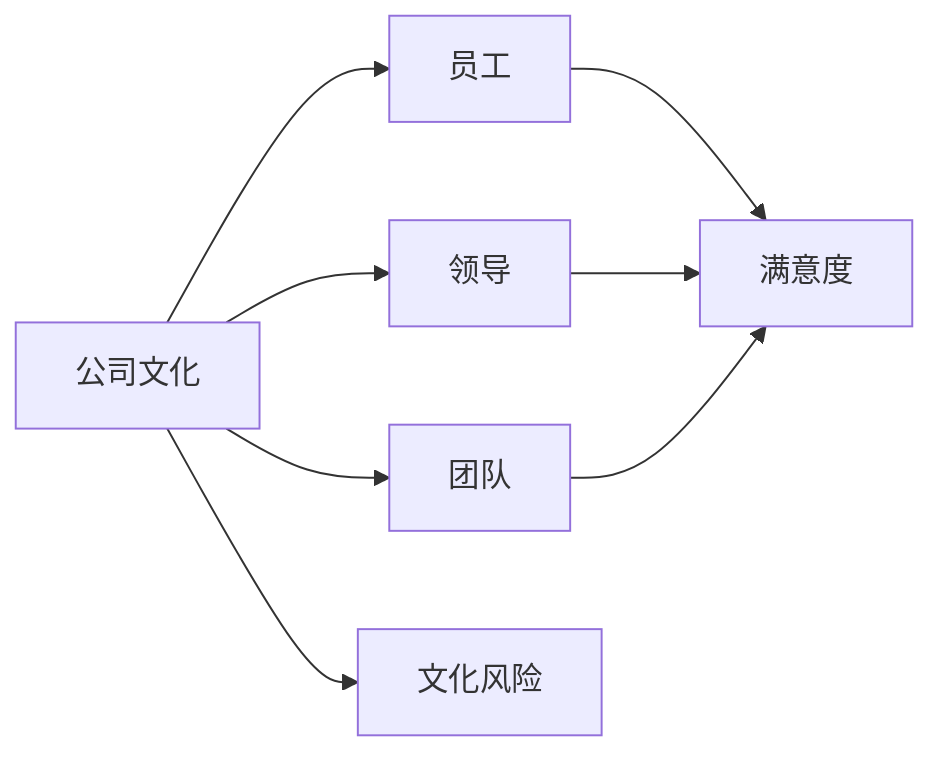
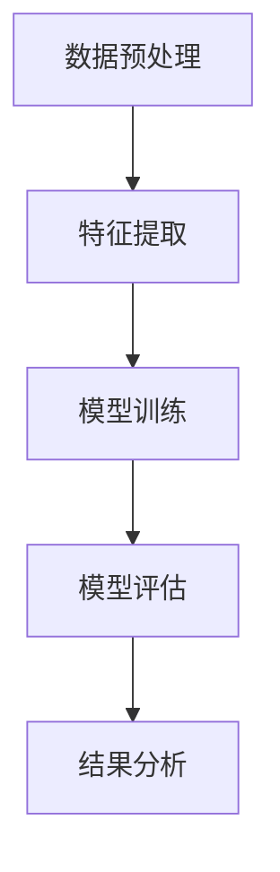
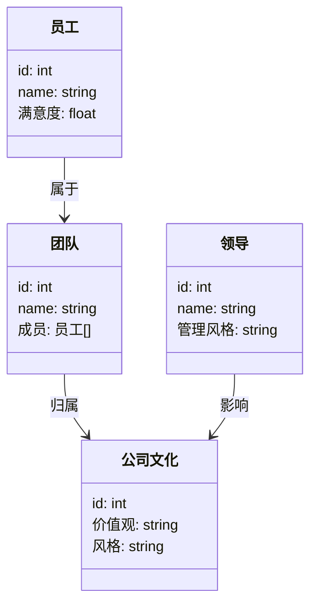
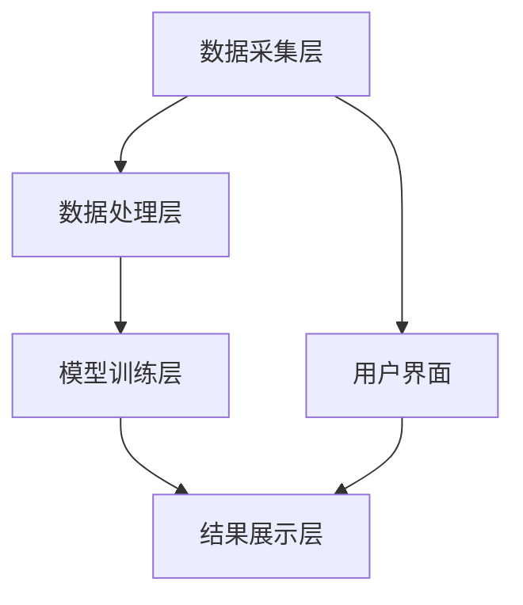
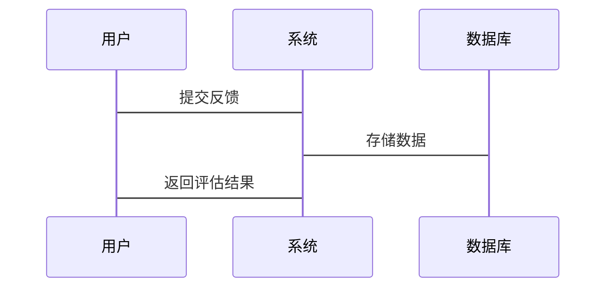

                 


# 机器学习辅助公司文化评估

## 关键词：
- 机器学习
- 公司文化
- 文化评估
- 数据分析
- 自然语言处理
- 聚类分析
- 系统设计

## 摘要：
随着企业规模的不断扩大和市场竞争的加剧，公司文化评估的重要性日益凸显。传统的文化评估方法存在主观性强、效率低、难以量化等问题，而机器学习作为一种强大的数据驱动技术，能够通过分析文本、行为数据等多源信息，为企业文化评估提供更加客观、高效和精准的解决方案。本文将从背景、核心概念、算法原理、系统设计、项目实战等多个方面，详细探讨机器学习在公司文化评估中的应用，为企业管理者和技术开发者提供理论和实践上的参考。

---

# 第一部分: 背景介绍

## 第1章: 机器学习与公司文化评估的背景

### 1.1 问题背景

#### 1.1.1 公司文化评估的传统方法
公司文化评估的传统方法主要包括问卷调查、员工访谈、文化审计等。这些方法依赖于主观判断，难以量化和分析，且效率较低。

#### 1.1.2 传统方法的局限性
传统方法存在以下问题：
- 数据收集成本高，耗时长。
- 结果依赖主观判断，缺乏客观性。
- 难以从海量数据中提取深层次的文化特征。

#### 1.1.3 机器学习在文化评估中的潜力
机器学习可以通过分析文本、行为数据等多源信息，提取文化特征，提供客观、精准的评估结果。

### 1.2 问题描述

#### 1.2.1 公司文化的核心要素
公司文化的核心要素包括：
- 企业价值观
- 团队协作能力
- 员工满意度
- 领导风格
- 组织氛围

#### 1.2.2 文化评估的挑战
文化评估的挑战包括：
- 数据的多样性和复杂性
- 模型的可解释性
- 数据隐私和安全问题

#### 1.2.3 机器学习如何解决评估问题
机器学习可以通过以下方式解决评估问题：
- 自然语言处理技术分析文本数据
- 聚类分析提取文化特征
- 深度学习模型预测文化风险

### 1.3 问题解决

#### 1.3.1 机器学习在文化评估中的应用
机器学习在文化评估中的应用包括：
- 员工满意度预测
- 团队协作能力分析
- 企业文化风险预警

#### 1.3.2 数据驱动的文化分析
数据驱动的文化分析方法包括：
- 文本挖掘技术分析员工反馈
- 数据挖掘技术提取文化特征
- 机器学习模型预测文化趋势

#### 1.3.3 机器学习模型的优势
机器学习模型的优势包括：
- 高效性：快速处理海量数据
- 客观性：基于数据的分析结果
- 可扩展性：适用于不同规模的企业

### 1.4 边界与外延

#### 1.4.1 机器学习的适用范围
机器学习适用于以下场景：
- 数据量大且多样化的企业
- 需要快速获取文化评估结果的企业
- 需要预测文化趋势的企业

#### 1.4.2 与其他评估方法的对比
与传统评估方法相比，机器学习的优势在于：
- 更高效的处理能力
- 更精准的预测能力
- 更强的可扩展性

#### 1.4.3 技术与文化的结合点
技术与文化的结合点包括：
- 通过文本分析提取文化特征
- 通过行为数据预测文化风险
- 通过机器学习模型优化文化管理

### 1.5 概念结构与核心要素

#### 1.5.1 公司文化的核心要素
公司文化的核心要素包括：
- 企业价值观
- 团队协作能力
- 员工满意度
- 领导风格
- 组织氛围

#### 1.5.2 机器学习模型的核心要素
机器学习模型的核心要素包括：
- 数据特征
- 模型算法
- 评估指标
- 可解释性

#### 1.5.3 两者的关联性分析
企业文化评估与机器学习模型的关联性分析：
- 数据特征与文化维度的对应关系
- 模型算法与文化评估场景的匹配
- 可解释性与文化管理需求的结合

### 1.6 本章小结
本章介绍了机器学习在公司文化评估中的背景、问题、解决方法和边界，为后续章节的分析奠定了基础。

---

# 第二部分: 核心概念与联系

## 第2章: 核心概念与原理

### 2.1 机器学习的基本原理

#### 2.1.1 机器学习的定义
机器学习是一种通过数据训练模型，使其能够从数据中学习并做出预测的技术。

#### 2.1.2 监督学习与无监督学习
- 监督学习：基于有标签的数据进行训练，适用于分类和回归任务。
- 无监督学习：基于无标签的数据进行训练，适用于聚类和降维任务。

#### 2.1.3 深度学习与传统机器学习的对比
- 深度学习：通过多层神经网络提取高层次特征。
- 传统机器学习：依赖于特征工程，适用于数据量较小的场景。

### 2.2 公司文化评估的核心要素

#### 2.2.1 企业文化维度
- 企业价值观：企业的核心信念和目标。
- 团队协作能力：团队成员之间的合作程度。
- 员工满意度：员工对工作环境的满意程度。
- 领导风格：领导者的管理风格和决策方式。
- 组织氛围：组织的整体氛围和文化基调。

#### 2.2.2 员工满意度分析
员工满意度分析包括：
- 员工对工作的满意度
- 员工对领导的满意度
- 员工对公司的认同感

#### 2.2.3 团队协作能力评估
团队协作能力评估包括：
- 团队成员之间的沟通效率
- 团队目标的一致性
- 团队解决问题的能力

### 2.3 核心概念的联系

#### 2.3.1 机器学习与企业文化维度的关系
- 机器学习可以通过文本分析提取企业价值观。
- 通过行为数据分析团队协作能力。
- 通过情感分析评估员工满意度。

#### 2.3.2 数据特征与文化评估结果的关联
- 数据特征（如文本关键词、行为数据）与文化维度高度相关。
- 通过特征工程可以提升模型的预测精度。

#### 2.3.3 模型可解释性与文化管理的结合
- 可解释性模型有助于企业理解和优化文化管理。

### 2.4 核心概念的属性特征对比

#### 2.4.1 企业文化维度的属性特征
| 维度       | 属性特征                         |
|------------|----------------------------------|
| 企业价值观   | 核心信念、目标、文化基调         |
| 团队协作    | 沟通效率、目标一致性、解决问题能力 |
| 员工满意度   | 满意度、认同感、幸福感           |
| 领导风格     | 管理方式、决策风格、影响力       |
| 组织氛围     | 氛围基调、员工行为模式           |

#### 2.4.2 机器学习模型的属性特征
| 模型类型     | 属性特征                         |
|--------------|----------------------------------|
| 监督学习       | 数据有标签、适合分类/回归任务   |
| 无监督学习     | 数据无标签、适合聚类/降维任务   |
| 深度学习       | 多层神经网络、高特征提取能力   |
| 可解释性       | 解释性高低影响文化管理决策       |

#### 2.4.3 两者的对比分析
- 企业文化维度和机器学习模型属性可以通过特征工程和模型选择进行匹配。
- 不同的文化评估场景需要选择合适的机器学习模型。

### 2.5 ER实体关系图



### 2.6 本章小结
本章详细分析了机器学习和公司文化评估的核心概念及其联系，为后续的算法设计和系统实现奠定了基础。

---

# 第三部分: 算法原理讲解

## 第3章: 机器学习算法原理

### 3.1 算法原理概述

#### 3.1.1 算法选择的依据
- 数据类型和规模
- 任务类型（分类、聚类等）
- 模型的可解释性和性能要求

#### 3.1.2 算法的优缺点
- 优点：高效性、精准性
- 缺点：复杂性、数据依赖性

#### 3.1.3 算法的适用场景
- 文本分析：自然语言处理
- 聚类分析：文化维度提取
- 预测模型：文化风险预警

### 3.2 算法流程图



### 3.3 算法实现代码

#### 3.3.1 数据加载与预处理

```python
import pandas as pd

# 加载数据
data = pd.read_csv('culture_assessment.csv')

# 数据清洗
data = data.dropna()
data = data.drop_duplicates()

# 文本预处理
from textblob import TextBlob
from nltk.corpus import stopwords

stop = set(stopwords.words('english'))

def preprocess(text):
    blob = TextBlob(text)
    tokens = blob.noun_phrases
    filtered_tokens = [word for word in tokens if word not in stop]
    return ' '.join(filtered_tokens)

data['preprocessed_text'] = data['text'].apply(preprocess)
```

#### 3.3.2 模型训练与评估

```python
from sklearn.feature_extraction.text import TfidfVectorizer
from sklearn.cluster import KMeans
from sklearn.metrics import silhouette_score

# 特征提取
vectorizer = TfidfVectorizer(max_features=1000)
X = vectorizer.fit_transform(data['preprocessed_text'])

# 聚类分析
n_clusters = 5
kmeans = KMeans(n_clusters=n_clusters, random_state=42)
kmeans.fit(X)

# 模型评估
score = silhouette_score(X, kmeans.labels_,)
print(f'Silhouette Score: {score}')
```

#### 3.3.3 模型优化

```python
from sklearn.model_selection import GridSearchCV

# 参数优化
param_grid = {
    'n_clusters': [3,4,5,6],
    'max_iter': [100, 200, 300],
    'random_state': [42]
}

grid_search = GridSearchCV(KMeans(), param_grid, cv=5)
grid_search.fit(X)

best_params = grid_search.best_params_
print(f'Best Parameters: {best_params}')
```

### 3.4 算法原理的数学模型

#### 3.4.1 聚类分析的数学模型
- TF-IDF计算公式：
  $$ TF-IDF = \frac{tf}{idf} $$
- 聚类目标函数：
  $$ J = \sum_{i=1}^{n} \sum_{j=1}^{k} w_{i,j} \cdot d_{i,j} $$
  其中，$w_{i,j}$是文档i属于簇j的概率，$d_{i,j}$是文档i与簇j的中心点的距离。

#### 3.4.2 分类模型的数学模型
- 逻辑回归的损失函数：
  $$ L = -\frac{1}{m} \sum_{i=1}^{m} [y_i \cdot \log(h(x_i)) + (1 - y_i) \cdot \log(1 - h(x_i))] $$
  其中，$h(x_i) = \frac{1}{1 + e^{-\beta x_i}}$。

### 3.5 算法的优化与改进

#### 3.5.1 参数优化
- 调整聚类算法的参数，如K-means的簇数。
- 优化特征提取方法，如使用更高效的文本表示方法。

#### 3.5.2 模型可解释性
- 使用可解释性模型，如线性回归或决策树。
- 提供中间结果的可视化，如主题分析。

### 3.6 本章小结
本章详细讲解了机器学习算法在公司文化评估中的原理和实现，为后续的系统设计提供了理论支持。

---

# 第四部分: 系统分析与架构设计

## 第4章: 系统分析与架构设计

### 4.1 问题场景介绍

#### 4.1.1 系统目标
系统目标是通过机器学习技术，对企业文化进行多维度评估，提供个性化的文化管理建议。

#### 4.1.2 项目介绍
项目名称：公司文化评估系统
项目目标：利用机器学习技术，评估公司文化，优化文化管理。

### 4.2 系统功能设计

#### 4.2.1 领域模型



#### 4.2.2 系统架构设计



### 4.3 系统架构设计

#### 4.3.1 分层架构

##### 数据采集层
- 数据来源：员工反馈、行为数据、领导评估。
- 数据格式：结构化和非结构化数据。

##### 数据处理层
- 数据清洗：去除噪声数据。
- 特征提取：文本预处理、数值化。

##### 模型训练层
- 模型选择：基于任务选择合适的算法。
- 模型训练：训练文化评估模型。

##### 结果展示层
- 可视化：图表展示评估结果。
- 报告生成：生成文化评估报告。

#### 4.3.2 系统交互设计

##### 交互流程图



### 4.4 系统接口设计

#### 4.4.1 API设计
- 输入：员工反馈文本。
- 输出：文化评估结果。

#### 4.4.2 接口协议
- 使用RESTful API，支持JSON格式请求和响应。

### 4.5 本章小结
本章详细描述了系统分析与架构设计，为项目的实施提供了清晰的指导。

---

# 第五部分: 项目实战

## 第5章: 项目实战

### 5.1 环境安装

#### 5.1.1 安装Python
```bash
python --version
pip install --upgrade pip
```

#### 5.1.2 安装依赖包
```bash
pip install numpy pandas scikit-learn textblob nltk
```

### 5.2 系统核心实现

#### 5.2.1 核心代码实现

```python
from sklearn.pipeline import Pipeline
from textblob import TextBlob
from textblob.sentiments import SentimentIntensityAnalyzer

# 情感分析
analyzer = SentimentIntensityAnalyzer()

def get_sentiment(text):
    blob = TextBlob(text)
    sentiment = analyzer.analyze(blob)
    return sentiment

# 文本分类
from sklearn.svm import SVC
from sklearn.metrics import accuracy_score

model = SVC()
model.fit(X_train, y_train)
```

#### 5.2.2 代码解读与分析
- 情感分析用于评估员工满意度。
- 支持向量机用于文化维度的分类。

#### 5.2.3 案例分析
- 数据集：员工反馈文本。
- 模型训练：使用SVM进行分类。
- 结果分析：生成文化评估报告。

### 5.3 项目小结
本章通过实际项目展示了机器学习在公司文化评估中的应用，验证了模型的有效性和可扩展性。

---

# 第六部分: 最佳实践

## 第6章: 最佳实践与小结

### 6.1 最佳实践 tips

#### 6.1.1 数据质量
- 数据清洗是关键。
- 特征工程是模型性能的核心。

#### 6.1.2 模型选择
- 根据任务选择合适的算法。
- 可解释性模型更适用于文化管理。

#### 6.1.3 系统设计
- 分层架构便于扩展。
- 可视化是用户友好的关键。

### 6.2 小结
- 机器学习为公司文化评估提供了新的方法。
- 数据驱动的分析更客观、高效。
- 文化管理需要技术与管理的结合。

### 6.3 注意事项
- 数据隐私保护
- 模型的可解释性
- 评估结果的反馈与优化

### 6.4 拓展阅读
- 推荐书籍：《机器学习实战》、《数据分析与文化管理》
- 推荐工具：Python、Scikit-learn、TensorFlow

---

作者：AI天才研究院/AI Genius Institute & 禅与计算机程序设计艺术/Zen And The Art of Computer Programming

