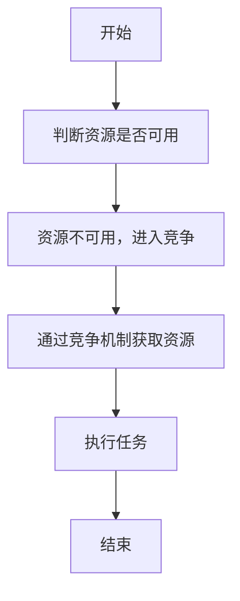
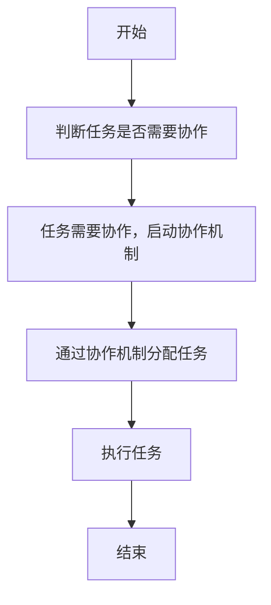
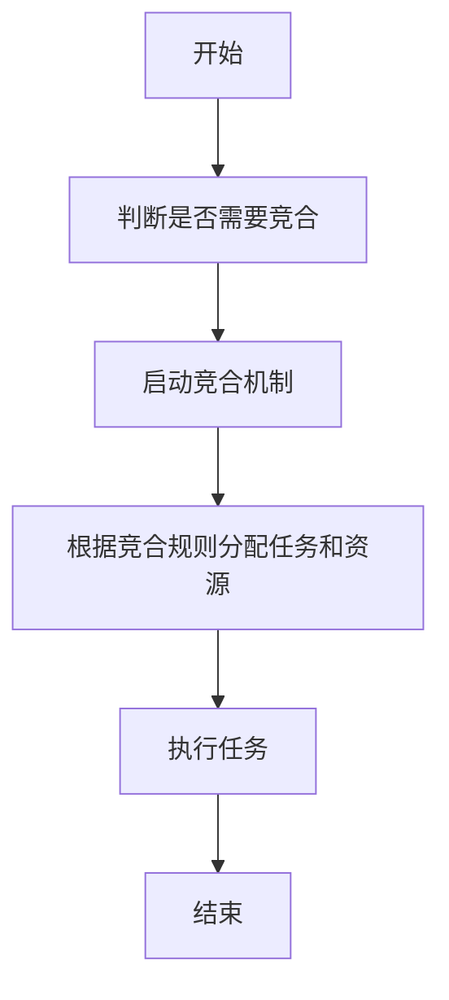
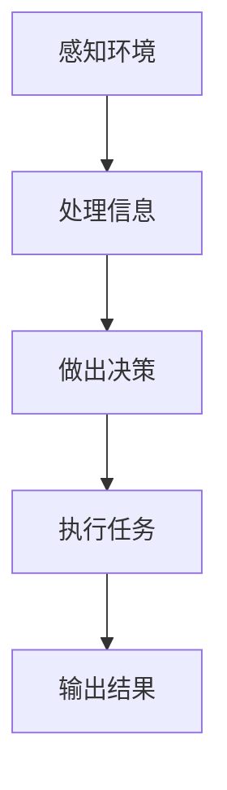
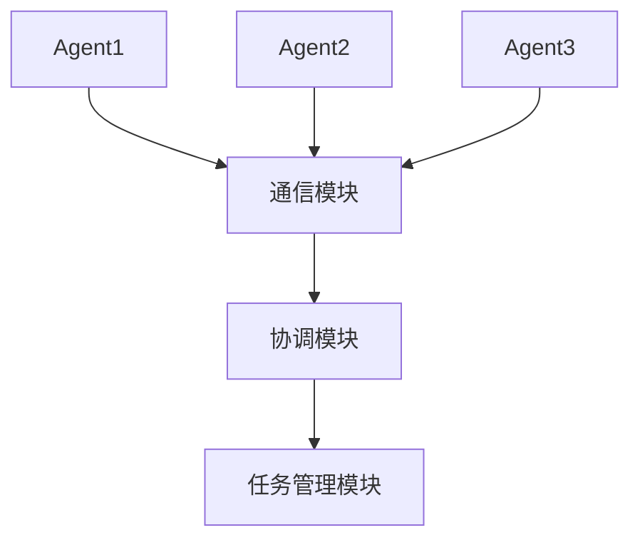
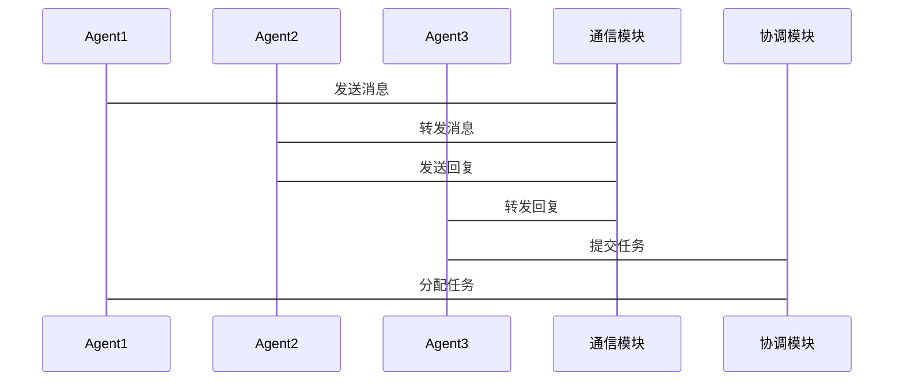

                 


# 构建AI Agent的多Agent竞争与合作框架

> 关键词：AI Agent, 多Agent系统, 竞争与合作, 算法原理, 系统架构

> 摘要：本文将详细探讨构建AI Agent的多Agent竞争与合作框架，从基本概念到算法实现，再到系统架构和项目实战，全面解析多Agent系统的构建过程。本文将帮助读者理解多Agent系统的核心原理，并掌握如何在实际应用中构建高效的多Agent竞争与合作框架。

---

# 第1章: AI Agent与多Agent系统概述

## 1.1 AI Agent的基本概念

### 1.1.1 AI Agent的定义与特点
AI Agent（智能体）是指在计算机系统中，能够感知环境、自主决策并执行任务的实体。Agent的核心特点包括自主性、反应性、目标导向和社会性。自主性意味着Agent能够独立运作，不需要外部干预；反应性意味着Agent能够根据环境的变化调整自己的行为；目标导向意味着Agent的行为是为了实现特定的目标；社会性则指Agent能够与其他Agent或人类进行交互和协作。

### 1.1.2 多Agent系统的基本概念
多Agent系统（Multi-Agent System, MAS）是由多个智能体组成的系统，这些智能体通过通信和协作完成复杂的任务。多Agent系统的特点包括分布式性、异构性、动态性和自适应性。分布式性指系统中的多个Agent分布在网络的不同节点上；异构性指系统中的Agent具有不同的功能和能力；动态性指系统中的环境和任务可能随时变化；自适应性指系统能够根据变化调整自身的行为。

### 1.1.3 多Agent系统的发展历程
多Agent系统的研究起源于20世纪80年代，随着人工智能技术的发展，多Agent系统逐渐从理论研究走向实际应用。近年来，随着云计算、大数据和物联网技术的发展，多Agent系统在分布式计算、机器人协作、自动驾驶等领域得到了广泛应用。

## 1.2 多Agent系统的核心要素

### 1.2.1 Agent的类型与分类
Agent可以根据不同的标准进行分类。按照智能体的智能水平，可以分为简单反应式Agent和复杂认知式Agent；按照智能体的功能，可以分为感知型Agent、行动型Agent和感知-行动型Agent；按照智能体的协作方式，可以分为竞争型Agent和合作型Agent。

### 1.2.2 Agent的结构与功能
Agent的结构通常包括感知模块、推理模块和行动模块。感知模块负责获取环境中的信息，推理模块负责处理信息并做出决策，行动模块负责执行决策并输出结果。不同类型的Agent具有不同的结构和功能。

### 1.2.3 多Agent系统中的交互与协作
多Agent系统中的交互与协作是通过通信和协调实现的。通信是指Agent之间通过消息传递进行信息交换，协调是指Agent之间通过合作完成共同的任务。协作可以通过分布式计算和任务分配来实现。

## 1.3 多Agent系统中的竞争与合作

### 1.3.1 竞争与合作的基本概念
竞争是指多个Agent为了争夺有限资源而进行的对抗性行为，合作是指多个Agent为了共同目标而进行的协作性行为。竞争与合作是多Agent系统中两个重要的行为模式。

### 1.3.2 竞争与合作的实现方式
竞争可以通过博弈论模型来实现，合作可以通过分布式计算和任务分配来实现。竞争与合作的结合可以通过竞合模型来实现。

### 1.3.3 竞争与合作的平衡点
在多Agent系统中，竞争与合作需要找到一个平衡点，以确保系统的稳定性和高效性。这可以通过调整竞争和合作的权重来实现。

## 1.4 本章小结
本章介绍了AI Agent的基本概念、多Agent系统的核心要素以及竞争与合作的基本概念。通过这些内容，读者可以理解多Agent系统的构建基础。

---

# 第2章: 多Agent系统的核心概念与联系

## 2.1 多Agent系统的核心原理

### 2.1.1 Agent的自主性与反应性
Agent的自主性是指其能够独立运作，反应性是指其能够根据环境的变化调整自己的行为。这些特性使得Agent能够在复杂环境中完成任务。

### 2.1.2 多Agent系统中的通信与协调
多Agent系统中的通信是指Agent之间通过消息传递进行信息交换，协调是指Agent之间通过合作完成共同的任务。通信和协调是多Agent系统的核心机制。

### 2.1.3 多Agent系统的分布式计算
多Agent系统的分布式计算是指多个Agent分布在不同的节点上，通过通信和协作完成任务。分布式计算能够提高系统的并行性和效率。

## 2.2 多Agent系统的核心概念对比

### 2.2.1 Agent类型对比表
| 类型                | 描述                                                                 |
|---------------------|----------------------------------------------------------------------|
| 简单反应式Agent     | 基于当前感知做出反应，没有内部状态。                                         |
| 复杂认知式Agent     | 具有内部状态、目标和推理能力。                                             |
| 感知型Agent         | 专注于感知环境信息。                                                       |
| 行动型Agent         | 专注于执行动作。                                                         |
| 感知-行动型Agent    | 同时具备感知和行动能力。                                                   |

### 2.2.2 通信协议对比表
| 通信协议             | 描述                                                                 |
|----------------------|----------------------------------------------------------------------|
| HTTP协议             | 基于请求-响应的通信协议，常用于Web应用。                                   |
| RPC协议             | 远程过程调用协议，允许程序像调用本地函数一样调用远程服务。                 |
| WebSocket协议        | 双向通信协议，适合实时通信场景。                                         |

### 2.2.3 竞争与合作机制对比表
| 机制                 | 描述                                                                 |
|----------------------|----------------------------------------------------------------------|
| 竞争机制             | 多个Agent争夺有限资源。                                                   |
| 合作机制             | 多个Agent共同完成任务。                                                   |
| 竞合机制             | 竞争与合作相结合的机制。                                                   |

## 2.3 多Agent系统的ER实体关系图

```mermaid
erDiagram
    agent {
        id
        name
        type
        status
    }
    environment {
        id
        state
        resource
    }
    communication {
        id
        message
        sender
        receiver
    }
    agent --> environment: interacts with
    agent --> communication: sends
    communication --> agent: receives
```

## 2.4 本章小结
本章详细介绍了多Agent系统的核心概念，包括Agent的自主性与反应性、通信与协调、分布式计算等，并通过对比表和实体关系图帮助读者理解多Agent系统的结构和联系。

---

# 第3章: 多Agent系统中的算法原理

## 3.1 多Agent系统中的基本算法

### 3.1.1 一致性算法
一致性算法用于确保多个Agent之间的数据一致性。常见的算法包括：

#### 3.1.1.1 两阶段提交协议
1. **阶段1**：协调者发送提交请求，参与者确认。
2. **阶段2**：协调者根据参与者确认结果提交或取消。

#### 3.1.1.2 三阶段提交协议
1. **阶段1**：协调者发送提交请求，参与者确认。
2. **阶段2**：协调者发送提交确认，参与者提交。
3. **阶段3**：协调者发送提交完成通知。

### 3.1.2 分布式规划算法
分布式规划算法用于多个Agent之间的任务分配和规划。常见的算法包括：

#### 3.1.2.1 分布式约束优化（DCOP）
DCOP通过分布式优化算法解决多个Agent之间的约束问题。

#### 3.1.2.2 分布式搜索算法
分布式搜索算法通过搜索全局最优解来实现任务分配。

### 3.1.3 协作与竞争算法
协作与竞争算法用于多个Agent之间的协作和竞争。常见的算法包括：

#### 3.1.3.1 竞争分配算法
通过竞争机制分配任务和资源。

#### 3.1.3.2 协作分配算法
通过协作机制分配任务和资源。

## 3.2 竞争与合作机制的算法实现

### 3.2.1 竞争算法的实现流程



### 3.2.2 合作算法的实现流程



### 3.2.3 竞合算法的实现流程



## 3.3 算法的数学模型与公式

### 3.3.1 一致性算法的数学模型
一致性算法的目标是确保所有Agent的数据一致。数学模型可以表示为：

$$ \text{一致性} = \sum_{i=1}^{n} \text{Agent}_i \text{的状态} $$

### 3.3.2 分布式规划算法的数学模型
分布式规划算法的目标是优化多个Agent的任务分配。数学模型可以表示为：

$$ \text{优化目标} = \sum_{i=1}^{n} \text{Agent}_i \text{的任务权重} $$

### 3.3.3 竞争与合作算法的数学模型
竞争与合作算法的目标是平衡竞争和合作。数学模型可以表示为：

$$ \text{平衡点} = \alpha \cdot \text{竞争强度} + \beta \cdot \text{合作强度} $$

其中，$\alpha$ 和 $\beta$ 是竞争和合作的权重系数。

## 3.4 本章小结
本章介绍了多Agent系统中的基本算法，包括一致性算法、分布式规划算法和竞争与合作算法，并通过流程图和数学公式帮助读者理解这些算法的实现原理。

---

# 第4章: 多Agent系统的系统架构设计

## 4.1 系统功能设计

### 4.1.1 系统功能模块划分
多Agent系统的功能模块通常包括：

1. **感知模块**：负责获取环境信息。
2. **推理模块**：负责处理信息并做出决策。
3. **行动模块**：负责执行决策并输出结果。
4. **通信模块**：负责与其他Agent进行信息交换。
5. **协调模块**：负责协调多个Agent的任务分配和协作。

### 4.1.2 系统功能流程
系统功能流程如下：



## 4.2 系统架构设计

### 4.2.1 系统架构图
多Agent系统的架构通常包括以下几个部分：



### 4.2.2 系统交互设计
系统交互设计如下：



## 4.3 本章小结
本章详细介绍了多Agent系统的系统架构设计，包括功能模块划分、系统架构图和系统交互设计，帮助读者理解多Agent系统的构建过程。

---

# 第5章: 多Agent系统的项目实战

## 5.1 项目背景与目标

### 5.1.1 项目背景
本项目旨在构建一个多Agent系统的竞争与合作框架，用于模拟多个智能体在复杂环境中的协作和竞争行为。

### 5.1.2 项目目标
1. 实现多个Agent在环境中的感知、决策和行动。
2. 实现Agent之间的通信和协作。
3. 实现竞争与合作机制的结合。

## 5.2 核心代码实现

### 5.2.1 环境搭建
```python
# 安装必要的库
pip install numpy
pip install matplotlib
pip install scikit-learn
```

### 5.2.2 Agent类实现
```python
class Agent:
    def __init__(self, id, type):
        self.id = id
        self.type = type
        self.status = "idle"
    
    def perceive(self, environment):
        # 根据环境信息做出决策
        pass
    
    def act(self, action):
        # 执行动作
        pass
    
    def communicate(self, message):
        # 与其他Agent通信
        pass
```

### 5.2.3 竞争与合作机制实现
```python
class Competition-Cooperation:
    def __init__(self, agents):
        self.agents = agents
        self.resources = []
    
    def compete(self):
        # 实现竞争机制
        pass
    
    def cooperate(self):
        # 实现合作机制
        pass
    
    def balance(self):
        # 实现竞争与合作的平衡
        pass
```

### 5.2.4 环境类实现
```python
class Environment:
    def __init__(self, state):
        self.state = state
        self.resources = []
    
    def update(self, action):
        # 更新环境状态
        pass
```

## 5.3 系统实现与测试

### 5.3.1 系统实现
```python
# 初始化多个Agent
agents = [Agent(1, "competitive"), Agent(2, "cooperative")]
# 初始化环境
environment = Environment("idle")
# 初始化竞争与合作机制
cc = Competition-Cooperation(agents)
# 开始运行系统
cc.run()
```

### 5.3.2 系统测试
```python
# 测试竞争机制
cc.compete()
# 测试合作机制
cc.cooperate()
# 测试平衡机制
cc.balance()
```

## 5.4 本章小结
本章通过一个具体的项目案例，展示了如何构建一个多Agent系统的竞争与合作框架，并通过代码实现和系统测试，验证了框架的可行性和有效性。

---

# 第6章: 总结与展望

## 6.1 本章总结
本文详细探讨了构建AI Agent的多Agent竞争与合作框架，从基本概念到算法实现，再到系统架构和项目实战，全面解析了多Agent系统的构建过程。

## 6.2 未来展望
未来，多Agent系统将在更多领域得到应用，比如分布式计算、机器人协作、自动驾驶等。随着人工智能技术的发展，多Agent系统将更加智能化和高效化。

## 6.3 最佳实践 tips
1. 在构建多Agent系统时，需要充分考虑Agent之间的通信和协作。
2. 竞争与合作机制的实现需要根据具体场景进行调整。
3. 系统架构设计需要考虑系统的扩展性和可维护性。

---

# 作者：AI天才研究院/AI Genius Institute & 禅与计算机程序设计艺术 /Zen And The Art of Computer Programming

---

通过以上目录大纲和内容的详细说明，我们可以看到构建AI Agent的多Agent竞争与合作框架需要从基本概念、算法原理、系统架构到项目实战进行全面的分析和实现。希望这篇文章能够为读者提供清晰的思路和实用的知识，帮助他们在实际应用中构建高效的多Agent系统。

