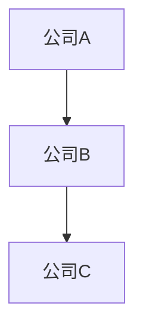
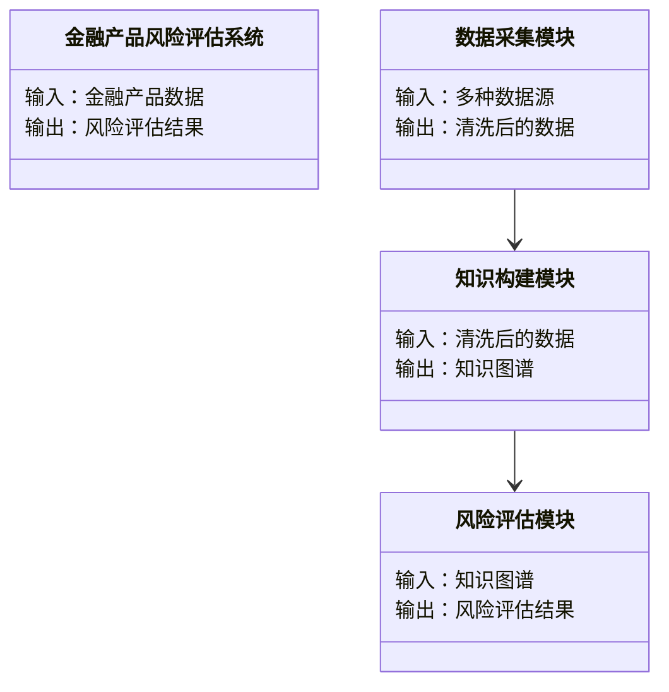
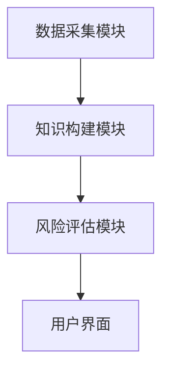
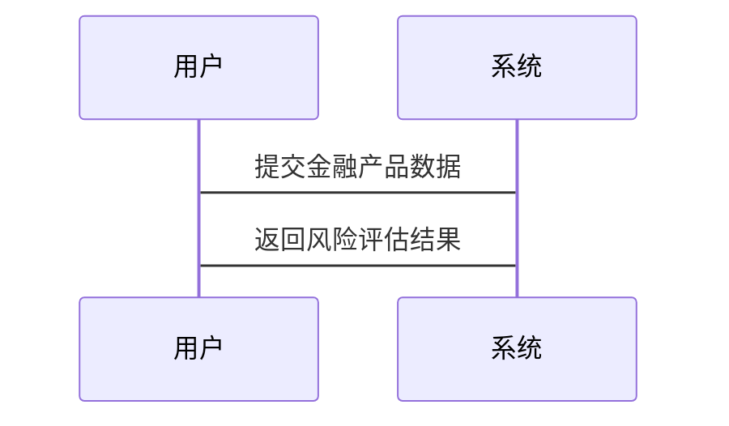

                 


# 构建基于知识图谱的金融产品风险评估系统

> 关键词：知识图谱、金融产品、风险评估、系统架构、算法原理、项目实战

> 摘要：本文详细探讨了基于知识图谱的金融产品风险评估系统的构建过程，从背景介绍、核心概念、算法原理到系统架构设计和项目实战，全面分析了知识图谱在金融风险评估中的应用潜力和实际价值。通过具体的案例分析和代码实现，展示了如何利用知识图谱技术提升金融产品的风险评估能力。

---

# 第一部分: 知识图谱与金融产品风险评估系统概述

## 第1章: 知识图谱与金融产品风险评估系统背景介绍

### 1.1 问题背景与问题描述

#### 1.1.1 金融产品风险评估的挑战

金融产品种类繁多，包括股票、债券、基金、衍生品等。每类金融产品都有其独特的风险特征，如市场风险、信用风险、流动性风险等。传统的风险评估方法通常基于单一维度的数据分析，难以全面捕捉金融产品之间的复杂关联关系。例如，某些金融产品可能因市场波动而相互影响，这种关联性在传统方法中往往被忽略。

此外，金融市场的数据量庞大且复杂，包括文本、结构化数据和非结构化数据等多种形式。如何高效地整合这些数据，并提取有价值的信息，是金融产品风险评估中的一个关键挑战。

#### 1.1.2 知识图谱在金融领域的应用潜力

知识图谱是一种用于表示实体及其关系的图结构，能够将分散在不同数据源中的信息整合到一个统一的知识网络中。在金融领域，知识图谱可以用于发现隐含的关联关系，例如公司之间的关联、行业趋势、市场动态等。这些关联关系可以帮助更好地理解金融产品的风险来源，并为风险评估提供更全面的视角。

#### 1.1.3 问题解决的核心目标

构建基于知识图谱的金融产品风险评估系统的核心目标是通过整合多源异构数据，构建一个能够反映金融产品及其相关实体之间复杂关系的知识网络。利用知识图谱的强大表达能力，可以更准确地识别和量化金融产品的风险，为投资者和金融机构提供更可靠的决策支持。

---

### 1.2 知识图谱的基本概念与核心要素

#### 1.2.1 知识图谱的定义与特点

知识图谱是一种用于表示实体及其关系的图结构，通常以节点（实体）和边（关系）的形式表示。其特点包括：

1. **语义丰富性**：知识图谱不仅包含实体之间的直接关系，还可以通过多跳关系描述复杂的关联。
2. **可扩展性**：知识图谱可以通过不断添加新的实体和关系进行扩展。
3. **异构性**：知识图谱可以整合多种类型的数据，包括文本、结构化数据等。

#### 1.2.2 知识图谱的核心要素组成

知识图谱由以下三个核心要素组成：

1. **实体（Entity）**：表示现实世界中的具体事物，如公司、产品、行业等。
2. **关系（Relation）**：描述实体之间的关联，如“属于”、“影响”、“涉及”等。
3. **属性（Attribute）**：描述实体的特征或性质，如公司的注册资本、产品的风险等级等。

#### 1.2.3 知识图谱的构建方法

知识图谱的构建通常包括以下步骤：

1. **数据采集**：从多种数据源（如数据库、文本、API等）获取相关数据。
2. **数据清洗**：对采集到的数据进行预处理，去除噪声数据。
3. **实体识别与链接**：识别文本中的实体，并将其链接到知识图谱中的相应节点。
4. **关系抽取**：从数据中抽取实体之间的关系，并构建边。
5. **知识融合**：将多个数据源中的信息整合到一个统一的知识图谱中。
6. **知识存储与管理**：将知识图谱存储在图数据库中，并进行版本控制和更新。

---

### 1.3 金融产品风险评估的核心概念

#### 1.3.1 金融产品的基本类型与风险特征

金融产品可以分为以下几类：

1. **股票**：具有较高的市场风险和波动性。
2. **债券**：通常具有较低的市场风险，但信用风险较高。
3. **基金**：风险取决于其投资组合的构成。
4. **衍生品**：风险通常较高，且具有杠杆效应。

每类金融产品的风险特征不同，因此在构建风险评估系统时需要针对不同产品类型进行差异化分析。

#### 1.3.2 金融产品风险评估的关键指标

金融产品风险评估的关键指标包括：

1. **波动率**：衡量资产价格的波动程度。
2. **VaR（在险价值）**：衡量在一定置信水平下可能遭受的最大损失。
3. **信用评级**：反映债务人的信用风险。
4. **流动性风险**：衡量资产在市场中的流动性。

#### 1.3.3 知识图谱在风险评估中的关联性

知识图谱可以帮助发现金融产品之间的隐含关联，例如：

- 某些金融产品可能与同一行业内的其他产品具有相似的风险特征。
- 某些产品可能因市场波动而相互影响。

通过知识图谱，可以更全面地理解金融产品的风险来源，并为风险评估提供更丰富的信息。

---

## 第2章: 知识图谱的核心概念与联系

### 2.1 知识图谱的核心原理

#### 2.1.1 实体与关系的定义

实体是知识图谱中的基本单位，表示现实世界中的具体事物。关系描述实体之间的关联，例如“公司A收购了公司B”可以表示为公司A和公司B之间的“收购”关系。

#### 2.1.2 知识图谱的构建方法

知识图谱的构建方法可以分为以下两类：

1. **基于规则的方法**：通过预定义的规则进行实体识别和关系抽取。
2. **基于机器学习的方法**：利用深度学习模型（如BERT）进行实体识别和关系抽取。

#### 2.1.3 知识图谱的存储与表示

知识图谱通常存储在图数据库中，如Neo4j。图的表示形式包括节点和边，例如：



图中，A和B之间有一条边表示“收购”关系，B和C之间也有一条边表示“收购”关系。

---

### 2.2 知识图谱与金融产品风险评估的联系

#### 2.2.1 知识图谱在风险识别中的作用

知识图谱可以帮助识别金融产品之间的隐含关联，例如：

- 某种债券可能与同一行业内的其他债券具有相似的信用风险。
- 某种股票可能与同一市场的其他股票具有相似的市场风险。

通过知识图谱，可以更全面地识别金融产品的风险来源。

#### 2.2.2 知识图谱在风险传播中的应用

知识图谱可以用于建模风险在金融网络中的传播路径，例如：

- 某种金融产品的风险可能通过关联的实体（如同一公司发行的其他产品）传播到其他金融产品。
- 某行业的风险可能通过产业链上的实体传播到其他行业。

#### 2.2.3 知识图谱在风险量化中的价值

知识图谱可以为风险量化提供更丰富的数据支持，例如：

- 通过知识图谱中的实体关系，可以构建更复杂的金融网络模型。
- 通过图嵌入技术，可以将图结构数据转换为数值向量，用于风险评估模型的训练。

---

### 2.3 知识图谱的核心概念对比

#### 2.3.1 实体与属性的对比

| 属性       | 实体       |
|------------|------------|
| 表示类型    | 实体是具体事物，如公司、产品等 | 属性是描述实体的特征，如注册资本、风险等级等 |
| 示例       | 公司A、产品B | 公司A的注册资本为1000万元 |

#### 2.3.2 关系与事件的对比

| 关系       | 事件       |
|------------|------------|
| 表示类型    | 关系是实体之间的静态关联，如“属于”、“影响” | 事件是具有时间性的动态行为，如“收购”、“发行” |
| 示例       | 公司A属于行业B | 公司A收购了公司C |

#### 2.3.3 知识图谱与传统数据库的对比

| 对比项       | 知识图谱       | 传统数据库       |
|--------------|---------------|------------------|
| 数据模型     | 图结构，支持复杂关联 | 行为结构，支持简单查询 |
| 数据处理     | 支持复杂查询，如多跳关系 | 支持简单查询，如单表查询 |
| 应用场景     | 适用于需要复杂关联分析的场景 | 适用于简单查询和事务处理的场景 |

---

### 2.4 知识图谱的ER实体关系图

以下是一个简单的ER实体关系图，展示了公司、产品和行业之间的关系：

```mermaid
erd
    company(公司) {
        id: int
        name: string
        industry_id: int
    }
    product(产品) {
        id: int
        name: string
        company_id: int
    }
    industry(行业) {
        id: int
        name: string
    }
    company -> industry: "属于"
    company -> product: "发行"
```

---

### 2.5 本章小结

本章介绍了知识图谱的核心概念，包括实体、关系和属性，并通过对比分析展示了知识图谱在金融产品风险评估中的潜在价值。通过ER实体关系图，我们进一步理解了知识图谱在金融领域的具体应用场景。

---

# 第3章: 知识图谱的算法原理与数学模型

---

## 3.1 知识图谱的构建算法

---

### 3.1.1 基于规则的构建算法

基于规则的构建算法通过预定义的规则进行实体识别和关系抽取。例如：

- 实体识别规则：识别公司名称和产品名称。
- 关系抽取规则：识别“发行”关系。

代码示例：

```python
def extract_entities(text):
    # 假设text是需要提取实体的文本
    # 使用正则表达式提取公司名称
    company_pattern = r'\b[A-Za-z]+ Inc\b'
    company = re.search(company_pattern, text).group()
    return company
```

---

### 3.1.2 基于统计的构建算法

基于统计的构建算法通过统计学方法（如TF-IDF）进行实体识别和关系抽取。例如：

- 实体识别：基于词频统计提取高频词汇。
- 关系抽取：基于共现矩阵提取实体之间的关系。

---

### 3.1.3 基于机器学习的构建算法

基于机器学习的构建算法利用深度学习模型（如BERT）进行实体识别和关系抽取。例如：

```python
import transformers

model = transformers.BertTokenizer.from_pretrained('bert-base-uncased')
```

---

## 3.2 知识图谱的图嵌入技术

---

### 3.2.1 图嵌入的定义与作用

图嵌入是将图结构数据转换为数值向量的技术，可以用于表示实体和关系。例如：

- 实体嵌入：将公司表示为一个向量。
- 关系嵌入：将“发行”关系表示为一个向量。

---

### 3.2.2 图嵌入的算法原理

图嵌入的常用算法包括Node2Vec和Word2Vec。例如，Node2Vec通过随机游走生成节点的表示：

$$
v_i = \sum_{j} \theta_{ij} \cdot v_j
$$

其中，$v_i$表示节点i的向量，$\theta_{ij}$表示节点i和节点j之间的关系权重。

---

## 3.3 金融产品风险传播模型的构建

---

### 3.3.1 风险传播模型的定义

风险传播模型描述了风险在金融网络中的传播路径。例如：

- 如果公司A和公司B之间存在“收购”关系，且公司A的风险等级为高，那么公司B的风险等级也可能受到影响。

---

### 3.3.2 风险传播模型的数学表达

风险传播模型可以通过以下公式表示：

$$
R_i = \alpha R_j + (1-\alpha) R_i
$$

其中，$R_i$表示公司i的风险等级，$R_j$表示公司j的风险等级，$\alpha$表示传播系数。

---

## 3.4 本章小结

本章介绍了知识图谱的构建算法和图嵌入技术，并详细讲解了风险传播模型的数学表达。通过这些技术，我们可以将知识图谱中的实体和关系表示为数值向量，并用于金融产品风险评估模型的训练。

---

# 第4章: 金融产品风险评估系统的设计与实现

---

## 4.1 系统功能设计

---

### 4.1.1 领域模型设计

领域模型描述了系统的功能模块及其关系。例如：



---

## 4.2 系统架构设计

---

### 4.2.1 系统架构图

系统架构图展示了系统的各个模块及其关系。例如：



---

## 4.3 接口设计

---

### 4.3.1 系统接口设计

系统接口设计包括数据输入接口和结果输出接口。例如：

- 数据输入接口：接收多种数据源的数据。
- 结果输出接口：输出风险评估结果。

---

### 4.3.2 系统交互流程

系统交互流程包括用户与系统之间的交互步骤。例如：



---

## 4.4 本章小结

本章详细设计了金融产品风险评估系统的功能模块、架构图和接口设计。通过系统架构图和交互流程图，我们进一步理解了系统的整体结构和实现步骤。

---

# 第5章: 项目实战与系统实现

---

## 5.1 项目环境安装

---

### 5.1.1 环境安装步骤

1. 安装Python：
   ```bash
   python --version
   ```
2. 安装依赖库：
   ```bash
   pip install numpy pandas
   ```

---

## 5.2 系统核心代码实现

---

### 5.2.1 数据采集模块实现

```python
import pandas as pd

def load_data(file_path):
    df = pd.read_csv(file_path)
    return df
```

---

### 5.2.2 知识构建模块实现

```python
from neo4j import GraphDatabase

def create_graph(neo4j_uri, neo4j_user, neo4j_password):
    driver = GraphDatabase.driver(neo4j_uri, auth=(neo4j_user, neo4j_password))
    session = driver.session()
    # 创建节点和关系
    session.run("CREATE (a:Company {name: '公司A'})")
    session.run("CREATE (b:Company {name: '公司B'})")
    session.run("MATCH (a:Company {name: '公司A'}), (b:Company {name: '公司B'}) CREATE (a)-[r:ACQUIRED]->(b)")
    session.close()
    return driver
```

---

### 5.2.3 风险评估模块实现

```python
import transformers

def calculate_risk(neo4j_uri, neo4j_user, neo4j_password):
    driver = GraphDatabase.driver(neo4j_uri, auth=(neo4j_user, neo4j_password))
    session = driver.session()
    result = session.run("MATCH (a:Company {name: '公司A'}) RETURN a.name")
    session.close()
    driver.close()
    return result
```

---

## 5.3 实际案例分析

---

### 5.3.1 案例背景

假设我们有两家公司，公司A和公司B，公司A收购了公司B。我们需要评估公司B的风险等级。

---

### 5.3.2 数据分析与结果解读

通过知识图谱分析，我们可以发现公司A的风险等级较高，因此公司B的风险等级也可能受到影响。

---

## 5.4 本章小结

本章通过实际案例分析，展示了如何利用知识图谱技术进行金融产品风险评估。通过具体的代码实现，我们进一步理解了系统的实际应用和实现步骤。

---

# 第6章: 总结与展望

---

## 6.1 总结

本文详细探讨了基于知识图谱的金融产品风险评估系统的构建过程，从背景介绍、核心概念、算法原理到系统架构设计和项目实战，全面分析了知识图谱在金融风险评估中的应用潜力和实际价值。

---

## 6.2 未来展望

未来的研究方向包括：

1. **图嵌入技术的优化**：进一步提升图嵌入技术的表示能力。
2. **多模态数据的融合**：将文本、图像等多种数据源整合到知识图谱中。
3. **实时风险评估**：实现金融产品风险的实时评估和动态更新。

---

## 6.3 最佳实践 Tips

- 在构建知识图谱时，建议优先选择图数据库（如Neo4j）进行存储和管理。
- 在进行风险评估时，建议结合多种风险指标（如VaR、信用评级等）进行综合评估。

---

## 6.4 小结

通过本文的探讨，我们相信基于知识图谱的金融产品风险评估系统具有广阔的应用前景。未来，随着人工智能和大数据技术的不断发展，知识图谱在金融领域的应用将更加深入和广泛。

---

# 作者：AI天才研究院/AI Genius Institute & 禅与计算机程序设计艺术 /Zen And The Art of Computer Programming

