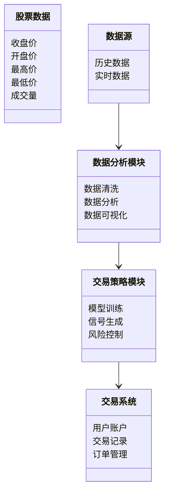
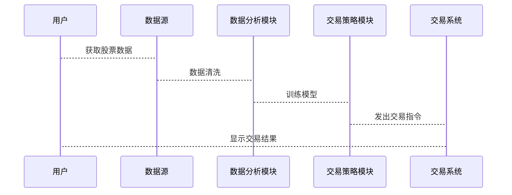

                 


# 特价股票与公司数字化转型能力的潜在联系

> 关键词：特价股票，公司数字化转型，数据驱动，技术赋能，市场分析，量化交易，系统架构

> 摘要：本文探讨了特价股票与公司数字化转型之间的潜在联系，分析了数字化转型如何通过数据驱动和技术创新影响特价股票市场，提出了基于机器学习的量化交易策略，并通过系统架构设计展示了如何构建支持特价股票分析的数字化平台。文章结合理论与实践，为投资者和企业提供了一种新的视角来理解和应对市场变化。

---

# 第一部分: 特价股票与公司数字化转型的背景与概念

## 第1章: 特价股票与数字化转型概述

### 1.1 特价股票的基本概念

#### 1.1.1 特价股票的定义
特价股票是指市场价格低于其内在价值，或者相对市场平均水平处于低位的股票。这些股票通常被认为具有较高的投资潜力，但也伴随着较高的风险。

#### 1.1.2 特价股票的分类与特点
- **分类**：特价股票可以分为周期性股票、成长型股票和价值型股票。
- **特点**：价格波动大、市场关注度低、潜在回报高。

#### 1.1.3 特价股票的市场现状
当前市场中，特价股票主要集中在中小型企业或处于转型期的企业。这些企业的股票价格往往被市场低估，但具备较大的增长潜力。

---

### 1.2 公司数字化转型的定义与特点

#### 1.2.1 数字化转型的定义
数字化转型是指企业通过引入数字技术（如人工智能、大数据、云计算等）来优化业务流程、提升效率、创新商业模式的过程。

#### 1.2.2 数字化转型的核心要素
- **数据驱动**：利用数据进行决策。
- **技术创新**：引入新技术（如AI、区块链）。
- **组织变革**：调整组织结构以适应数字化需求。

#### 1.2.3 数字化转型的实施路径
1. 确定目标：明确数字化转型的目的。
2. 制定策略：设计技术路线和实施计划。
3. 试点实施：在局部业务中验证方案。
4. 全面推广：将成功经验扩展到其他业务。

---

### 1.3 特价股票与数字化转型的联系

#### 1.3.1 特价股票与数字化转型的潜在关联
- **数据驱动的市场分析**：数字化转型为企业提供了更高效的数据分析工具，能够更好地识别特价股票的投资机会。
- **技术赋能的交易模式**：数字化转型推动了量化交易的普及，使得投资者能够更精准地捕捉市场机会。

#### 1.3.2 数字化转型对特价股票市场的影响
- **市场效率提升**：数字化转型减少了信息不对称，提高了市场效率。
- **投资行为变化**：数字化工具的普及使得更多投资者关注特价股票。

#### 1.3.3 特价股票在数字化转型中的作用
- **资金支持**：通过投资特价股票，为转型企业提供资金支持。
- **市场信号**：特价股票的价格变化反映了市场对数字化转型的预期。

---

## 第2章: 特价股票市场的现状与挑战

### 2.1 特价股票市场的现状分析

#### 2.1.1 特价股票市场的规模与结构
- **规模**：市场规模较小，参与者多为个人投资者。
- **结构**：市场集中度低，竞争激烈。

#### 2.1.2 特价股票市场的参与者分析
- **投资者**：个人投资者为主，机构投资者为辅。
- **企业**：中小型企业为主，部分大型企业也在尝试转型。

#### 2.1.3 特价股票市场的波动性特征
- **高波动性**：市场价格波动较大，投资风险高。
- **低流动性**：市场交易量小，买卖价差大。

---

### 2.2 数字化转型对企业的影响

#### 2.2.1 数字化转型对企业竞争力的影响
- **竞争优势**：通过技术创新提升产品和服务质量。
- **成本降低**：通过自动化减少人工成本。

#### 2.2.2 数字化转型对企业运营效率的影响
- **流程优化**：通过数字化工具提高业务流程效率。
- **决策效率**：通过数据分析实现快速决策。

#### 2.2.3 数字化转型对企业创新的影响
- **产品创新**：通过数据驱动设计新产品。
- **服务创新**：通过数字化手段提升客户体验。

---

### 2.3 特价股票与数字化转型的结合点

#### 2.3.1 特价股票市场中的数据驱动
- **数据来源**：利用大数据技术分析市场趋势。
- **数据应用**：通过数据挖掘识别投资机会。

#### 2.3.2 数字化转型对特价股票市场的影响
- **市场透明度提升**：通过数字化平台提供实时市场信息。
- **交易方式变革**：通过量化交易减少人为干扰。

#### 2.3.3 特价股票市场中的技术应用
- **人工智能**：用于市场预测和风险评估。
- **区块链**：用于交易记录和溯源。

---

# 第二部分: 特价股票与数字化转型的核心概念与联系

## 第3章: 特价股票与数字化转型的核心概念

### 3.1 特价股票的核心概念

#### 3.1.1 特价股票的定价机制
- **市场定价**：受供需关系影响。
- **内在价值**：基于企业基本面。

#### 3.1.2 特价股票的风险特征
- **市场风险**：价格波动大。
- **流动性风险**：交易量小。

#### 3.1.3 特价股票的市场行为
- **投资者行为**：个人投资者为主。
- **市场情绪**：受情绪影响较大。

---

### 3.2 数字化转型的核心概念

#### 3.2.1 数字化转型的技术基础
- **人工智能**：用于数据分析和预测。
- **大数据**：用于市场洞察和决策支持。
- **云计算**：用于存储和处理海量数据。

#### 3.2.2 数字化转型的业务模式
- **数字化产品**：通过数字化技术提供新服务。
- **数据 monetization**：通过数据变现。

#### 3.2.3 数字化转型的组织变革
- **组织结构**：扁平化、敏捷化。
- **文化变革**：鼓励创新和协作。

---

### 3.3 特价股票与数字化转型的核心联系

#### 3.3.1 数据驱动的市场分析
- **数据来源**：利用大数据技术分析市场趋势。
- **数据应用**：通过机器学习模型预测股票价格。

#### 3.3.2 技术赋能的交易模式
- **量化交易**：通过算法实现自动化交易。
- **风险管理**：通过技术手段控制投资风险。

#### 3.3.3 数字化转型对市场结构的影响
- **市场透明度提升**：通过数字化平台提高信息透明度。
- **交易效率提高**：通过技术手段减少交易成本。

---

## 第4章: 特价股票与数字化转型的关联模型

### 4.1 特价股票与数字化转型的关联模型

#### 4.1.1 模型构建的逻辑框架
- **输入**：市场数据、企业基本面数据。
- **输出**：股票价格预测、投资建议。

#### 4.1.2 模型的核心变量与关系
- **核心变量**：市场情绪、企业盈利、数字化能力。
- **关系**：数字化能力越强，股票价格波动越小。

#### 4.1.3 模型的验证与优化
- **验证方法**：回测和实证分析。
- **优化策略**：动态调整模型参数。

---

### 4.2 特价股票与数字化转型的关联机制

#### 4.2.1 数据驱动的市场预测
- **数据采集**：通过爬虫获取市场数据。
- **数据分析**：利用机器学习模型预测市场趋势。

#### 4.2.2 技术赋能的交易决策
- **算法交易**：通过量化交易模型实现自动化交易。
- **风险管理**：通过技术手段实时监控市场风险。

#### 4.2.3 数字化转型对市场效率的影响
- **市场透明度**：通过数字化平台提高信息透明度。
- **交易成本**：通过技术手段降低交易成本。

---

### 4.3 案例分析: 特价股票与数字化转型的关联实例

#### 4.3.1 案例背景介绍
- **案例公司**：某转型期企业。
- **案例背景**：通过数字化转型提升竞争力。

#### 4.3.2 关联机制的具体表现
- **数据驱动**：利用大数据分析市场趋势。
- **技术赋能**：通过算法交易实现高效投资。

#### 4.3.3 案例的启示与总结
- **启示**：数字化转型能够显著提升企业竞争力。
- **总结**：通过技术手段实现市场预测和交易优化。

---

# 第三部分: 算法与系统架构

## 第5章: 算法原理与实现

### 5.1 量化交易算法

#### 5.1.1 算法原理
- **核心思想**：基于历史数据预测未来价格。
- **实现步骤**：
  1. 数据采集：获取股票历史数据。
  2. 数据预处理：清洗和标准化数据。
  3. 模型训练：训练机器学习模型。
  4. 模型预测：预测未来股票价格。
  5. 交易策略：根据预测结果制定交易策略。

#### 5.1.2 算法实现代码
```python
import pandas as pd
import numpy as np
from sklearn.linear_model import LinearRegression
import matplotlib.pyplot as plt

# 数据采集
data = pd.read_csv('stock_data.csv')

# 数据预处理
X = data[['open', 'high', 'low', 'volume']]
y = data['close']

# 模型训练
model = LinearRegression()
model.fit(X, y)

# 模型预测
predicted_prices = model.predict(X)

# 可视化
plt.scatter(y, predicted_prices)
plt.xlabel('Actual Price')
plt.ylabel('Predicted Price')
plt.title('Linear Regression Model')
plt.show()
```

#### 5.1.3 算法的数学模型
$$ y = \beta_0 + \beta_1 x_1 + \beta_2 x_2 + \cdots + \beta_n x_n + \epsilon $$

其中，$y$ 是目标变量（股票价格），$x_i$ 是自变量（影响股票价格的因素），$\beta_i$ 是回归系数，$\epsilon$ 是误差项。

---

## 第6章: 系统架构设计

### 6.1 项目介绍
本项目旨在构建一个支持特价股票分析的数字化平台，利用大数据和人工智能技术实现市场预测和交易优化。

### 6.2 系统功能设计

#### 6.2.1 领域模型


### 6.3 系统架构设计


### 6.4 系统接口设计
- **数据接口**：与股票数据API对接。
- **交易接口**：与证券交易所系统对接。
- **用户接口**：提供可视化界面供用户操作。

### 6.5 系统交互设计



---

## 第7章: 项目实战

### 7.1 环境安装
- **Python**：安装Anaconda或使用虚拟环境。
- **库依赖**：安装pandas、numpy、scikit-learn等。

### 7.2 核心实现代码
```python
import pandas as pd
import numpy as np
from sklearn.linear_model import LinearRegression
from sklearn.metrics import mean_squared_error
import matplotlib.pyplot as plt

# 数据采集
data = pd.read_csv('stock_data.csv')

# 数据预处理
X = data[['open', 'high', 'low', 'volume']]
y = data['close']

# 划分训练集和测试集
X_train, X_test = X[:-100], X[-100:]
y_train, y_test = y[:-100], y[-100:]

# 模型训练
model = LinearRegression()
model.fit(X_train, y_train)

# 模型预测
predicted_prices = model.predict(X_test)

# 模型评估
mse = mean_squared_error(y_test, predicted_prices)
print(f'Mean Squared Error: {mse}')

# 可视化
plt.plot(y_test.index, y_test, label='Actual Price')
plt.plot(y_test.index, predicted_prices, label='Predicted Price')
plt.xlabel('Date')
plt.ylabel('Price')
plt.title('Stock Price Prediction')
plt.legend()
plt.show()
```

---

## 第8章: 总结与展望

### 8.1 总结
本文探讨了特价股票与公司数字化转型之间的潜在联系，分析了数字化转型如何通过数据驱动和技术创新影响特价股票市场。通过构建量化交易模型和系统架构设计，展示了如何利用技术手段实现市场预测和交易优化。

### 8.2 展望
未来的研究可以进一步探索以下方向：
1. 更复杂的算法模型，如深度学习。
2. 多因子量化交易策略。
3. 区块链技术在交易中的应用。

### 8.3 最佳实践 tips
- **数据质量**：确保数据来源可靠，清洗数据。
- **模型优化**：根据市场变化动态调整模型参数。
- **风险管理**：建立完善的风险控制机制。

---

作者：AI天才研究院/AI Genius Institute & 禅与计算机程序设计艺术 /Zen And The Art of Computer Programming

