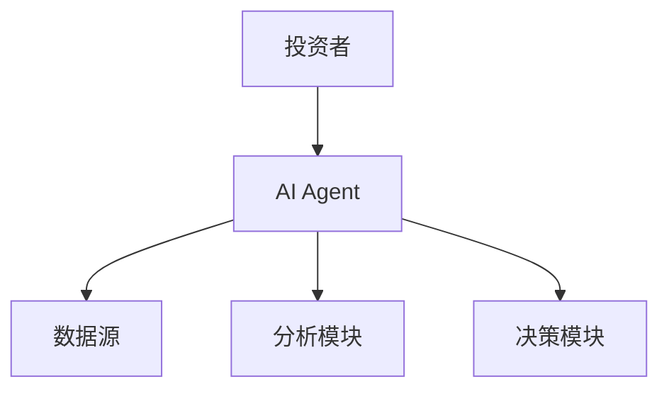
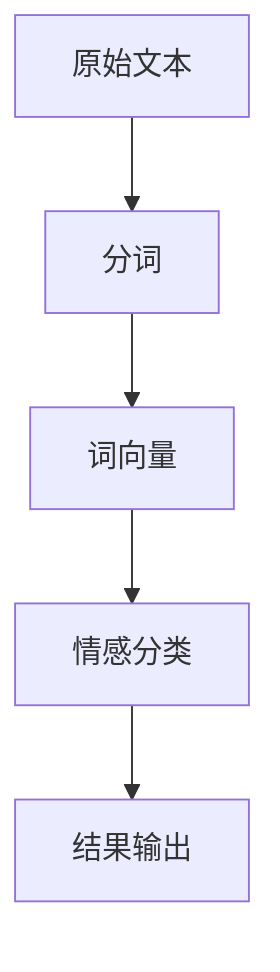
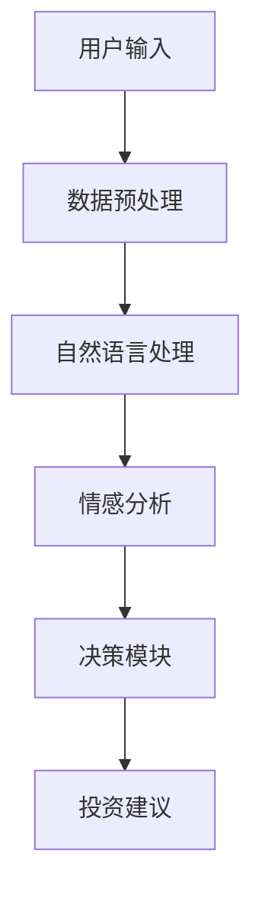
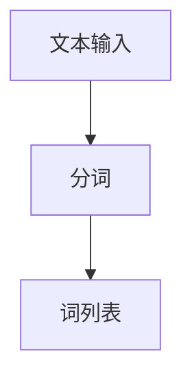
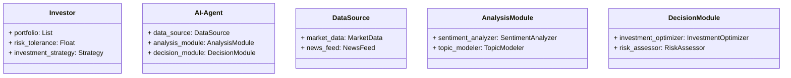
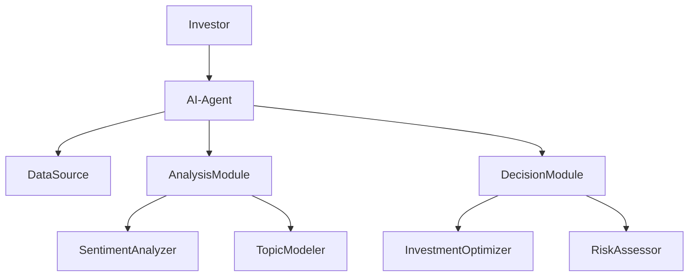
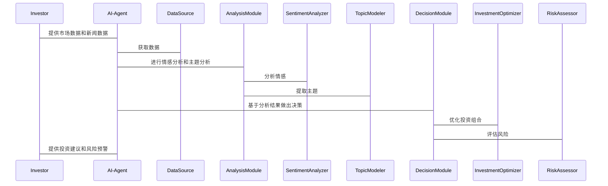

                 


# AI agents辅助价值投资者进行舆情分析

> 关键词：AI Agent, 舆情分析, 价值投资, 自然语言处理, 情感分析, 金融投资

> 摘要：本文探讨了AI Agent如何辅助价值投资者进行舆情分析。通过分析AI Agent的核心概念、舆情分析的算法原理、系统架构设计以及实际项目案例，本文详细阐述了AI Agent在金融投资中的应用价值，帮助投资者更高效地进行决策。

---

# 第一部分: AI Agent与价值投资的结合

## 第1章: AI Agent辅助价值投资的背景与概述

### 1.1 AI Agent的基本概念

#### 1.1.1 AI Agent的定义与特点
AI Agent（人工智能代理）是指能够感知环境、执行任务并做出决策的智能体。其特点包括：
- **自主性**：能够在没有外部干预的情况下自主运行。
- **反应性**：能够实时感知环境变化并做出响应。
- **学习能力**：通过数据和经验不断优化自身的决策能力。

#### 1.1.2 AI Agent的核心技术与实现原理
AI Agent的核心技术包括：
- **自然语言处理（NLP）**：用于理解和生成人类语言。
- **机器学习**：通过数据训练模型，使其能够进行预测和分类。
- **知识图谱**：构建领域知识库，帮助AI Agent更好地理解上下文。

#### 1.1.3 AI Agent在金融领域的应用潜力
AI Agent在金融领域的应用包括：
- **股票推荐**：通过分析市场数据和新闻，为投资者提供股票推荐。
- **风险评估**：利用历史数据和实时信息，评估投资标的的风险。
- **交易自动化**：通过算法交易，提高交易效率和准确性。

### 1.2 价值投资的基本原理

#### 1.2.1 价值投资的定义与核心理念
价值投资是一种投资策略，强调以低于内在价值的价格购买优质资产。其核心理念包括：
- **长期视角**：关注企业的长期价值，而非短期价格波动。
- **基本面分析**：通过分析企业的财务状况、行业地位等因素，评估其内在价值。

#### 1.2.2 价值投资的关键要素与决策过程
价值投资的关键要素包括：
- **企业财务状况**：如收入、利润、负债等。
- **行业地位**：企业在行业中的竞争地位。
- **管理团队**：企业的管理能力和战略规划。

#### 1.2.3 价值投资中的信息不对称问题
信息不对称是指市场参与者之间掌握的信息量不同，导致交易中存在不公平的情况。价值投资者需要通过分析公开信息和市场舆情，减少信息不对称的影响。

### 1.3 舆情分析在价值投资中的作用

#### 1.3.1 舆情分析的定义与方法
舆情分析是指对市场情绪进行分析，帮助投资者理解市场参与者的态度和看法。常用方法包括：
- **情感分析**：判断文本中情感的正负。
- **主题分析**：提取文本中的主要主题。
- **趋势分析**：分析舆情的变化趋势。

#### 1.3.2 舆情分析在价值投资中的应用场景
舆情分析在价值投资中的应用场景包括：
- **市场情绪监控**：实时监控市场情绪变化，帮助投资者做出决策。
- **新闻事件分析**：分析新闻事件对企业的影响，评估其对股价的潜在影响。
- **投资者情绪预测**：通过分析市场情绪，预测投资者的未来行为。

#### 1.3.3 舆情分析对投资决策的影响
舆情分析可以帮助投资者：
- **提前预警风险**：通过分析负面舆情，提前发现潜在风险。
- **捕捉市场机会**：通过分析积极舆情，发现被低估的投资机会。
- **优化投资组合**：根据舆情变化，动态调整投资组合。

### 1.4 AI Agent辅助舆情分析的优势

#### 1.4.1 提高信息处理效率
AI Agent可以快速处理大量文本数据，提取关键信息，提高信息处理效率。

#### 1.4.2 增强数据挖掘能力
AI Agent可以通过机器学习算法，从海量数据中挖掘潜在信息，帮助投资者发现隐藏的机会和风险。

#### 1.4.3 降低人为情绪干扰
AI Agent可以避免人为情绪干扰，提供客观的分析结果，帮助投资者做出理性决策。

### 1.5 本章小结
本章介绍了AI Agent的基本概念和价值投资的核心理念，分析了舆情分析在价值投资中的作用，并探讨了AI Agent辅助舆情分析的优势。

---

## 第2章: AI Agent与舆情分析的核心概念

### 2.1 AI Agent的核心概念

#### 2.1.1 实体关系图（ER图）分析


#### 2.1.2 AI Agent的属性特征对比
| 属性 | 特征 |
|------|------|
| 输入 | 文本数据、市场数据 |
| 输出 | 投资建议、风险预警 |
| 学习能力 | 自监督学习、强化学习 |
| 交互方式 | 自然语言交互、实时反馈 |

### 2.2 舆情分析的核心原理

#### 2.2.1 文本表示与情感分析


#### 2.2.2 舆情分析的数学模型
$$
\text{情感极性} = f(\text{词向量}, \text{上下文})
$$

### 2.3 AI Agent辅助舆情分析的系统架构


### 2.4 本章小结
本章详细讲解了AI Agent和舆情分析的核心概念，分析了它们的原理和系统架构。

---

## 第3章: AI Agent辅助舆情分析的算法原理

### 3.1 自然语言处理基础

#### 3.1.1 分词算法


### 3.2 情感分析算法

#### 3.2.1 基于词袋模型的情感分类
$$
P(\text{情感}|词) = \frac{\text{词出现的频率}}{\text{总词数}}
$$

### 3.3 基于深度学习的舆情分析

#### 3.3.1 Transformer模型的原理
$$
\text{编码器} = \text{自注意力机制} + \text{前馈网络}
$$

### 3.4 算法实现的代码示例
```python
def sentiment_analysis(text):
    tokens = tokenize(text)
    vector = vec
```

---

## 第4章: AI Agent辅助舆情分析的系统架构设计

### 4.1 问题场景介绍
投资者需要通过分析市场舆情，做出投资决策。

### 4.2 项目介绍
本项目旨在开发一个AI Agent，辅助价值投资者进行舆情分析。

### 4.3 系统功能设计

#### 4.3.1 领域模型（mermaid类图）


### 4.4 系统架构设计（mermaid架构图）


### 4.5 系统接口设计

#### 4.5.1 API接口
- **输入接口**：投资者输入市场数据和新闻数据。
- **输出接口**：AI Agent输出投资建议和风险预警。

### 4.6 系统交互设计（mermaid序列图）


### 4.7 本章小结
本章设计了一个AI Agent辅助舆情分析的系统架构，详细描述了系统各个模块的功能和交互流程。

---

## 第5章: 项目实战

### 5.1 环境安装
- **Python**：3.8+
- **库的安装**：`pip install numpy, pandas, transformers`

### 5.2 核心实现

#### 5.2.1 数据预处理
```python
import pandas as pd

def preprocess_data(data):
    # 去除缺失值
    data = data.dropna()
    # 标准化文本
    data['text'] = data['text'].str.lower()
    return data
```

#### 5.2.2 情感分析模型
```python
from transformers import AutoModelForSequenceClassification, AutoTokenizer

model_name = 'sentiment-roberta-base'
tokenizer = AutoTokenizer.from_pretrained(model_name)
model = AutoModelForSequenceClassification.from_pretrained(model_name)
```

#### 5.2.3 投资决策模块
```python
def generate_investment_recommendation(text):
    inputs = tokenizer(text, return_tensors='np')
    outputs = model(**inputs)
    prediction = outputs.logits.argmax().item()
    if prediction == 0:
        return '卖出'
    elif prediction == 1:
        return '持有'
    else:
        return '买入'
```

### 5.3 案例分析

#### 5.3.1 数据采集
```python
import requests

url = 'https://api.example.com/news'
response = requests.get(url)
data = response.json()
```

#### 5.3.2 情感分析
```python
text = '公司最近发布了新产品，市场反应热烈。'
recommendation = generate_investment_recommendation(text)
print(recommendation)  # 输出：买入
```

### 5.4 本章小结
本章通过实际案例展示了AI Agent辅助舆情分析的实现过程，包括环境安装、数据预处理、模型训练和投资决策模块的实现。

---

## 第6章: 总结与展望

### 6.1 系统优势
- **高效性**：AI Agent可以快速处理大量数据，提供实时分析结果。
- **准确性**：基于深度学习的模型可以提高情感分析的准确性。
- **可扩展性**：系统架构设计灵活，可以扩展到更多应用场景。

### 6.2 最佳实践Tips
- **数据质量**：确保输入数据的准确性和完整性。
- **模型优化**：定期更新模型，保持其预测能力。
- **用户教育**：帮助投资者理解AI Agent的分析结果，避免误用。

### 6.3 未来展望
- **多模态分析**：结合图像和视频等多模态数据，提高分析能力。
- **个性化服务**：根据投资者的个性化需求，提供定制化分析。
- **实时监控**：开发实时监控系统，提供即时的投资建议。

### 6.4 本章小结
本章总结了AI Agent辅助舆情分析的优势，并提出了未来的发展方向。

---

## 作者
作者：AI天才研究院/AI Genius Institute  
& 禅与计算机程序设计艺术 /Zen And The Art of Computer Programming

