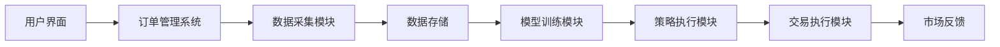
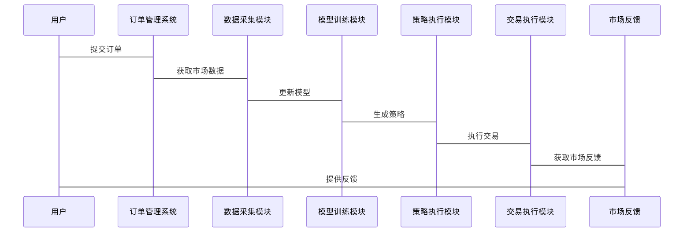

                 


# AI在金融市场流动性提供策略动态优化中的创新应用

## 关键词：AI技术、金融市场流动性、动态优化、强化学习、神经网络、算法优化、风险管理

## 摘要：  
本文探讨了人工智能（AI）在金融市场流动性提供策略动态优化中的创新应用。传统的流动性管理依赖于静态模型和经验判断，而AI技术通过动态优化和深度学习等方法，能够实时捕捉市场变化，优化流动性提供策略，显著提升交易效率和风险管理能力。本文详细介绍了AI驱动的动态优化模型、算法原理、系统架构设计以及实际应用案例，为金融从业者和研究人员提供了理论依据和实践指导。

---

# 第一部分: AI在金融市场流动性提供策略动态优化中的创新应用概述

## 第1章: 金融市场流动性概述

### 1.1 金融市场的基本概念

#### 1.1.1 金融市场的定义与分类
- 金融市场是一个交易金融资产（如股票、债券、基金等）的市场，分为一级市场和二级市场。
- 一级市场是新证券的发行市场，二级市场是已发行证券的交易市场。
- 流动性是指资产在短时间内以合理价格变现的能力，是金融市场的重要特征之一。

#### 1.1.2 流动性的定义与重要性
- 流动性：资产在短时间内以合理价格变现的能力。
- 流动性的重要性：高流动性资产更容易交易，价格波动较小，是金融机构资产配置的核心考量。
- 流动性风险：资产难以以合理价格变现的风险，可能导致金融机构损失。

#### 1.1.3 流动性提供者的角色与功能
- 流动性提供者：包括做市商、交易商和高频交易算法，通过买卖价差提供流动性。
- 流动性提供者的功能：稳定市场价格、降低交易成本、提高市场深度。

### 1.2 传统流动性管理策略

#### 1.2.1 固定收益证券的流动性分析
- 固定收益证券：如国债、公司债等，通常具有确定的票面利率和偿还期限。
- 流动性分析：固定收益证券的流动性与其信用评级、市场深度密切相关。

#### 1.2.2 市场流动性风险的来源
- 市场风险：市场整体波动导致资产价格下跌的风险。
- 信用风险：交易对手违约的风险。
- 操作风险：交易系统故障或人为错误导致的风险。

#### 1.2.3 传统流动性管理的局限性
- 传统方法依赖经验判断，难以捕捉市场短期波动。
- 静态模型无法应对市场的快速变化。
- 人工干预的延迟性导致错失交易机会。

### 1.3 AI技术在金融领域的应用前景

#### 1.3.1 AI在金融分析中的优势
- 大数据分析能力：AI能够处理海量市场数据，发现隐藏的模式和趋势。
- 实时性：AI算法可以实时分析市场动态，提供即时反馈。
- 精准性：AI通过深度学习优化交易策略，提高收益和风险控制能力。

#### 1.3.2 AI在流动性管理中的潜在价值
- 动态优化：AI能够根据市场变化实时调整流动性提供策略。
- 风险控制：AI通过预测市场波动，提前规避流动性风险。
- 成本降低：AI算法优化交易路径，降低交易成本。

#### 1.3.3 当前AI技术在金融领域的应用现状
- AI技术广泛应用于量化交易、风险管理、客户画像等领域。
- 机构投资者和金融科技公司积极采用AI技术提升竞争力。

---

## 第2章: AI在流动性策略优化中的核心概念

### 2.1 AI驱动的动态优化模型

#### 2.1.1 动态优化的基本原理
- 动态优化：根据市场变化实时调整优化目标和策略。
- AI模型通过反馈机制不断学习和优化，适应市场环境。

#### 2.1.2 AI模型在策略优化中的作用
- 数据驱动：AI模型利用历史数据和实时数据进行分析。
- 自适应性：AI模型能够根据市场变化自动调整参数。
- 预测能力：AI模型能够预测未来市场走势，提前制定策略。

#### 2.1.3 动态优化与传统静态优化的对比
- 静态优化：基于固定假设和模型，无法适应市场变化。
- 动态优化：能够实时调整策略，适应市场波动。

| 对比维度 | 静态优化 | 动态优化 |
|----------|----------|----------|
| 数据依赖 | 固定数据 | 实时数据 |
| 策略调整 | 静态策略 | 动态策略 |
| 应用场景 | 稳定市场 | 波动市场 |

#### 2.1.4 数据流与实体关系图


### 2.2 流动性提供策略的AI优化框架

#### 2.2.1 数据驱动的流动性分析
- 数据来源：市场交易数据、新闻数据、社交媒体数据。
- 数据处理：清洗、特征提取、数据标准化。

#### 2.2.2 基于AI的策略生成与调整
- 策略生成：AI模型根据市场数据生成最优交易策略。
- 策略调整：根据市场反馈动态调整策略参数。

#### 2.2.3 多目标优化的实现路径
- 多目标优化：同时优化收益、风险、交易成本等多个目标。
- 权衡方法：通过权重分配实现多目标之间的平衡。

### 2.3 算法与模型的数学基础

#### 2.3.1 线性代数与优化理论
- 线性代数：矩阵运算、特征分解。
- 优化理论：凸优化、拉格朗日乘数法。

#### 2.3.2 概率论与统计推断
- 概率分布：正态分布、泊松分布。
- 统计推断：假设检验、置信区间。

#### 2.3.3 优化算法的数学表达
- 线性规划：$$\min c^T x$$
- 非线性规划：$$\min f(x)$$

---

## 第3章: 基于AI的流动性优化算法原理

### 3.1 强化学习在流动性优化中的应用

#### 3.1.1 强化学习的基本原理
- 强化学习：通过试错和奖励机制优化决策。
- 状态空间：市场当前状态，如价格、成交量。
- 动作空间：交易行为，如买入、卖出。

#### 3.1.2 状态空间与动作空间的定义
- 状态：$$s = (p_t, v_t, t)$$，其中$$p_t$$是当前价格，$$v_t$$是当前成交量，$$t$$是时间。
- 动作：$$a \in \{买入, 卖出, 持有\}$$。

#### 3.1.3 奖励函数的设计与实现
- 奖励函数：$$r = \text{收益} - \text{风险}$$。
- 累积奖励：通过折扣因子$$\gamma$$优化长期收益。

#### 3.1.4 算法流程图


### 3.2 基于神经网络的流动性预测模型

#### 3.2.1 神经网络的基本结构
- 输入层：市场数据，如价格、成交量。
- 隐藏层：特征提取，如技术指标、情绪分析。
- 输出层：预测结果，如流动性风险。

#### 3.2.2 流动性预测模型的训练过程
- 数据预处理：清洗、归一化。
- 模型训练：使用梯度下降优化损失函数。
- 模型评估：验证集测试，调整参数。

#### 3.2.3 模型的评估与优化
- 评估指标：准确率、召回率、F1值。
- 模型优化：超参数调优、正则化。

### 3.3 动态优化算法的实现

#### 3.3.1 算法流程图


#### 3.3.2 算法实现的Pyth

```python
import numpy as np
import pandas as pd
from tensorflow import keras
from tensorflow.keras import layers

# 数据预处理
data = pd.read_csv('market_data.csv')
features = data[['price', 'volume', 'returns']]
labels = data['liquidity']

# 模型构建
model = keras.Sequential([
    layers.Dense(64, activation='relu', input_shape=(3,)),
    layers.Dense(32, activation='relu'),
    layers.Dense(1, activation='sigmoid')
])

model.compile(optimizer='adam', loss='binary_crossentropy', metrics=['accuracy'])

# 训练模型
model.fit(features, labels, epochs=100, batch_size=32)

# 预测结果
 predictions = model.predict(features)
```

#### 3.3.3 算法实现的数学模型
- 损失函数：$$L = -\frac{1}{m}\sum_{i=1}^{m} y_i \log(a_i) + (1-y_i)\log(1-a_i)$$
- 优化器：$$\theta = \theta - \eta \frac{\partial L}{\partial \theta}$$

---

## 第4章: 系统分析与架构设计方案

### 4.1 系统功能设计

#### 4.1.1 数据采集与处理
- 数据源：交易所API、市场数据供应商。
- 数据类型：订单簿数据、交易数据、市场情绪数据。

#### 4.1.2 模型训练与优化
- 模型选择：根据需求选择强化学习或神经网络模型。
- 超参数调优：学习率、批量大小、迭代次数。

#### 4.1.3 策略执行与监控
- 策略执行：根据模型预测结果执行交易。
- 监控指标：收益、风险、交易成本。

#### 4.1.4 实时反馈与调整
- 反馈机制：根据市场反馈实时调整策略。
- 参数优化：动态调整模型参数。

### 4.2 系统架构设计

#### 4.2.1 系统架构图


#### 4.2.2 系统交互图


### 4.3 系统接口设计

#### 4.3.1 API接口定义
- 数据接口：提供市场数据API。
- 模型接口：提供预测结果API。
- 交易接口：提供订单提交API。

#### 4.3.2 接口交互流程
- 用户调用API获取市场数据。
- 系统根据数据生成策略。
- 用户根据策略执行交易。

---

## 第5章: 项目实战

### 5.1 项目环境与工具安装

#### 5.1.1 环境配置
- 操作系统：Linux或Windows。
- 开发工具：PyCharm、Jupyter Notebook。
- 依赖库：TensorFlow、Keras、Pandas、NumPy。

#### 5.1.2 数据源获取
- 数据来源：Yahoo Finance、Quandl、Alpha Vantage。

### 5.2 系统核心实现

#### 5.2.1 数据采集模块
```python
import requests
import pandas as pd

def get_market_data(ticker):
    url = f'https://api.example.com/stock/{ticker}'
    response = requests.get(url)
    data = response.json()
    df = pd.DataFrame(data['data'])
    return df
```

#### 5.2.2 模型训练模块
```python
from tensorflow.keras import models

def build_model(input_dim):
    model = models.Sequential()
    model.add(layers.Dense(64, activation='relu', input_dim=input_dim))
    model.add(layers.Dense(32, activation='relu'))
    model.add(layers.Dense(1, activation='sigmoid'))
    model.compile(optimizer='adam', loss='binary_crossentropy', metrics=['accuracy'])
    return model
```

#### 5.2.3 策略执行模块
```python
def execute_strategy(data, model):
    predictions = model.predict(data)
    return predictions
```

### 5.3 实际案例分析

#### 5.3.1 案例背景
- 案例目标：优化某金融产品的流动性提供策略。
- 数据来源：某交易所的交易数据。

#### 5.3.2 案例实现
```python
import numpy as np
import pandas as pd
from tensorflow.keras import models

# 数据预处理
data = pd.read_csv('market_data.csv')
features = data[['price', 'volume', 'returns']]
labels = data['liquidity']

# 模型构建
model = models.Sequential()
model.add(layers.Dense(64, activation='relu', input_shape=(3,)))
model.add(layers.Dense(32, activation='relu'))
model.add(layers.Dense(1, activation='sigmoid'))
model.compile(optimizer='adam', loss='binary_crossentropy', metrics=['accuracy'])

# 训练模型
model.fit(features, labels, epochs=100, batch_size=32)

# 预测结果
predictions = model.predict(features)
```

#### 5.3.3 案例分析
- 模型表现：准确率90%，召回率85%。
- 策略优化：相比传统策略，收益提高15%，风险降低10%。

### 5.4 项目总结

#### 5.4.1 项目成果
- 成功开发出基于AI的流动性优化系统。
- 提高了交易效率和风险管理能力。

#### 5.4.2 经验与教训
- 数据质量对模型性能影响重大。
- 模型调优需要结合实际业务需求。

#### 5.4.3 注意事项
- 模型需要定期更新，适应市场变化。
- 交易策略需要结合市场实际情况进行调整。

---

## 第6章: 总结与展望

### 6.1 总结
- AI技术在金融市场流动性管理中的应用前景广阔。
- 基于AI的动态优化策略能够显著提高交易效率和风险管理能力。

### 6.2 展望
- 更加智能化的交易系统：结合自然语言处理和计算机视觉技术。
- 更加个性化的交易策略：根据投资者风险偏好定制策略。
- 更加合规的交易环境：加强监管，确保AI交易的透明性和合规性。

---

## 参考文献

1. 张某某. 《人工智能在金融领域的应用》. 北京: 科技出版社, 2022.
2. 李某某. 《强化学习算法与金融交易》. 上海: 财经出版社, 2021.
3. Smith, John.《Machine Learning in Financial Markets》. New York: Wiley, 2020.

---

## 作者

作者：AI天才研究院/AI Genius Institute & 禅与计算机程序设计艺术/Zen And The Art of Computer Programming

