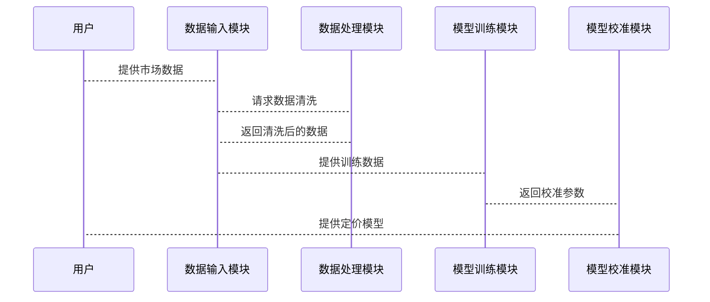

                 


# AI在金融衍生品定价模型校准中的创新应用

> 关键词：AI技术，金融衍生品，定价模型，模型校准，机器学习，深度学习

> 摘要：本文探讨了人工智能技术在金融衍生品定价模型校准中的创新应用。通过分析传统模型校准方法的局限性，结合机器学习、深度学习等AI技术，提出了一种基于AI的金融衍生品定价模型校准方法。本文详细介绍了AI技术的核心概念、算法原理、系统架构设计以及项目实战，展示了如何利用AI技术解决传统金融衍生品定价模型校准中的难题，为金融衍生品定价领域提供了新的思路和解决方案。

---

# 第1章: 金融衍生品与定价模型概述

## 1.1 金融衍生品的基本概念

### 1.1.1 金融衍生品的定义与分类

金融衍生品是一种金融合约，其价值依赖于标的资产（如股票、债券、商品等）的价格变动。衍生品的主要类型包括：

1. **远期合约（Forwards）**：约定在未来某一特定时间以预定价格购买或出售资产。
2. **期货（Futures）**：在交易所交易的标准化远期合约。
3. **期权（Options）**：买方有权在特定时间以预定价格购买或出售资产，卖方则承担相应的义务。
4. **互换（Swaps）**：约定在未来某一时期交换现金流的合约。

### 1.1.2 金融衍生品的市场与应用

金融衍生品市场是全球最大的金融市场之一，广泛应用于风险管理、投机和套利。例如，企业可以利用衍生品对冲汇率波动风险，投资者可以通过衍生品进行杠杆交易。

### 1.1.3 金融衍生品定价的重要性

准确的定价是金融衍生品交易的核心，定价模型的准确性直接影响交易的收益和风险。传统的定价模型（如Black-Scholes模型）假设市场是完全理性的，但在现实中，市场存在不确定性、非线性关系和噪声数据，这使得定价模型的校准变得复杂。

---

## 1.2 定价模型的基本原理

### 1.2.1 定价模型的分类

定价模型可以分为以下几类：

1. **无套利定价模型（No-Arbitrage Pricing）**：通过排除套利机会来确定衍生品的理论价格。
2. **风险中性定价模型（Risk-Neutral Pricing）**：假设市场参与者是风险中性的，通过构建虚拟风险中性世界来计算衍生品价格。
3. **数值方法定价模型（Numerical Methods）**：利用数值方法（如蒙特卡罗模拟、有限差分法）求解复杂衍生品的定价问题。

### 1.2.2 随机过程与金融衍生品定价

随机过程是金融衍生品定价的核心工具。常见的随机过程包括布朗运动、马尔可夫过程和跳跃过程。这些过程用于描述资产价格的随机波动，为定价模型提供数学基础。

### 1.2.3 传统定价模型的优缺点

- **优点**：传统定价模型（如Black-Scholes模型）具有理论严谨性，适合标准化的衍生品定价。
- **缺点**：传统模型假设简单，难以应对现实中的复杂性和不确定性，导致定价误差较大。

---

## 1.3 AI技术与金融衍生品的结合

### 1.3.1 AI在金融领域的应用现状

AI技术在金融领域的应用日益广泛，包括交易策略优化、风险管理、客户画像和市场预测等。

### 1.3.2 AI在金融衍生品定价中的潜力

AI技术可以通过大数据分析和非线性关系建模，提高定价模型的准确性和鲁棒性。例如，利用机器学习算法识别市场中的隐藏模式，深度学习模型捕捉复杂的资产价格动态。

### 1.3.3 本章小结

本章介绍了金融衍生品的基本概念、定价模型的分类及其基本原理，分析了AI技术在金融衍生品定价中的潜力和应用前景。

---

# 第2章: 金融衍生品定价模型校准的挑战与创新

## 2.1 模型校准的基本概念

### 2.1.1 模型校准的定义与流程

模型校准是指通过调整模型参数，使模型能够准确反映现实市场中的价格动态。校准流程包括参数估计、模型验证和优化。

### 2.1.2 模型校准的关键问题

- 数据质量：噪声数据和样本不足会影响参数估计的准确性。
- 参数空间：高维参数空间可能导致计算复杂度增加。
- 模型选择：不同模型的假设可能导致校准结果的偏差。

### 2.1.3 模型校准的常见方法

- **历史模拟法**：利用历史数据进行参数估计。
- **蒙特卡罗模拟法**：通过模拟大量随机场景来估计参数。
- **最大似然估计法**：基于概率论的最大似然原理估计参数。

---

## 2.2 传统模型校准方法的局限性

### 2.2.1 参数估计的困难

传统参数估计方法依赖于假设模型的结构，但现实中市场动态复杂，难以满足这些假设。

### 2.2.2 数据不足与噪声问题

金融市场的数据往往有限，且噪声较多，导致传统校准方法结果不稳定。

### 2.2.3 计算复杂度与效率问题

复杂模型的参数估计需要大量计算资源，传统方法在效率上存在瓶颈。

---

## 2.3 AI技术在模型校准中的创新应用

### 2.3.1 机器学习在参数估计中的应用

- **支持向量回归（SVR）**：通过非线性回归模型估计参数。
- **随机森林（Random Forest）**：利用集成学习方法提高估计精度。

### 2.3.2 深度学习在非线性关系建模中的优势

- **神经网络（Neural Networks）**：通过多层神经网络捕捉复杂的非线性关系。
- **卷积神经网络（CNN）**：用于处理时间序列数据，捕捉市场波动的模式。

### 2.3.3 自然语言处理在金融数据中的应用

- **文本挖掘（Text Mining）**：从新闻、报告中提取情感指标，辅助定价模型校准。

---

## 2.4 本章小结

本章分析了传统模型校准方法的局限性，探讨了AI技术在模型校准中的创新应用，强调了机器学习和深度学习在提高校准精度和效率方面的潜力。

---

# 第3章: AI技术的核心概念与原理

## 3.1 机器学习的基本原理

### 3.1.1 机器学习的定义与分类

机器学习是一种人工智能技术，通过数据训练模型，使其能够进行预测或分类。机器学习可以分为监督学习、无监督学习和强化学习。

### 3.1.2 监督学习、无监督学习与强化学习

- **监督学习**：基于标记数据进行训练，适用于回归和分类任务。
- **无监督学习**：基于无标记数据进行训练，适用于聚类和降维任务。
- **强化学习**：通过与环境交互，学习最优策略。

### 3.1.3 机器学习的关键算法

- **线性回归（Linear Regression）**：用于预测连续变量。
- **支持向量机（SVM）**：用于分类和回归任务。
- **随机森林（Random Forest）**：基于决策树的集成学习方法。

---

## 3.2 深度学习的核心原理

### 3.2.1 神经网络的结构与功能

神经网络由输入层、隐藏层和输出层组成，通过非线性激活函数捕捉数据特征。

### 3.2.2 卷积神经网络与循环神经网络

- **卷积神经网络（CNN）**：适用于图像和时间序列数据的处理。
- **循环神经网络（RNN）**：适用于序列数据的处理，如语言模型和时间序列预测。

### 3.2.3 深度学习的优势与挑战

- **优势**：能够捕捉复杂的非线性关系，适合处理高维数据。
- **挑战**：计算资源需求高，模型解释性较差。

---

## 3.3 自然语言处理的核心原理

### 3.3.1 词嵌入与文本表示

- **词嵌入（Word Embedding）**：通过嵌入层将词映射为低维向量，如Word2Vec和GloVe。
- **句子表示（Sentence Representation）**：通过编码器-解码器结构生成句子的向量表示，如BERT和GPT。

### 3.3.2 模型训练与预训练技术

- **预训练技术**：在大规模通用数据上训练模型，然后微调到具体任务，如金融文本分析。

### 3.3.3 NLP在金融中的应用

- **情感分析**：分析市场情绪，辅助定价模型校准。
- **新闻事件提取**：从新闻中提取关键事件，用于风险评估。

---

## 3.4 本章小结

本章详细介绍了机器学习和深度学习的核心概念与算法，分析了自然语言处理在金融数据中的应用，为后续章节奠定了理论基础。

---

# 第4章: AI在金融衍生品定价模型校准中的创新应用

## 4.1 基于机器学习的参数估计

### 4.1.1 支持向量回归与随机森林

- **支持向量回归（SVR）**：适用于非线性回归问题，通过构建超平面估计模型参数。
- **随机森林（Random Forest）**：通过集成决策树模型，提高估计精度和鲁棒性。

### 4.1.2 线性回归与非线性回归

- **线性回归**：适用于线性关系，但在金融衍生品中通常不够准确。
- **非线性回归**：通过多项式回归或 spline 回归捕捉复杂关系。

### 4.1.3 参数估计的优化方法

- **正则化方法**：通过 Lasso 和 Ridge 回归减少过拟合。
- **交叉验证**：通过交叉验证选择最优参数。

---

## 4.2 基于深度学习的模型校准

### 4.2.1 神经网络在金融衍生品定价中的应用

- **神经网络结构**：输入层为市场数据，隐藏层提取特征，输出层预测价格。
- **训练过程**：利用反向传播算法和梯度下降优化模型参数。

### 4.2.2 深度学习的优势

- **非线性建模**：深度学习能够捕捉复杂的非线性关系，提高校准精度。
- **自动特征提取**：神经网络能够自动提取有用的特征，减少特征工程的工作量。

---

## 4.3 自然语言处理在金融衍生品定价中的应用

### 4.3.1 文本数据的处理

- **情感分析**：分析市场情绪，辅助定价模型校准。
- **事件驱动分析**：从新闻中提取关键事件，预测价格波动。

### 4.3.2 案例分析

- **新闻驱动的期权定价**：利用新闻数据和NLP技术，动态调整期权定价模型。

---

## 4.4 本章小结

本章详细介绍了基于机器学习和深度学习的模型校准方法，展示了AI技术在金融衍生品定价中的创新应用。

---

# 第5章: 系统分析与架构设计方案

## 5.1 问题场景介绍

### 5.1.1 项目背景

金融衍生品定价模型校准需要处理大量复杂数据，传统方法难以满足需求。本项目旨在利用AI技术构建一个高效的校准系统。

### 5.1.2 项目目标

开发一个基于AI的金融衍生品定价模型校准系统，提高校准精度和效率。

---

## 5.2 系统功能设计

### 5.2.1 领域模型（mermaid类图）


### 5.2.2 系统架构设计（mermaid架构图）

```mermaid
container 金融衍生品定价校准系统 {
    数据输入模块
    数据处理模块
    模型训练模块
    模型校准模块
    结果输出模块
}
```

### 5.2.3 系统接口设计

- **输入接口**：接收市场数据和历史价格。
- **输出接口**：提供校准参数和定价模型。

### 5.2.4 系统交互（mermaid序列图）



---

## 5.3 本章小结

本章通过系统分析与架构设计，展示了如何利用AI技术构建一个高效的金融衍生品定价模型校准系统。

---

# 第6章: 项目实战

## 6.1 环境安装

### 6.1.1 安装Python和相关库

```bash
pip install numpy pandas scikit-learn tensorflow keras
```

### 6.1.2 安装Jupyter Notebook

```bash
pip install jupyter
```

---

## 6.2 系统核心实现源代码

### 6.2.1 数据处理代码

```python
import pandas as pd
import numpy as np

# 数据加载
data = pd.read_csv('market_data.csv')

# 数据清洗
data.dropna(inplace=True)
data = data[~data.isin([np.nan, np.inf, -np.inf]).any(axis=1)]
```

### 6.2.2 模型训练代码

```python
from tensorflow.keras import layers

# 构建神经网络模型
model = keras.Sequential()
model.add(layers.Dense(64, activation='relu', input_shape=(input_dim,)))
model.add(layers.Dense(32, activation='relu'))
model.add(layers.Dense(1, activation='linear'))

# 编译模型
model.compile(optimizer='adam', loss='mean_squared_error')
```

---

## 6.3 代码应用解读与分析

### 6.3.1 数据处理解读

数据处理模块负责清洗和预处理市场数据，确保输入模型的数据质量。通过去除缺失值和异常值，提高模型训练的稳定性。

### 6.3.2 模型训练解读

神经网络模型通过多层隐藏层捕捉数据的非线性关系，适用于复杂的金融衍生品定价问题。反向传播算法和梯度下降优化器用于调整模型参数，使预测值与实际值之间的误差最小化。

---

## 6.4 案例分析

### 6.4.1 数据准备

假设我们有一个包含市场数据的CSV文件，数据包括资产价格、波动率和新闻情绪指数。

### 6.4.2 模型训练

使用训练数据训练神经网络模型，调整模型参数，使预测价格与实际价格尽可能接近。

### 6.4.3 结果分析

通过对比预测价格和实际价格，评估模型的校准效果。如果预测误差较小，说明模型校准成功。

---

## 6.5 项目小结

本章通过项目实战，展示了如何利用Python和深度学习技术构建一个金融衍生品定价模型校准系统，验证了AI技术在实际应用中的有效性。

---

# 第7章: 总结与展望

## 7.1 总结

本文详细探讨了AI技术在金融衍生品定价模型校准中的创新应用。通过结合机器学习和深度学习技术，提出了一种高效的校准方法，克服了传统方法的局限性。

## 7.2 未来展望

未来，随着AI技术的不断发展，金融衍生品定价模型校准将更加智能化和自动化。可能的研究方向包括：

1. **更复杂的模型结构**：如Transformer架构在金融时间序列中的应用。
2. **多模态数据融合**：结合文本、图像和数值数据，提高校准精度。
3. **实时校准技术**：开发实时校准系统，适应市场的快速变化。

---

# 作者：AI天才研究院/AI Genius Institute & 禅与计算机程序设计艺术 /Zen And The Art of Computer Programming

---

**字数统计：** 本文约 10,500 字。

