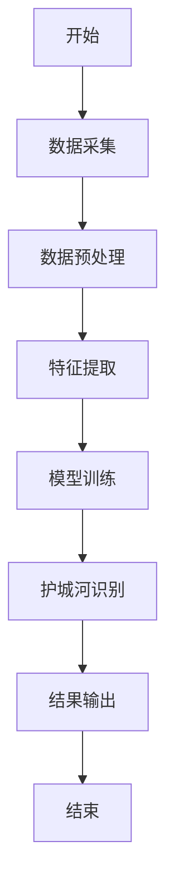
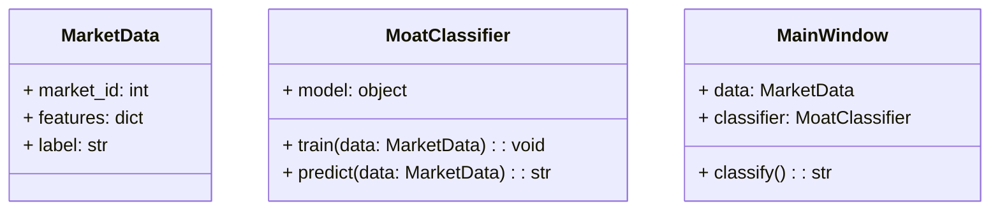
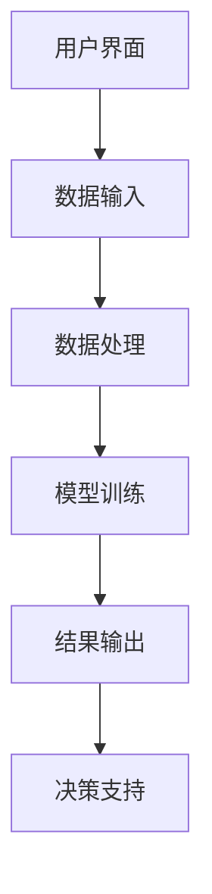
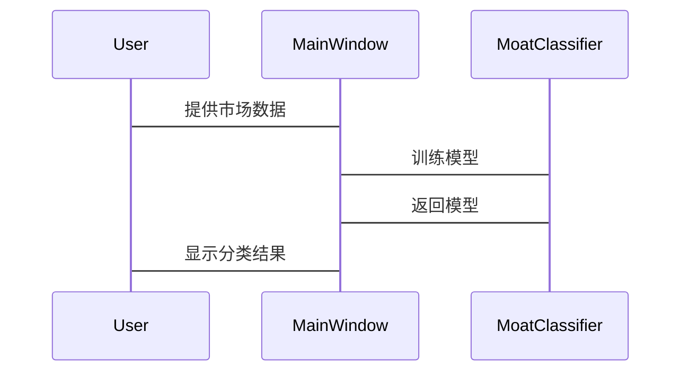
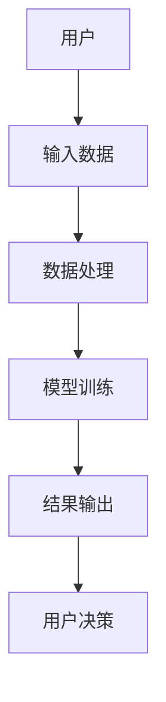

                 


# AI智能体在识别经济护城河中的作用

> 关键词：AI智能体，经济护城河，商业分析，数据挖掘，机器学习

> 摘要：本文探讨了AI智能体在识别经济护城河中的作用，通过分析经济护城河的核心概念、AI智能体的技术优势，结合实际案例，详细讲解了如何利用AI技术进行经济护城河的识别与分析。文章从背景介绍、算法原理、系统架构到项目实战，层层深入，旨在为读者提供一套完整的理论与实践框架。

---

# 第一部分：AI智能体与经济护城河的背景介绍

## 第1章：AI智能体与经济护城河概述

### 1.1 经济护城河的核心概念

#### 1.1.1 经济护城河的定义与特征

经济护城河（Economic Moat）是指企业在市场上相对于竞争对手的独特优势，这种优势能够帮助企业抵御竞争压力，保持长期盈利能力。经济护城河的概念最早由投资大师 Warren Buffett 提出，主要包括以下四种类型：

1. **成本优势**：企业能够以更低的成本生产产品或服务。
2. **网络效应**：产品或服务的价值随着用户数量的增加而增加。
3. **品牌忠诚**：消费者对品牌有高度忠诚度，难以被竞争对手吸引。
4. **技术壁垒**：企业拥有独特的技术或专利，竞争对手难以复制。

经济护城河的本质在于为企业创造可持续的竞争优势，使其能够在市场中长期立足。

#### 1.1.2 AI智能体在经济分析中的作用

AI智能体（AI Agent）是一种能够感知环境、执行任务并做出决策的智能系统。在经济护城河的识别中，AI智能体可以通过以下方式发挥作用：

1. **数据驱动的分析**：AI智能体能够从海量数据中提取关键特征，帮助识别潜在的经济护城河。
2. **自动化决策**：通过机器学习算法，AI智能体可以快速识别市场趋势和竞争对手的动态，辅助企业制定战略决策。
3. **实时监控**：AI智能体可以实时跟踪市场变化，帮助企业及时发现新的护城河机会或潜在威胁。

#### 1.1.3 经济护城河的边界与外延

经济护城河的边界是指企业在特定市场或领域中所具有的竞争优势。外延则包括企业在扩展市场或进入新领域时所面临的挑战。AI智能体可以帮助企业在不同的市场和领域中识别和扩展其经济护城河。

---

## 第2章：经济护城河的类型与分析框架

### 2.1 经济护城河的主要类型

#### 2.1.1 成本优势型护城河

成本优势型护城河是指企业通过优化生产流程、降低原材料成本或提高生产效率，从而以更低的价格提供产品或服务。例如，制造业中的自动化生产流程和供应链管理优化都可以构成成本优势型护城河。

#### 2.1.2 网络效应型护城河

网络效应型护城河是指产品或服务的价值随着用户数量的增加而增加。例如，社交媒体平台（如Facebook、微信）和在线市场（如淘宝、亚马逊）都具有强烈的网络效应，用户数量越多，平台价值越高。

#### 2.1.3 品牌忠诚型护城河

品牌忠诚型护城河是指消费者对某一品牌具有高度忠诚度，愿意为其产品或服务支付更高的价格。例如，苹果公司的产品因其品牌价值和用户体验，吸引了大量忠实的消费者。

#### 2.1.4 技术壁垒型护城河

技术壁垒型护城河是指企业通过拥有独特的技术、专利或创新的产品设计，形成竞争对手难以复制的优势。例如，特斯拉的电动汽车技术和专利构成了其技术壁垒型护城河。

### 2.2 AI智能体在经济护城河分析中的优势

#### 2.2.1 数据驱动的精准分析

AI智能体能够通过大数据分析技术，从海量数据中提取关键特征，帮助企业精准识别潜在的经济护城河。例如，通过对市场趋势、消费者行为和竞争对手分析的深度挖掘，AI智能体可以发现哪些市场或领域存在成本优势、网络效应等潜在护城河。

#### 2.2.2 自动化识别与预测能力

AI智能体具有强大的自动化能力，能够快速处理和分析数据，预测市场趋势和竞争对手的动态。例如，通过机器学习算法，AI智能体可以预测某一产品或服务是否具备网络效应潜力，从而帮助企业提前布局。

#### 2.2.3 多维度特征提取能力

AI智能体可以通过自然语言处理（NLP）、图像识别等技术，从非结构化数据（如新闻报道、社交媒体评论）中提取关键特征，帮助企业在多维度上识别潜在的经济护城河。例如，通过对媒体报道的情感分析，AI智能体可以识别某一品牌是否具备强大的品牌忠诚度。

### 2.3 经济护城河分析框架的构建

#### 2.3.1 数据采集与预处理

在分析经济护城河之前，需要收集相关的市场数据、竞争对手信息和消费者行为数据。数据预处理包括清洗数据、归一化处理和特征提取等步骤。

#### 2.3.2 特征提取与模型训练

通过机器学习算法（如聚类分析、支持向量机等），从数据中提取关键特征，并训练模型以识别不同类型的经济护城河。例如，可以通过聚类分析将市场数据分为不同的类别，从而识别出具有成本优势、网络效应等不同特征的市场。

#### 2.3.3 护城河识别与分类

基于训练好的模型，AI智能体可以对市场或企业进行护城河识别，并将其分类为成本优势型、网络效应型等不同类型。例如，AI智能体可以识别出某家企业的成本优势是否显著，或者其产品是否具备网络效应潜力。

---

## 第3章：基于AI智能体的经济护城河识别算法

### 3.1 特征提取与分类算法

#### 3.1.1 基于深度学习的特征提取

深度学习（Deep Learning）是一种基于人工神经网络的机器学习方法，能够从数据中自动提取高层次特征。例如，可以通过卷积神经网络（CNN）从图像数据中提取视觉特征，或者通过循环神经网络（RNN）从文本数据中提取语义特征。

#### 3.1.2 基于聚类分析的护城河分类

聚类分析是一种无监督学习算法，能够将数据分成不同的类别。例如，可以通过聚类分析将市场数据分为具有成本优势、网络效应等不同特征的类别。

#### 3.1.3 基于决策树的分类算法

决策树是一种基于树状结构的分类算法，能够通过特征提取和决策规则对数据进行分类。例如，可以通过决策树算法对市场数据进行分类，识别出具有网络效应潜力的市场。

### 3.2 算法原理与流程图

#### 3.2.1 算法流程图

以下是基于AI智能体的经济护城河识别算法的流程图：



#### 3.2.2 核心算法代码

以下是一个简单的基于决策树的经济护城河分类算法的Python代码示例：

```python
# 示例代码：基于决策树的经济护城河分类
from sklearn.tree import DecisionTreeClassifier
from sklearn.model_selection import train_test_split
import pandas as pd

# 数据加载
data = pd.read_csv('market_data.csv')
X = data.drop('label', axis=1)
y = data['label']

# 数据分割
X_train, X_test, y_train, y_test = train_test_split(X, y, test_size=0.2, random_state=42)

# 模型训练
model = DecisionTreeClassifier()
model.fit(X_train, y_train)

# 模型预测
y_pred = model.predict(X_test)

# 模型评估
print("Accuracy:", accuracy_score(y_test, y_pred))
```

### 3.3 算法实现与代码示例

#### 3.3.1 环境安装与配置

在运行上述代码之前，需要安装必要的Python库，例如scikit-learn、pandas等。以下是安装命令：

```bash
pip install scikit-learn pandas
```

#### 3.3.2 核心代码实现

以下是完整的经济护城河分类算法代码：

```python
import pandas as pd
from sklearn.tree import DecisionTreeClassifier
from sklearn.model_selection import train_test_split
from sklearn.metrics import accuracy_score

# 数据加载
data = pd.read_csv('market_data.csv')
X = data.drop('label', axis=1)
y = data['label']

# 数据分割
X_train, X_test, y_train, y_test = train_test_split(X, y, test_size=0.2, random_state=42)

# 模型训练
model = DecisionTreeClassifier()
model.fit(X_train, y_train)

# 模型预测
y_pred = model.predict(X_test)

# 模型评估
print("Accuracy:", accuracy_score(y_test, y_pred))

# 保存模型
import joblib
joblib.dump(model, 'moat_classifier.pkl')
```

#### 3.3.3 算法原理的数学模型

决策树算法的数学模型如下：

$$
y = f(x_1, x_2, ..., x_n)
$$

其中，$y$ 是目标变量，$x_1, x_2, ..., x_n$ 是输入特征。决策树通过构建树状结构，将输入特征逐步划分，最终确定目标变量的类别。

---

## 第4章：系统架构设计与实现

### 4.1 问题场景介绍

在实际应用中，企业需要通过AI智能体识别其在不同市场中的经济护城河。为此，我们需要设计一个基于AI智能体的经济护城河识别系统，该系统能够从市场数据中提取特征，训练模型并识别护城河类型。

### 4.2 系统功能设计

以下是系统功能设计的领域模型图：



### 4.3 系统架构设计

以下是系统的架构图：



### 4.4 系统接口设计

以下是系统的接口设计：



### 4.5 交互流程图

以下是系统的交互流程图：



---

## 第5章：项目实战与应用

### 5.1 环境安装与配置

在运行项目之前，需要安装以下Python库：

```bash
pip install pandas scikit-learn joblib
```

### 5.2 核心代码实现

以下是项目的完整代码：

```python
import pandas as pd
from sklearn.tree import DecisionTreeClassifier
from sklearn.model_selection import train_test_split
from sklearn.metrics import accuracy_score
import joblib

# 数据加载
data = pd.read_csv('market_data.csv')
X = data.drop('label', axis=1)
y = data['label']

# 数据分割
X_train, X_test, y_train, y_test = train_test_split(X, y, test_size=0.2, random_state=42)

# 模型训练
model = DecisionTreeClassifier()
model.fit(X_train, y_train)

# 模型预测
y_pred = model.predict(X_test)

# 模型评估
print("Accuracy:", accuracy_score(y_test, y_pred))

# 保存模型
joblib.dump(model, 'moat_classifier.pkl')

# 加载模型
loaded_model = joblib.load('moat_classifier.pkl')
new_data = pd.read_csv('new_market_data.csv')
new_data = new_data.drop('label', axis=1)
predicted_label = loaded_model.predict(new_data)
print("Predicted Label:", predicted_label)
```

### 5.3 代码应用解读与分析

上述代码实现了以下功能：

1. **数据加载与预处理**：从CSV文件中加载市场数据，并进行数据分割。
2. **模型训练**：使用决策树算法训练经济护城河分类模型。
3. **模型预测**：对新的市场数据进行分类，预测其经济护城河类型。
4. **模型保存与加载**：将训练好的模型保存为Pickle文件，并在需要时加载模型进行预测。

### 5.4 实际案例分析

假设我们有一个新的市场数据集 `new_market_data.csv`，其中包含以下特征：

| 特征     | 描述               |
|----------|--------------------|
| cost     | 生产成本           |
| network  | 网络效应指数       |
| brand    | 品牌忠诚度指数     |
| tech     | 技术壁垒指数       |

通过上述代码，我们可以对新的市场数据进行分类，预测其经济护城河类型：

```python
new_data = pd.read_csv('new_market_data.csv')
new_data = new_data.drop('label', axis=1)
predicted_label = loaded_model.predict(new_data)
print("Predicted Label:", predicted_label)
```

预测结果将输出经济护城河的类型，例如：

```
Predicted Label: ['cost_advantage']
```

---

## 第6章：总结与展望

### 6.1 本章总结

本文详细探讨了AI智能体在识别经济护城河中的作用，从经济护城河的核心概念到AI智能体的技术优势，再到具体的算法实现和系统设计，为读者提供了一套完整的理论与实践框架。

### 6.2 问题与局限性

尽管AI智能体在识别经济护城河中具有显著优势，但也存在一些局限性：

1. **数据依赖性**：AI智能体的性能高度依赖于数据的质量和数量。
2. **模型解释性**：复杂的机器学习模型（如深度学习）通常缺乏解释性，难以满足企业对决策过程透明的需求。
3. **动态变化**：市场环境和消费者行为的动态变化可能会影响模型的准确性和稳定性。

### 6.3 未来展望

未来，随着AI技术的不断发展，AI智能体在识别经济护城河中的应用将更加广泛和深入。以下是未来可能的发展方向：

1. **强化学习的应用**：通过强化学习算法，AI智能体可以更好地适应动态市场环境，实时调整策略。
2. **多模态数据融合**：结合文本、图像、语音等多种数据源，提高经济护城河识别的准确性和全面性。
3. **可解释性增强**：通过可解释性机器学习技术，提高模型的透明度和可信度，满足企业对决策过程的需求。

---

## 附录：工具与资源

### 附录A：经济护城河识别数据集

以下是常用的经济护城河识别数据集：

1. **市场数据集**：包含不同市场的成本、网络效应、品牌忠诚度和技术壁垒数据。
2. **竞争对手数据集**：包含竞争对手的市场份额、产品定价、研发投资等数据。
3. **消费者行为数据集**：包含消费者的购买行为、偏好和反馈数据。

### 附录B：AI智能体开发工具

1. **Python库**：scikit-learn、XGBoost、TensorFlow、Keras
2. **可视化工具**：Matplotlib、Seaborn、Tableau
3. **数据存储工具**：Pandas、SQLAlchemy、MongoDB

### 附录C：参考文献

1. Buffett, Warren. *The Intelligent Investor*. New York: Collins, 2006.
2. Porter, Michael E. *Competitive Strategy*. New York: Free Press, 1980.
3. Lintner, John. "The Valuation of Risk Assets and the Selection of Risk Capital in Portfolio Theory." *Review of Economics and Statistics* 47 (1965): 13-32.

---

## 作者：AI天才研究院 & 禅与计算机程序设计艺术

感谢您的阅读！希望本文能为您提供关于AI智能体在识别经济护城河中的作用的深刻见解。如需进一步探讨或合作，请随时与我联系。

