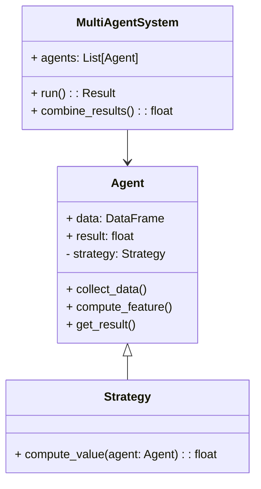
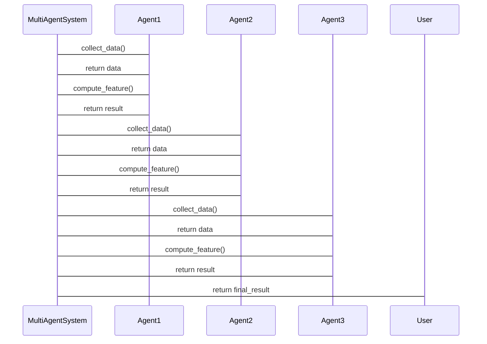

                 


# 利用多智能体系统进行跨资产类别的价值比较

**关键词**：多智能体系统，跨资产价值比较，金融建模，分布式算法，智能体协作

**摘要**：  
随着金融市场日益复杂化，跨资产类别之间的价值比较变得至关重要。传统的单一智能体方法在处理多维度、多模态数据时显得力不从心。而多智能体系统（MAS）凭借其分布式计算、协作学习和自适应性等特性，为跨资产价值比较提供了新的解决方案。本文将系统地探讨如何利用多智能体系统进行跨资产类别的价值比较，从理论基础到算法实现，再到实际应用，全面解析其核心原理和实现细节。

---

## 第一部分: 多智能体系统与跨资产价值比较的背景与基础

### 第1章: 多智能体系统与跨资产价值比较概述

#### 1.1 多智能体系统的定义与特点
##### 1.1.1 多智能体系统的定义
多智能体系统（Multi-Agent System, MAS）是由多个相互作用的智能体（Agent）组成的分布式系统，这些智能体能够自主决策、协作完成任务，并通过通信和协调实现全局目标。与传统的单一智能体系统相比，MAS具有更强的适应性和灵活性。

##### 1.1.2 多智能体系统的核心特点
1. **分布式计算**：智能体独立决策，减少集中计算的负担。
2. **协作性**：智能体之间通过通信和协作完成复杂任务。
3. **自适应性**：能够根据环境变化动态调整策略。
4. **鲁棒性**：单个智能体的故障不影响整体系统运行。

##### 1.1.3 多智能体系统与传统单智能体系统的区别
| 特性                | 多智能体系统（MAS）         | 单一智能体系统（SAS）         |
|---------------------|---------------------------|-----------------------------|
| 决策主体            | 多个智能体协作             | 单一智能体决策               |
| 计算效率            | 分布式计算，效率较高       | 集中计算，效率较低           |
| 系统鲁棒性          | 高，容错能力强             | 较低，单点故障风险大         |
| 应用场景            | 复杂分布式任务            | 简单或局部任务               |

#### 1.2 跨资产价值比较的定义与挑战
##### 1.2.1 资产类别与价值比较的基本概念
资产类别是指不同类型的金融资产，如股票、债券、基金、商品等。跨资产价值比较是指在不同资产类别之间进行价值评估和对比，以寻找潜在的投资机会或风险点。

##### 1.2.2 跨资产价值比较的核心挑战
1. **数据异质性**：不同资产类别具有不同的特征和计算方式。
2. **多目标优化**：需要在多个维度（如风险、收益、流动性）之间找到平衡。
3. **动态性**：金融市场波动频繁，资产价值实时变化。

##### 1.2.3 多智能体系统在跨资产价值比较中的优势
1. **分布式计算能力**：能够同时处理多种资产类别的数据。
2. **协作学习**：智能体之间可以共享信息，优化价值比较结果。
3. **自适应性**：能够快速响应市场变化，实时调整价值评估策略。

#### 1.3 多智能体系统在金融领域的应用前景
##### 1.3.1 金融领域中的多智能体系统应用现状
目前，多智能体系统已在金融领域的多个场景中得到应用，例如算法交易、风险评估、市场预测等。

##### 1.3.2 多智能体系统在跨资产价值比较中的潜在应用场景
1. **跨市场比较**：比较不同市场中的资产表现。
2. **资产组合优化**：基于多智能体的协作，优化资产配置。
3. **实时监控**：实时跟踪不同资产类别的价值变化。

##### 1.3.3 多智能体系统在金融领域的优势与挑战
- **优势**：能够处理复杂问题，提供高效的解决方案。
- **挑战**：智能体之间的协调和通信需要复杂的机制，且系统的实时性和安全性要求较高。

#### 1.4 本章小结
本章从多智能体系统的定义、特点出发，分析了跨资产价值比较的核心挑战，并探讨了多智能体系统在金融领域的应用前景。

---

## 第2章: 多智能体系统的核心概念与联系

### 2.1 多智能体系统的组成与结构
#### 2.1.1 智能体的定义与角色
智能体是指能够感知环境、自主决策并采取行动的实体。在跨资产价值比较中，每个智能体可以专注于不同的资产类别或任务。

#### 2.1.2 多智能体系统的组成结构
多智能体系统由以下几部分组成：
1. **智能体（Agent）**：负责具体任务的执行。
2. **环境（Environment）**：智能体所处的外部世界，提供输入数据和反馈。
3. **通信机制（Communication）**：智能体之间交换信息的渠道。
4. **协调机制（Coordination）**：确保智能体协作完成任务的机制。

#### 2.1.3 智能体之间的通信与协作
智能体之间的通信可以通过以下方式进行：
1. **直接通信**：智能体之间直接交换信息。
2. **间接通信**：通过中间媒介（如共享数据库）进行信息传递。

### 2.2 跨资产价值比较的核心要素
#### 2.2.1 资产类别与特征分析
- **资产类别**：股票、债券、基金、商品等。
- **资产特征**：收益、风险、流动性、波动性等。

#### 2.2.2 价值比较的关键指标
- **相对收益**：资产之间的收益差异。
- **风险调整后收益**：考虑风险因素后的收益。
- **流动性差异**：资产的交易活跃程度。

#### 2.2.3 跨资产比较的复杂性与不确定性
- **数据异质性**：不同资产类别的数据格式和特征差异较大。
- **市场波动**：金融市场的不确定性对资产价值的影响。

### 2.3 多智能体系统与跨资产价值比较的关联
#### 2.3.1 多智能体系统在跨资产比较中的角色
- **数据处理**：智能体负责不同资产类别的数据采集和预处理。
- **特征提取**：智能体从资产数据中提取关键特征。
- **价值评估**：智能体基于特征进行资产价值评估。

#### 2.3.2 多智能体系统如何处理跨资产数据
- **分布式数据处理**：每个智能体处理特定资产类别的数据。
- **协作数据融合**：智能体之间共享数据，形成综合评估结果。

#### 2.3.3 多智能体系统如何优化价值比较过程
- **并行计算**：多个智能体同时处理不同资产类别，提高计算效率。
- **动态调整**：根据市场变化实时优化评估策略。

#### 2.4 本章小结
本章详细分析了多智能体系统的组成结构，并探讨了其在跨资产价值比较中的具体应用。

---

## 第3章: 多智能体系统的算法原理与实现

### 3.1 多智能体系统的算法概述
#### 3.1.1 分布式算法的基本原理
分布式算法是指在多个计算节点上运行的算法，通过通信和协作完成任务。多智能体系统的算法通常基于分布式计算。

#### 3.1.2 多智能体系统中的协调与同步机制
- **同步机制**：确保智能体之间的动作协调一致。
- **异步机制**：允许智能体在不同时间点独立决策。

#### 3.1.3 基于博弈论的多智能体决策方法
- **纳什均衡**：所有智能体的策略组合达到稳定的平衡状态。
- **博弈树**：用于分析智能体之间的策略互动。

### 3.2 跨资产价值比较的算法实现
#### 3.2.1 数据预处理与特征提取
- **数据清洗**：去除噪声数据，确保数据质量。
- **特征选择**：提取对价值比较有影响的关键特征。

#### 3.2.2 基于多智能体的比较算法设计
1. **智能体分配任务**：每个智能体负责特定资产类别的数据处理。
2. **智能体协作计算**：通过通信机制共享数据和计算结果。
3. **综合评估结果**：将所有智能体的评估结果整合，得出最终的跨资产价值比较结果。

#### 3.2.3 算法的优化与调优
- **负载均衡**：确保每个智能体的任务分配合理，避免计算过载。
- **通信优化**：减少智能体之间的通信开销，提高计算效率。

### 3.3 算法实现的代码示例
#### 3.3.1 环境安装与配置
- **Python环境**：安装Python 3.8及以上版本。
- **库依赖**：安装`numpy`、`pandas`、`networkx`等库。

#### 3.3.2 核心算法实现代码
```python
import numpy as np
import pandas as pd
from sklearn.metrics import pairwise_distances

class MultiAgentSystem:
    def __init__(self, agents):
        self.agents = agents  # 列表，包含多个智能体
    
    def run(self):
        for agent in self.agents:
            agent.collect_data()  # 收集数据
            agent.compute_feature()  # 计算特征
        results = []
        for agent in self.agents:
            results.append(agent.get_result())  # 获取结果
        return self.combine_results(results)  # 综合结果
    
    def combine_results(self, results):
        # 将多个智能体的结果综合起来
        return np.mean(results, axis=0)  # 简单平均

class Agent:
    def __init__(self, data):
        self.data = data  # 分配给该智能体的数据
        self.result = None
    
    def collect_data(self):
        # 数据采集逻辑
        pass
    
    def compute_feature(self):
        # 特征计算逻辑
        pass
    
    def get_result(self):
        return self.result

# 示例用法
data = pd.DataFrame({
    '资产类别': ['股票', '债券', '基金'],
    '收益': [0.1, 0.05, 0.08],
    '风险': [0.2, 0.1, 0.15]
})

agents = [Agent(data.iloc[i]) for i in range(len(data))]
mas = MultiAgentSystem(agents)
results = mas.run()
print(results)
```

#### 3.3.3 代码的功能解读与分析
- **MultiAgentSystem类**：管理多个智能体，协调它们的运行。
- **Agent类**：具体执行数据处理和计算的智能体。
- **run方法**：启动多智能体系统的运行。
- **compute_feature方法**：计算资产的价值特征。

### 3.4 本章小结
本章详细讲解了多智能体系统的算法原理，并通过代码示例展示了其具体实现过程。

---

## 第4章: 多智能体系统中的数学模型与公式

### 4.1 多智能体系统的数学模型
#### 4.1.1 智能体的策略函数
$$ V(a) = \sum_{i=1}^{n} w_i x_i $$
其中，\( w_i \) 是权重，\( x_i \) 是特征。

#### 4.1.2 多智能体系统的状态空间
$$ S = \{ s_1, s_2, ..., s_n \} $$
其中，\( s_i \) 是智能体 \( i \) 的状态。

#### 4.1.3 多智能体系统的动作空间
$$ A = \{ a_1, a_2, ..., a_n \} $$
其中，\( a_i \) 是智能体 \( i \) 的动作。

### 4.2 跨资产价值比较的数学公式
#### 4.2.1 资产价值的量化公式
$$ V_i = \alpha \cdot R_i + \beta \cdot F_i $$
其中，\( R_i \) 是收益，\( F_i \) 是风险，\( \alpha \) 和 \( \beta \) 是权重。

#### 4.2.2 跨资产比较的综合评价模型
$$ V_{\text{total}} = \sum_{i=1}^{n} V_i $$
其中，\( V_i \) 是每个资产的价值评估结果。

#### 4.2.3 基于多智能体的优化公式
$$ \text{优化目标} = \min \sum_{i=1}^{n} (V_{\text{target}} - V_i) $$
其中，\( V_{\text{target}} \) 是目标价值。

### 4.3 数学模型的详细讲解与举例
#### 4.3.1 数学公式的推导过程
1. 确定每个资产的价值评估公式。
2. 将所有资产的评估结果综合起来，得到整体的价值评估。

#### 4.3.2 具体案例的数学模型分析
假设我们有三个资产类别：股票、债券、基金。每个资产的价值评估公式为：
$$ V_{\text{股票}} = 0.7 \cdot R_{\text{股票}} + 0.3 \cdot F_{\text{股票}} $$
$$ V_{\text{债券}} = 0.6 \cdot R_{\text{债券}} + 0.4 \cdot F_{\text{债券}} $$
$$ V_{\text{基金}} = 0.5 \cdot R_{\text{基金}} + 0.5 \cdot F_{\text{基金}} $$
最终的整体价值评估为：
$$ V_{\text{total}} = V_{\text{股票}} + V_{\text{债券}} + V_{\text{基金}} $$

#### 4.3.3 数学模型的实际应用示例
通过上述公式，我们可以计算出每个资产的价值评估结果，并最终得到整体的价值评估。

### 4.4 本章小结
本章通过数学公式详细讲解了多智能体系统在跨资产价值比较中的实现原理。

---

## 第5章: 多智能体系统的系统分析与架构设计

### 5.1 问题场景介绍
#### 5.1.1 跨资产价值比较的业务场景
在金融市场中，投资者需要对不同资产类别进行比较，以优化资产配置和投资决策。

#### 5.1.2 多智能体系统在其中的角色
多智能体系统负责数据采集、特征提取、价值评估和结果综合。

### 5.2 系统功能设计
#### 5.2.1 领域模型（mermaid 类图）


#### 5.2.2 系统架构设计（mermaid 架构图）


#### 5.2.3 系统接口设计
1. 数据采集接口：从数据源获取资产数据。
2. 特征提取接口：提取资产的特征。
3. 价值评估接口：计算资产的价值。
4. 结果综合接口：整合多个智能体的评估结果。

#### 5.2.4 系统交互（mermaid 序列图）


### 5.3 本章小结
本章从系统架构设计的角度，详细分析了多智能体系统在跨资产价值比较中的具体实现。

---

## 第6章: 项目实战

### 6.1 环境安装与配置
#### 6.1.1 安装Python环境
```bash
python --version
pip install numpy pandas networkx
```

#### 6.1.2 安装其他依赖
```bash
pip install scikit-learn
```

### 6.2 系统核心实现源代码
#### 6.2.1 数据预处理代码
```python
import pandas as pd
from sklearn.preprocessing import StandardScaler

def preprocess_data(data):
    # 去除缺失值
    data = data.dropna()
    # 标准化处理
    scaler = StandardScaler()
    data_scaled = scaler.fit_transform(data)
    return data_scaled
```

#### 6.2.2 多智能体系统实现代码
```python
class Agent:
    def __init__(self, data):
        self.data = data
        self.result = None
    
    def collect_data(self):
        # 数据采集逻辑
        pass
    
    def compute_feature(self):
        # 特征计算逻辑
        pass
    
    def get_result(self):
        return self.result

class MultiAgentSystem:
    def __init__(self, agents):
        self.agents = agents
    
    def run(self):
        for agent in self.agents:
            agent.collect_data()
            agent.compute_feature()
        results = []
        for agent in self.agents:
            results.append(agent.get_result())
        return self.combine_results(results)
    
    def combine_results(self, results):
        return np.mean(results, axis=0)
```

#### 6.2.3 价值评估代码
```python
from sklearn.metrics import pairwise_distances

def compute_value(agent_results):
    # 计算价值评估
    return np.mean(agent_results)
```

### 6.3 代码应用解读与分析
- **数据预处理**：对数据进行标准化处理，确保不同资产类别的数据具有可比性。
- **多智能体系统实现**：通过多个智能体协作完成数据处理和特征提取。
- **价值评估**：综合多个智能体的评估结果，得到最终的价值评估。

### 6.4 实际案例分析与详细讲解
假设我们有以下资产数据：
```python
data = pd.DataFrame({
    '资产类别': ['股票', '债券', '基金'],
    '收益': [0.1, 0.05, 0.08],
    '风险': [0.2, 0.1, 0.15]
})
```
通过多智能体系统的实现，我们可以得到每个资产的价值评估结果，并最终得到综合的价值评估。

### 6.5 项目小结
本章通过一个实际案例，详细讲解了多智能体系统在跨资产价值比较中的具体实现过程。

---

## 第7章: 总结与展望

### 7.1 本章总结
本文从理论到实践，系统地探讨了如何利用多智能体系统进行跨资产类别的价值比较。通过多智能体系统的分布式计算和协作学习，能够高效地处理复杂金融问题。

### 7.2 未来展望
随着人工智能和分布式计算技术的不断发展，多智能体系统在金融领域的应用前景广阔。未来的研究方向包括：
1. 提高系统的实时性和响应速度。
2. 增强智能体之间的协作能力。
3. 拓展多智能体系统在其他金融场景中的应用。

### 7.3 最佳实践 tips
1. 在实际应用中，建议根据具体需求选择合适的多智能体系统架构。
2. 注意数据质量和模型的可解释性，避免黑箱模型带来的风险。
3. 定期更新模型参数，适应市场变化。

### 7.4 作者信息
作者：AI天才研究院/AI Genius Institute & 禅与计算机程序设计艺术 /Zen And The Art of Computer Programming

---

**总结**：本文通过详细的理论分析和实践案例，展示了多智能体系统在跨资产价值比较中的巨大潜力和实际应用价值。希望本文能够为相关领域的研究和实践提供有价值的参考。

