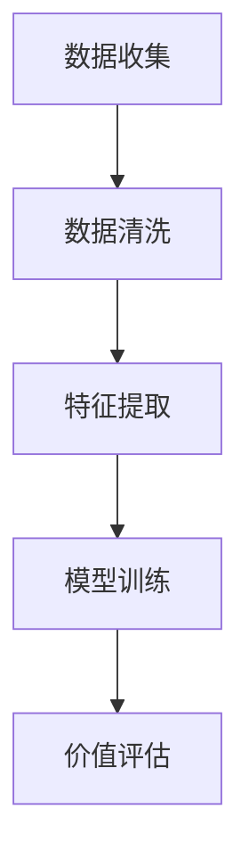
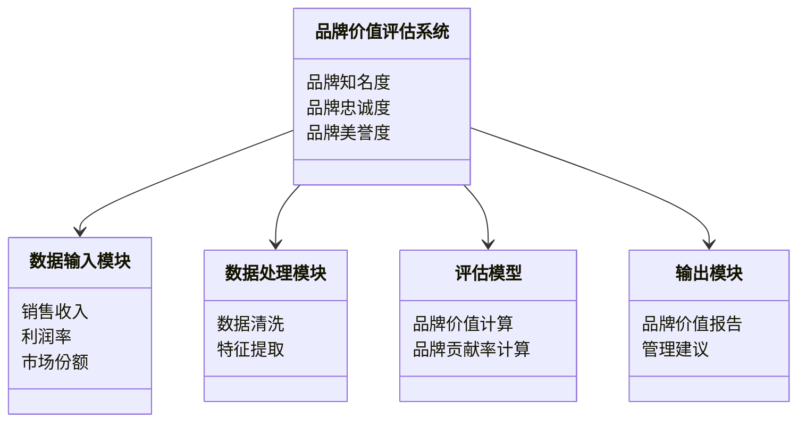
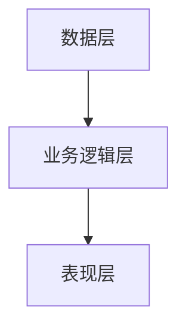
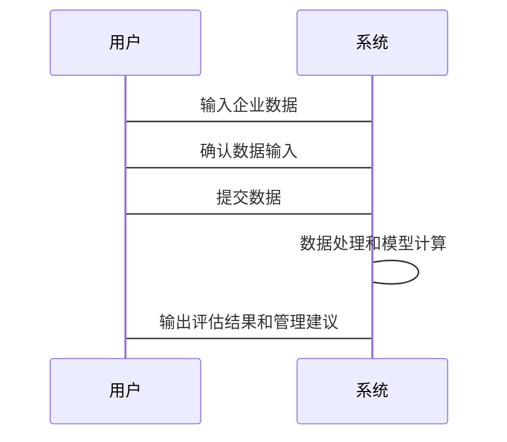

                 

# 彼得林奇如何评估公司的品牌价值

> 关键词：品牌价值评估，彼得林奇，投资策略，品牌资产，企业估值

> 摘要：本文深入探讨了彼得·林奇如何评估公司的品牌价值，从品牌价值的定义与重要性、评估方法与模型、系统架构设计到实际案例分析，全面解析品牌价值评估的逻辑与实践。文章结合理论与实践，详细阐述了品牌价值评估的算法原理、系统架构设计以及项目实战，帮助读者掌握品牌价值评估的核心方法与技巧。

---

## 第一部分: 品牌价值评估的背景与意义

### 第1章: 品牌价值评估的背景与意义

#### 1.1 品牌价值的定义与重要性

##### 1.1.1 品牌价值的定义

品牌价值是指品牌在市场中所能带来的经济价值，通常通过品牌知名度、品牌忠诚度、品牌认知度等指标来衡量。品牌价值是企业无形资产的重要组成部分，反映了品牌在消费者心中的地位和影响力。

##### 1.1.2 品牌价值对企业的重要性

品牌价值是企业市场竞争力的重要体现，高品牌价值意味着企业在市场上具有更强的议价能力、客户忠诚度和市场影响力。品牌价值还直接影响企业的估值，是投资者评估企业价值的重要依据之一。

##### 1.1.3 品牌价值与企业长期发展的关系

品牌价值是企业长期发展的基石。一个强大的品牌能够为企业带来持续的市场份额和客户忠诚度，从而为企业创造稳定的收入来源和利润。品牌价值的提升通常伴随着企业核心竞争力的增强，是企业长期发展的关键因素。

#### 1.2 彼得·林奇投资理念的核心要素

##### 1.2.1 彼得·林奇的投资者身份认知

彼得·林奇是美国著名的投资专家，以其独特的投资策略和对企业的深入分析闻名。他认为，投资者应该以企业所有者的身份来看待投资，关注企业的基本面和长期发展潜力。

##### 1.2.2 林奇的价值投资策略

林奇的价值投资策略强调对企业的深入研究和长期持有。他认为，投资的核心是找到那些具有持续增长潜力的企业，并且在市场低估时买入，在市场高估时卖出。

##### 1.2.3 林奇对品牌价值的关注点

林奇在评估企业价值时，非常关注品牌价值。他认为，强大的品牌能够为企业带来持续的竞争优势，是企业长期盈利能力的重要保障。

#### 1.3 品牌价值评估的现状与挑战

##### 1.3.1 品牌价值评估的复杂性

品牌价值评估的复杂性主要来源于品牌资产的无形性和难以量化的特性。品牌价值受到多种因素的影响，包括市场环境、消费者认知、竞争对手行为等，这些因素使得品牌价值评估具有较高的难度。

##### 1.3.2 当前品牌价值评估的主要方法

目前，品牌价值评估主要采用以下几种方法：
1. **品牌资产评估法**：通过评估品牌相关的资产价值来衡量品牌价值。
2. **品牌收益法**：通过分析品牌对企业收益的贡献来评估品牌价值。
3. **市场比较法**：通过比较同类企业的品牌价值来评估品牌价值。

##### 1.3.3 传统方法的局限性与改进方向

传统品牌价值评估方法存在以下局限性：
1. **难以量化**：品牌价值的量化难度较高，传统方法难以准确反映品牌价值。
2. **忽视动态变化**：传统方法往往忽视了品牌价值的动态变化，难以适应快速变化的市场环境。

改进方向：
1. **引入大数据分析**：通过大数据技术，量化品牌在市场中的影响力和消费者认知。
2. **动态评估模型**：建立动态评估模型，实时跟踪品牌价值的变化。

#### 1.4 本章小结

本章从品牌价值的定义与重要性入手，详细阐述了彼得·林奇的投资理念和对品牌价值的关注点，同时分析了当前品牌价值评估的现状与挑战。通过本章的学习，读者可以理解品牌价值在企业估值中的重要性，以及传统评估方法的局限性。

---

## 第二部分: 品牌价值的核心概念与联系

### 第2章: 品牌价值的核心概念与联系

#### 2.1 品牌价值的核心概念

##### 2.1.1 品牌的核心要素

品牌的核心要素包括品牌名称、品牌标志、品牌口号、品牌故事等。这些要素共同构成了品牌在市场中的形象和认知。

##### 2.1.2 品牌认知与品牌忠诚度

品牌认知是指消费者对品牌的了解和记忆，品牌忠诚度是指消费者对品牌的偏好和忠诚程度。两者共同影响着品牌价值的高低。

##### 2.1.3 品牌资产的构成

品牌资产主要包括品牌知名度、品牌美誉度、品牌忠诚度等。这些资产共同构成了品牌在市场中的价值。

#### 2.2 品牌价值与财务表现的关系

##### 2.2.1 品牌价值对财务的影响

品牌价值直接影响企业的销售收入、利润率和市场份额。强大的品牌能够为企业带来更高的销售价格和更大的市场份额，从而提升企业的财务表现。

##### 2.2.2 品牌价值与股价的关联性

品牌价值与股价密切相关。高品牌价值的企业通常具有较高的市场估值和股价表现。投资者通常会关注企业的品牌价值，以评估其投资价值。

##### 2.2.3 品牌价值对企业估值的影响

品牌价值是企业整体估值的重要组成部分。高品牌价值的企业通常具有较高的市场估值，尤其是在品牌驱动型行业中。

#### 2.3 品牌价值与企业竞争力的对比

##### 2.3.1 品牌竞争力的定义

品牌竞争力是指品牌在市场中与竞争对手相比的竞争优势。强大的品牌竞争力意味着品牌能够在市场中占据优势地位。

##### 2.3.2 品牌价值与企业竞争力的差异

品牌价值是企业整体市场价值的重要组成部分，而品牌竞争力则更关注品牌在市场中的竞争优势。两者既有区别又有联系，共同影响着企业的市场表现。

##### 2.3.3 品牌价值对竞争力的提升作用

强大的品牌价值能够提升企业的市场地位和竞争优势，是企业竞争力的重要保障。

#### 2.4 品牌价值与企业生命周期的关系

##### 2.4.1 品牌价值在企业初创期的作用

在企业初创期，品牌价值的建立至关重要。通过有效的品牌推广和营销，企业可以迅速建立品牌知名度和认知度，为后续发展奠定基础。

##### 2.4.2 品牌价值在成熟期的表现

在企业成熟期，品牌价值通常达到峰值。强大的品牌价值能够为企业带来稳定的市场份额和客户忠诚度，确保企业的持续发展。

##### 2.4.3 品牌价值在衰退期的调整策略

在企业衰退期，品牌价值的维护和提升尤为重要。通过品牌创新和市场调整，企业可以延缓品牌价值的衰退，为企业的复苏提供支持。

#### 2.5 本章小结

本章从品牌价值的核心概念出发，详细分析了品牌价值与财务表现、企业竞争力以及企业生命周期的关系。通过本章的学习，读者可以全面理解品牌价值在企业中的多重作用和影响。

---

## 第三部分: 品牌价值评估的算法原理

### 第3章: 品牌价值评估的算法原理

#### 3.1 品牌价值评估的数学模型

##### 3.1.1 品牌价值的量化公式

品牌价值的量化公式通常包括以下因素：
$$ \text{品牌价值} = \text{销售收入} \times \text{品牌贡献率} $$

##### 3.1.2 品牌价值与销售收入的关系

品牌价值与销售收入密切相关。强大的品牌价值能够提升企业的销售收入，而销售收入的增长又能够进一步提升品牌价值。

##### 3.1.3 品牌价值与利润率的关联性

品牌价值与利润率之间存在正相关关系。高品牌价值的企业通常具有较高的利润率，因为品牌溢价能够为企业带来更高的销售价格和更大的市场份额。

#### 3.2 品牌价值评估的算法流程

##### 3.2.1 数据收集与清洗

数据收集与清洗是品牌价值评估的第一步。需要收集企业的财务数据、市场数据、消费者数据等，并对数据进行清洗和预处理。

##### 3.2.2 数据特征提取

数据特征提取是将收集到的数据转化为有用的特征，以便后续建模和分析。常用的特征包括销售收入、利润率、市场份额、品牌知名度等。

##### 3.2.3 数据建模与预测

数据建模与预测是品牌价值评估的核心步骤。通常采用回归分析、聚类分析等方法，建立品牌价值评估模型，并对品牌价值进行预测。

#### 3.3 品牌价值评估的数学公式

##### 3.3.1 品牌价值的计算公式

品牌价值的计算公式如下：
$$ \text{品牌价值} = \text{销售收入} \times \text{品牌贡献率} $$

##### 3.3.2 品牌贡献率的计算

品牌贡献率的计算公式如下：
$$ \text{品牌贡献率} = \frac{\text{品牌相关收入}}{\text{总收入}} $$

#### 3.4 品牌价值评估的流程图

#### 3.5 本章小结

本章从品牌价值评估的数学模型和算法流程入手，详细讲解了品牌价值的量化公式和计算方法。通过本章的学习，读者可以掌握品牌价值评估的核心算法和流程。

---

## 第四部分: 品牌价值评估的系统分析与架构设计

### 第4章: 品牌价值评估的系统分析与架构设计

#### 4.1 系统分析

##### 4.1.1 问题场景介绍

品牌价值评估系统需要解决的主要问题是如何准确量化品牌价值，并为企业提供有效的品牌管理建议。

##### 4.1.2 项目目标与范围

项目的总体目标是开发一个品牌价值评估系统，能够对企业品牌价值进行准确评估，并提供品牌管理建议。项目的范围包括数据收集、模型建立、系统设计和功能实现。

##### 4.1.3 需求分析与边界条件

需求分析包括数据收集、模型建立、系统设计和功能实现。边界条件包括数据的准确性和完整性、模型的准确性和实时性等。

#### 4.2 系统功能设计

##### 4.2.1 领域模型设计

领域模型设计主要涉及品牌价值评估的核心要素，包括品牌知名度、品牌忠诚度、品牌美誉度等。

##### 4.2.2 系统架构设计

系统架构设计包括数据层、业务逻辑层和表现层。数据层负责数据的存储和管理，业务逻辑层负责数据处理和模型计算，表现层负责用户界面和结果输出。

##### 4.2.3 系统接口设计

系统接口设计包括数据输入接口、模型调用接口和结果输出接口。数据输入接口负责接收企业的财务数据和市场数据，模型调用接口负责调用品牌价值评估模型，结果输出接口负责输出评估结果和管理建议。

##### 4.2.4 系统交互设计

系统交互设计主要涉及用户与系统之间的交互流程。用户首先输入企业数据，系统进行数据处理和模型计算，最后输出评估结果和管理建议。

#### 4.3 本章小结

本章从系统分析与架构设计的角度，详细阐述了品牌价值评估系统的功能设计、架构设计和交互设计。通过本章的学习，读者可以理解品牌价值评估系统的整体架构和实现流程。

---

## 第五部分: 品牌价值评估的项目实战

### 第5章: 品牌价值评估的项目实战

#### 5.1 项目背景与目标

##### 5.1.1 项目背景

本项目旨在开发一个品牌价值评估系统，能够对企业品牌价值进行准确评估，并提供品牌管理建议。

##### 5.1.2 项目目标

项目的总体目标是开发一个品牌价值评估系统，能够对企业品牌价值进行准确评估，并提供品牌管理建议。具体目标包括数据收集、模型建立、系统设计和功能实现。

#### 5.2 项目环境与工具

##### 5.2.1 环境配置

项目需要以下环境和工具：
- Python编程语言
- 数据分析库（Pandas、NumPy）
- 可视化库（Matplotlib、Seaborn）
- 机器学习库（Scikit-learn）
- 开发工具（PyCharm）

##### 5.2.2 数据来源与获取方法

数据来源包括企业的财务数据、市场数据和消费者数据。数据获取方法包括公开数据爬取、API接口调用和数据购买。

#### 5.3 项目核心实现

##### 5.3.1 数据清洗与预处理

数据清洗与预处理是品牌价值评估的第一步，主要包括数据的缺失值处理、异常值处理和数据转换。

##### 5.3.2 数据特征提取

数据特征提取是将原始数据转化为有用的特征，以便后续建模和分析。常用的特征包括销售收入、利润率、市场份额、品牌知名度等。

##### 5.3.3 模型建立与训练

模型建立与训练是品牌价值评估的核心步骤。通常采用回归分析、聚类分析等方法，建立品牌价值评估模型，并对模型进行训练和优化。

##### 5.3.4 模型评估与优化

模型评估与优化是确保模型准确性和可靠性的关键步骤。通过交叉验证、混淆矩阵等方法，评估模型的性能，并进行参数调优和模型优化。

##### 5.3.5 系统实现

系统实现包括数据输入模块、数据处理模块、评估模型和输出模块。数据输入模块负责接收企业的财务数据和市场数据，数据处理模块负责数据清洗和特征提取，评估模型负责品牌价值计算，输出模块负责输出评估结果和管理建议。

##### 5.3.6 系统测试与部署

系统测试与部署是确保系统稳定性和可靠性的关键步骤。通过单元测试、集成测试和用户测试，验证系统的功能和性能，并进行系统部署和上线。

#### 5.4 项目小结

本章通过实际案例，详细讲解了品牌价值评估系统的开发与实现。通过本章的学习，读者可以掌握品牌价值评估系统的核心实现步骤和方法。

---

## 第六部分: 品牌价值评估的总结与展望

### 第6章: 品牌价值评估的总结与展望

#### 6.1 品牌价值评估的最佳实践

##### 6.1.1 数据收集与处理的注意事项

数据收集与处理是品牌价值评估的基础，需要注意数据的准确性和完整性。在数据处理过程中，应尽量减少数据丢失和偏差，确保数据的质量。

##### 6.1.2 模型选择与优化的技巧

模型选择与优化是品牌价值评估的关键，需要根据具体问题和数据特点选择合适的模型，并通过参数调优和模型优化，提高模型的准确性和可靠性。

##### 6.1.3 系统设计与实现的要点

系统设计与实现是品牌价值评估的核心，需要注重系统的可扩展性、可维护性和可移植性。在系统实现过程中，应遵循模块化设计和代码规范，确保系统的稳定性和可靠性。

#### 6.2 品牌价值评估的注意事项

##### 6.2.1 品牌价值评估的局限性

品牌价值评估的局限性主要体现在品牌资产的无形性和市场环境的不确定性。品牌价值受到多种因素的影响，包括消费者认知、市场环境和竞争对手行为等，这些因素使得品牌价值评估具有较高的难度。

##### 6.2.2 品牌价值评估的潜在风险

品牌价值评估的潜在风险包括数据偏差、模型过拟合和市场环境变化等。数据偏差可能导致评估结果的不准确，模型过拟合可能导致模型的泛化能力差，市场环境变化可能导致评估结果的失效。

##### 6.2.3 品牌价值评估的应对策略

为了应对品牌价值评估的局限性和潜在风险，可以采取以下策略：
1. **数据质量管理**：加强数据质量管理，确保数据的准确性和完整性。
2. **模型优化**：通过模型优化和参数调优，提高模型的准确性和可靠性。
3. **动态评估**：建立动态评估模型，实时跟踪品牌价值的变化，及时调整评估策略。

#### 6.3 品牌价值评估的未来展望

##### 6.3.1 品牌价值评估的未来趋势

随着大数据技术的不断发展，品牌价值评估将更加依赖于大数据分析和人工智能技术。未来，品牌价值评估将更加精准和动态，能够实时跟踪品牌价值的变化，并为企业提供更加智能化的品牌管理建议。

##### 6.3.2 新技术对品牌价值评估的影响

新技术，如人工智能、区块链和物联网等，将对品牌价值评估产生深远影响。人工智能技术可以提高品牌价值评估的准确性和效率，区块链技术可以提高数据的安全性和可信度，物联网技术可以提供更加实时和精准的市场数据。

##### 6.3.3 品牌价值评估的未来发展建议

为了适应未来的发展趋势，品牌价值评估需要不断引入新技术和新方法，加强数据管理，提高模型的准确性和可靠性。同时，企业需要加强品牌管理，提升品牌价值，以应对未来市场竞争的挑战。

#### 6.4 本章小结

本章从品牌价值评估的总结与展望入手，详细分析了品牌价值评估的最佳实践、注意事项和未来趋势。通过本章的学习，读者可以全面了解品牌价值评估的现状与未来发展方向。

---

## 作者：AI天才研究院/AI Genius Institute & 禅与计算机程序设计艺术 /Zen And The Art of Computer Programming

---

感谢您的耐心阅读！如果本文对您有所帮助，请不要忘记点赞和分享哦！

