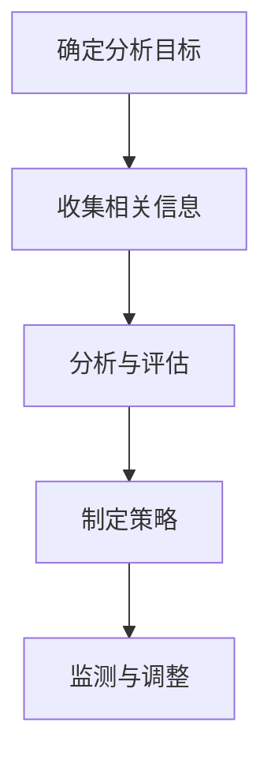
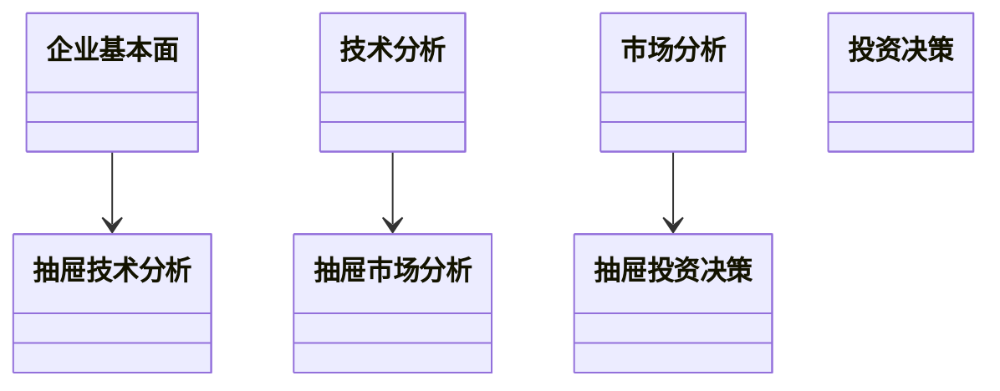
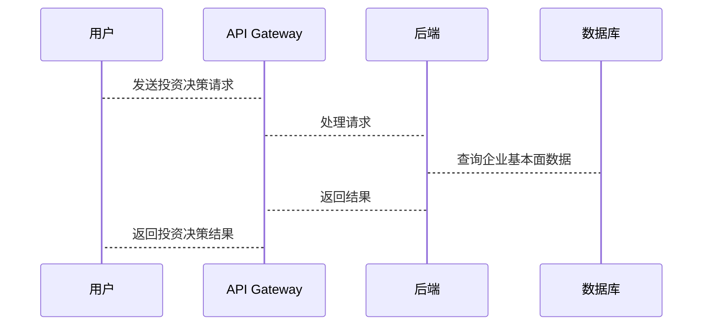

                 


# 彼得林奇对公司研发方向的前瞻性分析

## 关键词：彼得·林奇，研发方向，前瞻性分析，投资策略，技术分析，基本面分析

## 摘要：  
本文从彼得·林奇的投资理念出发，结合技术分析和基本面分析的方法，深入探讨研发方向的前瞻性分析框架。通过详细分析研发方向的核心要素、评估指标及分析流程，本文为投资者提供了科学的决策依据。文章还结合实际案例，展示了如何将彼得·林奇的分析框架应用于具体投资决策中，帮助投资者更好地把握市场趋势和企业研发方向。

---

## 正文

### 第一部分：背景介绍

#### 第1章：投资与研发方向概述

##### 1.1 投资的基本概念

###### 1.1.1 投资的定义与分类
- 投资的定义：将资金投入特定领域以获取收益的行为。
- 投资的分类：股票、债券、房地产、创业投资等。
- 投资的基本原则：分散投资、长期持有、价值投资。

###### 1.1.2 投资的基本原则
- 分散投资：降低风险，避免将所有资金投入单一领域。
- 长期持有：耐心持有优质资产，避免频繁交易。
- 价值投资：寻找具有长期竞争优势和合理估值的企业。

###### 1.1.3 投资市场的基本结构
- 一级市场：新股发行、私募融资等。
- 二级市场：股票交易所、债券市场等。
- 市场参与方：投资者、企业、中介机构、监管机构。

##### 1.2 彼得·林奇的投资理念

###### 1.2.1 彼得·林奇的生平简介
- 彼得·林奇：美国著名投资经理人，富达麦哲伦基金的传奇经理。
- 成功案例：管理基金期间，年平均回报率超过29%，创造了辉煌的投资业绩。

###### 1.2.2 彼得·林奇的投资风格
- 价值投资：寻找被市场低估的企业。
- 中小盘股：关注具有成长潜力的中小型企业。
- 长期持有：耐心持有优质资产，避免短期波动。

###### 1.2.3 彼得·林奇的成功案例
- 投资 Pfizer 的案例：通过基本面分析，发现其低估价值，长期持有获得丰厚回报。

##### 1.3 技术分析与基本面分析

###### 1.3.1 技术分析的基本概念
- 技术分析：通过历史价格、成交量等数据，预测未来市场走势。
- 常用工具：K线图、均线、MACD、RSI等。
- 技术分析的局限性：忽视基本面因素，依赖于市场情绪。

###### 1.3.2 基本面分析的基本概念
- 基本面分析：通过企业的财务数据、行业地位、管理团队等因素，评估其内在价值。
- 常用指标：PE（市盈率）、ROE（净资产收益率）、毛利率等。
- 基本面分析的优势：能够发现企业的内在价值，但需要大量数据支持。

###### 1.3.3 两种分析方法的对比与结合
- 对比：技术分析侧重市场情绪，基本面分析侧重企业价值。
- 结合：结合两者，技术分析辅助判断短期趋势，基本面分析评估长期价值。

##### 1.4 研发方向的重要性

###### 1.4.1 研发在企业中的地位
- 研发是企业创新的核心，决定企业的未来发展方向。
- 研发能力是企业竞争力的重要组成部分。

###### 1.4.2 研发方向对企业未来的影响
- 成功的研发方向能够带来技术优势和市场机会。
- 错误的研发方向可能导致资源浪费和市场失败。

###### 1.4.3 研发方向的前瞻性分析方法
- 前瞻性分析：通过分析行业趋势、技术发展、市场需求，预测研发方向的潜力。
- 研发方向的评估指标：技术可行性、市场潜力、经济效益、风险评估。

---

#### 第2章：研发方向的前瞻性分析框架

##### 2.1 研发方向分析的核心要素

###### 2.1.1 行业趋势分析
- 行业生命周期：初创期、成长期、成熟期、衰退期。
- 技术发展趋势：人工智能、大数据、区块链等新兴技术。

###### 2.1.2 技术发展周期
- 技术成熟度：早期技术、成熟技术、衰退技术。
- 技术替代性：新技术对旧技术的替代程度。

###### 2.1.3 市场需求预测
- 市场容量：潜在市场规模（TAM）、服务可得市场规模（SAM）、服务可实现市场规模（SOP）。
- 市场增长速度：年复合增长率（CAGR）。

###### 2.1.4 竞争格局分析
- 竞争对手分析：主要竞争对手的技术、产品、市场份额。
- 市场进入壁垒：技术壁垒、资金壁垒、政策壁垒。

##### 2.2 研发方向的评估指标

###### 2.2.1 技术可行性评估
- 技术可行性：现有技术是否可行，是否存在技术瓶颈。
- 技术成熟度：技术是否成熟，是否需要进一步研发。

###### 2.2.2 市场潜力评估
- 市场需求：目标市场是否足够大，是否有足够的增长空间。
- 市场进入壁垒：进入市场的难易程度。

###### 2.2.3 经济效益评估
- 投资回报率（ROI）：研发方向的投资回报率是否合理。
- 投资回收期：研发方向的投资回收周期是否在可接受范围内。

###### 2.2.4 风险评估
- 技术风险：技术研发是否可能失败。
- 市场风险：市场需求是否可能变化。
- 政策风险：政策是否可能变化，影响研发方向。

##### 2.3 研发方向的前瞻性分析流程

###### 2.3.1 确定分析目标
- 明确研发方向的分析目标：例如，评估某项技术的市场潜力。

###### 2.3.2 收集相关信息
- 行业报告：查阅行业分析报告，了解行业发展趋势。
- 技术文献：收集相关技术的文献资料，了解技术发展现状。
- 市场数据：收集市场需求数据，了解目标市场的容量和增长潜力。

###### 2.3.3 分析与评估
- 技术可行性分析：评估技术研发的可行性。
- 市场潜力分析：评估目标市场的潜力。
- 经济效益分析：评估研发方向的经济效益。
- 风险评估：评估研发方向的主要风险。

###### 2.3.4 制定策略
- 确定研发方向的优先级：根据分析结果，确定哪些研发方向优先实施。
- 制定研发计划：制定详细的研发计划，包括时间表、资源分配等。
- 监测与调整：定期监测研发方向的进展，根据市场变化进行调整。

---

### 第二部分：核心概念与联系

#### 第3章：彼得·林奇分析框架的核心要素

##### 3.1 核心概念原理

###### 3.1.1 投资决策的核心要素
- 企业基本面：财务状况、盈利能力、管理团队。
- 行业趋势：行业生命周期、技术发展、市场需求。

###### 3.1.2 研发方向的评估维度
- 技术可行性：技术研发是否可行。
- 市场潜力：目标市场的容量和增长潜力。
- 经济效益：研发方向的投资回报率。

###### 3.1.3 前瞻性分析的关键点
- 预测未来市场需求：通过分析行业趋势和技术发展，预测未来市场需求。
- 评估技术可行性：通过技术文献和专家意见，评估技术研发的可行性。
- 评估投资回报：通过财务模型，评估研发方向的经济效益。

##### 3.2 核心概念属性特征对比表格

| **核心概念** | **技术分析** | **基本面分析** |
|--------------|--------------|----------------|
| **定义**     | 通过历史价格、成交量等数据，预测未来市场走势。 | 通过企业的财务数据、行业地位、管理团队等因素，评估其内在价值。 |
| **优势**     | 能够发现短期市场趋势，帮助投资者进行短期交易。 | 能够发现企业的长期价值，帮助投资者进行长期投资。 |
| **劣势**     | 依赖于市场情绪，忽视基本面因素。 | 需要大量数据支持，分析过程复杂。 |

##### 3.3 ER实体关系图架构

```mermaid
erd
    企业
    : 基本面数据
    技术
    : 技术可行性
    市场
    : 市场需求
    投资决策
    : 研发方向评估
```

---

#### 第4章：研发方向的评估指标与分析流程

##### 4.1 评估指标

###### 4.1.1 技术可行性评估
- 技术成熟度：技术是否成熟，是否需要进一步研发。
- 技术替代性：新技术是否可能替代现有技术。

###### 4.1.2 市场潜力评估
- 市场容量：潜在市场规模（TAM）、服务可得市场规模（SAM）、服务可实现市场规模（SOP）。
- 市场增长速度：年复合增长率（CAGR）。

###### 4.1.3 经济效益评估
- 投资回报率（ROI）：研发方向的投资回报率是否合理。
- 投资回收期：研发方向的投资回收周期是否在可接受范围内。

##### 4.2 分析流程



---

### 第三部分：算法原理讲解

#### 第5章：彼得·林奇分析框架的数学模型

##### 5.1 技术可行性评估的数学模型

###### 5.1.1 技术成熟度评估模型
- 指标：技术成熟度（MT）、技术替代性（AT）。
- 公式：MT = (现有技术的成熟度 + 新技术的潜力) / 2。
- 解释：MT 越高，技术越成熟。

###### 5.1.2 技术可行性评估公式
$$ \text{技术可行性} = \frac{\text{技术成熟度} + \text{技术潜力}}{2} $$

##### 5.2 市场潜力评估的数学模型

###### 5.2.1 市场容量评估模型
- 指标：潜在市场规模（TAM）、服务可得市场规模（SAM）、服务可实现市场规模（SOP）。
- 公式：SOP = SAM × 市场渗透率。
- 解释：SOP 表示企业在可实现市场规模中的份额。

###### 5.2.2 市场增长速度评估公式
$$ \text{CAGR} = \left( \frac{\text{最终年收入}}{\text{初始年收入}} \right)^{\frac{1}{n}} - 1 $$

##### 5.3 投资回报率评估模型

###### 5.3.1 投资回报率公式
$$ \text{ROI} = \frac{\text{净利润}}{\text{投资成本}} \times 100\% $$

###### 5.3.2 投资回收期计算公式
$$ \text{投资回收期} = \frac{\text{初始投资}}{\text{年现金流}} $$

---

### 第四部分：系统分析与架构设计方案

#### 第6章：研发方向评估系统的构建

##### 6.1 系统功能设计

###### 6.1.1 领域模型


##### 6.2 系统架构设计

###### 6.2.1 系统架构图


##### 6.3 系统接口设计

###### 6.3.1 API 接口
- GET /market-analysis：获取市场分析数据。
- POST /investment-decision：提交投资决策请求。

##### 6.4 系统交互设计

###### 6.4.1 序列图


---

### 第五部分：项目实战

#### 第7章：研发方向评估的实战案例

##### 7.1 项目环境安装

###### 7.1.1 系统需求
- 操作系统：Windows 10 或更高版本，macOS 10.15 或更高版本。
- 开发工具：Python 3.8+，Jupyter Notebook，Git。

###### 7.1.2 环境配置
```bash
pip install numpy pandas matplotlib
```

##### 7.2 核心代码实现

###### 7.2.1 技术可行性评估
```python
def calculate_technology_feasibility(technology_maturity, technology_potential):
    return (technology_maturity + technology_potential) / 2

technology_maturity = 80  # 分值：0-100
technology_potential = 70  # 分值：0-100
feasibility = calculate_technology_feasibility(technology_maturity, technology_potential)
print(f"技术可行性：{feasibility}%")
```

###### 7.2.2 市场潜力评估
```python
def calculate_market_potential(tam, sam, market_penetration):
    sop = sam * market_penetration
    return sop

tam = 1000000000  # 总潜在市场
sam = 500000000    # 服务可得市场规模
market_penetration = 0.3  # 市场渗透率
market_potential = calculate_market_potential(tam, sam, market_penetration)
print(f"市场潜力：{market_potential}")
```

##### 7.3 代码解读与分析
- 技术可行性评估：通过加权平均计算技术可行性，权重分别为技术成熟度和技术潜力。
- 市场潜力评估：通过服务可得市场规模乘以市场渗透率，计算服务可实现市场规模（SOP）。

---

### 第六部分：总结与建议

#### 第8章：最佳实践与注意事项

##### 8.1 最佳实践

###### 8.1.1 组合投资
- 通过组合投资，分散风险，降低单一研发方向失败的影响。

###### 8.1.2 定期评估
- 定期评估研发方向的进展，根据市场变化进行调整。

##### 8.2 注意事项

###### 8.2.1 避免过度乐观
- 在评估研发方向时，避免过于乐观，充分考虑技术风险和市场风险。

###### 8.2.2 关注政策变化
- 研发方向的选择需要关注政策变化，避免因政策调整导致投资失败。

#### 第9章：小结与拓展阅读

##### 9.1 小结
- 彼得·林奇的前瞻性分析框架结合了技术分析和基本面分析，帮助投资者评估研发方向的潜力。
- 通过系统化的分析流程，投资者可以做出更科学的投资决策。

##### 9.2 拓展阅读
- 《彼得·林奇的投资策略》
- 《技术分析实战指南》
- 《基本面分析深度解读》

---

### 作者信息

作者：AI天才研究院/AI Genius Institute & 禅与计算机程序设计艺术/Zen And The Art of Computer Programming

