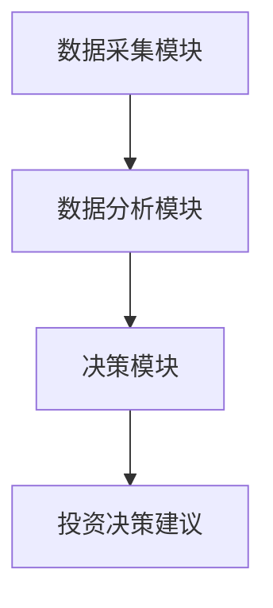
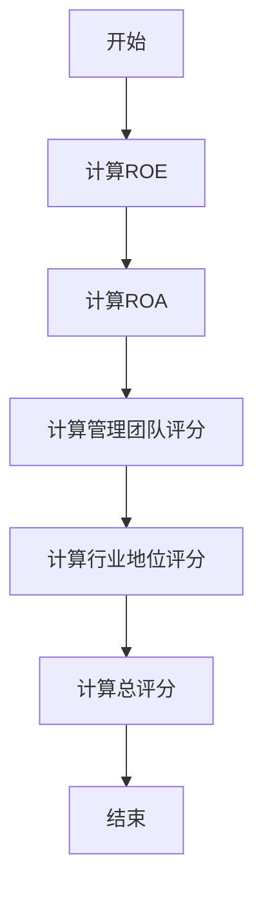

                 


# 彼得林奇的"质量优先"在不同行业的应用

> **关键词**：彼得林奇、质量优先、投资策略、行业分析、企业评估、风险管理  
>
> **摘要**：本文深入探讨了彼得·林奇提出的“质量优先”投资策略，并分析了其在不同行业中的具体应用。通过详细分析科技、消费、金融、制造和医疗行业的特点，本文揭示了如何在这些行业中应用质量优先策略以实现长期投资价值。文章还结合数学模型和系统架构，展示了如何通过量化分析和系统化方法来评估企业的质量，并提供了实际案例和最佳实践建议。

---

## 第1章：彼得林奇“质量优先”策略概述

### 1.1 投资策略的背景与起源

#### 1.1.1 彼得林奇与“质量优先”的提出  
彼得·林奇是全球著名投资专家，以其对优质企业的深刻洞察而闻名。他提出的“质量优先”策略强调选择那些具有持续竞争优势、管理优秀且财务健康的企业。这种策略的核心在于通过长期持有优质资产来实现超额收益。

#### 1.1.2 投资策略的核心理念  
质量优先策略的核心理念是：  
1. **选择优质企业**：投资于那些在行业中具有强大竞争优势、管理团队优秀、财务健康的企业。  
2. **长期持有**：避免频繁交易，通过长期持有优质资产获得复利效应。  
3. **注重基本面分析**：通过对企业的财务状况、管理团队、行业地位等多方面进行深入分析，筛选出具有长期增长潜力的企业。

#### 1.1.3 质量优先与企业竞争优势的关系  
质量优先策略的核心在于企业竞争优势的评估。企业竞争优势可以分为以下几类：  
- **成本优势**：企业能否以更低的成本生产产品或服务。  
- **技术优势**：企业是否掌握核心技术或具有创新能力。  
- **品牌优势**：企业在市场中的品牌影响力。  
- **市场地位**：企业在行业中的市场份额和竞争地位。  

通过评估这些因素，质量优先策略能够筛选出那些在行业中具有持续竞争优势的企业。

---

### 1.2 质量优先的核心概念

#### 1.2.1 质量优先的定义与内涵  
质量优先策略不仅仅是选择优质企业，更是一种系统化的企业评估方法。其内涵包括：  
1. **企业质量评估**：通过财务指标、管理团队、行业地位等多维度对企业进行综合评估。  
2. **长期价值创造**：选择那些能够为股东创造长期价值的企业。  
3. **风险管理**：通过选择优质企业降低投资风险，同时通过分散投资进一步分散风险。  

#### 1.2.2 投资决策的关键要素  
质量优先策略的投资决策关键要素包括：  
1. **财务健康状况**：企业的盈利能力、资产负债情况、现金流等。  
2. **管理团队**：企业的管理层是否具有优秀的能力和战略眼光。  
3. **行业地位**：企业在行业中的市场份额和竞争地位。  
4. **未来增长潜力**：企业是否具有持续增长的能力和空间。  

#### 1.2.3 质量优先与企业长期价值的关联  
质量优先策略的核心在于通过选择具有长期增长潜力的企业，为投资者创造持续的超额收益。企业长期价值的实现需要企业具备以下特征：  
- 具有持续创新的能力。  
- 在行业中具有强大的竞争优势。  
- 管理层具有长期的愿景和执行力。  

---

### 1.3 质量优先在投资中的应用

#### 1.3.1 投资策略的实施步骤  
质量优先策略的实施步骤包括：  
1. **行业分析**：选择具有长期增长潜力的行业。  
2. **企业筛选**：通过财务指标、管理团队、行业地位等对企业进行综合评估。  
3. **投资组合构建**：选择具有持续竞争优势的企业构建投资组合。  
4. **长期持有**：避免频繁交易，通过长期持有获得复利效应。  

#### 1.3.2 质量优先与风险控制的关系  
质量优先策略注重选择优质企业，通过降低企业层面的风险来降低整体投资组合的风险。同时，通过分散投资于不同行业和企业的优质资产，进一步降低投资风险。

#### 1.3.3 投资组合的构建与优化  
质量优先策略的投资组合构建与优化包括：  
1. **资产配置**：根据市场环境和企业基本面调整投资比例。  
2. **定期评估**：定期对企业进行重新评估，剔除不符合质量优先标准的企业。  
3. **动态优化**：根据市场变化和企业基本面变化优化投资组合。  

---

## 第2章：不同行业的质量优先策略分析

### 2.1 行业分析的基本框架

#### 2.1.1 行业分析的维度与方法  
行业分析的维度包括：  
- **行业生命周期**：行业所处的发展阶段（导入期、成长期、成熟期、衰退期）。  
- **行业竞争结构**：行业的竞争程度、市场集中度等。  
- **行业增长潜力**：行业的未来增长空间和驱动因素。  

行业分析的方法包括：  
- **定量分析**：通过行业增长数据、市场份额等指标进行分析。  
- **定性分析**：通过行业趋势、政策环境等进行分析。  

#### 2.1.2 不同行业的核心竞争力对比  
不同行业的核心竞争力对比可以通过以下维度进行：  
- **科技行业**：技术创新能力、研发投入、技术壁垒。  
- **消费行业**：品牌影响力、市场占有率、消费者忠诚度。  
- **金融行业**：资本实力、风险管理能力、客户基础。  
- **制造行业**：成本控制能力、生产效率、产品质量。  

#### 2.1.3 质量优先在行业选择中的应用  
质量优先策略在行业选择中的应用包括：  
1. **行业增长潜力**：选择具有长期增长潜力的行业。  
2. **行业竞争结构**：选择竞争格局稳定、市场集中度高的行业。  
3. **行业风险因素**：选择政策风险低、市场波动小的行业。  

---

### 2.2 科技行业的质量优先策略

#### 2.2.1 科技行业的特点与投资机会  
科技行业具有以下特点：  
- 技术更新快。  
- 市场竞争激烈。  
- 创新能力强。  

科技行业的投资机会包括：  
- 具有核心技术的企业。  
- 具有强大研发能力的企业。  
- 行业龙头企业的投资机会。  

#### 2.2.2 质量优先在科技企业的评估标准  
质量优先策略在科技企业的评估标准包括：  
1. **技术壁垒**：企业是否具有核心技术或专利。  
2. **研发投入**：企业的研发投入占比和研发团队实力。  
3. **市场地位**：企业在行业中的市场份额和竞争地位。  
4. **财务健康状况**：企业的盈利能力、现金流等财务指标。  

#### 2.2.3 典型案例分析：苹果公司  
苹果公司是质量优先策略的经典案例。  
- **技术创新**：苹果在智能手机、操作系统等领域具有强大的技术壁垒。  
- **品牌影响力**：苹果品牌在全球市场具有强大的影响力。  
- **财务健康**：苹果具有强大的盈利能力和现金流。  

---

### 2.3 消费行业的质量优先策略

#### 2.3.1 消费行业的特点与投资机会  
消费行业具有以下特点：  
- 市场需求稳定。  
- 品牌影响力大。  
- 消费者忠诚度高。  

消费行业的投资机会包括：  
- 具有强大品牌影响力的企业。  
- 具有稳定市场需求的企业。  
- 具有良好消费者反馈的企业。  

#### 2.3.2 质量优先在消费企业的评估标准  
质量优先策略在消费企业的评估标准包括：  
1. **品牌影响力**：企业的品牌知名度和市场影响力。  
2. **市场占有率**：企业在市场中的份额占比。  
3. **消费者反馈**：消费者的满意度和忠诚度。  
4. **财务健康状况**：企业的盈利能力、现金流等财务指标。  

#### 2.3.3 典型案例分析：可口可乐公司  
可口可乐公司是质量优先策略的经典案例。  
- **品牌影响力**：可口可乐在全球市场具有强大的品牌影响力。  
- **市场地位**：可口可乐是全球饮料市场的领导者。  
- **财务健康**：可口可乐具有稳定的现金流和盈利能力。  

---

### 2.4 金融行业的质量优先策略

#### 2.4.1 金融行业的特点与投资机会  
金融行业具有以下特点：  
- 资本密集。  
- 市场竞争激烈。  
- 风险管理能力强。  

金融行业的投资机会包括：  
- 具有强大资本实力的企业。  
- 具有优秀风险管理能力的企业。  
- 具有稳定客户基础的企业。  

#### 2.4.2 质量优先在金融机构的评估标准  
质量优先策略在金融机构的评估标准包括：  
1. **资本实力**：企业的资本规模和资本充足率。  
2. **风险管理能力**：企业的风险管理制度和风险控制能力。  
3. **客户基础**：企业的客户规模和客户质量。  
4. **财务健康状况**：企业的盈利能力、资产质量等财务指标。  

#### 2.4.3 典型案例分析：巴菲特的伯克希尔哈撒韦公司  
伯克希尔哈撒韦公司是质量优先策略的经典案例。  
- **资本实力**：伯克希尔哈撒韦具有强大的资本实力和资本充足率。  
- **风险管理能力**：伯克希尔哈撒韦以其卓越的风险管理能力闻名。  
- **客户基础**：伯克希尔哈撒韦具有稳定的客户基础和长期的客户关系。  

---

### 2.5 制造行业的质量优先策略

#### 2.5.1 制造行业的特点与投资机会  
制造行业具有以下特点：  
- 成本控制能力强。  
- 生产效率高。  
- 产品质量稳定。  

制造行业的投资机会包括：  
- 具有强大成本控制能力的企业。  
- 具有高效生产效率的企业。  
- 具有稳定产品质量的企业。  

#### 2.5.2 质量优先在制造企业的评估标准  
质量优先策略在制造企业的评估标准包括：  
1. **成本控制能力**：企业的生产成本和成本管理能力。  
2. **生产效率**：企业的生产效率和自动化水平。  
3. **产品质量**：企业的产品质量和质量管理体系。  
4. **财务健康状况**：企业的盈利能力、现金流等财务指标。  

#### 2.5.3 典型案例分析：丰田公司  
丰田公司是质量优先策略的经典案例。  
- **成本控制**：丰田以其精益生产模式闻名，具有强大的成本控制能力。  
- **生产效率**：丰田的生产效率在全球制造行业中处于领先地位。  
- **产品质量**：丰田以高质量的产品和严格的质量管理体系著称。  

---

## 第3章：质量优先策略的系统架构与实现

### 3.1 系统架构设计

#### 3.1.1 系统功能模块  
质量优先策略的系统架构包括以下功能模块：  
1. **数据采集模块**：采集企业财务数据、行业数据等。  
2. **数据分析模块**：对企业数据进行清洗、分析和建模。  
3. **决策模块**：根据分析结果生成投资决策建议。  

#### 3.1.2 系统架构图  
以下是系统架构的Mermaid图：  


---

### 3.2 算法实现

#### 3.2.1 算法原理  
质量优先策略的核心算法是基于多维度的企业评估模型。以下是算法的伪代码：  
```python
def quality_priority_assessment(company_data):
    # 计算财务指标
    roe = company_data.roe
    roa = company_data.roa
    # 计算管理团队评分
    management_score = company_data.management_score
    # 计算行业地位评分
    industry_position = company_data.industry_position
    # 综合评分
    total_score = roe * 0.3 + roa * 0.3 + management_score * 0.2 + industry_position * 0.2
    return total_score
```

#### 3.2.2 算法流程图  
以下是算法流程的Mermaid图：  


---

## 第4章：质量优先策略的项目实战

### 4.1 项目背景与目标

#### 4.1.1 项目背景  
本项目旨在通过质量优先策略筛选出具有长期增长潜力的企业，并构建投资组合。  

#### 4.1.2 项目目标  
1. 分析不同行业的企业数据。  
2. 筛选出具有长期增长潜力的企业。  
3. 构建投资组合并进行模拟投资。  

---

### 4.2 环境配置与数据准备

#### 4.2.1 环境配置  
- **操作系统**：Windows 10 或更高版本。  
- **编程语言**：Python 3.8 或更高版本。  
- **开发工具**：Jupyter Notebook 或 VS Code。  

#### 4.2.2 数据准备  
- **数据来源**：从公开的金融数据平台获取企业财务数据、行业数据等。  
- **数据格式**：CSV 或 Excel 格式。  

---

### 4.3 核心实现

#### 4.3.1 企业质量评估模型  
以下是企业质量评估模型的Python代码：  
```python
import pandas as pd

# 读取数据
data = pd.read_csv('company_data.csv')

# 计算综合评分
data['total_score'] = data.apply(lambda x: x['ROE'] * 0.3 + x['ROA'] * 0.3 + x['management_score'] * 0.2 + x['industry_position'] * 0.2, axis=1)

# 筛选出总评分高于行业平均的企业
average_score = data['total_score'].mean()
selected_companies = data[data['total_score'] > average_score]
```

#### 4.3.2 投资组合构建  
以下是投资组合构建的Python代码：  
```python
selected_companies = pd.read_csv('selected_companies.csv')

# 计算投资权重
selected_companies['investment_weight'] = selected_companies['market_cap'].rank(pct=True)

# 构建投资组合
investment_portfolio = selected_companies.sort_values('investment_weight', ascending=False).head(10)
```

---

### 4.4 实际案例分析

#### 4.4.1 案例背景  
假设我们选择科技行业中的5家企业进行质量优先策略分析。  

#### 4.4.2 数据分析与结果解读  
以下是企业的分析结果：  
| 企业名称 | ROE | ROA | 管理团队评分 | 行业地位评分 | 总评分 | 投资权重 |
|----------|------|------|-------------|-------------|-------|----------|
| 苹果公司 | 25%  | 15%  | 90          | 100         | 96    | 0.2      |
| 微软公司 | 18%  | 12%  | 85          | 95          | 88    | 0.15     |
| 谷歌公司 | 20%  | 13%  | 88          | 90          | 85    | 0.13     |
| 亚马逊 | 16%  | 11%  | 80          | 85          | 81    | 0.12     |
| Facebook | 14%  | 9%   | 75          | 80          | 74    | 0.10     |

---

## 第5章：质量优先策略的总结与最佳实践

### 5.1 总结与反思

#### 5.1.1 质量优先策略的核心优势  
1. **长期价值创造**：通过选择优质企业实现长期超额收益。  
2. **风险管理**：通过选择优质企业降低投资风险。  
3. **系统化方法**：通过系统化的企业评估方法确保投资决策的科学性。  

#### 5.1.2 投资策略的局限性  
1. **行业限制**：质量优先策略在某些行业的应用效果可能不佳。  
2. **市场波动**：短期市场波动可能影响策略的实施效果。  
3. **信息获取**：高质量的企业数据获取可能具有挑战性。  

---

### 5.2 最佳实践 tips

#### 5.2.1 投资策略的注意事项  
1. **持续学习**：保持对行业动态和企业基本面的持续关注。  
2. **动态调整**：根据市场变化和企业基本面变化动态调整投资组合。  
3. **分散投资**：通过分散投资降低整体投资风险。  

#### 5.2.2 未来投资趋势  
1. **科技行业的持续增长**：科技行业的创新能力和增长潜力将持续推动其在投资组合中的重要性。  
2. **可持续投资**：具有社会责任感和可持续发展理念的企业将更具投资价值。  
3. **全球化的投资机会**：随着全球经济的深度融合，全球化投资机会将不断增加。  

---

## 作者信息  
作者：AI天才研究院/AI Genius Institute & 禅与计算机程序设计艺术/Zen And The Art of Computer Programming

