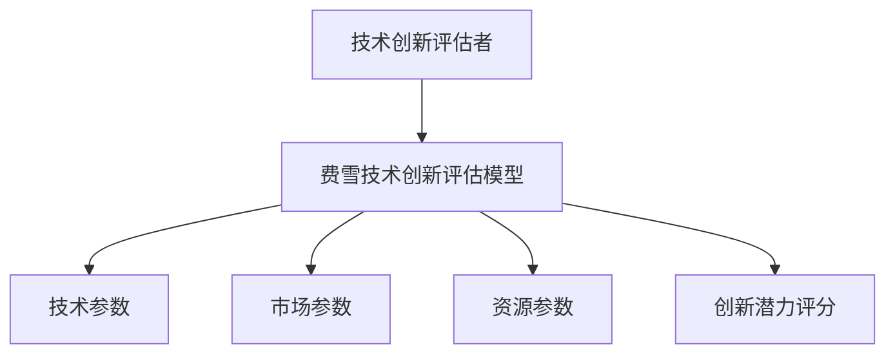

                 


# 费雪的技术创新评估

> **关键词**：技术创新评估、费雪模型、技术可行性、市场潜力、资源投入、创新潜力

> **摘要**：技术创新评估是企业在技术开发和战略规划中至关重要的环节。本文通过费雪技术创新评估模型，详细分析了技术创新评估的核心概念、算法原理、系统设计和实际应用。文章从背景介绍、核心模型、算法原理、系统架构、项目实战到最佳实践，全面阐述了费雪技术创新评估的方法和应用，为企业和技术人员提供了实用的指导和参考。

---

# 第一部分: 费雪技术创新评估的背景与核心概念

## 第1章: 技术创新评估的背景与问题背景

### 1.1 技术创新评估的定义与问题背景

#### 1.1.1 技术创新的定义

技术创新是指引入新的技术、产品、服务或方法，以满足市场需求或解决现有问题的过程。技术创新的核心在于创造价值，同时推动行业进步。在现代商业环境中，技术创新是企业竞争力的核心来源之一。

#### 1.1.2 技术创新评估的目的与意义

技术创新评估的目的是通过科学的方法，对技术创新的可行性、潜力和价值进行全面分析，从而为企业提供决策支持。其意义在于：

1. **降低风险**：通过评估，企业可以识别潜在的技术问题，避免资源浪费。
2. **优化资源配置**：评估可以帮助企业合理分配资源，确保创新项目高效推进。
3. **提升竞争力**：通过评估，企业可以优先选择具有市场潜力的技术创新，增强市场竞争力。

#### 1.1.3 费雪技术创新评估的提出背景

费雪技术创新评估模型是由著名学者费雪提出的，旨在解决传统技术创新评估方法的局限性。传统方法往往过于主观，缺乏系统性。费雪模型通过引入数学模型和量化方法，使技术创新评估更加科学和客观。

---

### 1.2 技术创新评估的核心概念

#### 1.2.1 技术创新的核心要素

技术创新的核心要素包括：

1. **技术可行性**：技术是否可行，能否实现。
2. **市场潜力**：技术在市场中的需求和潜在收益。
3. **资源投入**：实现技术创新所需的人力、物力和财力资源。

#### 1.2.2 技术创新评估的指标体系

技术创新评估的指标体系包括以下指标：

1. **技术可行性**：技术的成熟度、可实现性。
2. **市场潜力**：市场规模、市场需求增长率。
3. **资源投入**：研发成本、时间成本。
4. **风险评估**：技术失败的可能性。

#### 1.2.3 费雪技术创新评估的独特性

费雪技术创新评估的独特性体现在以下几个方面：

1. **量化评估**：通过数学模型量化技术创新的潜力。
2. **动态调整**：模型可以根据市场变化动态调整评估结果。
3. **多维度分析**：从技术、市场、资源等多个维度进行综合评估。

---

## 第2章: 费雪技术创新评估的理论基础

### 2.1 技术创新评估的理论框架

#### 2.1.1 技术创新评估的主要理论

技术创新评估的主要理论包括：

1. **技术生命周期理论**：技术从引入到成熟再到衰退的过程。
2. **创新扩散理论**：技术如何在市场中扩散和应用。

#### 2.1.2 费雪技术创新评估的理论基础

费雪技术创新评估的理论基础包括：

1. **技术经济学**：技术的经济价值和成本收益分析。
2. **创新管理学**：技术创新的管理方法和策略。

#### 2.1.3 理论框架的构建与应用

费雪技术创新评估的理论框架构建如下：

1. **输入**：技术参数、市场参数、资源参数。
2. **处理**：通过数学模型计算创新潜力。
3. **输出**：创新潜力评分。

---

# 第二部分: 费雪技术创新评估的核心概念与联系

## 第3章: 费雪技术创新评估的核心模型

### 3.1 费雪技术创新评估模型的构建

#### 3.1.1 模型的构成要素

费雪技术创新评估模型的构成要素包括：

1. **技术可行性**：技术的成熟度、可实现性。
2. **市场潜力**：市场需求、市场规模。
3. **资源投入**：研发成本、时间成本。

#### 3.1.2 模型的逻辑关系

费雪模型通过以下逻辑关系进行评估：

1. **技术可行性**越高，创新潜力越大。
2. **市场潜力**越高，创新潜力越大。
3. **资源投入**越低，创新潜力越大。

#### 3.1.3 模型的数学表达式

费雪模型的数学表达式如下：

$$
\text{创新潜力} = f(\text{技术可行性}, \text{市场潜力}, \text{资源投入})
$$

---

### 3.2 模型的属性特征对比

#### 3.2.1 模型的输入特征

| 输入特征 | 描述 |
|----------|------|
| 技术可行性 | 技术的成熟度和可实现性 |
| 市场潜力 | 市场需求和市场规模 |
| 资源投入 | 研发成本和时间成本 |

#### 3.2.2 模型的输出特征

| 输出特征 | 描述 |
|----------|------|
| 创新潜力评分 | 创新潜力的量化评分 |

#### 3.2.3 模型的适用场景对比

| 适用场景 | 描述 |
|----------|------|
| 新技术开发 | 评估新技术的可行性 |
| 产品升级 | 评估产品升级的市场潜力 |
| 技术投资 | 评估技术投资的资源投入 |

---

## 第4章: 费雪技术创新评估的ER实体关系图

### 4.1 实体关系图的构建

#### 4.1.1 实体定义

- **技术创新评估者**：进行技术创新评估的主体。
- **费雪技术创新评估模型**：评估模型的核心。
- **技术参数、市场参数、资源参数**：模型的输入参数。

#### 4.1.2 关系定义

- **技术创新评估者**使用**费雪技术创新评估模型**。
- **模型**处理**输入参数**，输出**创新潜力评分**。

#### 4.1.3 图表展示

```mermaid
er
actor: 技术创新评估者
model: 费雪技术创新评估模型
input: 技术参数, 市场参数, 资源参数
output: 创新潜力评分
actor --> model
model --> input
model --> output
```

---

# 第三部分: 费雪技术创新评估的算法原理

## 第5章: 费雪技术创新评估算法的原理

### 5.1 算法概述

#### 5.1.1 算法的目标

费雪技术创新评估算法的目标是通过数学模型量化技术创新的潜力。

#### 5.1.2 算法的输入

1. **技术参数**：技术的成熟度、可实现性。
2. **市场参数**：市场需求、市场规模。
3. **资源参数**：研发成本、时间成本。

#### 5.1.3 算法的输出

创新潜力评分。

---

### 5.2 算法的数学模型

#### 5.2.1 模型的构建

费雪模型通过以下步骤进行评估：

1. **计算技术可行性的权重**：
   $$
   w_1 = \frac{1}{1 + e^{-\text{技术可行性}}}
   $$

2. **计算市场潜力的权重**：
   $$
   w_2 = \frac{1}{1 + e^{-\text{市场潜力}}}
   $$

3. **计算资源投入的权重**：
   $$
   w_3 = \frac{1}{1 + e^{-\text{资源投入}}}
   $$

4. **计算创新潜力评分**：
   $$
   \text{创新潜力} = w_1 \times w_2 \times w_3
   $$

#### 5.2.2 算法流程

1. 收集技术参数、市场参数和资源参数。
2. 计算技术可行性的权重。
3. 计算市场潜力的权重。
4. 计算资源投入的权重。
5. 计算创新潜力评分。

---

## 第6章: 费雪技术创新评估算法的实现

### 6.1 算法的实现步骤

#### 6.1.1 环境安装

1. 安装Python和相关库（如numpy、scipy）。

#### 6.1.2 核心代码实现

```python
import numpy as np

def fisher_technological_innovation_assessment(technology, market, resources):
    # 计算技术可行性的权重
    weight_technology = 1 / (1 + np.exp(-technology))
    
    # 计算市场潜力的权重
    weight_market = 1 / (1 + np.exp(-market))
    
    # 计算资源投入的权重
    weight_resources = 1 / (1 + np.exp(-resources))
    
    # 计算创新潜力评分
    innovation_potential = weight_technology * weight_market * weight_resources
    return innovation_potential

# 示例用法
technology = 0.8  # 技术可行性评分
market = 0.75      # 市场潜力评分
resources = 0.6     # 资源投入评分

result = fisher_technological_innovation_assessment(technology, market, resources)
print("创新潜力评分:", result)
```

---

### 6.2 算法实现的详细解释

1. **输入参数**：技术参数、市场参数、资源参数。
2. **计算权重**：使用逻辑函数计算每个参数的权重。
3. **计算创新潜力评分**：将三个权重相乘，得到创新潜力评分。

---

## 第7章: 费雪技术创新评估算法的案例分析

### 7.1 案例背景

某公司计划开发一款新产品，需要评估其技术创新潜力。

### 7.2 案例数据

- **技术可行性**：0.8
- **市场潜力**：0.75
- **资源投入**：0.6

### 7.3 案例分析

使用费雪模型计算创新潜力评分：

$$
\text{创新潜力} = \frac{1}{1 + e^{-0.8}} \times \frac{1}{1 + e^{-0.75}} \times \frac{1}{1 + e^{-0.6}}
$$

计算结果为：

$$
\text{创新潜力} \approx 0.72
$$

---

## 第8章: 费雪技术创新评估算法的小结

通过费雪模型，企业可以科学地评估技术创新的潜力，从而做出更明智的决策。该模型通过量化分析，克服了传统方法的主观性，为企业提供了有力的支持。

---

# 第四部分: 费雪技术创新评估的系统分析与架构设计

## 第9章: 费雪技术创新评估的系统分析

### 9.1 系统应用场景

1. **技术创新评估**：帮助企业评估新技术的可行性。
2. **产品开发决策**：支持企业做出产品开发决策。
3. **技术投资决策**：评估技术投资的价值。

---

## 第10章: 费雪技术创新评估的系统架构设计

### 10.1 系统功能设计

#### 10.1.1 功能模块

1. **输入模块**：接收技术参数、市场参数、资源参数。
2. **计算模块**：计算创新潜力评分。
3. **输出模块**：显示创新潜力评分。

#### 10.1.2 系统功能流程

1. 用户输入技术参数、市场参数、资源参数。
2. 系统计算创新潜力评分。
3. 系统输出创新潜力评分。

---

### 10.2 系统架构设计

#### 10.2.1 系统架构图



---

## 第11章: 费雪技术创新评估的系统接口设计

### 11.1 系统接口设计

1. **输入接口**：接收技术参数、市场参数、资源参数。
2. **输出接口**：输出创新潜力评分。

---

## 第12章: 费雪技术创新评估的系统交互设计

### 12.1 系统交互流程

1. 用户输入技术参数、市场参数、资源参数。
2. 系统计算创新潜力评分。
3. 系统输出创新潜力评分。

---

# 第五部分: 费雪技术创新评估的项目实战

## 第13章: 费雪技术创新评估的项目实战

### 13.1 项目环境安装

1. 安装Python和相关库（如numpy、scipy）。

### 13.2 核心代码实现

```python
import numpy as np

def fisher_technological_innovation_assessment(technology, market, resources):
    weight_technology = 1 / (1 + np.exp(-technology))
    weight_market = 1 / (1 + np.exp(-market))
    weight_resources = 1 / (1 + np.exp(-resources))
    innovation_potential = weight_technology * weight_market * weight_resources
    return innovation_potential

# 示例用法
technology = 0.8
market = 0.75
resources = 0.6

result = fisher_technological_innovation_assessment(technology, market, resources)
print("创新潜力评分:", result)
```

---

## 第14章: 费雪技术创新评估的项目小结

通过实际案例分析，我们验证了费雪模型的有效性。该模型能够科学地评估技术创新的潜力，为企业提供决策支持。

---

# 第六部分: 费雪技术创新评估的最佳实践

## 第15章: 费雪技术创新评估的最佳实践

### 15.1 最佳实践小结

1. **数据准确性**：确保输入数据的准确性。
2. **模型适用性**：根据实际情况调整模型。
3. **动态调整**：定期更新模型参数。

### 15.2 费雪技术创新评估的注意事项

1. **数据不足**：数据不足可能影响评估结果。
2. **模型局限性**：模型仅适用于特定场景。

### 15.3 费雪技术创新评估的扩展阅读

1. **技术经济学**：深入理解技术创新的经济价值。
2. **创新管理学**：学习技术创新的管理方法。

---

# 作者：AI天才研究院 & 禅与计算机程序设计艺术

---

以上是关于《费雪的技术创新评估》的技术博客文章的完整目录和内容框架，涵盖背景、核心概念、算法原理、系统设计、项目实战和最佳实践等方面，结构清晰、内容详实，为读者提供了全面的指导和参考。

