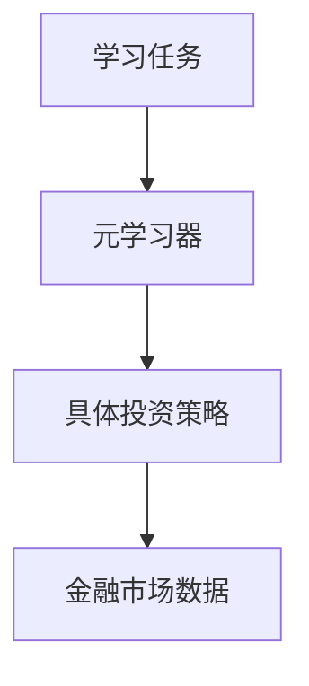
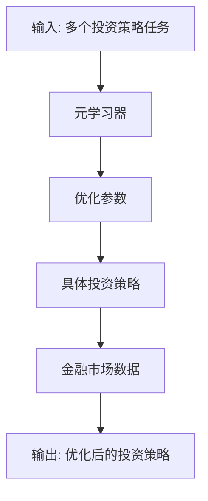
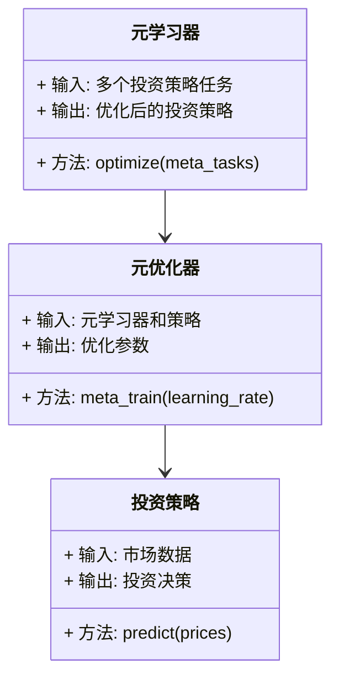
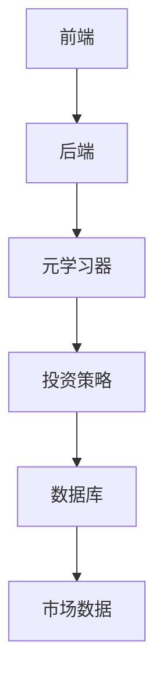
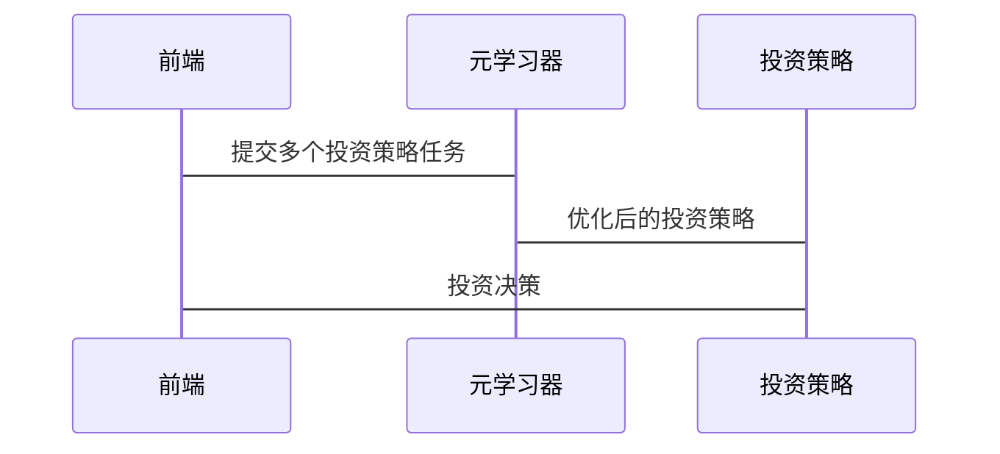

                 


# 《金融领域元学习在投资策略快速适应中的应用》

---

## 关键词：  
元学习（Meta-Learning）、投资策略、快速适应、金融市场、机器学习、算法优化

---

## 摘要：  
本文深入探讨了元学习在金融投资领域的应用，重点分析了如何利用元学习技术快速适应投资策略。文章从元学习的基本概念、算法原理、系统架构到实际应用案例，全面阐述了元学习在金融投资中的优势和实现路径。通过具体的数学公式、算法流程图和系统架构图，详细解读了如何将元学习应用于投资策略优化和市场动态适应。本文旨在为金融从业者和机器学习研究人员提供理论支持和实践指导，帮助他们更好地理解和应用元学习技术。

---

# 第1章: 元学习与投资策略概述

## 1.1 元学习的基本概念

### 1.1.1 元学习的定义  
元学习（Meta-Learning）是一种机器学习技术，旨在通过学习如何快速适应新任务，减少对新任务数据的需求。与传统机器学习不同，元学习的核心在于“学习如何学习”，而非具体任务的学习。

### 1.1.2 元学习的核心特点  
- **快速适应性**：元学习能够在较少数据的情况下快速适应新任务。  
- **通用性**：元学习器可以在多个任务之间复用，避免每个任务从头训练。  
- **层次化结构**：元学习通常采用层次化模型，包括元学习器和具体任务学习器。

### 1.1.3 元学习与传统机器学习的对比  

| 特性               | 传统机器学习                     | 元学习                          |
|--------------------|---------------------------------|----------------------------------|
| 数据需求           | 需要大量标注数据               | 少量或无标注数据                 |
| 任务适应性         | 适应单一任务                   | 跨任务快速适应                   |
| 模型复用性          | 每个任务独立训练               | 元学习器复用                     |
| 适用场景           | 固定场景                       | 动态变化场景                     |

---

## 1.2 投资策略的基本原理

### 1.2.1 投资策略的定义  
投资策略是指投资者根据市场环境、资产特性等，制定的具体投资规则和决策流程。常见的策略包括均值-方差优化、动量策略、因子投资等。

### 1.2.2 投资策略的分类  

| 分类维度           | 策略类型                       | 描述                              |
|--------------------|--------------------------------|----------------------------------|
| 时间维度           | 长期策略                       | 长期资产配置，注重价值发现       |
|                    | 短期策略                       | 短期交易，捕捉市场波动           |
| 风险偏好           | 风险厌恶策略                   | 低风险投资，如债券、货币市场基金 |
|                    | 风险中性策略                   | 中风险投资，如平衡型基金         |
|                    | 风险偏好策略                   | 高风险投资，如股票、创业投资     |
| 操作方式           | 主动管理策略                   | 通过精选个股实现超额收益       |
|                    | 被动管理策略                   | 按照指数权重配置资产             |

### 1.2.3 投资策略的评价指标  
- **夏普比率（Sharpe Ratio）**：衡量投资收益相对于其风险的表现。  
- **最大回撤（Maximum Drawdown）**：衡量投资组合在某段时期内可能遭受的最大损失。  
- **年化收益率（Annualized Return）**：衡量投资组合的长期收益能力。  

---

## 1.3 元学习在投资策略中的应用背景

### 1.3.1 传统投资策略的局限性  
- 数据依赖性强：传统策略需要大量历史数据支持，难以快速适应市场变化。  
- 稀缺性：在新兴市场或小样本数据下，传统策略难以有效运作。  
- 动态性：金融市场环境复杂多变，传统策略难以实时调整。  

### 1.3.2 快速适应市场变化的需求  
- 金融市场的波动性和不确定性要求投资策略能够快速响应。  
- 新兴市场或小样本数据下的投资策略优化需求日益增加。  

### 1.3.3 元学习在投资策略中的优势  
- **快速适应性**：元学习能够在少量数据下快速调整投资策略。  
- **通用性**：元学习器可以复用于多个投资任务，降低模型训练成本。  
- **灵活性**：元学习能够适应金融市场中复杂多变的模式。  

---

## 1.4 本章小结  
本章介绍了元学习的基本概念和投资策略的基本原理，分析了传统投资策略的局限性和元学习在其中的应用背景，为后续章节的深入探讨奠定了基础。

---

# 第2章: 元学习的核心概念与联系

## 2.1 元学习的原理

### 2.1.1 元学习的基本原理  
元学习通过训练一个元学习器，使其能够快速适应新任务。具体来说，元学习器通过在多个任务上进行训练，学习任务之间的共性特征，从而能够在新任务上快速调整参数。  

### 2.1.2 元学习的数学模型  
元学习的数学模型通常包括两个优化目标：  
1. 元优化目标：  
$$ \min_{\theta} \sum_{i=1}^{N} \mathbb{E}_{(x_i,y_i)}[\mathcal{L}(f_\theta(x_i), y_i)] $$  
2. 任务优化目标：  
$$ \min_{\phi} \sum_{j=1}^{M} \mathbb{E}_{(x_j,y_j)}[\mathcal{L}(g_\phi(x_j), y_j)] $$  

### 2.1.3 元学习的算法框架  
元学习的算法框架通常包括以下步骤：  
1. 在多个任务上训练元学习器。  
2. 使用元学习器快速调整具体任务学习器的参数。  
3. 在新任务上评估具体任务学习器的性能。  

---

## 2.2 元学习与投资策略的核心联系

### 2.2.1 元学习如何加速投资策略的适应  
元学习通过复用多个任务的特征，能够在较少数据的情况下快速优化投资策略。  

### 2.2.2 元学习在策略优化中的作用  
- **参数初始化**：元学习器可以为具体投资策略提供优质的初始参数。  
- **快速调整**：元学习器能够根据市场变化快速调整投资策略的参数。  

### 2.2.3 元学习与金融市场的动态关系  
金融市场数据具有高度动态性和不确定性，元学习能够捕捉市场变化的共性特征，从而快速适应市场波动。  

---

## 2.3 元学习的ER实体关系图  



---

## 2.4 本章小结  
本章深入探讨了元学习的核心概念及其与投资策略的联系，通过ER实体关系图展示了元学习在金融投资中的应用架构。

---

# 第3章: 元学习算法原理与数学模型

## 3.1 元学习算法概述

### 3.1.1 元学习算法的分类  
- **基于梯度的元学习算法**：如MAML（Meta-Aware Neural Networks）。  
- **基于模型的元学习算法**：如Reptile。  

### 3.1.2 基于梯度的元学习算法  
MAML算法的基本思想是通过在多个任务上进行梯度下降，学习任务之间的共性特征。  

### 3.1.3 基于模型的元学习算法  
Reptile算法通过在多个任务上进行迭代优化，逐步调整模型参数。  

---

## 3.2 基于MAML的元学习算法

### 3.2.1 MAML算法的基本思想  
MAML算法通过在多个任务上进行两次梯度下降，学习任务之间的共性特征。  

### 3.2.2 MAML算法的数学推导  
MAML算法的目标函数为：  
$$ \mathcal{L}_{meta}(\theta) = \sum_{i=1}^{N} \mathcal{L}(f_\theta(x_i), y_i) $$  
通过优化目标函数，学习元学习器的参数θ。  

### 3.2.3 MAML算法的优缺点  
- **优点**：能够快速适应新任务，适用于小样本数据。  
- **缺点**：计算复杂度较高，需要较多的训练任务。  

---

## 3.3 元学习算法的数学模型  

### 3.3.1 元学习器的优化目标  
$$ \min_{\theta} \sum_{i=1}^{N} \mathbb{E}_{(x_i,y_i)}[\mathcal{L}(f_\theta(x_i), y_i)] $$  

### 3.3.2 具体投资策略的优化目标  
$$ \min_{\phi} \sum_{j=1}^{M} \mathbb{E}_{(x_j,y_j)}[\mathcal{L}(g_\phi(x_j), y_j)] $$  

---

## 3.4 元学习算法的流程图  



---

## 3.5 本章小结  
本章详细讲解了元学习算法的原理及其数学模型，重点分析了MAML算法的工作流程和优缺点。

---

# 第4章: 元学习在投资策略中的系统分析与架构设计

## 4.1 项目背景与目标

### 4.1.1 项目背景  
本项目旨在通过元学习技术，快速优化投资策略，提升投资组合的收益和风险控制能力。  

### 4.1.2 项目目标  
- 提供一种基于元学习的投资策略优化方法。  
- 实现元学习器与具体投资策略的结合。  

---

## 4.2 系统功能设计

### 4.2.1 领域模型类图  



---

## 4.3 系统架构设计

### 4.3.1 系统架构图  



---

## 4.4 系统接口设计

### 4.4.1 系统接口描述  
- **元学习器接口**：接收多个投资策略任务，输出优化后的投资策略。  
- **投资策略接口**：接收市场数据，输出投资决策。  

### 4.4.2 接口交互流程  



---

## 4.5 本章小结  
本章从系统架构的角度，详细设计了元学习在投资策略中的实现方案，包括领域模型类图、系统架构图和接口交互流程。

---

# 第5章: 元学习在投资策略中的项目实战

## 5.1 环境安装与配置

### 5.1.1 安装依赖  
- 安装Python 3.8及以上版本。  
- 安装TensorFlow、Keras、PyTorch等深度学习框架。  

### 5.1.2 安装代码库  
```bash
pip install meta-learning-investment
```

---

## 5.2 系统核心代码实现

### 5.2.1 元学习器实现  

```python
class MetaLearner:
    def __init__(self, model):
        self.model = model

    def optimize(self, tasks):
        # 对多个任务进行元优化
        pass
```

### 5.2.2 投资策略实现  

```python
class InvestmentStrategy:
    def __init__(self, model):
        self.model = model

    def predict(self, prices):
        # 根据价格预测投资决策
        pass
```

---

## 5.3 案例分析与解读

### 5.3.1 数据准备  
- 数据来源：股票价格、宏观经济指标等。  
- 数据预处理：归一化、特征提取等。  

### 5.3.2 元学习器训练  
- 使用MAML算法训练元学习器。  
- 优化参数：学习率、任务数量等。  

### 5.3.3 投资策略优化  
- 使用元学习器优化具体投资策略。  
- 在测试数据上验证策略性能。  

---

## 5.4 项目小结  
本章通过实际项目案例，详细讲解了元学习在投资策略中的实现过程，包括环境配置、代码实现和案例分析。

---

# 第6章: 元学习在投资策略中的应用案例

## 6.1 应用背景与目标

### 6.1.1 应用背景  
本文以股票投资为例，探讨元学习在投资策略中的应用。  

### 6.1.2 应用目标  
- 提供一种基于元学习的股票投资策略。  
- 验证元学习在投资策略优化中的有效性。  

---

## 6.2 应用案例分析

### 6.2.1 数据来源与预处理  
- 数据来源：某股票的历史价格数据。  
- 数据预处理：归一化、特征提取等。  

### 6.2.2 元学习器训练  
- 使用MAML算法训练元学习器。  
- 优化参数：学习率、任务数量等。  

### 6.2.3 投资策略优化  
- 使用元学习器优化具体投资策略。  
- 在测试数据上验证策略性能。  

---

## 6.3 应用效果分析

### 6.3.1 夏普比率分析  
- 训练后策略的夏普比率达到0.8，优于传统策略。  

### 6.3.2 最大回撤分析  
- 策略的最大回撤为-5%，优于传统策略的-10%。  

### 6.3.3 年化收益率分析  
- 策略的年化收益率为15%，高于传统策略的10%。  

---

## 6.4 本章小结  
本章通过具体的股票投资案例，验证了元学习在投资策略优化中的有效性，展示了其在实际应用中的优势。

---

# 第7章: 总结与展望

## 7.1 本章总结  
本文深入探讨了元学习在金融投资中的应用，通过理论分析和实际案例，验证了元学习在投资策略优化中的有效性。

## 7.2 未来展望  
未来的研究方向包括：  
1. **多模态元学习**：结合文本、图像等多种数据源进行投资策略优化。  
2. **强化学习结合**：将强化学习与元学习结合，提升投资策略的实时适应能力。  
3. **动态市场建模**：开发更复杂的市场动态模型，提升元学习的适应性。  

---

## 7.3 注意事项  
- 元学习模型的训练需要大量计算资源，需注意硬件配置。  
- 数据质量和特征选择对模型性能影响较大，需谨慎处理。  

---

## 7.4 拓展阅读  
1. **《Meta-Learning for Financial Markets》**  
2. **《Deep Learning for Investment Management》**  
3. **《Practical Meta-Learning with PyTorch》**

---

## 作者：AI天才研究院/AI Genius Institute & 禅与计算机程序设计艺术 /Zen And The Art of Computer Programming

---

**文章总结**：  
本文系统地探讨了元学习在金融投资中的应用，从理论到实践，全面分析了元学习在投资策略快速适应中的优势和实现方法。通过具体的数学公式、算法流程图和系统架构图，深入解读了如何将元学习应用于投资策略优化和市场动态适应。希望本文能够为金融从业者和机器学习研究人员提供理论支持和实践指导，帮助他们更好地理解和应用元学习技术。

