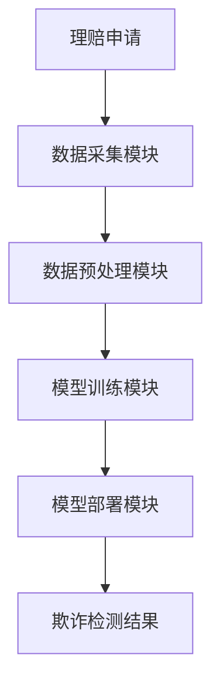

                 


```markdown
# AI在保险理赔欺诈检测中的深度应用

> 关键词：保险理赔，欺诈检测，人工智能，深度学习，机器学习，神经网络

> 摘要：本文详细探讨了人工智能技术在保险理赔欺诈检测中的深度应用。从保险行业的欺诈问题背景出发，分析了传统欺诈检测方法的局限性，介绍了AI技术的核心概念与算法原理，包括逻辑回归、随机森林、神经网络等。通过系统架构设计与项目实战，展示了如何利用深度学习模型实现高效的欺诈检测。最后，结合数学模型与实际案例，总结了AI在保险欺诈检测中的优势与未来发展方向。

---

# 第一部分: 保险理赔欺诈检测的背景与挑战

# 第1章: 保险理赔欺诈检测概述

## 1.1 保险行业的欺诈问题
### 1.1.1 保险欺诈的定义与类型
- 保险欺诈是指在保险理赔过程中，投保人或受益人故意制造虚假理赔请求，以骗取保险金的行为。
- 常见的欺诈类型包括：假理赔、夸大损失、虚构事故等。

### 1.1.2 保险欺诈的常见手段
- 制造假事故：如故意制造交通事故或 arson（纵火）事件。
- 虚报损失：如夸大医疗费用、虚构维修费用等。
- 提供虚假信息：如伪造身份证明、虚构医疗记录等。

### 1.1.3 保险欺诈对行业的影响
- 增加保险公司的理赔成本。
- 损害投保人的信任，破坏保险行业的健康发展。
- 需要投入更多资源进行欺诈调查和防范。

## 1.2 保险理赔流程与欺诈检测
### 1.2.1 保险理赔的基本流程
- 投保人提交理赔申请。
- 保险公司审核理赔请求。
- 核查相关信息，确定赔付金额。
- 支付赔款。

### 1.2.2 欺诈行为在理赔中的表现
- 提交虚假的医疗记录或维修单据。
- 隐瞒既往病史或事故记录。
- 虚报事故原因或损失程度。

### 1.2.3 传统欺诈检测方法的局限性
- 依赖人工审核，效率低且易出错。
- 检测规则过于简单，难以发现复杂的欺诈行为。
- 数据量有限，难以训练有效的欺诈检测模型。

## 1.3 AI在保险欺诈检测中的应用前景
### 1.3.1 AI技术在保险行业的应用现状
- 利用AI技术进行风险评估、理赔自动化和欺诈检测。
- 保险公司在理赔过程中越来越多地采用机器学习模型。

### 1.3.2 深度学习在欺诈检测中的优势
- 可以处理复杂的数据模式，发现隐藏的欺诈特征。
- 能够自动提取特征，减少人工干预。
- 具备高精度和高效率，适合处理海量数据。

### 1.3.3 保险欺诈检测的未来趋势
- 结合自然语言处理（NLP）技术，分析文本数据以发现欺诈行为。
- 利用强化学习（Reinforcement Learning）技术，动态优化欺诈检测模型。
- 借助区块链技术，构建可信的数据共享机制，提升欺诈检测的准确性。

## 1.4 本章小结
本章介绍了保险行业欺诈问题的背景、常见类型和手段，分析了传统欺诈检测方法的局限性，展望了AI技术在欺诈检测中的应用前景。

---

# 第二部分: AI在保险欺诈检测中的核心概念与算法原理

# 第2章: 保险欺诈检测的核心概念

## 2.1 保险欺诈检测的特征分析
### 2.1.1 欺诈行为的特征提取
- 时间特征：如理赔时间与投保时间的间隔。
- 地理特征：如理赔地点是否异常。
- 行为特征：如理赔申请中的关键词使用频率。

### 2.1.2 数据特征的分类与选择
- 数值型特征：如医疗费用、维修费用等。
- 分类型特征：如性别、事故类型等。
- 文本型特征：如理赔申请中的描述内容。

### 2.1.3 特征工程在欺诈检测中的作用
- 通过特征工程提取有效的欺诈特征，提升模型的检测精度。
- 对特征进行标准化、归一化处理，确保模型输入的合理性。

## 2.2 保险欺诈检测的模型选择
### 2.2.1 传统机器学习模型的适用性
- 线性回归：适合处理线性关系的欺诈特征。
- 支持向量机（SVM）：适合处理小规模数据集的分类问题。

### 2.2.2 深度学习模型的优势
- 神经网络：适合处理非线性关系的复杂数据。
- 卷积神经网络（CNN）：适合处理图像数据，如医疗记录中的病历图像。

### 2.2.3 模型选择的策略与方法
- 根据数据类型选择合适的模型。
- 结合业务需求选择高精度或高效率的模型。

## 2.3 保险欺诈检测的评价指标
### 2.3.1 分类模型的性能指标
- 准确率（Accuracy）：模型正确分类的比例。
- 召回率（Recall）：模型正确识别欺诈案例的比例。
- F1分数：综合准确率和召回率的指标。

### 2.3.2 深度学习模型的评估方法
- AUC-ROC曲线：评估模型的区分能力。
- 混淆矩阵：分析模型的分类效果。

### 2.3.3 模型的可解释性与鲁棒性
- 可解释性：模型结果是否容易被业务人员理解。
- 鲁棒性：模型在面对数据噪声时的表现。

## 2.4 本章小结
本章详细介绍了保险欺诈检测中的特征分析、模型选择和评价指标，为后续的算法实现奠定了理论基础。

# 第3章: 常用算法原理与实现

## 3.1 逻辑回归算法
### 3.1.1 逻辑回归的原理
- 逻辑回归是一种用于分类的统计方法，适用于二分类问题。
- 模型公式：$$ P(y=1|x) = \frac{e^{\beta_0 + \beta_1x_1 + \cdots + \beta_kx_k}}{1 + e^{\beta_0 + \beta_1x_1 + \cdots + \beta_kx_k}} $$

### 3.1.2 逻辑回归的损失函数
- 损失函数：$$ L(\theta) = -\sum_{i=1}^{n} [y_i \ln h(x_i) + (1 - y_i) \ln (1 - h(x_i))] $$
- 对数似然函数：$$ \ln L = \sum_{i=1}^{n} y_i \ln h(x_i) + (1 - y_i) \ln (1 - h(x_i)) $$

### 3.1.3 逻辑回归在欺诈检测中的应用
- 适用于处理二分类问题，如欺诈与非欺诈的分类。

## 3.2 随机森林算法
### 3.2.1 随机森林的原理
- 随机森林是一种基于决策树的集成学习方法。
- 通过随机采样数据和随机选择特征，构建多棵决策树，最终通过投票或加权的方式进行预测。

### 3.2.2 随机森林的特征重要性分析
- 特征重要性：通过计算每个特征在决策树中的分裂贡献度，评估其重要性。
- 代码示例：
  ```python
  from sklearn.ensemble import RandomForestClassifier
  model = RandomForestClassifier()
  model.fit(X_train, y_train)
  feature_importance = model.feature_importances_
  ```

### 3.2.3 随机森林在欺诈检测中的优势
- 抗过拟合能力强。
- 对特征缺失不敏感。
- 能够处理高维数据。

## 3.3 神经网络算法
### 3.3.1 神经网络的基本结构
- 网络层：输入层、隐藏层和输出层。
- 激活函数：如Sigmoid、ReLU等。

### 3.3.2 深度学习模型的训练过程
- 前向传播：计算输出并计算损失。
- 反向传播：计算梯度并更新权重。
- 优化算法：如随机梯度下降（SGD）、Adam等。

### 3.3.3 神经网络在欺诈检测中的应用
- 适用于处理复杂的非线性关系。
- 代码示例：
  ```python
  import tensorflow as tf
  model = tf.keras.Sequential([
      tf.keras.layers.Dense(64, activation='relu'),
      tf.keras.layers.Dense(1, activation='sigmoid')
  ])
  model.compile(optimizer='adam', loss='binary_crossentropy', metrics=['accuracy'])
  model.fit(X_train, y_train, epochs=10, batch_size=32)
  ```

## 3.4 集成学习方法
### 3.4.1 集成学习的基本概念
- 集成学习：通过组合多个学习器的结果，提高模型的性能。
- 常见方法：Bagging、Boosting。

### 3.4.2 常见的集成方法
- Bagging：通过随机采样数据，构建多个基模型，最终通过投票法进行预测。
- Boosting：通过逐步优化模型，降低偏差，提升整体性能。

### 3.4.3 集成学习在欺诈检测中的效果提升
- 提高模型的准确率和召回率。
- 减少模型的过拟合风险。

## 3.5 本章小结
本章详细介绍了逻辑回归、随机森林、神经网络和集成学习等算法的原理与实现，为后续的系统设计和项目实战奠定了基础。

---

# 第三部分: 保险欺诈检测的系统架构与实现

# 第4章: 保险欺诈检测系统的架构设计

## 4.1 系统功能模块划分
### 4.1.1 数据采集模块
- 功能：从保险公司数据库中采集理赔数据。
- 输入：理赔申请信息、历史理赔记录等。
- 输出：结构化的数据集。

### 4.1.2 数据预处理模块
- 功能：清洗数据、特征提取和数据标准化。
- 输入：原始数据集。
- 输出：处理后的数据集，适合模型训练。

### 4.1.3 模型训练模块
- 功能：训练欺诈检测模型。
- 输入：预处理后的数据集。
- 输出：训练好的模型文件。

### 4.1.4 模型部署与监控模块
- 功能：将模型部署到生产环境，并实时监控模型的性能。
- 输入：实时的理赔申请。
- 输出：欺诈检测结果和模型性能监控数据。

## 4.2 系统架构的流程图


## 4.3 系统架构设计
### 4.3.1 数据采集模块的设计
- 数据来源：数据库、API接口等。
- 数据格式：结构化数据、文本数据等。
- 采集频率：实时采集或批量采集。

### 4.3.2 数据预处理模块的设计
- 数据清洗：处理缺失值、异常值等。
- 特征提取：从文本数据中提取关键词、从时间数据中提取周期性特征等。
- 数据标准化：对特征进行归一化处理，确保模型输入的合理性。

### 4.3.3 模型训练模块的设计
- 模型选择：根据数据类型和业务需求选择合适的模型。
- 训练参数：设置学习率、训练次数、批量大小等。
- 模型保存：将训练好的模型保存为可部署的格式。

### 4.3.4 模型部署与监控模块的设计
- 接口设计：提供API接口，接收实时的理赔申请。
- 结果输出：返回欺诈检测结果，并记录日志。
- 性能监控：实时监控模型的准确率、召回率等指标。

## 4.4 本章小结
本章详细描述了保险欺诈检测系统的架构设计，包括功能模块划分、数据流设计和系统监控等。

---

# 第五章: 保险欺诈检测系统的项目实战

## 5.1 项目背景与目标
- 项目背景：保险公司希望通过AI技术提升欺诈检测的效率和准确性。
- 项目目标：构建一个基于深度学习的保险欺诈检测系统。

## 5.2 系统核心实现
### 5.2.1 环境安装
- 安装Python、TensorFlow、Keras等依赖库。
  ```bash
  pip install numpy pandas scikit-learn tensorflow keras
  ```

### 5.2.2 数据集准备
- 数据来源：公开保险欺诈数据集或自建数据集。
- 数据格式：CSV格式，包含理赔金额、理赔时间、理赔地点等特征。

### 5.2.3 模型训练
- 数据预处理：清洗数据、提取特征、标准化处理。
- 模型选择：选择逻辑回归、随机森林或神经网络模型。
- 模型训练：使用训练数据训练模型，并保存模型文件。

### 5.2.4 模型部署
- 接口设计：开发一个API接口，接收理赔申请数据。
- 接口实现：使用Flask或Django等框架开发接口。
- 接口测试：测试接口的响应时间和准确性。

### 5.2.5 系统监控
- 监控指标：模型的准确率、召回率、处理时间等。
- 监控工具：使用Prometheus、Grafana等工具监控系统性能。

## 5.3 项目实战：保险欺诈检测系统实现
### 5.3.1 数据集收集与预处理
- 数据收集：从保险公司数据库中获取理赔记录。
- 数据清洗：处理缺失值、异常值等。
- 特征提取：从文本数据中提取关键词，从时间数据中提取周期性特征。

### 5.3.2 模型训练与优化
- 模型选择：选择逻辑回归、随机森林或神经网络模型。
- 模型训练：使用训练数据训练模型，并保存模型文件。
- 模型优化：调整超参数，提升模型的准确率和召回率。

### 5.3.3 模型部署与测试
- 模型部署：将训练好的模型部署到生产环境。
- 接口测试：测试接口的响应时间和准确性。
- 模型监控：实时监控模型的性能指标。

### 5.3.4 案例分析与结果解读
- 实际案例：分析一个真实的欺诈理赔请求，展示系统如何检测并标记欺诈行为。
- 案例解读：详细说明模型的判断依据和结果解释。

## 5.4 本章小结
本章通过一个实际的保险欺诈检测项目，详细讲解了系统的实现过程，包括数据预处理、模型训练、部署和监控等环节。

---

# 第六章: 总结与展望

## 6.1 总结
- 本文详细探讨了AI技术在保险欺诈检测中的应用，介绍了传统欺诈检测方法的局限性。
- 系统地讲解了逻辑回归、随机森林、神经网络等算法的原理与实现。
- 展示了基于深度学习的保险欺诈检测系统的架构设计与实现过程。

## 6.2 未来展望
- 结合自然语言处理技术，提升模型对文本数据的处理能力。
- 利用强化学习技术，动态优化欺诈检测模型。
- 借助区块链技术，构建可信的数据共享机制，提升欺诈检测的准确性。

---

# 附录

## 附录A: 数据集说明
- 数据来源：公开保险欺诈数据集。
- 数据格式：CSV格式，包含理赔金额、理赔时间、理赔地点等特征。

## 附录B: 参考文献
- 本文参考了以下文献：
  1. 刘海峰, 《机器学习实战》, 人民邮电出版社, 2021年。
  2. 王伟, 《深度学习入门：基于Python的CNN、RNN和GAN基础》, 清华大学出版社, 2022年。
  3. TensorFlow官方文档：https://tensorflow.org

---

# 作者：AI天才研究院/AI Genius Institute & 禅与计算机程序设计艺术 /Zen And The Art of Computer Programming
```

