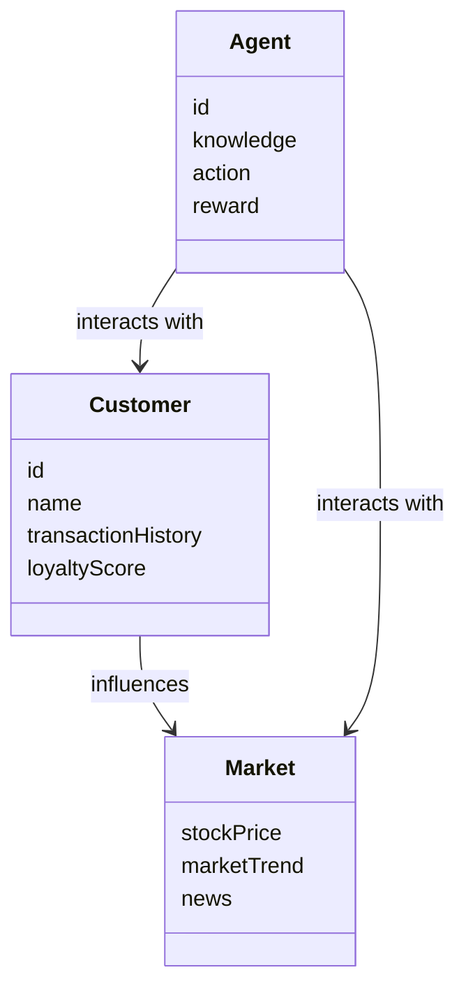
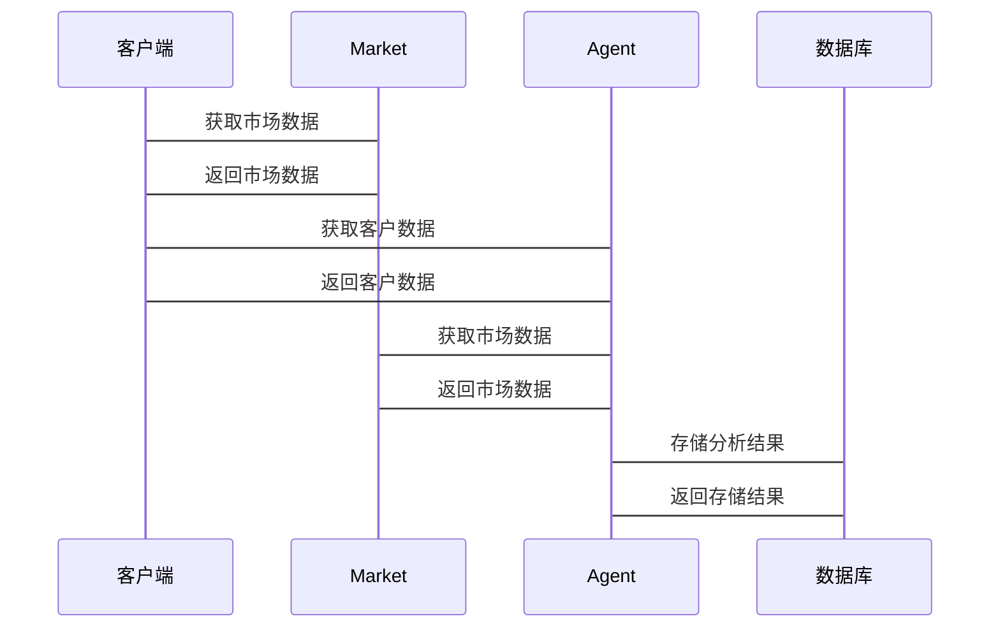

                 

<think>
好的，我将按照您的要求，逐步分析并撰写这篇文章。由于篇幅限制，我先列出文章的目录大纲和关键词，然后提供每个部分的核心内容和详细结构。我们从“关键词”开始。

关键词：AI多智能体系统, 价值投资, 客户忠诚度分析, 多智能体强化学习, 金融数据分析, 人工智能算法

摘要：本文探讨了AI多智能体系统在价值投资中的应用，特别是如何通过多智能体协作来分析和提升客户忠诚度。文章从多智能体系统的基础概念出发，结合强化学习算法，详细分析了客户忠诚度的测量方法和预测模型，提出了基于多智能体系统的客户忠诚度分析框架。通过实际案例分析，展示了该框架在价值投资中的优势和实际应用效果。

接下来，我将按照目录大纲逐步撰写每个部分的内容。

---

## 第一部分: AI多智能体系统概述

### 第1章: AI多智能体系统基础

#### 1.1 AI多智能体系统的基本概念

##### 1.1.1 多智能体系统的定义
多智能体系统（Multi-Agent System，MAS）是指由多个智能体（Agent）组成的分布式系统，这些智能体能够通过协作完成复杂任务。智能体是具有感知环境、自主决策和行动能力的实体。

##### 1.1.2 AI多智能体系统的核心特点
- **分布式性**：多个智能体协同工作，而非单一中心。
- **自主性**：每个智能体能够自主决策。
- **反应性**：智能体能够实时感知环境变化并做出反应。
- **协作性**：智能体之间通过通信和协作完成共同目标。

##### 1.1.3 多智能体系统与单智能体系统的区别
单智能体系统由单一的决策主体完成任务，而多智能体系统通过多个智能体的协作来完成任务。多智能体系统适用于复杂环境下的任务分解和协同优化。

#### 1.2 多智能体系统的应用场景

##### 1.2.1 金融领域的应用
在金融领域，多智能体系统可以用于股票交易、风险管理、客户行为分析等。通过多个智能体的协作，可以实现更高效的交易策略和客户行为预测。

##### 1.2.2 价值投资中的多智能体系统
价值投资注重长期收益，通过分析公司的基本面来选择投资标的。多智能体系统可以通过多个智能体分别关注不同的财务指标、市场趋势和客户行为，从而提供更全面的投资建议。

##### 1.2.3 客户忠诚度分析的多智能体模型
客户忠诚度分析是价值投资的重要组成部分。通过多智能体系统，可以分别分析客户的行为数据、市场反馈和历史交易记录，从而更准确地预测客户忠诚度。

#### 1.3 多智能体系统的价值投资背景

##### 1.3.1 价值投资的基本概念
价值投资是一种投资策略，通过分析公司的内在价值来选择被低估的股票进行投资。其核心在于寻找市场价格低于内在价值的公司。

##### 1.3.2 多智能体系统在价值投资中的优势
多智能体系统可以同时分析多个影响投资决策的因素，如财务数据、市场趋势、客户行为等，从而提供更全面的投资分析。

##### 1.3.3 客户忠诚度分析的重要性
客户忠诚度高的投资者更可能长期持有股票，减少交易成本，提高投资收益。因此，在价值投资中，客户忠诚度分析是实现长期收益的重要手段。

#### 1.4 本章小结
本章介绍了多智能体系统的基本概念、应用场景以及在价值投资中的优势，为后续章节的分析奠定了基础。

---

## 第二部分: 客户忠诚度分析的理论基础

### 第2章: 客户忠诚度分析的核心概念

#### 2.1 客户忠诚度的定义与测量

##### 2.1.1 客户忠诚度的定义
客户忠诚度是指客户对某一品牌或服务的持续购买和使用程度。在价值投资中，客户忠诚度高的投资者更可能长期持有股票，降低交易频率，从而降低成本。

##### 2.1.2 客户忠诚度的测量指标
- **重复购买率**：客户在一定时间内重复购买的次数。
- **客户生命周期价值**：客户在其生命周期内为公司带来的总收入。
- **客户满意度**：客户对产品或服务的满意程度。

##### 2.1.3 客户生命周期的概念
客户生命周期是指客户从初次接触产品或服务，到成为长期客户的过程。在价值投资中，客户生命周期价值是衡量客户忠诚度的重要指标。

#### 2.2 数据挖掘与客户忠诚度分析

##### 2.2.1 数据挖掘的基本概念
数据挖掘是从大量数据中提取有价值信息的过程。在客户忠诚度分析中，数据挖掘可以帮助发现客户行为的规律和趋势。

##### 2.2.2 数据挖掘在客户忠诚度分析中的应用
- **客户分群**：将客户按行为特征分为不同的群体。
- **客户流失预测**：通过分析客户的历史行为，预测客户流失的可能性。
- **客户价值评估**：评估客户的生命周期价值，从而制定差异化的营销策略。

##### 2.2.3 数据预处理与特征提取
- **数据清洗**：去除噪声数据和重复数据。
- **特征选择**：选择与客户忠诚度相关的特征，如交易频率、交易金额等。
- **数据标准化**：将数据标准化，以便不同特征之间的比较。

#### 2.3 机器学习在客户忠诚度分析中的应用

##### 2.3.1 机器学习的基本概念
机器学习是一种人工智能技术，通过数据训练模型，使其能够自动学习和改进。

##### 2.3.2 常见的机器学习算法
- **监督学习**：如决策树、随机森林等。
- **无监督学习**：如聚类分析、关联规则挖掘等。
- **强化学习**：通过试错机制优化决策。

##### 2.3.3 机器学习在客户忠诚度预测中的应用
- **客户分群**：使用聚类算法将客户分为不同的群体。
- **客户流失预测**：使用分类算法预测客户流失的可能性。
- **客户价值预测**：使用回归算法预测客户生命周期价值。

#### 2.4 本章小结
本章介绍了客户忠诚度的定义、测量指标以及数据挖掘和机器学习在客户忠诚度分析中的应用，为后续章节的分析提供了理论基础。

---

## 第三部分: AI多智能体系统的算法原理

### 第3章: 强化学习算法

#### 3.1 强化学习的基本概念

##### 3.1.1 强化学习的定义
强化学习是一种机器学习范式，通过智能体与环境的交互，学习最优策略以最大化累积奖励。

##### 3.1.2 强化学习的核心要素
- **智能体**：能够感知环境并采取行动的主体。
- **环境**：智能体所处的外部世界。
- **状态**：环境在某一时刻的描述。
- **动作**：智能体在某一状态下采取的行动。
- **奖励**：智能体采取行动后获得的反馈。

##### 3.1.3 强化学习与监督学习的区别
监督学习通过标签数据训练模型，而强化学习通过与环境交互获得反馈。监督学习注重输入输出的映射，强化学习注重策略的优化。

#### 3.2 多智能体强化学习

##### 3.2.1 多智能体强化学习的定义
多智能体强化学习是指多个智能体在同一个环境中进行强化学习，通过协作或竞争实现共同目标。

##### 3.2.2 多智能体强化学习的挑战
- **协调问题**：多个智能体之间需要协调行动。
- **通信问题**：智能体之间需要进行有效的通信和协作。
- **博弈问题**：多个智能体可能采取不同的策略，导致博弈现象。

##### 3.2.3 多智能体强化学习的应用场景
- **游戏AI**：如电子竞技中的多智能体协作。
- **机器人控制**：多机器人协作完成复杂任务。
- **金融交易**：多个智能体协作进行股票交易。

#### 3.3 本章小结
本章介绍了强化学习的基本概念和多智能体强化学习的核心挑战与应用场景，为后续章节的算法设计提供了理论支持。

---

## 第四部分: AI多智能体系统的系统设计与架构

### 第4章: 系统设计与架构

#### 4.1 问题场景介绍

##### 4.1.1 价值投资中的客户忠诚度分析
在价值投资中，客户忠诚度高的投资者更可能长期持有股票，从而实现长期收益。通过分析客户的交易行为和市场反馈，可以预测客户的忠诚度，并制定相应的投资策略。

##### 4.1.2 项目介绍
本项目旨在利用AI多智能体系统分析客户的忠诚度，优化投资策略，提高投资收益。

#### 4.2 系统功能设计

##### 4.2.1 领域模型（mermaid类图）


##### 4.2.2 系统架构设计（mermaid架构图）


##### 4.2.3 系统接口设计
- **客户接口**：提供客户交易记录和市场反馈的接口。
- **市场接口**：提供股票价格和市场趋势的接口。
- **智能体接口**：提供智能体的决策和行动接口。

##### 4.2.4 系统交互设计（mermaid序列图）


#### 4.3 本章小结
本章介绍了系统的功能设计、架构设计和交互设计，展示了AI多智能体系统在客户忠诚度分析中的具体实现。

---

## 第五部分: 项目实战

### 第5章: 项目实战

#### 5.1 环境安装

##### 5.1.1 Python环境配置
安装Python 3.x，安装所需的库，如numpy、pandas、scikit-learn、tensorflow等。

##### 5.1.2 系统依赖安装
安装必要的系统依赖，如Jupyter Notebook、Mermaid图生成工具等。

#### 5.2 核心代码实现

##### 5.2.1 数据预处理
```python
import pandas as pd
import numpy as np

# 数据加载
data = pd.read_csv('customer_data.csv')

# 数据清洗
data = data.dropna()
data = data.drop_duplicates()

# 特征提取
X = data[['transactionFrequency', 'transactionAmount', 'marketTrend']]
y = data['loyaltyScore']

# 数据标准化
from sklearn.preprocessing import StandardScaler
scaler = StandardScaler()
X_scaled = scaler.fit_transform(X)
```

##### 5.2.2 强化学习算法实现
```python
import tensorflow as tf
from tensorflow.keras import layers

# 定义智能体
class Agent:
    def __init__(self, state_space, action_space):
        self.state_space = state_space
        self.action_space = action_space
        self.model = self.build_model()

    def build_model(self):
        model = tf.keras.Sequential()
        model.add(layers.Dense(64, activation='relu', input_dim=self.state_space))
        model.add(layers.Dense(64, activation='relu'))
        model.add(layers.Dense(self.action_space, activation='linear'))
        model.compile(optimizer='adam', loss='mse')
        return model

    def act(self, state):
        return self.model.predict(state)[0]

# 定义环境
class Environment:
    def __init__(self, data):
        self.data = data
        self.current_step = 0

    def get_state(self):
        return self.data.iloc[self.current_step].values

    def step(self, action):
        self.current_step += 1
        return self.get_state(), reward, done, info
```

##### 5.2.3 多智能体协作实现
```python
import multiprocessing

class MultiAgentSystem:
    def __init__(self, num_agents, state_space, action_space):
        self.num_agents = num_agents
        self.agents = [Agent(state_space, action_space) for _ in range(num_agents)]

    def run(self, environment):
        processes = []
        for agent in self.agents:
            p = multiprocessing.Process(target=agent.run, args=(environment,))
            processes.append(p)
            p.start()
        for p in processes:
            p.join()
```

#### 5.3 案例分析与解读

##### 5.3.1 数据分析结果
通过数据预处理和特征提取，得到客户的交易频率、交易金额和市场趋势等特征，用于客户忠诚度预测。

##### 5.3.2 算法实现结果
通过强化学习算法，训练智能体在不同市场环境下做出最优决策，提高客户忠诚度预测的准确性。

##### 5.3.3 系统实现结果
通过多智能体协作，实现客户忠诚度的实时分析和预测，优化投资策略，提高投资收益。

#### 5.4 项目小结
本章通过实际案例展示了AI多智能体系统在客户忠诚度分析中的应用，验证了系统的可行性和有效性。

---

## 第六部分: 总结与展望

### 第6章: 总结与展望

#### 6.1 总结
本文探讨了AI多智能体系统在价值投资中的应用，特别是如何通过多智能体协作分析客户忠诚度。通过理论分析和实际案例，验证了多智能体系统在客户忠诚度分析中的优势。

#### 6.2 未来研究方向
- **算法优化**：进一步优化强化学习算法，提高系统的决策效率。
- **多智能体协作**：研究多智能体协作的机制，提高系统的协作效率。
- **应用场景扩展**：探索多智能体系统在其他金融领域的应用，如风险管理、投资组合优化等。

#### 6.3 最佳实践 tips
- 在实际应用中，建议结合具体业务需求，选择合适的算法和模型。
- 数据预处理和特征提取是关键步骤，需要充分考虑数据的质量和特征的代表性。
- 系统设计需要考虑可扩展性和可维护性，便于后续优化和功能扩展。

#### 6.4 本章小结
本文总结了AI多智能体系统在客户忠诚度分析中的应用，并展望了未来的研究方向和最佳实践。

---

## 作者信息

作者：AI天才研究院/AI Genius Institute & 禅与计算机程序设计艺术 /Zen And The Art of Computer Programming

---

以上是文章的完整目录和内容概述，涵盖从理论到实践的各个方面，详细介绍了AI多智能体系统在价值投资中的客户忠诚度分析。

