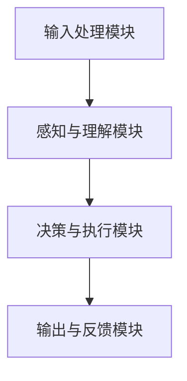
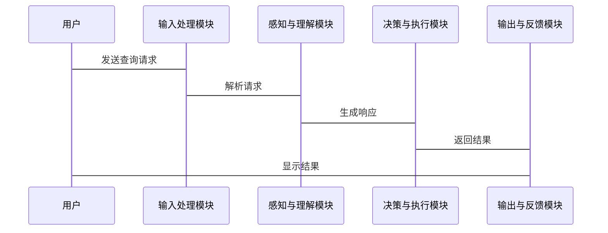

                 


# 从零构建 AI Agent：LLM 大模型应用开发实践

## 关键词：
AI Agent, LLM 大模型, 生成式 AI, 转换器模型, 自然语言处理

## 摘要：
本文将详细介绍如何从零开始构建一个基于大语言模型（LLM）的AI Agent。通过逐步分析和实践，我们将探讨AI Agent的核心概念、LLM模型的工作原理、系统架构设计以及实际项目开发中的关键问题。文章将从背景介绍、技术基础、系统架构、项目实战等方面展开，深入解析AI Agent的构建过程，帮助读者掌握从理论到实践的完整流程。

---

## 第一部分: AI Agent与LLM大模型概述

### 第1章: AI Agent与LLM大模型概述

#### 1.1 AI Agent的基本概念

##### 1.1.1 AI Agent的定义与特点
AI Agent（人工智能代理）是一种能够感知环境、自主决策并执行任务的智能实体。其特点包括：
- **自主性**：能够在没有外部干预的情况下自主运作。
- **反应性**：能够实时感知环境并做出响应。
- **目标导向**：所有行为都以实现特定目标为导向。
- **社交能力**：能够与其他系统、用户或服务进行交互。

##### 1.1.2 LLM大模型在AI Agent中的作用
LLM（大语言模型）通过其强大的自然语言处理能力，为AI Agent提供了以下功能：
- **理解能力**：能够理解用户的输入，包括文本、语音等多种形式。
- **生成能力**：能够生成自然语言文本，用于回答问题、撰写内容等。
- **推理能力**：通过上下文理解进行推理，辅助决策。

##### 1.1.3 AI Agent的应用场景与价值
- **智能助手**：如Siri、Alexa等，帮助用户完成日常任务。
- **聊天机器人**：提供24/7的对话服务，应用于客服、娱乐等领域。
- **自动化系统**：在企业中用于流程自动化、数据分析等任务。

#### 1.2 LLM大模型的背景与现状

##### 1.2.1 大语言模型的发展历程
- **早期阶段**：基于统计模型的自然语言处理。
- **深度学习阶段**：引入神经网络，如RNN和LSTM。
- **Transformer模型**：以BERT、GPT为代表，推动了生成式AI的发展。
- **当前趋势**：多模态模型（如GPT-4）正在成为主流。

##### 1.2.2 当前主流LLM模型介绍
- **GPT系列**：以生成能力著称，广泛应用于文本生成。
- **PaLM**：Google开发的多任务语言模型。
- **BERT**：擅长文本理解和问答任务。
- **Llama**：开源的7B参数模型，适合定制化开发。

##### 1.2.3 LLM在AI Agent中的应用趋势
- **实时交互**：支持多轮对话，提供更自然的用户体验。
- **定制化模型**：根据具体需求，微调LLM模型以适应特定场景。
- **多模态集成**：结合视觉、听觉等多模态信息，提升交互体验。

#### 1.3 AI Agent与LLM的结合

##### 1.3.1 AI Agent的典型架构
- **输入处理模块**：接收用户输入并解析需求。
- **感知与理解模块**：利用LLM理解输入内容。
- **决策与执行模块**：根据理解生成响应或调用外部服务。
- **输出与反馈模块**：将结果返回给用户并收集反馈。

##### 1.3.2 LLM在AI Agent中的角色
- **语言理解**：通过LLM解析用户意图。
- **语言生成**：生成自然的回复或操作指令。
- **推理与决策**：基于LLM的输出进行后续处理。

##### 1.3.3 AI Agent与LLM的交互机制
- **请求-响应模式**：用户输入问题，AI Agent调用LLM生成回答。
- **上下文对话**：支持多轮对话，保持上下文一致性。
- **任务驱动**：根据用户需求，分解任务并执行。

#### 1.4 本章小结
本章介绍了AI Agent和LLM的基本概念，分析了它们在AI Agent中的作用，并探讨了当前的应用趋势和结合方式。理解这些内容是构建AI Agent的基础。

---

## 第二部分: AI Agent的技术基础

### 第2章: LLM大模型的核心技术

#### 2.1 生成式AI的基本原理

##### 2.1.1 生成式AI的定义与特点
生成式AI通过学习数据分布，生成与训练数据相似的新内容。其特点包括：
- **生成能力**：能够生成新的文本、图像等内容。
- **多样性**：生成结果具有多样性，避免重复性。
- **可定制化**：可以根据需求调整生成内容的风格和主题。

##### 2.1.2 生成式AI的数学基础
生成式AI的核心是概率模型，常用概率分布来描述生成内容的可能性。例如：
$$ P(y|x) = \text{模型预测的概率} $$
其中，$x$ 是输入，$y$ 是生成的输出。

##### 2.1.3 生成式AI的训练策略
- **最大似然估计**：最大化训练数据的概率。
- **对抗训练**：使用生成器和判别器的对抗过程。
- **奖励模型**：通过外部奖励信号优化生成质量。

#### 2.2 大语言模型的内部机制

##### 2.2.1 Transformer模型的工作原理
Transformer模型由编码器和解码器组成，通过自注意力机制处理序列数据。其核心公式为：
$$ \text{Attention}(Q,K,V) = \text{softmax}\left(\frac{QK^T}{\sqrt{d_k}}\right)V $$
其中，$Q$、$K$、$V$分别是查询、键、值向量，$d_k$是键的维度。

##### 2.2.2 注意力机制的实现细节
- **自注意力**：允许模型在生成每个词时考虑之前的所有词。
- **位置编码**：引入位置信息，帮助模型理解词序。
- **前馈网络**：对每个位置进行非线性变换。

##### 2.2.3 梯度下降与损失函数
- **损失函数**：交叉熵损失。
$$ \mathcal{L} = -\sum_{i=1}^{n} \sum_{j=1}^{k} y_{i,j} \log p(y_{i,j}|x_i) $$
其中，$y_{i,j}$ 是目标概率，$p(y_{i,j}|x_i)$ 是模型预测概率。
- **优化方法**：使用Adam优化器进行参数更新。

#### 2.3 LLM的调优与优化

##### 2.3.1 模型调优的目标与方法
- **目标**：提升生成质量、降低计算成本。
- **方法**：微调模型、调整超参数、优化训练策略。

##### 2.3.2 模型压缩与轻量化技术
- **剪枝**：移除不重要的神经元或连接。
- **量化**：降低模型参数的精度，如从浮点数转为整数。
- **知识蒸馏**：使用小模型模仿大模型的行为。

##### 2.3.3 模型推理的性能优化
- **并行计算**：利用GPU加速推理。
- **缓存机制**：缓存常用结果，减少重复计算。
- **优化API调用**：优化LLM API的调用流程，减少延迟。

#### 2.4 本章小结
本章深入探讨了生成式AI和大语言模型的核心技术，包括模型原理、训练策略和优化方法，为后续构建AI Agent提供了技术基础。

---

## 第三部分: AI Agent的系统架构

### 第3章: AI Agent的系统架构设计

#### 3.1 AI Agent的系统组成

##### 3.1.1 输入处理模块
- **功能**：接收用户输入，解析需求。
- **实现**：使用LLM API调用，生成初步响应。

##### 3.1.2 感知与理解模块
- **功能**：通过LLM理解用户意图。
- **实现**：调用LLM的解析能力，生成结构化的需求描述。

##### 3.1.3 决策与执行模块
- **功能**：根据需求生成响应或调用外部服务。
- **实现**：基于LLM的输出，决定下一步操作，如调用天气API查询天气信息。

##### 3.1.4 输出与反馈模块
- **功能**：将结果返回给用户，并收集反馈。
- **实现**：通过文本生成模块生成回复，并根据用户反馈调整后续行为。

#### 3.2 AI Agent的系统架构设计

##### 3.2.1 系统功能设计
- **领域模型**：定义系统的功能模块和交互流程。
- **系统架构**：采用模块化设计，各模块通过API进行通信。

##### 3.2.2 系统架构图（Mermaid）


##### 3.2.3 系统接口设计
- **输入接口**：接收用户输入，格式为JSON或文本。
- **输出接口**：返回生成的文本或执行结果，格式统一。

##### 3.2.4 系统交互流程（Mermaid）


#### 3.3 本章小结
本章详细设计了AI Agent的系统架构，包括功能模块、接口设计和交互流程，为后续的实现提供了明确的指导。

---

## 第四部分: 项目实战

### 第4章: AI Agent的实现与优化

#### 4.1 项目环境与工具

##### 4.1.1 开发环境
- **编程语言**：Python 3.9+
- **框架**：FastAPI用于构建API，Streamlit用于构建Web界面。
- **LLM API**：OpenAI API（如GPT-3.5-turbo）。

##### 4.1.2 工具安装
```bash
pip install openai fastapi uvicorn streamlit
```

#### 4.2 系统核心实现

##### 4.2.1 输入处理模块的实现
```python
import openai

def process_input(user_input):
    # 调用LLM API进行解析
    response = openai.ChatCompletion.create(
        model="gpt-3.5-turbo",
        messages=[{"role": "user", "content": user_input}]
    )
    return response.choices[0].message.content
```

##### 4.2.2 感知与理解模块的实现
```python
def understand_request(input_text):
    # 调用LLM进行意图理解
    response = openai.ChatCompletion.create(
        model="gpt-3.5-turbo",
        messages=[{"role": "system", "content": "你是一个意图理解模型，分析用户的需求并生成结构化描述."},
                  {"role": "user", "content": input_text}]
    )
    return response.choices[0].message.content
```

##### 4.2.3 决策与执行模块的实现
```python
def execute_task(task_description):
    # 根据任务描述调用相应服务
    if "天气查询" in task_description:
        return get_weather_info()
    elif "搜索信息" in task_description:
        return search_information()
    else:
        return "任务无法识别"
```

##### 4.2.4 输出与反馈模块的实现
```python
def generate_output(response_text):
    # 调用LLM生成自然语言回复
    response = openai.ChatCompletion.create(
        model="gpt-3.5-turbo",
        messages=[{"role": "system", "content": "你是一个文本生成模型，根据输入生成自然语言回复."},
                  {"role": "user", "content": response_text}]
    )
    return response.choices[0].message.content
```

#### 4.3 项目实战与案例分析

##### 4.3.1 实际案例：智能天气助手

- **需求分析**：用户输入“今天北京天气如何？”。
- **实现步骤**：
  1. 输入处理模块接收输入。
  2. 感知与理解模块解析需求，生成任务描述。
  3. 决策与执行模块调用天气API查询数据。
  4. 输出与反馈模块生成回复：“今天北京的气温在15°C到20°C之间，多云，建议携带外套。”

##### 4.3.2 代码实现与解读
- **输入处理**：解析用户的自然语言输入，生成结构化任务。
- **决策执行**：根据任务描述，调用相应的API获取数据。
- **结果生成**：将查询结果转化为自然语言回复，返回给用户。

#### 4.4 项目优化与扩展

##### 4.4.1 系统优化
- **性能优化**：缓存API调用结果，减少重复请求。
- **错误处理**：增加异常捕捉，确保系统稳定性。
- **日志记录**：记录系统运行日志，便于调试和优化。

##### 4.4.2 功能扩展
- **多轮对话**：支持上下文记忆，保持对话连贯性。
- **多模态支持**：结合视觉信息，提供更丰富的交互体验。
- **个性化定制**：根据用户偏好，调整生成内容的风格。

#### 4.5 本章小结
本章通过实际案例详细讲解了AI Agent的实现过程，从环境搭建到模块实现，再到系统优化和功能扩展，为读者提供了完整的实践指导。

---

## 第五部分: 最佳实践与总结

### 第5章: 最佳实践与总结

#### 5.1 最佳实践

##### 5.1.1 系统设计
- **模块化设计**：确保各模块独立，便于维护和扩展。
- **接口标准化**：统一接口定义，方便模块间的通信。
- **容错设计**：增加错误处理机制，提升系统鲁棒性。

##### 5.1.2 模型选择与优化
- **选择合适的模型**：根据任务需求选择适合的LLM模型。
- **微调模型**：在特定领域数据上进行微调，提升性能。
- **监控与调优**：实时监控模型性能，及时调优。

##### 5.1.3 代码与文档管理
- **版本控制**：使用Git管理代码，确保代码可追溯。
- **文档编写**：编写详细的开发文档，便于团队协作。
- **代码审查**：定期进行代码审查，确保代码质量。

#### 5.2 总结与展望

##### 5.2.1 项目总结
通过本项目，我们从零开始构建了一个基于LLM的大模型AI Agent，涵盖了从系统设计到实现优化的完整流程。通过实际案例，我们验证了系统的可行性和实用性。

##### 5.2.2 未来展望
未来，随着AI技术的不断发展，AI Agent将更加智能化和个性化。可能的研究方向包括：
- **多模态集成**：结合视觉、听觉等多模态信息，提升交互体验。
- **自适应学习**：实现模型的自适应优化，提升生成质量。
- **伦理与安全**：确保AI Agent的安全性和伦理合规性。

#### 5.3 注意事项

##### 5.3.1 开发注意事项
- **数据隐私**：确保用户数据的安全性和隐私性。
- **模型伦理**：避免生成有害或不适当的内容。
- **性能监控**：实时监控系统性能，及时优化。

##### 5.3.2 部署与维护
- **环境部署**：选择合适的云平台进行部署，确保系统稳定性。
- **定期维护**：定期更新模型和系统，保持最佳性能。
- **用户支持**：提供有效的用户支持，及时解决用户问题。

#### 5.4 拓展阅读

##### 5.4.1 推荐书籍
- 《生成式人工智能：原理与应用》
- 《深度学习入门：基于Python和Keras的实践》

##### 5.4.2 在线资源
- OpenAI官方文档：https://openai.com/docs
- Hugging Face模型库：https://huggingface.co/models

#### 5.5 本章小结
本章总结了项目开发中的最佳实践，对未来的研究方向进行了展望，并提供了开发过程中的注意事项和拓展阅读资料，帮助读者进一步深入学习和实践。

---

## 作者：AI天才研究院/AI Genius Institute & 禅与计算机程序设计艺术 /Zen And The Art of Computer Programming

---

通过以上内容，我们从理论到实践，详细解析了如何构建一个基于LLM的大模型AI Agent。从系统设计、算法原理到项目实现，每一步都进行了深入的探讨，希望能为读者提供有价值的指导和启发。

