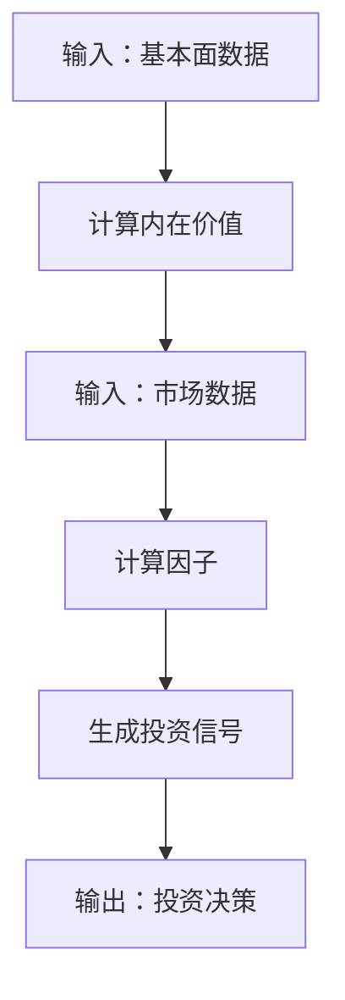
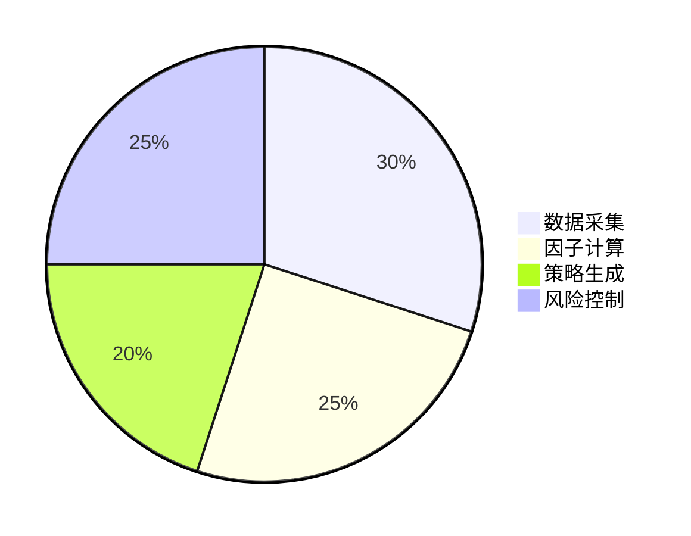
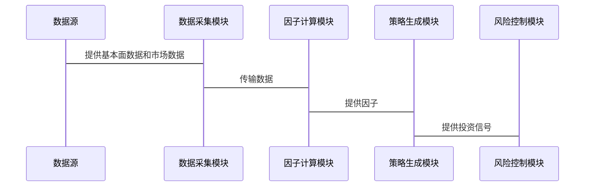

                 


# 价值投资与量化投资的融合

> 关键词：价值投资、量化投资、融合机制、算法设计、系统架构、投资策略、风险管理

> 摘要：本文深入探讨了价值投资与量化投资的融合机制，结合理论分析与实际案例，详细阐述了两者结合的可行性、优势与挑战。通过系统架构设计、算法实现和项目实战，展示了如何在实际投资中将价值投资的长期视角与量化投资的数据驱动方法相结合，以实现更优的投资效果。本文还提供了丰富的技术细节，包括核心概念对比、融合算法设计、系统架构图解和代码实现，为投资者和量化技术爱好者提供了宝贵的参考。

---

## 第一部分: 价值投资与量化投资的融合概述

### 第1章: 价值投资与量化投资的核心概念

#### 1.1 价值投资的定义与特点
- **1.1.1 价值投资的定义**  
  价值投资是一种基于对公司基本面分析的投资策略，强调以低于其内在价值的价格买入优质企业，长期持有，等待其价值回归。
- **1.1.2 价值投资的核心特点**  
  - 长期视角：注重企业的长期盈利能力，而非短期价格波动。  
  - 低估值：寻找市场价格低于内在价值的企业。  
  - 高质量：选择财务健康、竞争优势明显的企业。  
- **1.1.3 价值投资的边界与外延**  
  价值投资的边界在于对“价值”的定义，外延则包括成长型投资、防御型投资等变体。

#### 1.2 量化投资的定义与特点
- **1.2.1 量化投资的定义**  
  量化投资是通过数学模型和算法，利用大数据、统计套利、高频交易等技术，进行自动化投资决策的投资方式。
- **1.2.2 量化投资的核心特点**  
  - 数据驱动：依赖历史数据和市场信号，而非主观判断。  
  - 高频交易：利用算法快速捕捉市场机会。  
  - 系统性：投资决策完全基于预先设定的规则。  
- **1.2.3 量化投资与传统投资的区别**  
  - 传统投资依赖主观判断，量化投资依赖数据和算法。  
  - 传统投资时间跨度长，量化投资时间跨度短。  
  - 传统投资注重基本面分析，量化投资注重统计规律和数学模型。

#### 1.3 价值投资与量化投资的联系与区别
- **1.3.1 联系分析**  
  - 两者都追求超额收益。  
  - 两者都依赖对市场的深刻理解。  
  - 量化投资可以为价值投资提供数据支持。  
- **1.3.2 区别对比**  
  - 投资哲学不同：价值投资强调长期价值，量化投资强调短期数据。  
  - 投资工具不同：价值投资依赖基本面分析，量化投资依赖数学模型。  
  - 风险控制方式不同：价值投资注重选股，量化投资注重系统性风险管理。  
- **1.3.3 融合的可能性与必要性**  
  - 融合可以弥补两者的不足：价值投资需要数据支持，量化投资需要长期逻辑。  
  - 融合可以提高投资效率：通过量化手段筛选优质标的，加快投资决策速度。  
  - 融合可以降低风险：通过系统化管理，减少人为情绪干扰。

---

### 第2章: 价值投资与量化投资的融合背景

#### 2.1 当前金融市场的发展现状
- **2.1.1 全球金融市场的演变**  
  - 全球化和信息化推动金融市场复杂化。  
  - 机构投资者占比越来越高。  
  - 技术进步推动金融创新。  
- **2.1.2 中国金融市场的特点**  
  - 中国股市波动性大，政策影响显著。  
  - 机构化进程加速。  
  - 数字化转型成为趋势。  
- **2.1.3 数字化与金融创新的趋势**  
  - 人工智能、大数据等技术广泛应用于金融领域。  
  - 数字化工具降低了投资门槛。  
  - 量化交易成为主流。

#### 2.2 投资者行为的变化
- **2.2.1 投资者结构的变迁**  
  - 个人投资者占比下降，机构投资者占比上升。  
  - 投资者需求多元化：既要收益，也要风险控制。  
- **2.2.2 投资者需求的多样化**  
  - 投资者追求个性化投资策略。  
  - 投资者关注可持续投资（ESG）。  
  - 投资者需要透明化、智能化的投资工具。  
- **2.2.3 技术驱动的投资行为改变**  
  - 技术降低了信息获取成本。  
  - 技术提高了投资决策的效率。  
  - 技术推动了投资行为的自动化。

#### 2.3 价值投资与量化投资融合的动机
- **2.3.1 提高投资效率的需求**  
  - 通过量化手段快速筛选标的，提高投资效率。  
- **2.3.2 应对市场不确定性的需要**  
  - 通过系统化管理降低投资风险。  
- **2.3.3 技术进步带来的可能性**  
  - 大数据和人工智能为融合提供了技术基础。

---

### 第3章: 价值投资与量化投资的融合可行性分析

#### 3.1 融合的理论基础
- **3.1.1 投资学基本理论**  
  - 资本资产定价模型（CAPM）。  
  - 现代投资组合理论（MPT）。  
- **3.1.2 有效市场假说**  
  - 强有效市场：价格反映所有信息。  
  - 弱有效市场：价格反映历史信息。  
- **3.1.3 行为金融学的视角**  
  - 行为偏差对市场的影响。  
  - 理性与非理性的平衡。

#### 3.2 融合的实践基础
- **3.2.1 量化技术的发展**  
  - 大数据分析技术。  
  - 机器学习算法。  
- **3.2.2 金融数据的可获得性**  
  - 数据量大，数据维度丰富。  
  - 数据获取成本降低。  
- **3.2.3 云计算与大数据技术的支持**  
  - 云计算提供了强大的计算能力。  
  - 大数据技术支持海量数据处理。

#### 3.3 融合的挑战与机遇
- **3.3.1 挑战分析**  
  - 数据质量与噪声干扰。  
  - 系统化管理的难度。  
  - 市场环境的不确定性。  
- **3.3.2 机遇分析**  
  - 技术进步带来的投资机会。  
  - 市场效率提升带来的Alpha机会。  
  - 个性化投资需求的增长。  
- **3.3.3 融合的未来发展趋势**  
  - 技术驱动的融合将越来越深入。  
  - 机构投资者将成为融合的主要实践者。  
  - 融合将推动投资理念的创新。

---

## 第二部分: 价值投资与量化投资的融合机制

### 第4章: 价值投资与量化投资的核心概念与联系

#### 4.1 核心概念原理
- **4.1.1 价值投资的内在价值计算**  
  - 内在价值公式：$$ V = \frac{CF}{r - g} $$  
  - 其中，CF为现金流，r为折现率，g为增长率。  
- **4.1.2 量化投资的数学模型**  
  - 例如，因子模型：$$ R_i = a + b_1F_1 + b_2F_2 + ... + b_nF_n + e $$  
  - 其中，$R_i$为资产收益，$F_j$为因子，$e$为残差。  
- **4.1.3 两者结合的理论基础**  
  - 价值投资提供长期逻辑，量化投资提供短期信号。  

#### 4.2 核心概念属性对比
- **4.2.1 属性对比表格**  
  | 属性           | 价值投资                  | 量化投资                  |
  |-----------------|---------------------------|---------------------------|
  | 投资理念         | 长期价值驱动               | 短期数据驱动               |
  | 分析方法         | 基本面分析                 | 统计分析、算法驱动         |
  | 时间跨度         | 长期（数年）                | 短期（数周、数月）          |
  | 风险控制         | 选股为主                   | 系统化风险管理             |
  | 适用场景         | 稳定市场                   | 波动性市场                 |

#### 4.3 实体关系图（ER图）
```mermaid
er
  entity 价值投资 {
    <属性：内在价值、基本面分析>
    <关系：通过因子与量化投资连接>
  }
  
  entity 量化投资 {
    <属性：数学模型、统计套利>
    <关系：通过因子与价值投资连接>
  }
  
  relationship 融合 {
    <属性：因子、算法、数据>
  }
```

---

### 第5章: 价值投资与量化投资的融合算法设计

#### 5.1 算法设计概述
- **5.1.1 算法目标**  
  - 将价值投资的长期逻辑与量化投资的短期数据相结合，形成混合投资策略。  
- **5.1.2 算法输入**  
  - 企业基本面数据（收入、利润、现金流等）。  
  - 市场数据（价格、成交量、波动率等）。  
- **5.1.3 算法输出**  
  - 投资信号（买入、卖出、持有）。  
  - 风险提示。

#### 5.2 算法流程图（mermaid）


#### 5.3 核心算法代码实现
- **5.3.1 因子计算代码**
```python
def calculate_factor(fundamental_data, market_data):
    # 计算价值因子（例如，低市盈率）
    pe_ratio = market_data['price'] / fundamental_data['earnings']
    value_factor = (pe_ratio < np.percentile(pe_ratio, 30)) * 1
    return value_factor
```

- **5.3.2 策略生成代码**
```python
def generate_strategy(value_factor, momentum_factor):
    # 融合价值因子和动量因子
    combined_signal = (value_factor + momentum_factor) / 2
    return combined_signal > 0.5
```

---

### 第6章: 价值投资与量化投资的融合系统架构设计

#### 6.1 系统功能设计
- **6.1.1 功能模块**  
  - 数据采集模块：收集基本面数据和市场数据。  
  - 因子计算模块：计算价值因子和量化因子。  
  - 策略生成模块：生成投资信号。  
  - 风险控制模块：实时监控风险。

#### 6.2 系统架构图（mermaid）


#### 6.3 系统接口设计
- **6.3.1 数据接口**  
  - 数据输入接口：接收外部数据源（如API）传入的数据。  
  - 数据输出接口：将处理后的数据输出到数据库或前端界面。

#### 6.4 系统交互流程图（mermaid）


---

## 第三部分: 价值投资与量化投资的融合实战

### 第7章: 项目实战

#### 7.1 环境安装
- **7.1.1 安装Python和相关库**  
  - 安装Python 3.8及以上版本。  
  - 安装库：`pandas`、`numpy`、`scikit-learn`、`matplotlib`。

#### 7.2 核心代码实现
- **7.2.1 数据清洗代码**
```python
import pandas as pd
import numpy as np

# 读取数据
df = pd.read_csv('stock_data.csv')

# 删除缺失值
df.dropna(inplace=True)

# 标准化处理
from sklearn.preprocessing import StandardScaler
scaler = StandardScaler()
scaled_data = scaler.fit_transform(df[['price', 'volume', 'earnings']])
```

- **7.2.2 因子分析代码**
```python
from sklearn.decomposition import PCA

# 计算主成分
pca = PCA(n_components=3)
principal_components = pca.fit_transform(scaled_data)
```

- **7.2.3 机器学习模型训练代码**
```python
from sklearn.linear_model import LogisticRegression

# 训练模型
model = LogisticRegression()
model.fit(principal_components, df['label'])
```

#### 7.3 实际案例分析
- **7.3.1 案例背景**  
  - 数据来源：某股票市场的历史数据。  
  - 数据范围：过去5年的每日数据。  
- **7.3.2 案例分析**  
  - 训练模型并生成投资信号。  
  - 对比传统价值投资和量化投资的效果。  
  - 分析融合策略的表现。

#### 7.4 项目小结
- **7.4.1 成功经验**  
  - 融合策略在稳定性和收益性之间找到了平衡点。  
- **7.4.2 改进建议**  
  - 进一步优化因子选择。  
  - 引入更多数据源，如新闻数据和社交媒体情绪数据。

---

## 第四部分: 最佳实践与总结

### 第8章: 最佳实践与总结

#### 8.1 最佳实践
- **8.1.1 风险管理**  
  - 设定止损点。  
  - 分散投资组合。  
- **8.1.2 数据选择**  
  - 确保数据质量和完整性。  
  - 合理选择数据源。  
- **8.1.3 模型调优**  
  - 定期回测模型。  
  - 动态调整因子权重。

#### 8.2 小结
- **8.2.1 融合的核心价值**  
  - 提高投资效率。  
  - 降低投资风险。  
  - 满足多样化投资需求。  
- **8.2.2 未来展望**  
  - 技术进步将继续推动融合的深化。  
  - 机构投资者将成为融合的主要实践者。  
  - 融合将推动投资理念的创新。

#### 8.3 注意事项
- **8.3.1 技术风险**  
  - 算法失效的风险。  
  - 数据噪声的干扰。  
- **8.3.2 市场风险**  
  - 市场环境变化的影响。  
  - 政策风险。

#### 8.4 拓展阅读
- **8.4.1 推荐书籍**  
  - 《投资学精要》  
  - 《量化投资：数据驱动的投资策略》  
- **8.4.2 推荐博客与资源**  
  - 量化投资论坛。  
  - 价值投资经典案例分析。

---

## 作者：AI天才研究院/AI Genius Institute & 禅与计算机程序设计艺术/Zen And The Art of Computer Programming

