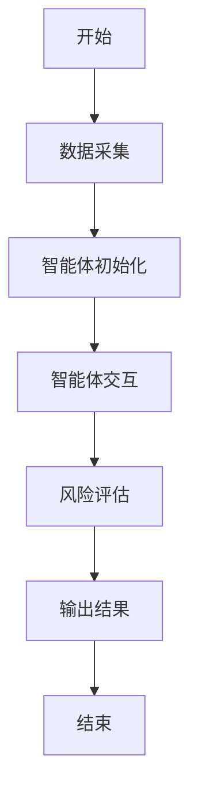
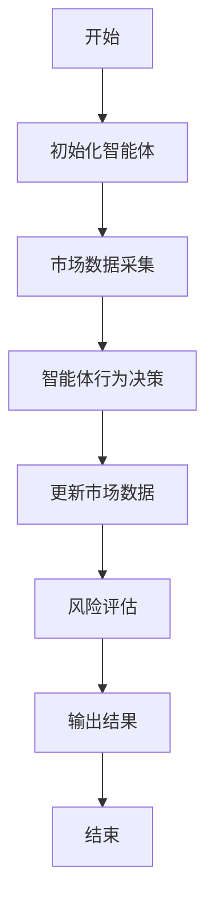
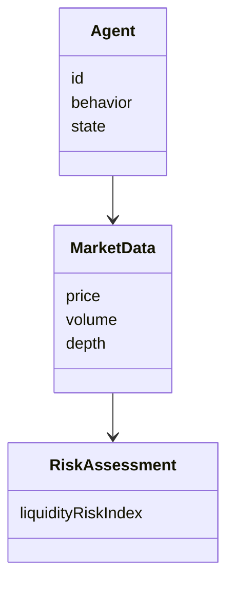
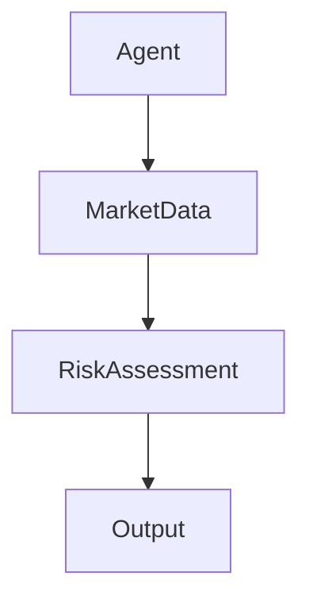
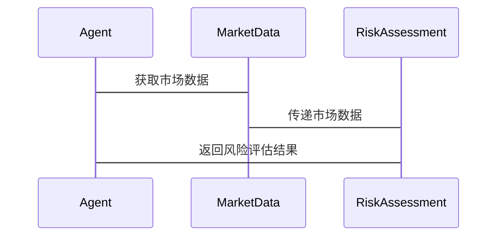

                 


```markdown
# 基于多智能体的动态市场流动性风险评估模型

## 关键词：
- 多智能体系统
- 流动性风险
- 金融市场
- 动态市场
- 风险评估

## 摘要：
本文提出了一种基于多智能体的动态市场流动性风险评估模型，旨在通过模拟市场参与者的行为，动态评估流动性风险。模型结合了多智能体系统的优势，能够捕捉市场中的复杂动态，为金融机构提供更准确的风险评估工具。文章详细介绍了模型的构建过程、算法原理、系统架构，并通过实际案例验证了模型的有效性。

---

## 第1章: 动态市场流动性风险评估背景与问题

### 1.1 问题背景

#### 1.1.1 金融市场流动性风险的定义
流动性风险是指资产在金融市场中无法以合理价格迅速变现的风险。传统的方法通常基于静态数据和假设，难以捕捉市场的动态变化。

#### 1.1.2 动态市场环境下的流动性风险特征
在动态市场中，流动性风险受到多种因素影响，包括市场参与者的实时行为、价格波动、交易量变化等。这些因素使得风险具有高度的动态性和复杂性。

#### 1.1.3 传统流动性风险评估方法的局限性
传统方法通常依赖于历史数据和统计模型，难以实时捕捉市场参与者的互动和行为变化。尤其是在市场波动加剧的情况下，传统方法往往显得不够灵活和准确。

### 1.2 问题描述

#### 1.2.1 多智能体系统在金融市场的应用潜力
多智能体系统能够模拟市场参与者的复杂行为，具有高度的灵活性和适应性。通过模拟个体行为，可以更好地理解市场动态。

#### 1.2.2 动态市场中流动性风险的复杂性
动态市场中的流动性风险涉及多个参与者之间的互动，个体行为的复杂性使得传统的单一分析方法难以奏效。

#### 1.2.3 基于多智能体的流动性风险评估需求
为了更准确地评估流动性风险，需要引入能够模拟市场参与者行为的多智能体系统，以捕捉市场的动态变化。

### 1.3 问题解决思路

#### 1.3.1 引入多智能体系统的必要性
通过引入多智能体系统，可以模拟市场参与者的实时行为，动态评估流动性风险。多智能体系统能够处理复杂的市场环境，提供更准确的风险评估结果。

#### 1.3.2 动态市场中多智能体的交互机制
在动态市场中，多智能体系统通过模拟个体行为的交互，捕捉市场动态变化，从而实现流动性风险的动态评估。

#### 1.3.3 基于多智能体的流动性风险评估框架
构建一个基于多智能体的框架，整合市场参与者的实时行为数据，利用多智能体系统的交互机制，动态评估流动性风险。

### 1.4 边界与外延

#### 1.4.1 研究的边界条件
研究的边界条件包括市场参与者的数量、行为规则、数据来源等，确保模型的适用性和准确性。

#### 1.4.2 相关概念的外延与内涵
流动性风险的内涵和外延需要明确，确保模型的适用范围和研究方向。

#### 1.4.3 模型的应用场景与限制
模型适用于动态市场环境，但在某些极端情况下可能存在局限性，需要进一步优化和调整。

---

## 第2章: 多智能体系统与流动性风险评估的核心概念

### 2.1 多智能体系统的定义与特点

#### 2.1.1 多智能体系统的定义
多智能体系统是由多个智能体组成的系统，智能体能够自主决策并与其他智能体和环境进行交互。

#### 2.1.2 多智能体系统的属性特征
- 分布式性：智能体分布在网络中，独立决策。
- 交互性：智能体之间可以通过通信进行交互。
- 自主性：智能体具有自主决策能力。
- 社会性：智能体之间通过合作和竞争实现目标。

#### 2.1.3 多智能体系统的优缺点对比
| 特性       | 优点                         | 缺点                         |
|------------|------------------------------|----------------------------|
| 分布式性   | 高度灵活，适应复杂环境       | 系统复杂性高，维护困难       |
| 交互性     | 模拟真实市场环境              | 通信开销大                  |
| 自主性     | 独立决策，适应性强            | 需要复杂的协调机制           |
| 社会性     | 通过合作和竞争提高整体效率    | 可能出现协调问题             |

### 2.2 流动性风险评估模型的构建要素

#### 2.2.1 市场参与者的行为特征
市场参与者包括投资者、交易员、机构等，他们的行为特征影响市场的流动性。

#### 2.2.2 市场动态的建模方法
通过建模市场参与者的决策过程，捕捉市场的动态变化。

#### 2.2.3 风险评估指标的选择
选择合适的指标，如交易量、价格波动、订单簿深度等，用于评估流动性风险。

### 2.3 多智能体与流动性风险评估的关联性

#### 2.3.1 多智能体系统在流动性风险评估中的作用
多智能体系统能够模拟市场参与者的实时行为，捕捉市场动态变化，提供更准确的流动性风险评估。

#### 2.3.2 多智能体系统与传统风险评估方法的对比
| 方法       | 优点                         | 缺点                         |
|------------|------------------------------|----------------------------|
| 传统方法   | 简单易用，计算速度快           | 难以捕捉市场动态变化         |
| 多智能体系统 | 模拟真实市场环境，动态评估     | 系统复杂性高，实现难度大     |

#### 2.3.3 多智能体系统的适用性分析
多智能体系统适用于动态市场环境，能够捕捉市场的复杂动态，但需要考虑系统的复杂性和实现成本。

---

## 第3章: 多智能体动态市场流动性风险评估模型的算法原理

### 3.1 模型算法概述

#### 3.1.1 基于多智能体的动态评估方法
通过模拟市场参与者的实时行为，动态评估流动性风险。模型的核心是智能体之间的交互和信息共享。

#### 3.1.2 多智能体系统的交互机制
智能体之间通过通信模块进行交互，共享市场信息，调整自身的决策策略。

#### 3.1.3 动态评估算法的设计思路
算法设计思路包括数据采集、智能体交互、风险评估等步骤，确保模型能够实时捕捉市场动态。

### 3.2 算法流程



### 3.3 算法实现

#### 3.3.1 Python代码实现

```python
import numpy as np
import random

class Agent:
    def __init__(self, id, behavior):
        self.id = id
        self.behavior = behavior
        self.state = "active"
    
    def act(self, market_data):
        if self.behavior == "buyer":
            return "buy"
        elif self.behavior == "seller":
            return "sell"
        else:
            return "hold"

def simulate_market(agents):
    market_data = {"price": 100, "volume": 1000}
    for agent in agents:
        action = agent.act(market_data)
        if action == "buy":
            market_data["price"] += 1
            market_data["volume"] -= 100
        elif action == "sell":
            market_data["price"] -= 1
            market_data["volume"] += 100
    return market_data

# 创建多个智能体
agents = [Agent(i, "buyer") for i in range(5)]
agents += [Agent(i, "seller") for i in range(5)]

# 模拟市场
market_result = simulate_market(agents)
print("最终市场价格：", market_result["price"], "交易量：", market_result["volume"])
```

#### 3.3.2 算法流程图


### 3.4 算法数学模型

#### 3.4.1 风险评估公式
$$
\text{流动性风险指数} = \frac{\text{市场波动率} \times \text{交易量}}{\text{订单簿深度}}
$$

#### 3.4.2 算法优化
通过优化智能体的行为策略，提高模型的准确性和效率。例如，采用遗传算法优化智能体的行为参数。

---

## 第4章: 数学模型与公式推导

### 4.1 数学模型概述
模型通过多智能体的交互，模拟市场动态，评估流动性风险。数学模型包括市场参与者的决策模型和风险评估指标的计算公式。

### 4.2 数学公式

#### 4.2.1 流动性风险评估公式
$$
\text{流动性风险} = \sum_{i=1}^{n} w_i \times r_i
$$
其中，$w_i$是风险因子的权重，$r_i$是风险因子的值。

#### 4.2.2 市场波动率计算公式
$$
\text{市场波动率} = \sqrt{\frac{1}{N} \sum_{i=1}^{N} (p_i - \bar{p})^2}
$$
其中，$N$是时间窗口的长度，$p_i$是第$i$个时间点的价格，$\bar{p}$是平均价格。

---

## 第5章: 系统分析与架构设计

### 5.1 系统功能设计

#### 5.1.1 领域模型


#### 5.1.2 系统架构


### 5.2 系统实现

#### 5.2.1 系统接口设计
- 数据接口：采集市场数据，如价格、交易量等。
- 智能体接口：定义智能体的行为和交互方式。
- 风险评估接口：计算流动性风险指数，输出结果。

#### 5.2.2 系统交互流程图


---

## 第6章: 项目实战

### 6.1 环境安装

#### 6.1.1 Python环境
安装Python 3.x，确保环境满足需求。

#### 6.1.2 库的安装
安装必要的库，如numpy、pandas、matplotlib等。

### 6.2 系统核心实现

#### 6.2.1 数据采集模块
实现市场数据的采集和处理，如从API获取实时数据。

#### 6.2.2 智能体交互模块
定义智能体的行为规则，实现智能体之间的交互。

#### 6.2.3 风险评估模块
根据市场数据和智能体行为，计算流动性风险指数，输出结果。

### 6.3 代码实现

#### 6.3.1 数据采集模块
```python
import requests

def get_market_data(api_key):
    url = f"https://api.example.com/market_data?api_key={api_key}"
    response = requests.get(url)
    return response.json()
```

#### 6.3.2 智能体交互模块
```python
class Agent:
    def __init__(self, id, behavior):
        self.id = id
        self.behavior = behavior
        self.state = "active"
    
    def act(self, market_data):
        if self.behavior == "buyer":
            return "buy"
        elif self.behavior == "seller":
            return "sell"
        else:
            return "hold"
```

#### 6.3.3 风险评估模块
```python
def calculate_liquidity_risk(market_data):
    volatility = np.std(market_data['price'])
    volume = market_data['volume']
    depth = market_data['depth']
    risk_index = (volatility * volume) / depth
    return risk_index
```

### 6.4 案例分析

#### 6.4.1 数据采集
通过API获取市场数据，如价格、交易量、订单簿深度等。

#### 6.4.2 智能体交互
模拟市场参与者的交易行为，更新市场数据。

#### 6.4.3 风险评估
根据更新后的市场数据，计算流动性风险指数，输出结果。

### 6.5 项目小结
通过项目实战，验证了模型的有效性，展示了多智能体系统在流动性风险评估中的应用潜力。

---

## 第7章: 最佳实践与总结

### 7.1 小结
本文提出了一种基于多智能体的动态市场流动性风险评估模型，通过模拟市场参与者的实时行为，动态评估流动性风险，为金融机构提供了新的工具和方法。

### 7.2 注意事项
在实际应用中，需要注意模型的复杂性和实现成本，确保数据的准确性和实时性。

### 7.3 拓展阅读
建议进一步研究多智能体系统的优化算法，探索其在金融市场的其他应用。

---

## 作者：AI天才研究院/AI Genius Institute & 禅与计算机程序设计艺术/Zen And The Art of Computer Programming
```

