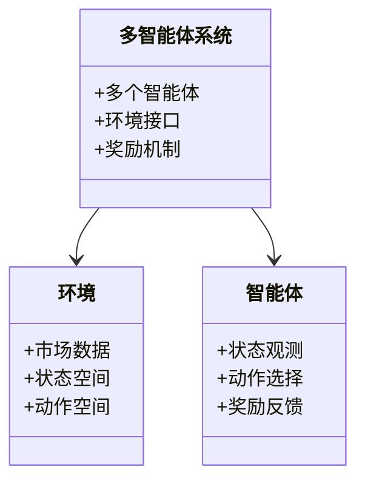
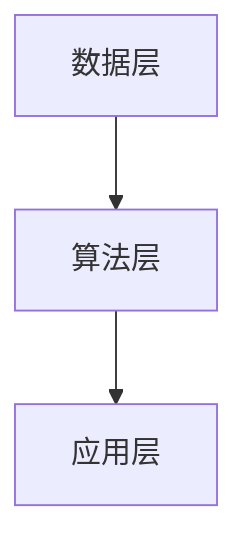
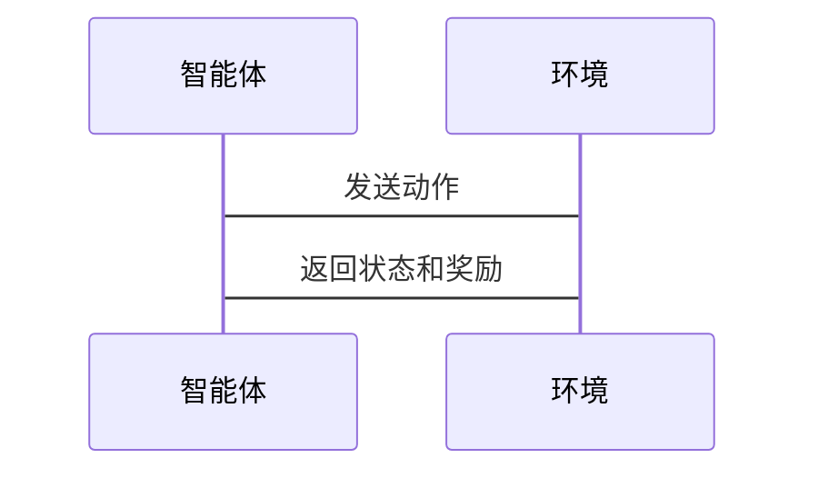

                 


# 多智能体强化学习在股票选择中的应用

> 关键词：多智能体强化学习，股票选择，强化学习，分布式决策，投资策略

> 摘要：本文深入探讨了多智能体强化学习在股票选择中的应用，从基础理论到算法实现，再到系统设计和项目实战，全面解析了多智能体强化学习如何助力股票选择。通过详细分析多智能体系统的核心概念、强化学习的算法原理，以及它们在股票选择中的结合，本文为读者提供了一套完整的解决方案。

---

## 第1章: 多智能体强化学习概述

### 1.1 多智能体系统的基本概念

#### 1.1.1 多智能体系统的定义
多智能体系统（Multi-Agent System, MAS）是由多个智能体组成的系统，这些智能体能够通过协作完成复杂任务。每个智能体都有自己的目标和决策机制。

#### 1.1.2 多智能体系统的特征
- **分布式性**：智能体之间独立决策，通过通信协作完成任务。
- **自主性**：每个智能体都有自主决策的能力。
- **反应性**：智能体能够根据环境变化实时调整行为。
- **协作性**：智能体之间通过协作提高整体系统的性能。

#### 1.1.3 多智能体系统与单智能体系统的区别
| 特性         | 单智能体系统             | 多智能体系统             |
|--------------|--------------------------|--------------------------|
| 决策中心化   | 单个智能体决策            | 多个智能体决策            |
| 行为协调性   | 决策集中在单一实体        | 需要协调多个智能体行为    |
| 系统复杂度   | 较低                     | 较高                     |

### 1.2 强化学习的基本原理

#### 1.2.1 强化学习的定义
强化学习（Reinforcement Learning, RL）是一种机器学习范式，通过智能体与环境的交互，学习最优策略以最大化累积奖励。

#### 1.2.2 强化学习的核心要素
- **智能体**：执行动作的主体。
- **环境**：智能体所处的外部世界。
- **动作**：智能体在某一状态下的行为。
- **状态**：描述环境当前情况的观测。
- **奖励**：智能体行为后获得的反馈，用于指导学习。

#### 1.2.3 强化学习的数学模型
强化学习的目标是找到最优策略 $\pi(a|s)$，使得智能体在与环境交互的过程中，获得的累积奖励最大。数学上，目标函数可以表示为：
$$ J(\pi) = \mathbb{E}[R] $$
其中，$R$ 是累积奖励。

### 1.3 多智能体强化学习的背景与应用

#### 1.3.1 多智能体强化学习的背景
随着金融市场的复杂化，单智能体难以应对多变的市场环境，多智能体通过分工协作，能够更高效地完成任务。

#### 1.3.2 多智能体强化学习的应用领域
- **金融投资**：用于股票选择、组合优化等。
- **机器人协作**：用于工业自动化、机器人编队。
- **游戏AI**：用于多智能体游戏、策略游戏。

#### 1.3.3 多智能体强化学习在股票选择中的潜力
通过分布式决策和协作，多智能体能够从多个角度分析市场，制定更优的投资策略。

---

## 第2章: 股票选择的基本原理

### 2.1 股票选择的核心要素

#### 2.1.1 市场分析
- **宏观经济因素**：GDP、利率、通货膨胀等。
- **行业分析**：行业发展趋势、竞争状况。
- **公司基本面**：财务状况、盈利能力、管理团队。

#### 2.1.2 股票基本面分析
- **市盈率（PE）**：股价与每股收益的比率。
- **市净率（PB）**：股价与每股净资产的比率。
- **股息率**：股息与股价的比率。

#### 2.1.3 技术分析
- **K线图**：显示股票价格的波动情况。
- **移动平均线**：用于识别趋势和支撑位。
- **成交量分析**：成交量是价格变动的确认指标。

### 2.2 股票选择的常见策略

#### 2.2.1 基于历史数据的策略
- **均值回归**：假设价格会回归均值。
- **动量策略**：投资于动量效应显著的股票。
- **反转策略**：投资于即将反转的股票。

#### 2.2.2 基于市场情绪的策略
- **情绪指标**：通过市场情绪预测股价波动。
- **市场恐慌指数**：衡量市场风险偏好。

#### 2.2.3 基于机器学习的策略
- **监督学习**：基于历史数据预测股价。
- **无监督学习**：发现市场中的隐含模式。

### 2.3 股票选择的挑战与难点

#### 2.3.1 市场的不确定性
股票市场受多种不可预测因素影响，如政策变化、突发事件等。

#### 2.3.2 数据的不完全性
市场数据可能存在噪声，影响模型的准确性。

#### 2.3.3 策略的可解释性
复杂的模型可能导致策略难以解释和调整。

---

## 第3章: 多智能体强化学习在股票选择中的结合

### 3.1 多智能体与股票选择的结合点

#### 3.1.1 多智能体在市场分析中的应用
- **市场情绪分析**：多个智能体分别分析不同市场情绪指标。
- **行业趋势预测**：每个智能体专注于一个行业，预测其发展趋势。

#### 3.1.2 多智能体在策略选择中的应用
- **组合优化**：多个智能体分别优化不同资产配置。
- **风险控制**：通过协作智能体实时监控和调整投资组合风险。

#### 3.1.3 多智能体在风险控制中的应用
- **实时监控**：多个智能体实时监控市场风险。
- **风险预警**：通过协作预测潜在风险点。

### 3.2 多智能体强化学习的核心优势

#### 3.2.1 分布式决策的优势
- **局部最优到全局最优**：每个智能体专注于局部优化，通过协作实现全局最优。
- **容错性高**：单个智能体的故障不影响整体系统的运行。

#### 3.2.2 多智能体协作的优势
- **信息共享**：智能体之间共享信息，提高决策的准确性。
- **任务分工**：每个智能体专注于不同的任务，提高效率。

#### 3.2.3 强化学习的实时反馈优势
- **实时调整策略**：根据市场反馈实时调整投资策略。
- **快速适应市场变化**：通过强化学习快速适应市场波动。

### 3.3 多智能体强化学习在股票选择中的应用场景

#### 3.3.1 股票组合优化
通过多智能体协作，优化投资组合，平衡风险和收益。

#### 3.3.2 股票交易策略生成
基于多智能体的强化学习，生成多样化的交易策略。

#### 3.3.3 市场风险预警
通过协作智能体实时监控市场风险，提前预警潜在风险。

---

## 第4章: 多智能体强化学习的算法原理

### 4.1 多智能体强化学习的基本算法

#### 4.1.1 分散决策算法
- **Q-learning**：通过Q值表学习最优策略。
- **DQN（Deep Q-Network）**：使用深度神经网络近似Q值函数。

#### 4.1.2 协作学习算法
- **联邦学习**：多个智能体协作学习，共享模型参数。
- **分布式强化学习**：智能体在分布式环境中学习。

### 4.2 多智能体强化学习的算法实现

#### 4.2.1 Q-learning算法
Q-learning算法通过更新Q值表，学习最优策略。算法流程如下：

```python
初始化Q表为零
while 环境未终止:
    状态s = 获取当前状态
    动作a = 选择动作（基于Q表）
    执行动作a，得到奖励r和新状态s'
    Q(s, a) = Q(s, a) + α*(r + γ*max(Q(s', a')) - Q(s, a))
```

#### 4.2.2 DQN算法
DQN算法使用深度神经网络近似Q值函数，避免Q表的维度问题。算法流程如下：

1. 环境初始化。
2. 智能体与环境交互，获取经验。
3. 经验存储在经验回放池中。
4. 神经网络通过经验回放进行训练。
5. 网络参数更新，优化Q值函数。

#### 4.2.3 算法在股票选择中的应用
通过训练智能体，使其能够在股票市场中学习最优的交易策略。例如，智能体可以通过Q-learning算法，学习在不同市场状态下选择最优的股票。

---

## 第5章: 系统分析与架构设计

### 5.1 系统背景介绍

#### 5.1.1 项目背景
本项目旨在利用多智能体强化学习技术，优化股票选择策略，提高投资收益。

### 5.2 系统功能设计

#### 5.2.1 领域模型设计
领域模型采用类图表示，展示系统中的各个模块及其关系。



### 5.3 系统架构设计

#### 5.3.1 系统架构
系统架构采用分层设计，包括数据层、算法层和应用层。



#### 5.3.2 系统交互流程
系统交互流程采用序列图表示，展示智能体与环境的交互过程。



---

## 第6章: 项目实战

### 6.1 环境安装

#### 6.1.1 安装Python
```bash
# 安装Python
# 可以使用Anaconda或虚拟环境管理工具
```

#### 6.1.2 安装依赖库
```bash
pip install numpy matplotlib tensorflow
```

### 6.2 核心代码实现

#### 6.2.1 Q-learning算法实现
```python
import numpy as np

class QLearning:
    def __init__(self, state_space, action_space):
        self.state_space = state_space
        self.action_space = action_space
        self.Q = np.zeros((state_space, action_space))
    
    def choose_action(self, state, epsilon=0.1):
        if np.random.random() < epsilon:
            return np.random.randint(self.action_space)
        else:
            return np.argmax(self.Q[state])
    
    def update_Q(self, state, action, reward, next_state, alpha=0.1, gamma=0.9):
        self.Q[state][action] += alpha * (reward + gamma * np.max(self.Q[next_state]) - self.Q[state][action])
```

#### 6.2.2 DQN算法实现
```python
import tensorflow as tf
from tensorflow.keras import layers

class DQN:
    def __init__(self, state_dim, action_dim, learning_rate=0.001):
        self.model = self.build_model(state_dim, action_dim)
        self.optimizer = tf.keras.optimizers.Adam(learning_rate=learning_rate)
    
    def build_model(self, state_dim, action_dim):
        model = tf.keras.Sequential()
        model.add(layers.Dense(64, activation='relu', input_dim=state_dim))
        model.add(layers.Dense(64, activation='relu'))
        model.add(layers.Dense(action_dim, activation='linear'))
        return model
    
    def update(self, states, actions, rewards, next_states, discount=0.99):
        states = tf.convert_to_tensor(states, dtype=tf.float32)
        actions = tf.convert_to_tensor(actions, dtype=tf.float32)
        rewards = tf.convert_to_tensor(rewards, dtype=tf.float32)
        next_states = tf.convert_to_tensor(next_states, dtype=tf.float32)
        
        with tf.GradientTape() as tape:
            current_q = self.model(states)
            current_q = tf.gather(current_q, actions)
            
            next_q = self.model(next_states)
            next_q = tf.reduce_max(next_q, axis=1)
            
            target = rewards + discount * next_q
            loss = tf.keras.losses.mean_squared_error(target, current_q)
        
        gradients = tape.gradient(loss, self.model.trainable_variables)
        self.optimizer.apply_gradients(zip(gradients, self.model.trainable_variables))
```

### 6.3 实际案例分析

#### 6.3.1 训练智能体进行股票交易
- 数据准备：使用历史股价数据，提取状态空间（如开盘价、收盘价、成交量等）。
- 训练过程：智能体通过与环境交互，学习最优的交易策略。
- 结果分析：智能体在测试数据上的表现优于传统策略。

#### 6.3.2 策略优化
- 通过多智能体协作，优化投资组合。
- 系统监控和调整策略，适应市场变化。

### 6.4 项目小结
通过项目实战，验证了多智能体强化学习在股票选择中的有效性，同时积累了实际应用的经验。

---

## 第7章: 最佳实践与总结

### 7.1 最佳实践

#### 7.1.1 系统设计
- 明确智能体的分工与协作。
- 设计合理的奖励机制。

#### 7.1.2 算法选择
- 根据任务需求选择合适的算法。
- 调参优化，提升模型性能。

#### 7.1.3 系统实现
- 使用成熟框架（如TensorFlow、PyTorch）加速开发。
- 注重代码的可维护性和可扩展性。

### 7.2 小结与展望
- **小结**：本文详细介绍了多智能体强化学习在股票选择中的应用，从理论到实践，为读者提供了一套完整的解决方案。
- **展望**：未来可以进一步研究多智能体协作机制，优化算法性能，探索更复杂的金融应用场景。

---

## 作者：AI天才研究院/AI Genius Institute & 禅与计算机程序设计艺术 /Zen And The Art of Computer Programming

