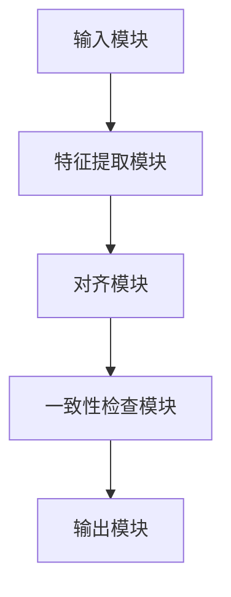
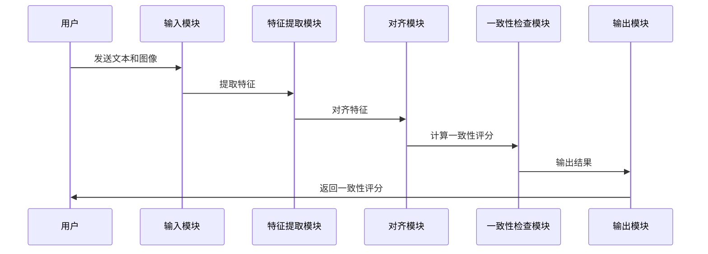

                 


# 开发AI Agent的跨模态内容一致性检查器

> 关键词：AI Agent，跨模态，内容一致性，检查器，多模态数据，语义对齐，特征提取

> 摘要：本文将详细探讨如何开发一个AI Agent的跨模态内容一致性检查器。在当今的AI应用中，多模态数据的处理变得越来越重要，如何确保不同模态的内容在语义上保持一致是AI Agent设计中的一个关键挑战。本文将从问题背景、核心概念、算法原理、系统架构设计到项目实战，全面分析如何构建这样一个检查器。通过本文的讲解，读者将能够理解跨模态内容一致性的核心原理，并掌握其实现方法。

---

# 第一部分: 背景介绍

## 第1章: 背景介绍

### 1.1 问题背景

#### 1.1.1 多模态数据的语义一致性问题
在现代AI应用中，多模态数据（如文本、图像、语音等）的处理越来越普遍。然而，这些模态之间的语义一致性问题却常常被忽视。例如，在一个多模态对话系统中，用户可能输入一段文本和一张图片，这两者的语义如果不一致，可能会导致系统误解用户的意图，从而生成错误的响应。

#### 1.1.2 AI Agent在跨模态交互中的挑战
AI Agent作为一种智能代理，需要能够处理多种模态的输入并生成一致的输出。然而，不同模态的数据具有不同的特征和语义空间，如何在这些模态之间建立一致的语义理解是一个重要的技术难题。

#### 1.1.3 内容一致性检查的必要性
内容一致性检查是确保AI Agent能够准确理解输入数据的关键。通过一致性检查，AI Agent可以识别出不同模态数据之间的矛盾或不一致，并采取相应的措施（如提示用户重新输入、调整输出策略等）。

### 1.2 问题描述

#### 1.2.1 跨模态内容不一致的定义
跨模态内容不一致指的是在不同模态的数据中，语义表达存在矛盾或不匹配。例如，一段文本描述的是“一只猫”，而对应的图片却显示的是“一只狗”。

#### 1.2.2 问题场景分析
跨模态内容不一致的问题可能出现在多个场景中，例如：
- 多模态对话系统中，用户的文本输入和图片输入存在语义矛盾。
- 智能内容审核系统中，文本和图片的内容不一致，导致审核结果错误。

#### 1.2.3 问题的边界与外延
跨模态内容一致性检查的核心是确保不同模态的数据在语义上的一致性。其边界包括：
- 模态的类型（如文本、图像、语音等）。
- 内容一致性检查的粒度（如整体一致、局部一致等）。
- 检查的范围（如实时检查、离线检查等）。

### 1.3 核心概念与联系

#### 1.3.1 跨模态数据处理的基本原理
跨模态数据处理的核心在于将不同模态的数据映射到一个共同的语义空间，并在此空间中进行语义分析和一致性检查。

#### 1.3.2 一致性度量的定义
一致性度量是指对不同模态数据之间语义相似性或一致性的量化评估。常用的度量方法包括余弦相似度、欧氏距离等。

#### 1.3.3 AI Agent与跨模态检查的关系
AI Agent通过跨模态内容一致性检查器，可以更好地理解输入数据的语义，从而生成更准确的响应。这种一致性检查器是AI Agent实现跨模态智能的核心组件之一。

---

# 第二部分: 核心概念与联系

## 第2章: 核心概念与联系

### 2.1 跨模态数据处理原理

#### 2.1.1 文本特征提取
文本特征提取通常采用预训练语言模型（如BERT、GPT等）进行词向量表示。例如，使用BERT模型将文本转换为固定长度的向量表示。

#### 2.1.2 图像特征提取
图像特征提取通常采用卷积神经网络（CNN）进行特征提取。例如，使用ResNet模型提取图像的高层次特征。

#### 2.1.3 联合特征学习
联合特征学习的目标是将不同模态的特征表示映射到一个共同的语义空间。例如，可以通过对比学习的方法，将文本和图像的特征向量对齐。

### 2.2 内容一致性度量

#### 2.2.1 基于相似度的度量方法
常用的相似度计算方法包括余弦相似度、欧氏距离等。例如，余弦相似度可以表示为：
$$ \text{sim}(x, y) = \frac{x \cdot y}{\|x\| \|y\|} $$

#### 2.2.2 基于对比学习的度量方法
对比学习是一种有效的跨模态对齐方法，通过最大化相同语义的模态特征之间的相似性，来实现跨模态对齐。

#### 2.2.3 跨模态一致性评分的计算
一致性评分可以通过加权平均或其他聚合方法来计算。例如：
$$ \text{score} = \alpha \cdot \text{sim}_\text{text} + (1-\alpha) \cdot \text{sim}_\text{image} $$

### 2.3 AI Agent与跨模态检查的系统架构

#### 2.3.1 系统组成模块
系统主要包括：
- 输入模块：接收多模态输入数据。
- 特征提取模块：对不同模态数据进行特征提取。
- 对齐模块：将不同模态的特征映射到共同语义空间。
- 一致性检查模块：计算一致性评分并输出结果。

#### 2.3.2 模块之间的关系
模块之间的关系可以通过以下Mermaid图表示：



### 2.4 本章小结

---

# 第三部分: 跨模态内容一致性检查的算法原理

## 第3章: 跨模态内容一致性检查的算法原理

### 3.1 特征提取与表示学习

#### 3.1.1 文本特征提取
使用预训练语言模型进行文本特征提取，例如：
- 输入文本：`"这是一只猫"`
- 输出向量：`[v1, v2, ..., vn]`

#### 3.1.2 图像特征提取
使用CNN提取图像特征，例如：
- 输入图像：一张猫的图片
- 输出向量：`[w1, w2, ..., wm]`

#### 3.1.3 联合特征学习
通过对比学习将文本和图像的特征向量对齐，例如：
$$ L = \text{sim}(f_\text{text}(x), f_\text{image}(y)) $$

### 3.2 跨模态对齐与一致性度量

#### 3.2.1 跨模态对齐算法
对比学习算法：
- 输入：文本和图像
- 输出：对齐的特征向量

#### 3.2.2 跨模态相似度计算
使用余弦相似度计算对齐后的特征向量：
$$ \text{sim}(x, y) = \frac{x \cdot y}{\|x\| \|y\|} $$

#### 3.2.3 一致性评分的优化方法
通过损失函数优化一致性评分，例如：
$$ L = \text{sim}(x, y) - \lambda \cdot \text{sim}(x', y') $$

### 3.3 算法实现的数学模型

#### 3.3.1 特征表示的数学表达
文本特征表示：
$$ f_\text{text}(x) = \text{BERT}(x) $$
图像特征表示：
$$ f_\text{image}(y) = \text{ResNet}(y) $$

#### 3.3.2 对齐模型的数学公式
对比学习损失函数：
$$ L = \text{sim}(f_\text{text}(x), f_\text{image}(y)) - \lambda \cdot \text{sim}(f_\text{text}(x'), f_\text{image}(y')) $$

#### 3.3.3 一致性评分的计算公式
$$ \text{score} = \alpha \cdot \text{sim}_\text{text} + (1-\alpha) \cdot \text{sim}_\text{image} $$

### 3.4 本章小结

---

# 第四部分: 跨模态内容一致性检查的系统架构设计

## 第4章: 跨模态内容一致性检查的系统架构设计

### 4.1 系统功能设计

#### 4.1.1 功能模块划分
- 输入模块：接收多模态输入数据。
- 特征提取模块：对不同模态数据进行特征提取。
- 对齐模块：将不同模态的特征映射到共同语义空间。
- 一致性检查模块：计算一致性评分并输出结果。

#### 4.1.2 功能描述
- 输入模块：接收文本和图像输入。
- 特征提取模块：分别提取文本和图像特征。
- 对齐模块：将文本和图像特征对齐。
- 一致性检查模块：计算一致性评分并输出结果。

#### 4.1.3 系统的输入输出流程
- 输入：文本和图像
- 输出：一致性评分

### 4.2 系统架构设计

#### 4.2.1 分层架构设计
- 数据层：存储多模态数据。
- 逻辑层：实现特征提取、对齐和一致性检查功能。
- 表现层：展示结果。

#### 4.2.2 模块之间的交互关系
模块之间的关系可以通过以下Mermaid图表示：


### 4.3 接口设计与交互流程

#### 4.3.1 系统接口定义
- 输入接口：`/api/input`
- 输出接口：`/api/output`

#### 4.3.2 接口的调用流程
1. 用户调用输入接口，发送文本和图像数据。
2. 系统调用特征提取模块，提取文本和图像特征。
3. 特征提取模块返回特征向量。
4. 对齐模块将特征向量对齐。
5. 一致性检查模块计算一致性评分并输出结果。

#### 4.3.3 交互的时序图设计


### 4.4 本章小结

---

# 第五部分: 项目实战与实现

## 第5章: 项目实战与实现

### 5.1 环境搭建与工具安装

#### 5.1.1 开发环境配置
- 操作系统：Linux/Windows/MacOS
- Python版本：3.8+
- 开发工具：PyCharm/VS Code

#### 5.1.2 依赖库的安装
- BERT库：`transformers`库
- ResNet库：`torchvision`库
- 其他依赖：`numpy`, `scikit-learn`

安装命令：
```bash
pip install transformers torchvision numpy scikit-learn
```

#### 5.1.3 开发工具的选择
推荐使用PyCharm或VS Code进行开发。

### 5.2 核心功能实现

#### 5.2.1 特征提取模块实现

##### 5.2.1.1 文本特征提取代码
```python
from transformers import BertTokenizer, BertModel
import torch

def text_feature_extraction(text):
    tokenizer = BertTokenizer.from_pretrained('bert-base-uncased')
    model = BertModel.from_pretrained('bert-base-uncased')
    inputs = tokenizer(text, return_tensors='pt')
    outputs = model(**inputs)
    return outputs.last_hidden_state.squeeze()
```

##### 5.2.1.2 图像特征提取代码
```python
from torchvision import models, transforms
import torch

def image_feature_extraction(image_path):
    model = models.resnet50(pretrained=True)
    transform = transforms.Compose([
        transforms.Resize(256),
        transforms.CenterCrop(224),
        transforms.ToTensor(),
        transforms.Normalize(mean=[0.485, 0.456, 0.406], std=[0.229, 0.224, 0.225]),
    ])
    image = Image.open(image_path)
    image_tensor = transform(image).unsqueeze(0)
    outputs = model(image_tensor)
    return outputs.squeeze()
```

#### 5.2.2 对齐模块实现

##### 5.2.2.1 对比学习代码
```python
import torch
import torch.nn as nn

class ContrastiveLoss(nn.Module):
    def __init__(self, temperature=0.1):
        super(ContrastiveLoss, self).__init__()
        self.temperature = temperature

    def forward(self, feature_text, feature_image):
        # 计算余弦相似度
        sim = torch.cosine_similarity(feature_text, feature_image)
        # 计算损失
        loss = (1 - sim).mean()
        return loss
```

#### 5.2.3 一致性检查模块实现

##### 5.2.3.1 一致性评分计算代码
```python
def consistency_score(feature_text, feature_image, alpha=0.5):
    # 计算余弦相似度
    sim_text = torch.cosine_similarity(feature_text, feature_text.mean(dim=-1, keepdim=True))
    sim_image = torch.cosine_similarity(feature_image, feature_image.mean(dim=-1, keepdim=True))
    # 加权平均
    score = alpha * sim_text + (1-alpha) * sim_image
    return score
```

### 5.3 实际案例分析与代码解读

#### 5.3.1 案例分析
假设我们有一个文本描述“一只猫”和一张猫的图片，我们希望检查这两者的一致性。

#### 5.3.2 代码实现
```python
text = "一只猫"
image_path = "cat.jpg"

# 提取特征
feature_text = text_feature_extraction(text)
feature_image = image_feature_extraction(image_path)

# 对齐模块
contrastive_loss = ContrastiveLoss()
loss = contrastive_loss(feature_text, feature_image)

# 一致性评分
score = consistency_score(feature_text, feature_image)
print("一致性评分:", score.item())
```

### 5.4 项目小结

---

# 第六部分: 总结与展望

## 第6章: 总结与展望

### 6.1 总结
本文详细探讨了如何开发一个AI Agent的跨模态内容一致性检查器。通过背景介绍、核心概念、算法原理、系统架构设计和项目实战的讲解，读者可以全面理解跨模态内容一致性检查器的核心原理和实现方法。

### 6.2 展望
未来的研究方向可以包括：
- 更高效的跨模态对齐算法
- 更准确的一致性度量方法
- 更强大的多模态特征提取模型

### 6.3 最佳实践 Tips
- 在实际应用中，建议根据具体场景选择合适的特征提取模型和对齐方法。
- 定期更新模型参数，以适应数据分布的变化。

### 6.4 注意事项
- 在实际应用中，需要注意模型的训练数据质量和多样性。
- 需要合理设置超参数（如对比学习的温度参数）以获得最佳性能。

### 6.5 拓展阅读
- 《Contrastive Learning: A Unified Framework for Self-Supervised Learning》
- 《BERT: Pre-training of Deep Bidirectional Transformers for NLP》

---

# 作者：AI天才研究院/AI Genius Institute & 禅与计算机程序设计艺术 /Zen And The Art of Computer Programming

---

以上是关于《开发AI Agent的跨模态内容一致性检查器》的技术博客文章的完整目录和内容框架。

