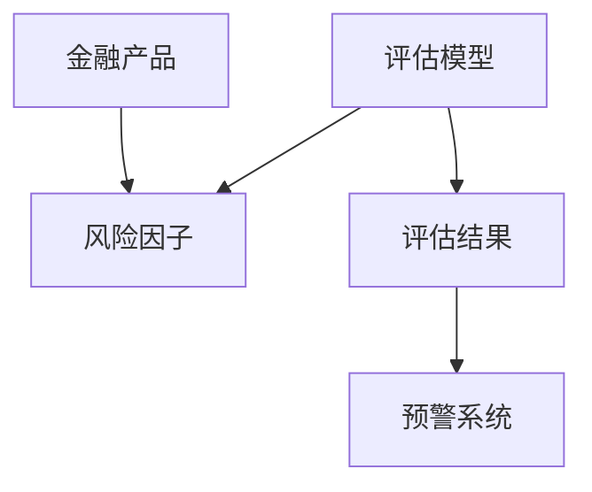
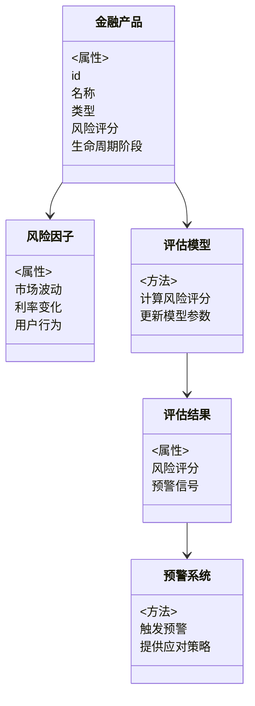
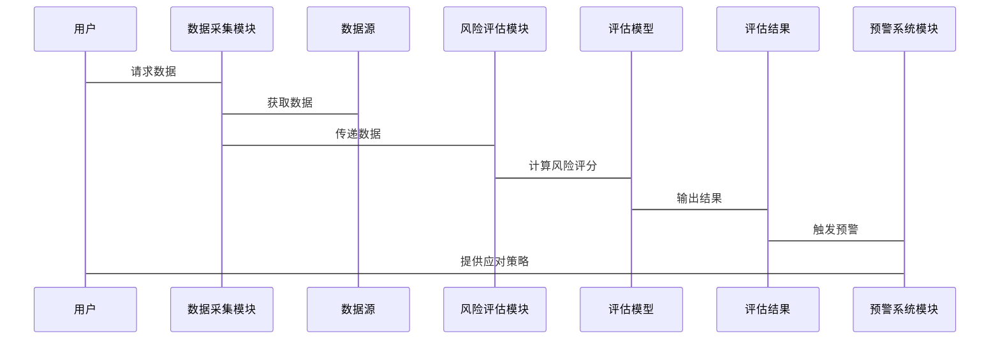

                 


# 开发智能化的金融产品生命周期风险动态评估平台

> 关键词：金融风险管理、动态风险评估、金融产品生命周期、机器学习、时间序列分析

> 摘要：本文详细探讨了开发智能化金融产品生命周期风险动态评估平台的核心技术与实现方法。文章从背景与目标出发，分析了动态风险评估的核心概念与算法原理，结合系统架构设计与项目实战，全面阐述了如何构建一个高效、智能的金融风险评估系统。

---

# 第一部分: 背景介绍

## 第1章: 金融产品生命周期风险动态评估平台概述

### 1.1 问题背景与描述

#### 1.1.1 传统金融产品风险管理的局限性
传统的金融产品风险管理通常基于静态模型和固定规则，难以应对市场环境的快速变化。例如，传统的风险评估可能仅基于历史数据和固定指标，无法实时捕捉市场波动、政策变化或突发事件对产品风险的影响。

#### 1.1.2 动态风险评估的必要性
随着金融市场日益复杂化，金融产品的风险暴露往往呈现动态变化特征。例如，一只股票型基金的风险在市场牛市和熊市中的表现截然不同。因此，动态评估金融产品生命周期中的风险变化，能够帮助金融机构更及时地采取应对措施，降低潜在损失。

#### 1.1.3 平台目标与意义
本平台的目标是通过智能化技术，实时动态评估金融产品的风险状态，覆盖其生命周期的各个阶段，包括产品设计、发行、运行和终止。通过整合多源数据和先进算法，平台能够提供实时、精准的风险评估结果，并生成预警信号，辅助决策者优化风险管理策略。

### 1.2 平台的核心概念与组成

#### 1.2.1 动态风险评估的定义
动态风险评估是指在金融产品生命周期的不同阶段，根据实时数据和市场变化，持续更新和调整风险评估结果的过程。与静态评估相比，动态评估具有更强的适应性和实时性。

#### 1.2.2 金融产品生命周期的阶段划分
金融产品的生命周期可以划分为以下几个阶段：
1. **设计阶段**：产品设计、风险分析和初步评估。
2. **发行阶段**：产品上线、市场推广和初始风险暴露。
3. **运行阶段**：产品运作、风险监控和动态调整。
4. **终止阶段**：产品清盘、风险处置和总结评估。

#### 1.2.3 平台的核心要素与组成模块
平台由以下几个核心模块组成：
1. **数据采集模块**：实时采集市场数据、产品数据和用户行为数据。
2. **风险评估模块**：基于机器学习算法，动态计算产品的风险评分。
3. **预警系统模块**：根据风险评分生成预警信号，并提供应对策略。
4. **可视化模块**：以图表形式展示风险评估结果和预警信息。

### 1.3 平台的边界与外延

#### 1.3.1 平台的功能边界
平台主要关注金融产品的风险评估，不涉及产品设计、投资决策或交易执行等其他功能。

#### 1.3.2 平台的适用范围与限制
平台适用于各类金融产品，包括股票、基金、债券、衍生品等，但不适用于非金融类产品（如实物商品）的风险评估。

#### 1.3.3 平台与外部系统的交互关系
平台需要与以下外部系统进行交互：
1. **数据源**：金融市场数据供应商、产品数据库。
2. **用户界面**：金融机构的风控部门、投资经理等用户群体。
3. **预警系统**：与交易系统、资产管理系统集成。

### 1.4 本章小结
本章介绍了开发智能化金融产品生命周期风险动态评估平台的背景与目标，明确了平台的核心概念与组成模块，并界定了平台的功能边界与适用范围。

---

# 第二部分: 核心概念与联系

## 第2章: 核心概念与关联分析

### 2.1 动态风险评估的核心原理

#### 2.1.1 动态风险评估的数学模型
动态风险评估的核心是基于时间序列分析和机器学习算法，构建能够捕捉市场变化的数学模型。例如，使用ARIMA模型对历史数据进行建模，预测未来的风险趋势。

#### 2.1.2 风险因子的动态变化特征
金融产品的风险受多种因素影响，包括市场波动、宏观经济指标、政策变化等。这些因素通常具有动态变化特征，需要通过模型实时捕捉。

#### 2.1.3 动态评估的实时性与准确性
动态评估的关键在于实时更新模型参数，以反映最新的市场信息。然而，实时性与准确性之间存在权衡，需要通过模型优化和参数调整来实现平衡。

### 2.2 金融产品生命周期的阶段模型

#### 2.2.1 产品设计阶段的风险评估
在产品设计阶段，需要通过历史数据和市场分析，评估产品的潜在风险。例如，通过分析类似产品的历史表现，预测新产品的风险特征。

#### 2.2.2 产品发行阶段的风险监控
在产品发行阶段，需要实时监控市场反应和产品表现，及时发现潜在风险。例如，通过分析产品的市场流动性，评估产品的流动性风险。

#### 2.2.3 产品运行阶段的风险预警
在产品运行阶段，需要持续监控产品的风险指标，如波动率、信用评级等，并根据实时数据动态调整风险评估结果。

### 2.3 核心概念的属性对比

| 核心概念 | 动态风险评估 | 静态风险评估 |
|----------|--------------|--------------|
| 时间维度 | 实时更新      | 固定时间窗口 |
| 数据来源 | 实时数据      | 历史数据      |
| 精度要求 | 高            | 中            |

#### 2.3.1 动态风险评估与静态风险评估的对比
动态风险评估能够捕捉市场变化，提供更及时的风险信号，但计算复杂度较高。静态风险评估计算简单，但可能无法反映最新的市场变化。

#### 2.3.2 不同金融产品的风险特征分析
不同金融产品的风险特征差异显著。例如，股票的风险主要受市场波动影响，而债券的风险主要受利率变化影响。

#### 2.3.3 平台功能模块的属性分析
平台的功能模块需要具备高实时性、高准确性、高可扩展性等属性，以满足金融市场的复杂需求。

### 2.4 实体关系图（ER图）



#### 2.4.1 实体关系图的解释
- **金融产品（A）**：平台需要评估的金融产品。
- **风险因子（B）**：影响金融产品风险的各种因素，如市场波动、利率变化等。
- **评估模型（C）**：用于计算金融产品风险的算法和数学模型。
- **评估结果（D）**：模型计算出的风险评分和预警信号。
- **预警系统（E）**：根据评估结果，触发预警信号并提供应对策略。

### 2.5 本章小结
本章通过对比分析，明确了动态风险评估与静态风险评估的区别，阐述了金融产品生命周期中不同阶段的风险特征，并通过ER图展示了平台的核心实体关系。

---

# 第三部分: 算法原理与数学模型

## 第3章: 动态风险评估算法原理

### 3.1 时间序列分析算法

#### 3.1.1 时间序列的基本特征
时间序列分析是动态风险评估的重要工具。时间序列的基本特征包括趋势、周期性、季节性等。

#### 3.1.2 ARIMA模型的原理与应用
ARIMA（Autoregressive Integrated Moving Average）模型是一种常用的时间序列预测模型。其基本公式为：

$$ARIMA(p, d, q)$$

其中：
- $p$ 是自回归阶数。
- $d$ 是差分阶数。
- $q$ 是移动平均阶数。

#### 3.1.3 LSTM网络在时间序列预测中的优势
LSTM（Long Short-Term Memory）网络是一种基于深度学习的时间序列预测模型。与ARIMA模型相比，LSTM能够更好地捕捉复杂的时间序列特征，特别是在数据中存在非线性关系时表现更优。

### 3.2 集成学习算法

#### 3.2.1 Bagging与Boosting的基本原理
Bagging是一种通过生成多个基模型来降低预测误差的技术，而Boosting是一种通过迭代提升基模型性能的技术。

#### 3.2.2 随机森林在风险评估中的应用
随机森林是一种基于Bagging算法的集成学习方法，适用于高维数据的分类和回归问题。

#### 3.2.3 XGBoost算法的优势
XGBoost是一种基于Boosting算法的优化决策树模型，具有计算效率高、模型解释性强等优点。

### 3.3 机器学习模型的数学公式

#### 3.3.1 ARIMA模型公式
$$ARIMA(p, d, q)$$

其中，$p$ 表示自回归部分的阶数，$d$ 表示差分的阶数，$q$ 表示移动平均部分的阶数。

#### 3.3.2 LSTM网络的结构
LSTM的基本单元包括输入门（Input Gate）、遗忘门（Forget Gate）和输出门（Output Gate），公式如下：

$$
\begin{aligned}
i &= \sigma(W_i x + U_i h_{prev}) \\
f &= \sigma(W_f x + U_f h_{prev}) \\
o &= \sigma(W_o x + U_o h_{prev}) \\
g &= \tanh(W_g x + U_g h_{prev}) \\
h &= f \cdot h_{prev} + i \cdot g \\
\end{aligned}
$$

其中，$i$ 是输入门，$f$ 是遗忘门，$o$ 是输出门，$g$ 是候选细胞状态，$h$ 是最终的隐藏状态。

### 3.4 本章小结
本章详细介绍了时间序列分析和集成学习算法在动态风险评估中的应用，重点讲解了ARIMA模型和LSTM网络的原理与公式，为后续的系统实现奠定了理论基础。

---

# 第四部分: 系统分析与架构设计

## 第4章: 系统分析与架构设计方案

### 4.1 问题场景介绍

#### 4.1.1 系统需求分析
平台需要满足以下功能需求：
1. 实时采集金融市场数据。
2. 动态计算金融产品的风险评分。
3. 生成风险预警信号。
4. 提供可视化界面供用户查看结果。

#### 4.1.2 系统约束条件
系统需要满足以下约束条件：
1. 实时性要求：评估结果需要在秒级内更新。
2. 高可用性：系统需要7×24小时无故障运行。
3. 数据安全性：保护用户数据和系统安全。

### 4.2 项目介绍

#### 4.2.1 项目目标
开发一个智能化的金融产品生命周期风险动态评估平台，实现对金融产品的实时风险评估和预警。

#### 4.2.2 项目范围
平台适用于各类金融产品，包括股票、基金、债券、衍生品等。

### 4.3 系统功能设计

#### 4.3.1 领域模型（Mermaid 类图）



#### 4.3.2 系统架构设计（Mermaid 架构图）

```mermaid
container 金融产品生命周期风险动态评估平台 {
    组件 数据采集模块
    组件 风险评估模块
    组件 预警系统模块
    组件 可视化模块
}
```

#### 4.3.3 系统接口设计
系统接口包括：
1. 数据接口：与数据源（如金融市场数据供应商）对接。
2. 用户接口：与金融机构的风控部门对接。
3. 预警接口：与交易系统、资产管理系统对接。

#### 4.3.4 系统交互流程（Mermaid 序列图）



### 4.4 本章小结
本章通过系统分析和架构设计，明确了平台的功能需求和实现方案，为后续的系统开发奠定了基础。

---

# 第五部分: 项目实战

## 第5章: 项目实战与经验分享

### 5.1 环境安装与配置

#### 5.1.1 系统需求
- 操作系统：Linux/Windows/MacOS
- 硬件配置：4核 CPU，8GB 内存
- 软件依赖：Python 3.8+, Pandas, Scikit-learn, LSTM 模型库

#### 5.1.2 安装步骤
1. 安装 Python 环境：
   ```bash
   pip install python
   ```
2. 安装依赖库：
   ```bash
   pip install pandas scikit-learn
   ```

### 5.2 系统核心实现源代码

#### 5.2.1 数据预处理代码
```python
import pandas as pd

def preprocess_data(data):
    # 数据清洗
    data = data.dropna()
    # 标准化处理
    from sklearn.preprocessing import StandardScaler
    scaler = StandardScaler()
    data_scaled = scaler.fit_transform(data)
    return data_scaled
```

#### 5.2.2 风险评估模型实现
```python
from sklearn.ensemble import RandomForestClassifier
import numpy as np

def train_model(X_train, y_train):
    model = RandomForestClassifier(n_estimators=100, max_depth=5, random_state=42)
    model.fit(X_train, y_train)
    return model
```

#### 5.2.3 预警系统实现
```python
def generate_alarm信号（signal）：
    # 假设风险评分为0.9以上为高风险
    if risk_score > 0.9:
        return "红色预警"
    elif risk_score > 0.7:
        return "橙色预警"
    else:
        return "绿色预警"
```

### 5.3 代码应用解读与分析

#### 5.3.1 数据预处理
数据预处理是模型训练的前提。通过标准化处理，可以消除不同特征之间的量纲差异，提高模型的训练效果。

#### 5.3.2 模型训练
随机森林模型是一种集成学习算法，适用于高维数据的分类和回归问题。通过调整模型参数（如n_estimators和max_depth），可以优化模型的性能。

#### 5.3.3 预警系统
预警系统的实现基于风险评分的阈值判断。通过设置不同的预警级别，可以为用户提供不同级别的风险提示，帮助其采取相应的应对措施。

### 5.4 实际案例分析

#### 5.4.1 案例背景
假设我们正在评估一只股票型基金的风险。历史数据显示，该基金在市场牛市中的波动率较低，而在熊市中的波动率较高。

#### 5.4.2 数据分析
通过预处理后的数据，我们可以发现该基金的风险评分在市场下跌期间显著提高。

#### 5.4.3 模型预测
模型预测结果显示，未来一个月内该基金的风险评分为0.85，属于橙色预警级别。

### 5.5 项目小结
本章通过实际案例分析，展示了平台的核心功能和实现过程。通过代码实现，验证了模型的有效性和预警系统的实用性。

---

# 第六部分: 总结与展望

## 第6章: 总结与展望

### 6.1 本章总结
本文详细探讨了开发智能化金融产品生命周期风险动态评估平台的核心技术与实现方法。通过背景分析、核心概念阐述、算法原理讲解、系统架构设计和项目实战，全面展示了平台的构建过程和应用场景。

### 6.2 未来展望
未来，随着人工智能技术的不断发展，动态风险评估平台将更加智能化和自动化。以下是未来可能的发展方向：
1. **引入实时数据源**：通过接入实时行情数据，进一步提高评估的实时性。
2. **增强模型解释性**：通过模型解释技术（如SHAP值），帮助用户更好地理解风险评估结果。
3. **拓展应用场景**：将平台应用于更多类型的金融产品，如加密货币、保险产品等。

### 6.3 最佳实践 Tips

#### 6.3.1 数据质量的重要性
数据质量是模型性能的基础。在实际应用中，需要高度重视数据的完整性和准确性。

#### 6.3.2 模型更新的频率
模型需要定期更新，以反映市场变化和数据分布的变化。建议根据业务需求，设置合理的模型更新频率。

#### 6.3.3 预警系统的可配置性
预警系统的阈值和规则需要根据具体业务需求进行配置，以满足不同金融机构的个性化需求。

### 6.4 本章小结
本章总结了本文的核心内容，并展望了未来的发展方向，同时提供了一些实践中的注意事项和建议。

---

# 作者信息

作者：AI天才研究院/AI Genius Institute & 禅与计算机程序设计艺术/Zen And The Art of Computer Programming

---

**本文通过系统化的分析与实践，深入探讨了开发智能化金融产品生命周期风险动态评估平台的关键技术与实现方法。从背景分析到系统实现，再到项目实战，为读者提供了一套完整的解决方案，帮助金融机构更好地应对金融市场的不确定性与风险挑战。**

