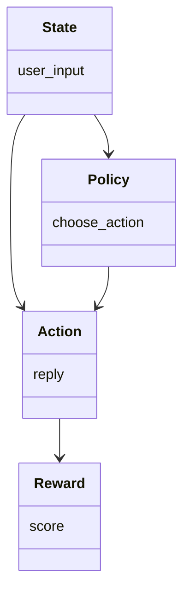
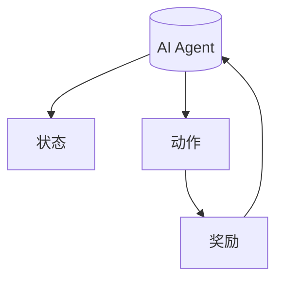
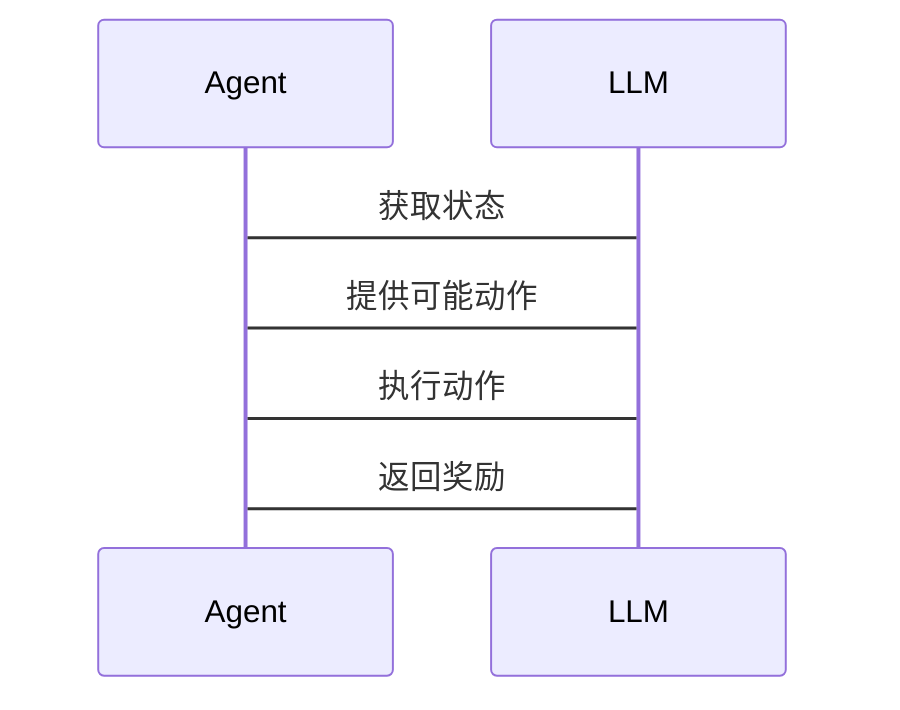

                 


```markdown
# 强化学习在AI Agent中的应用：优化LLM的决策

> 关键词：强化学习, AI Agent, 大语言模型, 决策优化, 算法实现

> 摘要：本文探讨了强化学习在AI Agent中的应用，重点分析了如何通过强化学习优化大语言模型（LLM）的决策过程。文章从强化学习的基本概念出发，结合数学模型和算法原理，详细讲解了强化学习在优化LLM决策中的具体实现方法，并通过实际案例展示了强化学习在提升LLM决策能力中的应用效果。

---

# 第一部分: 强化学习在AI Agent中的应用基础

## 第1章: 强化学习与AI Agent概述

### 1.1 强化学习的基本概念

#### 1.1.1 强化学习的定义与核心概念
强化学习（Reinforcement Learning, RL）是一种机器学习范式，其中智能体通过与环境交互来学习策略，以最大化累积的奖励。其核心概念包括：
- **状态（State）**：智能体所处的环境情况。
- **动作（Action）**：智能体在某一状态下选择的行为。
- **奖励（Reward）**：智能体执行动作后获得的反馈，用于指导学习。
- **策略（Policy）**：决定动作选择的概率分布函数。
- **值函数（Value Function）**：预测从当前状态开始的未来累积奖励。

#### 1.1.2 AI Agent的基本概念与分类
AI Agent是能够感知环境并采取行动以实现目标的智能实体。根据智能体的决策方式，可以分为：
- **反应式Agent**：基于当前感知做出决策。
- **认知式Agent**：具备复杂推理和规划能力。

#### 1.1.3 强化学习在AI Agent中的重要性
强化学习为AI Agent提供了自适应决策能力，使其能够在动态环境中优化行为，从而提高任务成功率。

### 1.2 大语言模型（LLM）的基本原理

#### 1.2.1 LLM的定义与特点
大语言模型是基于大量数据训练的深度学习模型，具有强大的自然语言处理能力。其特点包括：
- **大规模训练数据**：通常使用万亿级参数。
- **上下文理解能力**：能够捕捉长文本中的语义信息。
- **多任务适应性**：适用于多种自然语言处理任务。

#### 1.2.2 LLM的训练机制与应用场景
LLM通常采用监督学习和无监督学习结合的方式进行训练，广泛应用于文本生成、问答系统、机器翻译等领域。

#### 1.2.3 LLM在决策优化中的潜力
通过强化学习，可以优化LLM的决策过程，使其在复杂任务中做出更优选择。

### 1.3 强化学习优化LLM决策的背景与意义

#### 1.3.1 当前LLM决策优化的挑战
- **决策不确定性**：LLM可能生成不准确或不合适的决策。
- **动态环境适应**：LLM需要在动态环境中实时调整决策。

#### 1.3.2 强化学习在LLM优化中的独特优势
- **自适应性**：强化学习使LLM能够根据反馈不断优化决策。
- **端到端优化**：强化学习可以直接优化LLM的输出，而不必依赖于中间步骤。

#### 1.3.3 优化LLM决策的实际应用场景
- **智能客服**：优化LLM的对话策略，提高客户满意度。
- **游戏AI**：提升游戏AI的决策能力，增强游戏体验。

## 第2章: 强化学习的核心概念与数学模型

### 2.1 强化学习的基本原理

#### 2.1.1 状态、动作、奖励的定义
- **状态（State）**：环境的当前情况，例如棋盘上的棋子位置。
- **动作（Action）**：智能体的选择，例如移动棋子的方向。
- **奖励（Reward）**：智能体行为的反馈，例如得分。

#### 2.1.2 Q-learning算法的基本原理
Q-learning是一种经典的强化学习算法，通过更新Q值表来学习最优策略。

#### 2.1.3 策略梯度方法的概述
策略梯度方法直接优化策略，通过梯度上升更新参数。

### 2.2 Markov决策过程（MDP）模型

#### 2.2.1 MDP的定义与组成部分
MDP由状态空间、动作空间、转移概率和奖励函数组成。

#### 2.2.2 MDP的数学模型与公式
状态转移概率：$$P(s'|s,a)$$
奖励函数：$$R(s,a)$$

#### 2.2.3 MDP与强化学习的关系
MDP为强化学习提供了理论基础，强化学习算法用于求解MDP问题。

### 2.3 强化学习的数学公式与实现

#### 2.3.1 Q-learning的数学公式
Q值更新公式：
$$Q(s,a) \leftarrow Q(s,a) + \alpha [r + \max_{a'} Q(s',a') - Q(s,a)]$$
其中，$\alpha$是学习率。

#### 2.3.2 Deep Q-Networks（DQN）的实现原理
DQN通过神经网络近似Q值函数，结合经验回放和目标网络提升稳定性。

#### 2.3.3 策略梯度方法的数学推导
策略梯度目标函数：
$$J(\theta) = \mathbb{E}_{\tau}[\sum_{t} R(s_t,a_t)]$$
梯度计算：
$$\nabla J(\theta) = \mathbb{E}_{\tau}[\sum_{t} \nabla \log \pi(a_t|s_t) Q(s_t,a_t)]$$

## 第3章: 强化学习算法的实现与优化

### 3.1 常见强化学习算法的对比

#### 3.1.1 Q-learning与DQN的对比分析
| 算法 | 离线更新 | 网络结构 | 优点 |
|------|----------|----------|------|
| Q-learning | 是 | 无 | 简单易实现 |
| DQN | 否 | DNN | 更稳定 |

#### 3.1.2 策略梯度方法与Q-learning的对比
策略梯度方法直接优化策略，而Q-learning优化Q值函数。

#### 3.1.3 不同算法的优缺点总结
- **Q-learning**：简单但不适用于高维状态空间。
- **DQN**：适合复杂环境，但实现较复杂。
- **策略梯度方法**：优化策略，但需要处理概率分布。

### 3.2 强化学习算法的优化策略

#### 3.2.1 超参数优化方法
- **学习率**：控制更新步长。
- **探索与利用**：平衡探索新动作和利用已知最优动作。

#### 3.2.2 网络结构优化技巧
- **经验回放**：减少数据偏差。
- **目标网络**：稳定训练过程。

#### 3.2.3 奖励机制设计的优化
- **稀疏奖励**：降低奖励信号的噪声。
- **多任务奖励**：结合多个任务目标。

### 3.3 强化学习算法的实现代码

#### 3.3.1 Q-learning算法的Python实现
```python
import numpy as np

class QLearning:
    def __init__(self, state_space, action_space, alpha=0.1, gamma=0.99):
        self.state_space = state_space
        self.action_space = action_space
        self.alpha = alpha
        self.gamma = gamma
        self.q_table = np.zeros((state_space, action_space))

    def choose_action(self, state, epsilon=0.1):
        if np.random.random() < epsilon:
            return np.random.randint(self.action_space)
        return np.argmax(self.q_table[state])

    def update_q_table(self, state, action, reward, next_state):
        self.q_table[state, action] += self.alpha * (reward + self.gamma * np.max(self.q_table[next_state]) - self.q_table[state, action])
```

#### 3.3.2 DQN算法的网络结构代码
```python
import torch
import torch.nn as nn

class DQN(nn.Module):
    def __init__(self, input_dim, hidden_dim, output_dim):
        super(DQN, self).__init__()
        self.fc1 = nn.Linear(input_dim, hidden_dim)
        self.fc2 = nn.Linear(hidden_dim, output_dim)

    def forward(self, x):
        x = torch.relu(self.fc1(x))
        x = self.fc2(x)
        return x
```

#### 3.3.3 策略梯度方法的实现
```python
import torch
import torch.nn as nn
import torch.optim as optim

class PolicyGradient:
    def __init__(self, input_dim, hidden_dim, output_dim, lr=0.01):
        self.policy_net = nn.Sequential(
            nn.Linear(input_dim, hidden_dim),
            nn.ReLU(),
            nn.Linear(hidden_dim, output_dim)
        )
        self.optimizer = optim.Adam(self.policy_net.parameters(), lr=lr)

    def forward(self, x):
        return self.policy_net(x)

    def optimize(self, predicted_log_probs, rewards):
        loss = -torch.mean(torch.log(predicted_log_probs) * rewards)
        self.optimizer.zero_grad()
        loss.backward()
        self.optimizer.step()
```

---

# 第二部分: 强化学习优化LLM决策的系统设计与实现

## 第4章: 系统分析与架构设计方案

### 4.1 问题场景介绍
我们考虑一个智能客服系统，其中LLM需要根据用户输入生成合适的回复。通过强化学习优化LLM的决策，可以提高客户满意度。

### 4.2 系统功能设计

#### 4.2.1 领域模型设计


#### 4.2.2 系统架构设计


#### 4.2.3 系统交互设计


## 第5章: 项目实战与案例分析

### 5.1 环境安装与配置
- 安装Python和必要的库：`pip install numpy torch`

### 5.2 系统核心实现

#### 5.2.1 环境接口实现
```python
class Environment:
    def __init__(self):
        self.state = None

    def get_state(self):
        return self.state

    def take_action(self, action):
        # 返回新的状态和奖励
        return new_state, reward
```

#### 5.2.2 强化学习算法实现
```python
class Agent:
    def __init__(self, state_space, action_space):
        self.state_space = state_space
        self.action_space = action_space
        self.q_table = np.zeros((state_space, action_space))

    def take_action(self, state):
        # 使用epsilon-greedy策略选择动作
        epsilon = 0.1
        if np.random.random() < epsilon:
            return np.random.randint(self.action_space)
        return np.argmax(self.q_table[state])

    def update_q_table(self, state, action, reward, next_state):
        self.q_table[state, action] += 0.1 * (reward + 0.99 * np.max(self.q_table[next_state]) - self.q_table[state, action])
```

#### 5.2.3 训练与测试
```python
env = Environment()
agent = Agent(state_space, action_space)

for episode in range(1000):
    state = env.get_state()
    action = agent.take_action(state)
    next_state, reward = env.take_action(action)
    agent.update_q_table(state, action, reward, next_state)
```

### 5.3 实际案例分析
以智能客服为例，通过强化学习优化LLM的回复策略，提高客户满意度。

## 第6章: 最佳实践与注意事项

### 6.1 实施强化学习优化的注意事项
- **环境设计**：确保环境能够准确反映实际场景。
- **奖励机制**：设计合理的奖励函数，避免误导学习。

### 6.2 强化学习优化的未来展望
- **多智能体协作**：研究多智能体协同优化。
- **实时决策优化**：提升强化学习的实时性。

---

# 作者：AI天才研究院/AI Genius Institute & 禅与计算机程序设计艺术 /Zen And The Art of Computer Programming
```

这篇文章详细介绍了强化学习在优化大语言模型决策中的应用，涵盖了从理论基础到实际实现的各个方面，帮助读者全面理解并掌握相关知识。

