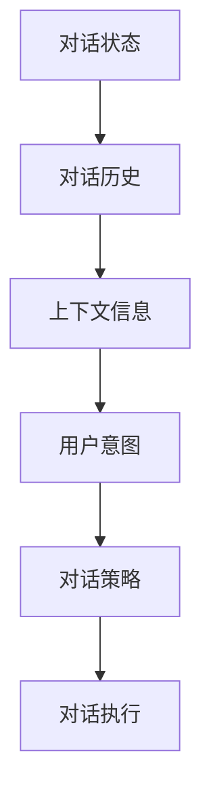
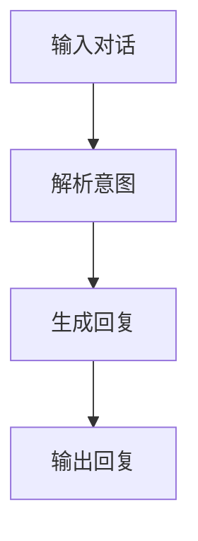
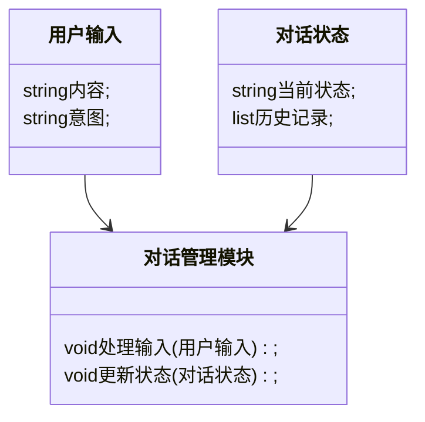
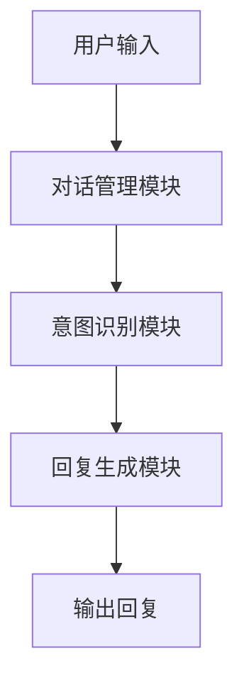
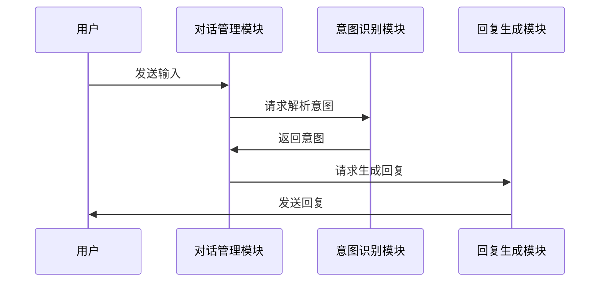

                 


# 构建AI Agent的对话管理系统

## 关键词：AI Agent，对话管理系统，自然语言处理，对话状态管理，深度学习

## 摘要：  
本文将详细介绍构建AI Agent对话管理系统的全过程，涵盖其核心概念、算法原理、系统架构设计以及实际项目实现。通过对对话状态管理、用户意图识别等关键问题的深入探讨，结合具体的系统架构图和算法流程图，为读者提供一个全面而系统的构建指南。

---

# 第一部分: AI Agent与对话管理系统的背景与核心概念

## 第1章: AI Agent与对话管理系统的概述

### 1.1 AI Agent的基本概念
#### 1.1.1 什么是AI Agent  
AI Agent（人工智能代理）是指能够感知环境、执行任务并与其他实体交互的智能实体。它通过自然语言处理（NLP）技术实现与用户的对话交互，帮助用户完成特定任务或提供信息。

#### 1.1.2 AI Agent的核心特征  
- **自主性**：AI Agent能够在没有外部干预的情况下独立执行任务。  
- **反应性**：能够实时感知环境并做出响应。  
- **目标导向**：具有明确的目标，能够优化行为以实现目标。  

#### 1.1.3 对话管理系统的定义与作用  
对话管理系统是AI Agent的核心模块，负责处理用户输入、理解用户意图并生成适当的回复。它是连接用户与AI Agent的桥梁，决定了对话的流畅性和用户体验。

---

### 1.2 对话管理系统的背景与重要性  
#### 1.2.1 当前对话系统的发展现状  
近年来，随着自然语言处理技术的进步，对话系统逐渐从基于规则的传统方法向深度学习驱动的智能系统转变。现代对话系统支持多轮对话、上下文理解和意图识别。

#### 1.2.2 对话管理系统在AI Agent中的地位  
对话管理系统是AI Agent实现智能交互的核心模块，它决定了AI Agent能否理解用户需求并提供有效的反馈。

#### 1.2.3 对话管理系统的应用场景  
- 智能客服：为用户提供自动化的服务支持。  
- 智能助手：帮助用户完成日常任务，如日程管理、信息查询。  
- 游戏NPC：在游戏场景中实现智能交互。  

---

### 1.3 对话管理系统的边界与外延  
#### 1.3.1 对话管理系统的边界  
对话管理系统主要关注用户输入的解析和对话的生成，其边界包括：  
- 输入：用户的文本或语音输入。  
- 输出：系统的文本或语音回复。  
- 内部状态：对话历史、上下文信息等。  

#### 1.3.2 对话管理系统的外延  
对话管理系统的外延包括：  
- 自然语言理解（NLU）：解析用户意图。  
- 自然语言生成（NLG）：生成回复内容。  
- 知识库：提供对话内容的支持。  

#### 1.3.3 对话管理系统与其他模块的关系  
对话管理系统与NLU、NLG、知识库等模块密切相关，它们共同构成了完整的AI Agent系统。

---

### 1.4 对话管理系统的概念结构  
#### 1.4.1 对话管理系统的组成要素  
- **对话状态**：当前对话的实时状态，包括用户意图、上下文信息等。  
- **对话历史**：记录对话的全过程，用于上下文理解。  
- **用户意图**：用户在对话中希望实现的目标。  
- **对话策略**：根据对话状态选择合适的回复策略。  

#### 1.4.2 各要素之间的关系  
对话状态和对话历史共同构成了对话的上下文，用户意图是对话的核心目标，对话策略则决定了系统的回复方式。

#### 1.4.3 对话管理系统的整体架构  


---

## 1.5 本章小结  
本章从AI Agent的基本概念出发，介绍了对话管理系统的定义、作用、边界和外延，并通过概念结构图展示了其内部关系。接下来将深入探讨对话管理系统的核心概念与联系。

---

# 第二部分: 对话管理系统的核心概念与联系

## 第2章: 对话管理系统的原理与核心概念

### 2.1 对话状态管理  
#### 2.1.1 对话状态的定义  
对话状态是对话过程中的实时状态，包括用户当前的意图、已输入的内容以及系统对这些内容的理解。

#### 2.1.2 对话状态的表示方法  
- **基于规则的方法**：通过预定义的规则表示状态。  
- **基于向量的方法**：使用向量表示对话内容。  

#### 2.1.3 对话状态的更新机制  
对话状态根据用户输入和系统反馈不断更新，确保对话的连贯性。

---

### 2.2 对话历史与上下文管理  
#### 2.2.1 对话历史的记录方式  
对话历史可以通过日志形式记录，包括用户和系统的对话内容。

#### 2.2.2 上下文信息的提取与应用  
上下文信息是对话历史中的关键部分，用于理解用户的当前意图。  
例如：  
用户输入：“我需要预订一个航班。”  
系统解析：用户意图是“预订航班”，上下文信息包括日期、目的地等。

#### 2.2.3 对话历史与当前对话的关系  
对话历史为当前对话提供背景信息，帮助系统理解用户的上下文意图。

---

### 2.3 用户意图识别  
#### 2.3.1 用户意图的定义  
用户意图是用户在对话中希望实现的目标，可以是显式的（如“我要查询天气”）或隐式的（如“我需要帮助解决问题”）。

#### 2.3.2 用户意图的分类  
- **显式意图**：用户直接表达的需求。  
- **隐式意图**：用户通过间接方式表达的需求。  

#### 2.3.3 用户意图识别的关键技术  
- **自然语言处理（NLP）**：通过词袋模型、TF-IDF等技术提取关键词。  
- **深度学习模型**：如LSTM、BERT等模型用于意图识别。  

---

### 2.4 对话策略与执行  
#### 2.4.1 对话策略的定义  
对话策略是根据当前对话状态选择合适的回复策略。  

#### 2.4.2 常见的对话策略类型  
- **基于规则的策略**：根据预定义的规则选择回复。  
- **基于模型的策略**：使用深度学习模型生成回复。  

#### 2.4.3 对话策略的执行机制  
对话策略通过调用NLU和NLG模块生成最终的回复内容。

---

### 2.5 对话管理系统的实体关系图  


---

## 2.6 本章小结  
本章详细介绍了对话管理系统的各个核心概念，包括对话状态、对话历史、用户意图和对话策略，并通过实体关系图展示了它们之间的关系。接下来将深入探讨对话管理系统的算法原理。

---

# 第三部分: 对话管理系统的算法原理

## 第3章: 对话管理系统的算法基础

### 3.1 基于规则的对话管理  
#### 3.1.1 基于规则的方法  
基于规则的对话管理通过预定义的规则实现对话的控制。  
例如：  
规则1：如果用户输入“帮助”，则回复“请问您需要帮助什么？”  

#### 3.1.2 基于规则的优缺点  
- 优点：简单易懂，实现成本低。  
- 缺点：难以应对复杂的对话场景。  

---

### 3.2 基于深度学习的对话管理  
#### 3.2.1 基于深度学习的方法  
基于深度学习的对话管理通过训练模型实现对话的生成和理解。  

#### 3.2.2 常见的深度学习模型  
- **Seq2Seq模型**：用于生成回复。  
- **BERT模型**：用于理解对话内容。  

#### 3.2.3 深度学习模型的优缺点  
- 优点：能够处理复杂的对话场景，生成更自然的回复。  
- 缺点：训练成本高，需要大量数据支持。  

---

### 3.3 对话管理的数学模型  
#### 3.3.1 基于概率论的模型  
对话管理可以通过概率模型计算每个可能回复的概率。  
例如：  
$$ P(reply | input) = \prod_{i=1}^{n} P(word_i | input) $$  

#### 3.3.2 基于向量空间的模型  
对话内容可以通过向量表示，利用向量空间模型进行相似度计算。  
例如：  
$$ \text{相似度} = \frac{\vec{u} \cdot \vec{v}}{||\vec{u}|| \cdot ||\vec{v}||} $$  

---

### 3.4 对话管理的算法流程图  


---

## 3.5 本章小结  
本章详细介绍了对话管理的两种主要方法：基于规则的方法和基于深度学习的方法，并通过数学模型和流程图展示了它们的工作原理。接下来将探讨对话管理系统的系统架构设计。

---

# 第四部分: 对话管理系统的系统架构与设计

## 第4章: 对话管理系统的架构设计

### 4.1 问题场景介绍  
对话管理系统需要在复杂的对话场景中实现高效管理，包括多轮对话、上下文理解等。

### 4.2 系统功能设计  
#### 4.2.1 领域模型设计  


#### 4.2.2 系统架构设计  


#### 4.2.3 接口设计与交互序列图  


---

## 4.3 本章小结  
本章通过系统架构图和交互序列图展示了对话管理系统的整体设计，明确了各模块之间的关系和交互流程。接下来将通过一个实际项目案例进一步验证系统的可行性。

---

# 第五部分: 对话管理系统的项目实战

## 第5章: 对话管理系统的项目实现

### 5.1 环境安装与配置  
- 安装Python和必要的库（如TensorFlow、Keras、NLTK）。  
- 安装对话管理系统的依赖库。

### 5.2 核心代码实现  
#### 5.2.1 对话状态管理代码  
```python
class DialogState:
    def __init__(self):
        self.current_state = "idle"
        self.history = []
    
    def update_state(self, new_state):
        self.current_state = new_state
        self.history.append(new_state)
```

#### 5.2.2 用户意图识别代码  
```python
from tensorflow.keras.models import load_model

class IntentRecognizer:
    def __init__(self, model_path):
        self.model = load_model(model_path)
    
    def recognize_intent(self, input_text):
        # 输入处理
        processed_input = self.preprocess(input_text)
        # 模型预测
        prediction = self.model.predict(processed_input)
        return self.get_intent(prediction)
    
    def preprocess(self, text):
        # 简单的文本预处理
        return text.lower().split()
    
    def get_intent(self, prediction):
        # 根据预测结果返回意图
        return "intent_" + str(prediction.argmax())
```

#### 5.2.3 对话策略实现代码  
```python
class DialogStrategy:
    def __init__(self):
        self.dialog_states = {}
    
    def execute_strategy(self, dialog_state):
        # 根据当前状态选择回复策略
        if dialog_state in self.dialog_states:
            return self.dialog_states[dialog_state]
        else:
            return "默认回复"
```

---

### 5.3 项目实战与代码解读  
#### 5.3.1 项目实现  
通过上述代码实现一个简单的对话管理系统，包括对话状态管理、意图识别和对话策略执行。

#### 5.3.2 代码应用解读  
- 对话状态管理模块负责维护对话的状态和历史。  
- 意图识别模块通过预训练模型识别用户的意图。  
- 对话策略模块根据当前状态选择合适的回复策略。

#### 5.3.3 案例分析  
通过一个实际对话案例，展示系统的运行流程。  
例如：  
用户输入：“我要预订机票。”  
系统回复：“请问您需要预订哪个日期的机票？”

---

## 5.4 本章小结  
本章通过实际项目案例展示了对话管理系统的实现过程，包括环境配置、核心代码实现和案例分析。接下来将总结对话管理系统的最佳实践。

---

# 第六部分: 对话管理系统的最佳实践

## 第6章: 对话管理系统的最佳实践

### 6.1 小结与总结  
对话管理系统是AI Agent的核心模块，其设计与实现直接影响用户体验。通过本章的探讨，我们掌握了对话管理系统的各个关键部分及其相互关系。

### 6.2 注意事项与常见问题  
- 对话管理系统的性能优化：通过缓存和并行计算提升效率。  
- 数据安全：保护用户隐私，避免数据泄露。  
- 错误处理：设计完善的错误处理机制，确保系统健壮性。

### 6.3 拓展阅读与学习资源  
- 推荐阅读《自然语言处理实战》和《深度学习入门》等书籍。  
- 参考GitHub上的开源对话管理系统项目。

---

## 6.4 本章小结  
本章总结了对话管理系统的最佳实践，提出了性能优化、数据安全和错误处理等关键问题。通过拓展阅读和学习资源，读者可以进一步深入学习对话管理系统的相关知识。

---

# 作者：AI天才研究院/AI Genius Institute & 禅与计算机程序设计艺术 /Zen And The Art of Computer Programming

