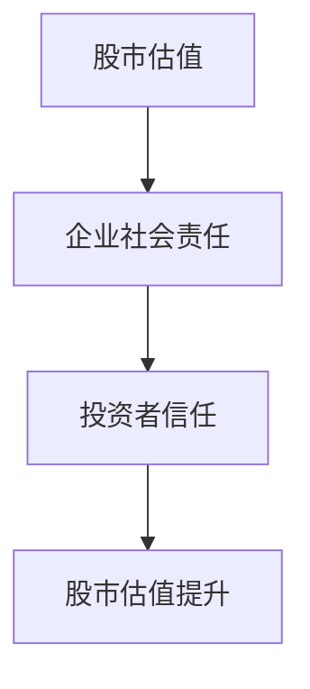

                 

# 股市估值高低对企业社会责任实践的影响

> 关键词：股市估值，企业社会责任，影响机制，数学模型，案例分析

> 摘要：本文探讨了股市估值的高低对企业社会责任实践的影响。通过分析股市估值与企业社会责任的定义、影响机制、数学模型以及实际案例，本文揭示了股市估值如何影响企业社会责任的实践路径。同时，文章还提出了企业如何在不同估值环境下优化社会责任实践的策略建议。

---

# 第一部分: 股市估值对企业社会责任的影响机制

## 1.1 核心概念与问题背景

### 1.1.1 股市估值的定义与计算方法
股市估值是指通过对企业的财务数据、市场表现和行业地位等多方面因素的综合分析，来评估企业价值的过程。常见的股市估值方法包括市盈率（P/E）、市净率（P/B）、市值（Market Value）等。

### 1.1.2 企业社会责任的定义与内涵
企业社会责任（Corporate Social Responsibility, CSR）是指企业在追求经济效益的同时，还需关注环境保护、社会公益、员工福利等方面的责任。企业社会责任不仅包括企业的内部管理，还涉及与外部利益相关者的互动。

### 1.1.3 股市估值与企业社会责任的关联性
股市估值与企业社会责任之间存在密切关联。高估值的企业通常会面临更高的社会责任期望，而低估值的企业则可能在社会责任实践上投入较少。这种关联性主要体现在企业形象、投资者信任和风险管理等方面。

---

## 1.2 问题描述与研究意义

### 1.2.1 股市估值对企业行为的影响
股市估值的高低直接影响企业的经营策略和管理决策。高估值企业通常会更加注重品牌形象和可持续发展，而低估值企业可能更倾向于短期利益最大化。

### 1.2.2 企业社会责任实践的现状与挑战
当前，企业社会责任的实践普遍面临以下挑战：社会责任与经济效益的平衡、社会责任信息披露的不规范性、社会责任实践的可持续性等。

### 1.2.3 研究股市估值对企业社会责任影响的意义
研究股市估值对企业社会责任的影响，有助于企业更好地平衡经济效益与社会责任，同时也能为投资者提供更全面的决策依据。

---

## 1.3 问题解决与边界条件

### 1.3.1 如何衡量企业社会责任的实践程度
衡量企业社会责任的实践程度，可以参考以下指标：
1. 环境指标：碳排放、能源消耗等。
2. 社会指标：员工福利、社区贡献等。
3. 治理指标：公司治理透明度、董事会多样性等。

### 1.3.2 股市估值对企业社会责任的正向与反向影响
股市估值的高与低分别对企业社会责任产生正向和反向影响：
- **正向影响**：高估值企业更倾向于投入社会责任实践，以提升品牌形象和投资者信任。
- **反向影响**：低估值企业可能忽视社会责任，优先追求短期收益。

### 1.3.3 企业社会责任与股市估值的边界与外延
企业社会责任的外延包括环境保护、社会公益、员工福利等多个方面，而股市估值的边界则主要关注企业的财务表现和市场表现。

---

## 1.4 核心概念结构与属性分析

### 1.4.1 股市估值的核心要素
1. 财务表现：净利润、营业收入等。
2. 市场表现：股价波动、市值排名等。
3. 行业地位：市场占有率、行业竞争格局等。

### 1.4.2 企业社会责任的属性特征
1. 经济属性：社会责任与经济效益的平衡。
2. 社会属性：社会责任对社会价值的贡献。
3. 环境属性：社会责任与可持续发展的关联。

### 1.4.3 两者的概念结构对比
- **相似性**：两者都关注企业的长期价值和可持续发展。
- **差异性**：股市估值更注重企业的财务表现，而企业社会责任更关注企业的社会价值。

---

## 1.5 本章小结
本章从核心概念、问题背景、影响机制等多个维度，详细阐述了股市估值与企业社会责任的关联性。接下来，我们将深入分析股市估值对企业社会责任的具体影响机制。

---

# 第二部分: 股市估值对企业社会责任的影响机制

## 2.1 股市估值对企业社会责任的直接影响

### 2.1.1 高估值对企业社会责任的激励作用
高估值企业通常具有较强的财务实力和市场影响力，因此更倾向于投入社会责任实践。例如，高估值企业可能通过绿色生产、员工福利等措施提升品牌形象。

### 2.1.2 低估值对企业社会责任的抑制作用
低估值企业由于财务压力较大，可能更关注短期利益，忽视社会责任实践。这种现象在中小型企业中尤为明显。

### 2.1.3 股市估值波动对企业社会责任的动态影响
股市估值的波动性可能导致企业社会责任实践的短期化。例如，股价下跌时，企业可能减少社会责任投入，优先应对财务压力。

---

## 2.2 企业社会责任对股市估值的反向影响

### 2.2.1 企业社会责任提升股市估值的路径
1. **投资者信任**：社会责任实践能够增强投资者对企业的信任，从而提升股价。
2. **风险管理**：社会责任实践有助于降低企业面临的声誉风险，提升市场表现。
3. **社会价值**：社会责任实践能够提升企业的社会价值，吸引更多投资者关注。

### 2.2.2 企业社会责任实践对投资者信任的影响
通过履行社会责任，企业能够树立良好的品牌形象，增强投资者的信任感。例如，企业通过环保实践提升品牌形象，从而吸引更多投资者。

### 2.2.3 企业社会责任与企业风险管理的关联
企业社会责任实践有助于降低企业的声誉风险和法律风险，从而间接提升股市估值。

---

## 2.3 影响机制的数学模型与公式

### 2.3.1 股市估值与企业社会责任的线性关系模型
$$ V = \beta \cdot S + \epsilon $$
其中：
- \( V \) 表示股市估值。
- \( S \) 表示企业社会责任指数。
- \( \beta \) 表示回归系数。
- \( \epsilon \) 表示误差项。

---

## 2.4 影响机制的流程图

---

## 2.5 本章小结
本章通过分析股市估值对企业社会责任的直接影响和反向影响，揭示了两者之间的复杂关系。接下来，我们将结合实际案例，进一步验证这些理论分析。

---

# 第三部分: 企业社会责任的内涵与外延

## 3.1 企业社会责任的多维度分析

### 3.1.1 经济维度：企业社会责任与经济效益的平衡
企业社会责任与经济效益之间并非完全对立。通过履行社会责任，企业可以提升品牌形象，进而实现长期的经济效益。

### 3.1.2 社会维度：企业社会责任对社会价值的贡献
企业社会责任的实践能够为社会带来更多的就业机会、更好的员工福利和更优质的产品服务。

### 3.1.3 环境维度：企业社会责任与可持续发展
企业社会责任的实践有助于推动绿色生产、节能减排，从而为可持续发展做出贡献。

---

## 3.2 企业社会责任的实践维度

### 3.2.1 经济责任：股东利益最大化
企业需要在追求股东利益最大化的同时，兼顾社会责任。

### 3.2.2 社会责任：员工福利与社区发展
企业应关注员工福利，积极参与社区发展，承担更多的社会义务。

### 3.2.3 环境责任：绿色生产与可持续发展
企业应减少能源消耗，降低碳排放，推动绿色生产。

---

## 3.3 企业社会责任的评价体系

### 3.3.1 核心评价指标
1. 环境指标：碳排放、能源消耗等。
2. 社会指标：员工满意度、社区贡献等。
3. 治理指标：公司治理透明度、董事会多样性等。

### 3.3.2 企业社会责任的评价流程
1. 数据收集：收集企业的财务数据、社会责任实践数据等。
2. 数据分析：通过数据分析工具，对企业社会责任实践进行量化评估。
3. 结果反馈：将评估结果反馈给企业，帮助企业优化社会责任实践。

---

## 3.4 本章小结
本章从多维度分析了企业社会责任的内涵与外延，明确了企业社会责任的实践维度和评价体系。接下来，我们将结合实际案例，进一步探讨股市估值对企业社会责任的具体影响。

---

# 第四部分: 股市估值对企业社会责任的影响路径

## 4.1 股市估值对企业社会责任的正向影响路径

### 4.1.1 高估值企业的社会责任实践
高估值企业通常具有较强的财务实力和市场影响力，因此更倾向于投入社会责任实践。例如，高估值企业可能通过绿色生产、员工福利等措施提升品牌形象。

### 4.1.2 高估值企业社会责任实践的案例分析
以某高估值企业为例，该企业通过减少碳排放、提高员工福利等措施，提升了品牌形象，从而进一步提升了股市估值。

---

## 4.2 股市估值对企业社会责任的反向影响路径

### 4.2.1 低估值企业的社会责任实践
低估值企业由于财务压力较大，可能更关注短期利益，忽视社会责任实践。这种现象在中小型企业中尤为明显。

### 4.2.2 低估值企业社会责任实践的案例分析
以某低估值企业为例，该企业由于忽视社会责任实践，导致品牌形象受损，进而影响了股市估值。

---

## 4.3 企业社会责任对股市估值的反向影响路径

### 4.3.1 企业社会责任提升股市估值的路径
1. **投资者信任**：社会责任实践能够增强投资者对企业的信任，从而提升股价。
2. **风险管理**：社会责任实践有助于降低企业面临的声誉风险，提升市场表现。
3. **社会价值**：社会责任实践能够提升企业的社会价值，吸引更多投资者关注。

### 4.3.2 企业社会责任与股市估值的互动关系
企业社会责任与股市估值之间存在双向互动关系。一方面，股市估值影响企业的社会责任实践；另一方面，企业社会责任实践也会影响股市估值。

---

## 4.4 本章小结
本章通过案例分析，进一步验证了股市估值对企业社会责任的影响路径。接下来，我们将结合数学模型，进一步分析两者之间的关系。

---

# 第五部分: 股市估值与企业社会责任的数学模型与实证分析

## 5.1 股市估值与企业社会责任的数学模型

### 5.1.1 回归分析模型
$$ V = \beta \cdot S + \epsilon $$
其中：
- \( V \) 表示股市估值。
- \( S \) 表示企业社会责任指数。
- \( \beta \) 表示回归系数。
- \( \epsilon \) 表示误差项。

### 5.1.2 聚类分析模型
通过对企业的股市估值和企业社会责任指数进行聚类分析，可以发现高估值企业通常具有较高的社会责任指数，而低估值企业则具有较低的社会责任指数。

---

## 5.2 股市估值与企业社会责任的实证分析

### 5.2.1 数据来源与样本选择
以某行业为例，选取一定数量的企业作为样本，收集其股市估值和企业社会责任指数。

### 5.2.2 数据分析与结果解读
通过对数据进行回归分析，验证股市估值与企业社会责任指数之间的相关性。

### 5.2.3 结果讨论
实证分析结果表明，股市估值与企业社会责任指数之间存在显著的正相关关系。

---

## 5.3 本章小结
本章通过数学模型和实证分析，进一步验证了股市估值与企业社会责任之间的关系。接下来，我们将结合实际案例，进一步探讨企业如何优化社会责任实践。

---

# 第六部分: 企业社会责任实践对股市估值的具体影响

## 6.1 企业社会责任实践对股市估值的正向影响

### 6.1.1 财务表现的提升
通过履行社会责任，企业可以提升品牌形象，进而实现财务表现的提升。

### 6.1.2 投资者信任的增强
社会责任实践能够增强投资者对企业的信任，从而提升股价。

### 6.1.3 风险管理的优化
社会责任实践有助于降低企业面临的声誉风险，从而优化风险管理。

---

## 6.2 企业社会责任实践对股市估值的反向影响

### 6.2.1 社会责任实践的短期成本
履行社会责任可能需要投入大量资金，短期内可能会影响企业的财务表现。

### 6.2.2 社会责任实践的长期收益
尽管社会责任实践可能带来短期成本，但其长期收益通常大于短期成本。

---

## 6.3 企业社会责任与股市估值的平衡点

### 6.3.1 短期目标与长期目标的平衡
企业需要在短期目标和长期目标之间找到平衡点，既要注重短期收益，又要兼顾长期发展。

### 6.3.2 经济效益与社会价值的平衡
企业需要在经济效益和社会价值之间找到平衡点，既要追求利润，又要履行社会责任。

---

## 6.4 本章小结
本章通过分析企业社会责任实践对股市估值的具体影响，进一步揭示了两者之间的关系。接下来，我们将结合实际案例，进一步探讨企业如何优化社会责任实践。

---

# 第七部分: 实际案例分析与启示

## 7.1 案例分析：高估值企业的社会责任实践

### 7.1.1 案例背景
某高估值企业通过绿色生产、员工福利等措施，提升了品牌形象，进而提升了股市估值。

### 7.1.2 案例分析
通过案例分析，可以发现高估值企业更倾向于投入社会责任实践，以提升品牌形象和投资者信任。

---

## 7.2 案例分析：低估值企业的社会责任实践

### 7.2.1 案例背景
某低估值企业由于财务压力较大，忽视了社会责任实践，导致品牌形象受损，进而影响了股市估值。

### 7.2.2 案例分析
通过案例分析，可以发现低估值企业可能忽视社会责任实践，优先追求短期利益。

---

## 7.3 启示与建议

### 7.3.1 企业层面
企业需要在追求经济效益的同时，注重社会责任实践，以实现长期的可持续发展。

### 7.3.2 投资者层面
投资者需要关注企业的社会责任实践，以全面评估企业的长期价值。

### 7.3.3 政策层面
政府需要制定相关政策，规范企业的社会责任实践，促进企业的可持续发展。

---

## 7.4 本章小结
本章通过实际案例分析，进一步验证了股市估值对企业社会责任的影响。接下来，我们将结合总结与展望，进一步探讨未来的研究方向。

---

# 第八部分: 总结与展望

## 8.1 本章总结
本文从核心概念、影响机制、数学模型、实际案例等多个维度，系统地分析了股市估值对企业社会责任实践的影响。研究发现，股市估值与企业社会责任之间存在显著的正相关关系，高估值企业更倾向于投入社会责任实践，而低估值企业则可能忽视社会责任实践。

---

## 8.2 未来研究方向

### 8.2.1 不同行业与企业规模的差异性研究
未来研究可以进一步探讨不同行业和企业规模对社会责任实践的影响差异。

### 8.2.2 社会责任实践与企业绩效的长期影响研究
未来研究可以进一步探讨社会责任实践对企业绩效的长期影响。

### 8.2.3 社会责任实践与投资者行为的互动关系研究
未来研究可以进一步探讨社会责任实践与投资者行为之间的互动关系。

---

## 8.3 本章小结
本文通过系统分析，揭示了股市估值对企业社会责任实践的影响。未来研究可以进一步拓展和深化这一领域的研究。

---

# 作者：AI天才研究院/AI Genius Institute & 禅与计算机程序设计艺术 /Zen And The Art of Computer Programming

---

# 致谢
感谢读者的耐心阅读，感谢研究团队的辛勤工作，感谢所有支持与帮助的力量。

---

# 参考文献
[此处列出相关参考文献]

