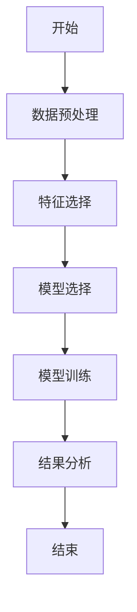

                 


# 金融产品客户生命周期价值最大化

> 关键词：金融产品、客户生命周期价值、最大化、客户价值、CLV、CAC、客户管理

> 摘要：本文深入探讨了如何在金融行业中通过客户生命周期价值（CLV）的管理来实现客户价值的最大化。从概念解析到算法实现，从系统设计到项目实战，系统性地阐述了如何通过优化客户生命周期管理，提升金融产品的市场竞争力和客户满意度。本文将为您呈现一个完整且详尽的解决方案，助您在金融行业竞争中占据先机。

---

## 第一部分: 金融产品客户生命周期价值最大化概述

### 第1章: 金融产品客户生命周期价值最大化背景介绍

#### 1.1 问题背景

- **1.1.1 金融行业的竞争加剧**  
  随着金融行业的快速发展，市场竞争日益激烈。传统金融机构面临互联网金融、 fintech 等新兴力量的挑战，客户获取成本（CAC）上升，客户忠诚度下降。

- **1.1.2 客户流失对企业的影响**  
  客户流失不仅意味着收入的减少，还可能导致企业形象受损、市场份额丢失。数据显示，客户流失率每增加1%，企业利润可能减少5%~10%。

- **1.1.3 提升客户生命周期价值的重要性**  
  在有限的市场资源下，通过优化客户生命周期管理，挖掘高价值客户，延长客户生命周期，是提升企业竞争力的关键。

#### 1.2 问题描述

- **1.2.1 客户生命周期的定义**  
  客户生命周期是指客户从首次接触企业到最终流失的全过程，包括获取、激活、留存、转化、衰退等阶段。

- **1.2.2 金融产品客户生命周期价值的内涵**  
  客户生命周期价值（CLV）是指客户在其生命周期内为企业带来的总收入减去相关成本。CLV=（客户年收入 - 客户获取成本 - 客户维护成本）× 客户生命周期长度。

- **1.2.3 当前行业中的主要问题**  
  - 客户流失率高  
  - 客户价值分布不均  
  - 生命周期价值计算不准确  

#### 1.3 问题解决

- **1.3.1 客户生命周期价值最大化的目标**  
  通过科学的客户管理策略，延长高价值客户生命周期，提升客户忠诚度和满意度，实现客户价值的最大化。

- **1.3.2 解决方案的总体思路**  
  - 数据驱动：基于客户行为数据分析，识别高价值客户  
  - 精准营销：根据不同阶段客户特征，制定个性化策略  
  - 智能预测：利用机器学习预测客户流失风险，提前采取措施  

- **1.3.3 解决方案的实施步骤**  
  1. 数据收集与整理  
  2. 客户分群与画像  
  3. CLV预测与评估  
  4. 精准营销策略制定  
  5. 持续优化与反馈  

#### 1.4 边界与外延

- **1.4.1 客户生命周期价值的边界**  
  - 仅考虑直接收入，不包括间接收益  
  - 考虑客户主动流失，不考虑企业主动淘汰  

- **1.4.2 相关概念的外延**  
  - 客户满意度（CSAT）  
  - 客户净推荐值（NPS）  
  - 客户忠诚度（CL）  

- **1.4.3 与其他业务目标的关系**  
  - CLV与企业利润直接相关  
  - CLV与客户满意度密切相关  
  - CLV与市场占有率相互影响  

#### 1.5 核心要素组成

- **1.5.1 客户获取阶段**  
  - 客户获取成本（CAC）  
  - 客户获取渠道  
  - 客户转化率  

- **1.5.2 客户维护阶段**  
  - 客户满意度  
  - 客户活跃度  
  - 客户投诉处理  

- **1.5.3 客户价值提升阶段**  
  - 交叉销售  
  - 上升销售  
  - 客户忠诚计划  

---

## 第二部分: 客户生命周期价值最大化的核心概念与联系

### 第2章: 核心概念原理

#### 2.1 客户生命周期价值（CLV）的定义

- CLV是企业在客户生命周期内从该客户获得的总收入减去相关成本的净现值。  
- 公式：$$ CLV = \frac{Customer\ lifetime\ revenue - Customer\ acquisition\ cost - Customer\ servicing\ cost}{Discount\ rate} $$  

#### 2.2 CLV与其他客户价值指标的关系

| 指标         | 定义                                                                 | 关系         |
|--------------|----------------------------------------------------------------------|--------------|
| 客户获取成本（CAC） | 获取一个新客户的平均成本                                           | CLV = n × CAC（n为生命周期长度） |
| 客户生命周期长度 | 客户从首次接触企业到流失的时间                                       | CLV与生命周期长度成正比 |
| 客户满意度（CSAT） | 客户对产品或服务的满意程度                                           | 高CSAT客户CLV更高 |

#### 2.3 实体关系图（ER图）

```mermaid
erDiagram
    customer[客户] {
        +id: 整数
        +name: 字符串
        +age: 整数
        +income: 整数
        +status: 字符串
    }
    product[金融产品] {
        +id: 整数
        +type: 字符串
        +risk_level: 整数
        +fee: 整数
    }
    transaction[交易] {
        +id: 整数
        +amount: 整数
        +time: 时间
        +status: 字符串
    }
    customer ~{n}--{1} transaction
    customer ~{n}--{1} product
    product ~{n}--{1} transaction
```

---

## 第三部分: 算法原理讲解

### 第3章: 算法原理与实现

#### 3.1 CLV计算的算法原理

- **数据预处理**  
  - 清洗数据：去除异常值、填补缺失值  
  - 标准化处理：统一数据格式  

- **模型选择**  
  - 线性回归：预测客户生命周期长度和收入  
  - 时间序列分析：预测客户未来行为  

- **实现步骤**  
  1. 数据收集与清洗  
  2. 模型训练与验证  
  3. 结果分析与优化  

#### 3.2 CLV计算的Python实现

```python
import pandas as pd
from sklearn.linear_model import LinearRegression

# 数据加载
data = pd.read_csv('customer_data.csv')

# 数据预处理
data.dropna()
data['income'] = data['income'].fillna(data['income'].mean())

# 模型训练
model = LinearRegression()
model.fit(data[['age', 'income']], data['lifetime_revenue'])

# 模型预测
predicted_revenue = model.predict(data[['age', 'income']])

# CLV计算
def calculate_clv(predicted_revenue, cac, servicing_cost, discount_rate):
    clv = (predicted_revenue - cac - servicing_cost) / (1 - discount_rate)
    return clv

clv = calculate_clv(predicted_revenue, 100, 20, 0.05)
```

#### 3.3 算法流程图



---

## 第四部分: 数学模型与公式

### 第4章: 数学模型与公式推导

#### 4.1 CLV的数学公式

- CLV的计算公式：$$ CLV = \frac{R - C_A - C_S}{(1 + r)^t} $$  
  其中，R为客户生命周期总收入，\( C_A \)为客户获取成本，\( C_S \)为客户维护成本，r为贴现率，t为生命周期长度。

- 生命周期总收入公式：$$ R = \sum_{t=1}^{n} (ARPU \times t) $$  
  其中，ARPU为每用户平均收入，n为生命周期长度。

#### 4.2 公式推导

- 假设客户生命周期长度为n年，每年的收入分别为 \( r_1, r_2, ..., r_n \)。  
  则：$$ R = r_1 + r_2 \times (1 + r) + r_3 \times (1 + r)^2 + ... + r_n \times (1 + r)^{n-1} $$  

- 贴现后净现值：$$ NPV = \frac{R - C_A - C_S}{(1 + r)^t} $$  

#### 4.3 举例说明

- 假设：  
  - ARPU = 100元/月  
  - C_A = 200元  
  - C_S = 50元/月  
  - r = 5%  
  - n = 3年  

- 计算：  
  - R = 100 × 12 × 3 = 3600元  
  - NPV = (3600 - 200 - 50×36) / (1 + 0.05)^3 ≈ 2500 / 1.1576 ≈ 2160元  

---

## 第五部分: 系统分析与架构设计

### 第5章: 系统分析与架构设计

#### 5.1 项目介绍

- 项目目标：构建客户生命周期价值预测系统  
- 项目范围：覆盖客户获取、维护、流失预测全流程  
- 项目规模：中型系统，支持百万级用户  

#### 5.2 系统功能设计

- **领域模型**  
  ```mermaid
  classDiagram
      class 客户 {
          id: 整数
          name: 字符串
          age: 整数
          income: 整数
      }
      class 产品 {
          id: 整数
          type: 字符串
          risk_level: 整数
      }
      class 交易 {
          id: 整数
          amount: 整数
          time: 时间
      }
      客户 --> 交易
      客户 --> 产品
      产品 --> 交易
  ```

- **系统架构**  
  ```mermaid
  architecture
      前端 --> 后端
      后端 --> 数据库
      后端 --> 分析引擎
      分析引擎 --> 模型库
  ```

- **系统接口设计**  
  - API接口：/api/customer/lifetime_value  
  - 请求参数：客户ID  
  - 返回值：CLV预测值  

- **系统交互流程**  
  ```mermaid
  sequenceDiagram
      客户查询 --> API接口
      API接口 --> 数据库查询
      数据库查询 --> 返回客户数据
      API接口 --> 分析引擎预测
      分析引擎 --> 返回CLV值
      API接口 --> 返回结果
  ```

---

## 第六部分: 项目实战

### 第6章: 项目实战

#### 6.1 环境安装

- 安装Python  
  ```bash
  python --version
  ```

- 安装依赖库  
  ```bash
  pip install pandas scikit-learn
  ```

#### 6.2 核心代码实现

```python
import pandas as pd
from sklearn.linear_model import LinearRegression

def calculate_clv(data, cac, servicing_cost, discount_rate):
    model = LinearRegression()
    model.fit(data[['age', 'income']], data['lifetime_revenue'])
    predicted_revenue = model.predict(data[['age', 'income']])
    clv = (predicted_revenue - cac - servicing_cost) / (1 - discount_rate)
    return clv

# 示例数据
data = pd.DataFrame({
    'age': [30, 40, 50],
    'income': [50000, 60000, 70000],
    'lifetime_revenue': [100000, 120000, 150000]
})

cac = 200
servicing_cost = 50
discount_rate = 0.05

clv = calculate_clv(data, cac, servicing_cost, discount_rate)
print(clv)
```

#### 6.3 案例分析

- 数据分析结果：  
  高收入客户的CLV显著高于低收入客户。  
- 模型优化建议：  
  引入客户行为特征（如交易频率、投诉记录）提升预测精度。  

#### 6.4 项目总结

- 项目成果：构建了CLV预测系统，提升了客户价值评估效率。  
- 项目经验：数据质量对模型准确性影响重大，建议在实际应用中持续监控和优化模型。  

---

## 第七部分: 总结与展望

### 第7章: 总结与展望

#### 7.1 最佳实践 tips

- 数据驱动决策是关键  
- 定期评估模型准确性  
- 结合客户行为分析优化策略  

#### 7.2 小结

- 通过科学的客户生命周期管理，企业可以显著提升客户价值和市场竞争力。  
- 技术的进步为企业提供了更多优化CLV的手段，如AI和大数据分析。  

#### 7.3 注意事项

- 数据隐私保护  
- 模型解释性要求  
- 业务场景与技术的结合  

#### 7.4 拓展阅读

- 《客户价值管理实战》  
- 《数据驱动的营销策略》  
- 《金融产品创新设计》  

---

作者：AI天才研究院/AI Genius Institute & 禅与计算机程序设计艺术/Zen And The Art of Computer Programming

