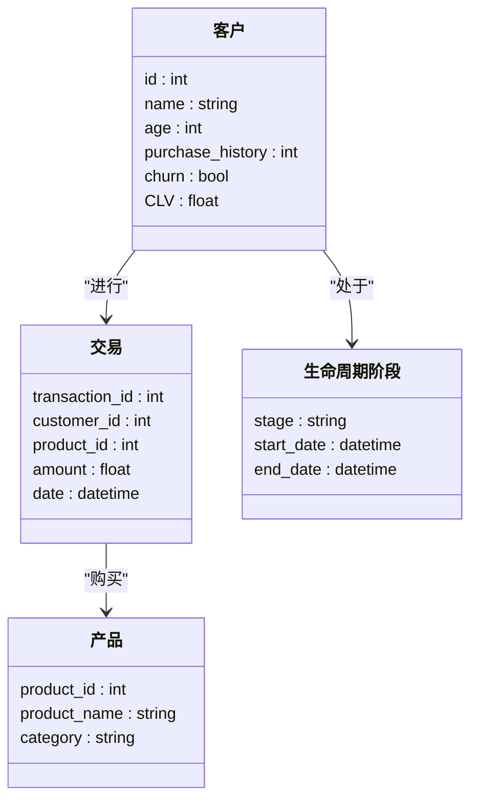
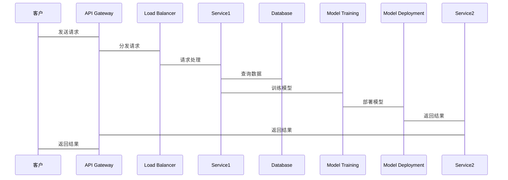

                 


# 《金融产品客户生命周期价值预测》

---

## 关键词：
- 金融产品
- 客户生命周期价值
- 机器学习
- 预测模型
- 数据分析

---

## 摘要：
本文深入探讨了金融产品客户生命周期价值预测的核心概念、算法原理、系统设计与项目实战。首先，我们介绍了客户生命周期价值预测的背景及其在金融行业中的重要性。接着，我们详细分析了预测模型的核心原理，包括数据特征提取、模型选择与优化策略。随后，我们从系统架构设计的角度，介绍了如何构建一个高效可靠的预测系统，并通过实际案例展示了如何将这些模型应用于实际业务场景中。最后，我们总结了最佳实践、小结及注意事项，为读者提供了全面的指导。

---

# 第一部分: 金融产品客户生命周期价值预测背景与基础

---

## 第1章: 客户生命周期价值预测概述

### 1.1 客户生命周期价值预测的背景

#### 1.1.1 金融行业的客户价值管理
在金融行业，客户是企业的核心资产。通过预测客户在生命周期中的价值，金融机构可以更好地制定客户管理策略，优化资源配置，提高客户满意度和忠诚度。客户生命周期价值预测能够帮助金融机构识别高价值客户，降低客户流失率，从而实现长期的业务增长。

#### 1.1.2 客户生命周期的概念
客户生命周期（Customer Lifetime Value，简称CLV）是指客户在与企业交互的整个过程中为企业创造的总价值。在金融行业，客户生命周期可以分为几个阶段：获取阶段、活跃阶段、稳定阶段和流失阶段。不同阶段的客户行为和价值贡献不同，因此需要针对不同阶段的客户采取不同的管理策略。

#### 1.1.3 生命周期价值预测的重要性
生命周期价值预测能够帮助金融机构：
1. **优化客户获取策略**：通过预测客户的价值，选择高潜力客户进行营销，提高营销效率。
2. **制定个性化的客户服务策略**：根据不同阶段客户的特征，提供定制化的产品和服务，提高客户满意度。
3. **降低客户流失风险**：通过预测客户流失的可能性，提前采取措施，挽留高价值客户。

### 1.2 问题背景与问题描述

#### 1.2.1 金融产品客户流失问题
客户流失是金融行业面临的重大挑战之一。客户流失不仅会导致收入减少，还会增加获取新客户的成本。因此，如何预测客户流失并采取有效措施，是金融机构亟待解决的问题。

#### 1.2.2 客户生命周期价值预测的目标
客户生命周期价值预测的目标是通过分析客户的特征和行为数据，预测客户在未来一段时间内的价值贡献，从而为金融机构提供决策支持。

#### 1.2.3 问题解决的思路与方法
1. **数据收集与分析**：收集客户的交易数据、行为数据、 demographic数据等，分析客户的特征和行为模式。
2. **模型构建与训练**：选择合适的预测模型，利用历史数据进行模型训练。
3. **模型评估与优化**：通过交叉验证等方法评估模型性能，优化模型参数，提高预测准确性。
4. **模型部署与应用**：将模型部署到实际业务中，实时预测客户价值，指导业务决策。

### 1.3 客户生命周期价值预测的核心概念

#### 1.3.1 生命周期阶段划分
客户生命周期可以划分为以下几个阶段：
1. **获取阶段**：客户首次与企业接触，可能是通过广告、推荐等方式获取。
2. **活跃阶段**：客户开始使用企业的产品或服务，成为活跃客户。
3. **稳定阶段**：客户持续使用产品或服务，成为企业的忠诚客户。
4. **流失阶段**：客户停止使用产品或服务，或者减少使用频率。

#### 1.3.2 客户价值的定义与度量
客户价值是指客户在生命周期中为企业带来的总收入减去获取和维护客户的成本。具体来说，客户生命周期价值（CLV）的计算公式可以表示为：

$$ CLV = \sum_{t=1}^{n} (收入_t - 成本_t) $$

其中，$收入_t$ 是客户在第 t 年带来的收入，$成本_t$ 是客户在第 t 年带来的成本。

#### 1.3.3 预测模型的构建与应用
预测模型的构建需要考虑以下步骤：
1. **数据预处理**：清洗数据，处理缺失值，标准化数据。
2. **特征工程**：提取关键特征，如客户年龄、收入、交易频率等。
3. **模型选择**：根据数据特征和业务需求选择合适的模型。
4. **模型训练**：利用历史数据对模型进行训练。
5. **模型评估**：通过交叉验证等方法评估模型性能。
6. **模型部署**：将模型部署到实际业务中，实时预测客户价值。

---

## 1.4 本章小结
本章主要介绍了客户生命周期价值预测的背景、目标和核心概念。我们通过分析客户生命周期的不同阶段，明确了客户价值预测的重要性，并提出了构建预测模型的思路与方法。下一章将详细探讨客户生命周期价值预测的核心原理和相关技术。

---

# 第二部分: 核心概念与联系

---

## 第2章: 客户生命周期价值预测的核心原理

### 2.1 数据特征与模型选择

#### 2.1.1 客户行为数据的特征分析
客户行为数据包括客户的交易记录、登录频率、产品使用情况等。这些数据可以帮助我们了解客户的消费习惯和行为模式。例如，可以通过分析客户的交易记录，计算客户的平均交易金额和交易频率，从而判断客户的消费能力。

#### 2.1.2 生命周期阶段的特征提取
在客户生命周期的不同阶段，客户的特征可能有所不同。例如，在获取阶段，客户可能对产品不了解，而在活跃阶段，客户可能开始频繁使用产品。通过提取不同阶段的特征，我们可以更好地理解客户的行为模式。

#### 2.1.3 数据预处理与特征工程
数据预处理是构建预测模型的重要步骤。我们需要对数据进行清洗，处理缺失值，标准化数据等。特征工程则是从数据中提取有意义的特征，例如，客户年龄、收入、交易金额等。这些特征将作为模型的输入，帮助模型更好地预测客户价值。

### 2.2 模型选择与评价指标

#### 2.2.1 常见预测模型的对比
在金融行业，常用的客户价值预测模型包括线性回归、决策树、随机森林和神经网络等。每种模型都有其优缺点：
- **线性回归**：适用于线性关系的数据，模型简单易懂，但可能无法捕捉复杂的非线性关系。
- **决策树**：适用于分类问题，能够处理非线性数据，但容易过拟合。
- **随机森林**：通过集成多个决策树，能够提高模型的准确性和稳定性。
- **神经网络**：适用于复杂的数据模式，但训练时间较长，需要大量的计算资源。

#### 2.2.2 模型评价指标的定义与选择
在模型评估中，我们需要选择合适的评价指标。常用的评价指标包括准确率、召回率、F1分数等。例如，准确率是指模型正确预测的样本数占总样本数的比例；召回率是指模型正确预测的正样本数占所有正样本数的比例。F1分数是准确率和召回率的调和平均数，能够综合考虑模型的准确性和召回率。

#### 2.2.3 模型调优与优化策略
模型调优是提高模型性能的重要步骤。我们可以通过交叉验证等方法，调整模型的参数，例如，决策树的深度、随机森林的树数等。此外，我们还可以通过特征选择、数据增强等方法，进一步优化模型性能。

### 2.3 核心概念的ER实体关系图

```mermaid
erDiagram
    customer[客户] {
        <属性>
        id : int
        name : string
        age : int
        purchase_history : int
        churn : bool
        CLV : float
    }

    product[产品] {
        <属性>
        product_id : int
        product_name : string
        category : string
    }

    transaction[交易] {
        <属性>
        transaction_id : int
        customer_id : int
        product_id : int
        amount : float
        date : datetime
    }

    lifecycle_stage[生命周期阶段] {
        <属性>
        stage : string
        start_date : datetime
        end_date : datetime
    }

    relationship[关系] {
        customer -> transaction : "进行"
        transaction -> product : "购买"
        customer -> lifecycle_stage : "处于"
    }
```

---

## 2.4 本章小结
本章详细探讨了客户生命周期价值预测的核心原理，包括数据特征分析、模型选择与优化策略。通过对比不同模型的优缺点，我们明确了在实际应用中如何选择合适的模型，并通过特征工程和数据预处理，进一步提高了模型的预测准确性。下一章将重点介绍客户生命周期价值预测的算法原理及其在实际业务中的应用。

---

# 第三部分: 算法原理与实现

---

## 第3章: 常见预测算法原理与实现

### 3.1 线性回归算法

#### 3.1.1 线性回归的基本原理
线性回归是一种统计学方法，用于建立因变量与自变量之间的线性关系。在客户生命周期价值预测中，我们可以使用线性回归模型，根据客户的特征（如年龄、收入等）预测其生命周期价值。

#### 3.1.2 线性回归的数学模型
线性回归的数学模型可以表示为：

$$ y = \beta_0 + \beta_1 x_1 + \beta_2 x_2 + \dots + \beta_n x_n + \epsilon $$

其中，$y$ 是因变量（客户生命周期价值），$x_i$ 是自变量（客户特征），$\beta_i$ 是回归系数，$\epsilon$ 是误差项。

#### 3.1.3 线性回归的实现步骤
1. **数据预处理**：清洗数据，处理缺失值，标准化数据。
2. **特征选择**：选择对客户生命周期价值影响较大的特征。
3. **模型训练**：利用最小二乘法等方法，训练线性回归模型。
4. **模型评估**：通过R平方值等指标，评估模型的拟合优度。

#### 3.1.4 线性回归的优缺点
- **优点**：模型简单易懂，计算速度快。
- **缺点**：只能处理线性关系，无法捕捉复杂的非线性模式。

#### 3.1.5 线性回归的Python实现

```python
import numpy as np
from sklearn.linear_model import LinearRegression
from sklearn.metrics import r2_score

# 数据准备
X = np.array([[1, 2], [3, 4], [5, 6]])
y = np.array([1, 2, 3])

# 模型训练
model = LinearRegression()
model.fit(X, y)

# 模型预测
y_pred = model.predict(X)
print("预测结果:", y_pred)
print("R平方值:", r2_score(y, y_pred))
```

---

## 3.2 决策树算法

### 3.2.1 决策树的基本原理
决策树是一种基于树状结构的分类和回归算法。在客户生命周期价值预测中，决策树可以用来分类客户的不同生命周期阶段。

#### 3.2.2 决策树的数学模型
决策树的数学模型可以通过信息熵或基尼指数来衡量数据的不纯度。例如，ID3算法使用信息熵，C4.5算法使用信息增益率，CART算法使用基尼指数。

#### 3.2.3 决策树的实现步骤
1. **数据预处理**：清洗数据，处理缺失值，标准化数据。
2. **特征选择**：选择对客户生命周期阶段影响较大的特征。
3. **模型训练**：利用训练数据，构建决策树。
4. **模型评估**：通过准确率、召回率等指标，评估模型性能。

#### 3.2.4 决策树的优缺点
- **优点**：能够处理非线性数据，易于解释。
- **缺点**：容易过拟合，计算复杂度较高。

#### 3.2.5 决策树的Python实现

```python
from sklearn.tree import DecisionTreeClassifier
from sklearn.metrics import accuracy_score

# 数据准备
X = [[1, 2], [3, 4], [5, 6], [7, 8]]
y = [0, 1, 1, 0]

# 模型训练
model = DecisionTreeClassifier()
model.fit(X, y)

# 模型预测
y_pred = model.predict(X)
print("预测结果:", y_pred)
print("准确率:", accuracy_score(y, y_pred))
```

---

## 3.3 随机森林算法

### 3.3.1 随机森林的基本原理
随机森林是一种基于决策树的集成算法。通过集成多个决策树，随机森林能够提高模型的准确性和稳定性。

#### 3.3.2 随机森林的数学模型
随机森林通过 bagging 技术，从训练数据中随机抽取样本，构建多棵决策树。最终的预测结果通过投票或平均的方式得出。

#### 3.3.3 随机森林的实现步骤
1. **数据预处理**：清洗数据，处理缺失值，标准化数据。
2. **特征选择**：选择对客户生命周期价值影响较大的特征。
3. **模型训练**：利用训练数据，构建随机森林。
4. **模型评估**：通过准确率、F1分数等指标，评估模型性能。

#### 3.3.4 随机森林的优缺点
- **优点**：能够处理复杂的非线性数据，具有较高的准确性和稳定性。
- **缺点**：计算复杂度较高，需要较多的计算资源。

#### 3.3.5 随机森林的Python实现

```python
from sklearn.ensemble import RandomForestClassifier
from sklearn.metrics import accuracy_score

# 数据准备
X = [[1, 2], [3, 4], [5, 6], [7, 8]]
y = [0, 1, 1, 0]

# 模型训练
model = RandomForestClassifier(n_estimators=10)
model.fit(X, y)

# 模型预测
y_pred = model.predict(X)
print("预测结果:", y_pred)
print("准确率:", accuracy_score(y, y_pred))
```

---

## 3.4 神经网络算法

### 3.4.1 神经网络的基本原理
神经网络是一种受生物神经元启发的计算模型。通过多层神经元的组合，神经网络能够捕捉复杂的非线性模式。

#### 3.4.2 神经网络的数学模型
神经网络的数学模型包括输入层、隐藏层和输出层。通过激活函数（如sigmoid、ReLU等），神经网络能够进行非线性变换。

#### 3.4.3 神经网络的实现步骤
1. **数据预处理**：清洗数据，处理缺失值，标准化数据。
2. **特征选择**：选择对客户生命周期价值影响较大的特征。
3. **模型训练**：利用训练数据，训练神经网络模型。
4. **模型评估**：通过准确率、F1分数等指标，评估模型性能。

#### 3.4.4 神经网络的优缺点
- **优点**：能够处理复杂的非线性数据，具有较强的表达能力。
- **缺点**：计算复杂度较高，训练时间较长，需要大量的计算资源。

#### 3.4.5 神经网络的Python实现

```python
import tensorflow as tf
from sklearn.metrics import accuracy_score

# 数据准备
X = [[1, 2], [3, 4], [5, 6], [7, 8]]
y = [0, 1, 1, 0]

# 模型构建
model = tf.keras.Sequential([
    tf.keras.layers.Dense(4, activation='relu'),
    tf.keras.layers.Dense(2, activation='relu'),
    tf.keras.layers.Dense(1, activation='sigmoid')
])

model.compile(optimizer='adam', loss='binary_crossentropy', metrics=['accuracy'])

# 模型训练
model.fit(X, y, epochs=10, batch_size=1)

# 模型预测
y_pred = model.predict(X).round()
print("预测结果:", y_pred)
print("准确率:", accuracy_score(y, y_pred))
```

---

## 3.5 本章小结
本章详细介绍了客户生命周期价值预测中常用的四种算法：线性回归、决策树、随机森林和神经网络。我们通过对比不同算法的优缺点，明确了在实际应用中如何选择合适的算法，并通过Python代码展示了这些算法的实现步骤。下一章将从系统架构设计的角度，介绍如何构建一个高效的客户生命周期价值预测系统。

---

# 第四部分: 系统分析与架构设计

---

## 第4章: 客户生命周期价值预测系统设计

### 4.1 问题场景介绍

#### 4.1.1 项目背景
某银行希望通过客户生命周期价值预测，优化客户管理策略，提高客户满意度和忠诚度。具体来说，银行希望预测客户在未来一段时间内的价值贡献，并根据预测结果，制定个性化的客户服务策略。

#### 4.1.2 项目目标
1. **预测客户生命周期价值**：通过分析客户的交易数据和行为数据，预测客户在未来一段时间内的价值贡献。
2. **优化客户管理策略**：根据不同阶段客户的特征，制定个性化的客户服务策略。
3. **降低客户流失风险**：通过预测客户流失的可能性，提前采取措施，挽留高价值客户。

### 4.2 系统功能设计

#### 4.2.1 领域模型类图


#### 4.2.2 系统架构设计
```mermaid
archi
    title 客户生命周期价值预测系统架构
    client --> API Gateway : 请求
    API Gateway --> Load Balancer : 分发请求
    Load Balancer --> Service1 : 请求
    Service1 --> Database : 查询数据
    Service1 --> Model Training : 训练模型
    Model Training --> Model Deployment : 部署模型
    Model Deployment --> Service2 : 返回结果
    Service2 --> API Gateway : 返回结果
    API Gateway --> client : 返回结果
```

#### 4.2.3 系统接口设计
1. **数据接口**：
   - 数据输入接口：接收客户的交易数据和行为数据。
   - 数据输出接口：输出预测结果和模型评估报告。

2. **模型接口**：
   - 模型训练接口：接收训练数据，训练预测模型。
   - 模型预测接口：接收客户特征，返回客户生命周期价值预测结果。

3. **用户接口**：
   - 用户请求接口：接收用户的请求，返回预测结果。
   - 用户反馈接口：接收用户的反馈，优化预测模型。

#### 4.2.4 系统交互流程



---

## 4.3 本章小结
本章从系统架构设计的角度，介绍了客户生命周期价值预测系统的功能设计和架构设计。我们通过领域模型类图和系统架构图，展示了系统的整体结构和各模块之间的关系。通过系统交互流程图，明确了系统的运行流程和接口设计。下一章将通过实际案例，展示如何将这些设计应用于实际业务场景中。

---

# 第五部分: 项目实战与应用

---

## 第5章: 客户生命周期价值预测项目实战

### 5.1 项目环境安装

#### 5.1.1 Python环境安装
首先，我们需要安装Python编程环境。推荐使用Anaconda或Miniconda。安装步骤如下：
1. 下载并安装Anaconda：[https://www.anaconda.com/products/distribution](https://www.anaconda.com/products/distribution)
2. 配置环境变量，确保Python和pip可以正常使用。

#### 5.1.2 相关库的安装
我们需要安装以下Python库：
- numpy: 数据处理
- pandas: 数据分析
- scikit-learn: 机器学习算法
- tensorflow: 深度学习框架
- mermaid: 图形绘制工具

安装命令：
```bash
pip install numpy pandas scikit-learn tensorflow mermaid
```

### 5.2 系统核心实现

#### 5.2.1 数据加载与预处理

```python
import pandas as pd
from sklearn.preprocessing import StandardScaler

# 数据加载
data = pd.read_csv('customer_data.csv')

# 数据预处理
# 假设'churn'是客户流失标记，'CLV'是客户生命周期价值
data['churn'] = data['churn'].astype(int)
data['CLV'] = data['CLV'].astype(float)

# 特征工程
features = data[['age', 'income', 'transaction_count', 'product_count']]
target = data['churn']

# 数据标准化
scaler = StandardScaler()
features_scaled = scaler.fit_transform(features)
```

#### 5.2.2 模型训练与评估

```python
from sklearn.model_selection import train_test_split
from sklearn.linear_model import LogisticRegression
from sklearn.metrics import accuracy_score, confusion_matrix, classification_report

# 数据分割
X_train, X_test, y_train, y_test = train_test_split(features_scaled, target, test_size=0.2, random_state=42)

# 模型训练
model = LogisticRegression()
model.fit(X_train, y_train)

# 模型预测
y_pred = model.predict(X_test)

# 模型评估
print("准确率:", accuracy_score(y_test, y_pred))
print("混淆矩阵:", confusion_matrix(y_test, y_pred))
print("分类报告:", classification_report(y_test, y_pred))
```

#### 5.2.3 模型部署与应用

```python
# 模型部署
import joblib

# 保存模型
joblib.dump(model, 'customer_churn_model.pkl')

# 加载模型
model = joblib.load('customer_churn_model.pkl')

# 预测新客户
new_customer = [[30, 50000, 10, 5]]
new_customer_scaled = scaler.transform(new_customer)
prediction = model.predict(new_customer_scaled)

print("预测结果:", prediction)
```

### 5.3 项目实战总结

#### 5.3.1 项目小结
通过本项目，我们成功构建了一个客户生命周期价值预测系统。我们通过数据预处理、特征工程和模型训练，实现了客户流失预测功能。通过模型部署，我们将预测结果应用到实际业务中，帮助银行优化客户管理策略。

#### 5.3.2 实际案例分析
假设我们有一个新客户，年龄30岁，收入50000元，交易次数10次，产品数量5个。通过模型预测，我们发现该客户有较高的流失风险。因此，银行可以采取措施，例如提供优惠活动，增加客户互动，提高客户满意度。

---

## 5.4 本章小结
本章通过实际案例，展示了如何将客户生命周期价值预测应用于实际业务场景中。我们通过项目环境安装、数据加载与预处理、模型训练与评估，以及模型部署与应用，完整地实现了客户生命周期价值预测系统。下一章将总结最佳实践、小结及注意事项。

---

# 第六部分: 最佳实践与总结

---

## 第6章: 最佳实践、小结及注意事项

### 6.1 最佳实践

#### 6.1.1 数据质量的重要性
数据质量是模型性能的基础。我们需要确保数据的准确性和完整性，避免缺失值和异常值对模型的影响。

#### 6.1.2 模型调优的技巧
通过交叉验证、网格搜索等方法，我们可以找到最优的模型参数，提高模型的预测准确性。

#### 6.1.3 模型部署的注意事项
在模型部署过程中，我们需要确保模型的稳定性和可扩展性。通过容器化部署（如Docker）和模型版本控制，我们可以更好地管理模型的生命周期。

### 6.2 小结
通过本文的介绍，我们全面探讨了客户生命周期价值预测的核心概念、算法原理、系统设计与项目实战。我们通过实际案例，展示了如何将这些技术应用于实际业务场景中。希望本文能够为读者提供有价值的参考，帮助他们在金融行业更好地应用客户生命周期价值预测技术。

### 6.3 注意事项

#### 6.3.1 数据隐私与安全
在数据处理和模型训练过程中，我们需要严格遵守数据隐私和安全规定，保护客户数据不被滥用。

#### 6.3.2 模型解释性
在金融行业，模型的解释性非常重要。我们需要选择能够解释模型决策的算法，例如决策树和线性回归，以便更好地理解模型的预测结果。

#### 6.3.3 模型更新与维护
随着市场环境和客户需求的变化，模型需要不断更新和维护。我们可以通过定期重新训练模型，或者采用增量学习的方法，保持模型的预测准确性。

---

## 6.4 拓展阅读
- **《机器学习实战》**：深入介绍机器学习算法的实现与应用。
- **《数据挖掘导论》**：系统讲解数据挖掘的基本概念与技术。
- **《金融数据分析与建模》**：专门介绍金融行业的数据分析与建模技术。

---

## 作者：AI天才研究院/AI Genius Institute & 禅与计算机程序设计艺术/Zen And The Art of Computer Programming

---

通过以上内容，我们希望为读者提供一个全面的客户生命周期价值预测技术的指南，帮助他们在金融行业中更好地应用这些技术，实现业务目标。

