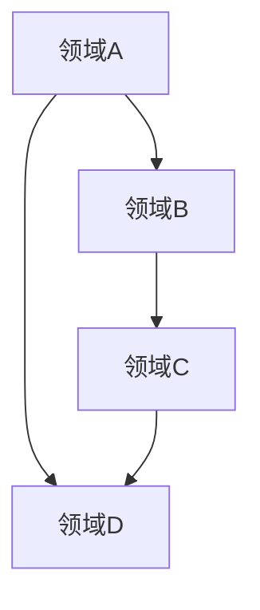
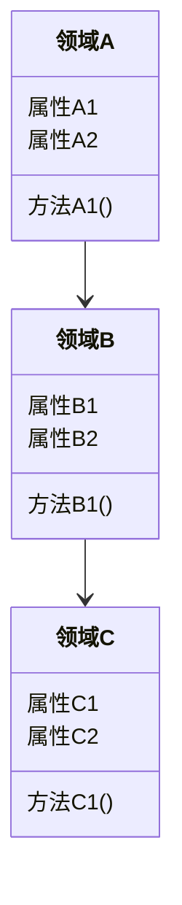

                 


# AI Agent的跨域知识迁移与整合

## 关键词
AI Agent, 知识迁移, 知识整合, 跨域知识, 人工智能, 系统架构

## 摘要
AI Agent作为人工智能领域的核心概念，其跨域知识迁移与整合能力是实现智能化、高效化和实用化的关键。本文从AI Agent的基本概念出发，深入探讨了跨域知识迁移的核心技术和算法原理，详细分析了系统的架构设计，并通过实际案例展示了知识迁移与整合的应用场景。文章最后总结了最佳实践和未来研究方向。

---

# 第一部分: AI Agent的跨域知识迁移与整合基础

## 第1章: AI Agent的基本概念与背景

### 1.1 AI Agent的定义与核心能力
- **1.1.1 什么是AI Agent**
  AI Agent（人工智能代理）是指能够感知环境、自主决策并执行任务的智能实体。它可以是一个软件程序、机器人或其他智能系统，其核心目标是通过与环境交互来实现特定目标。

- **1.1.2 AI Agent的核心能力**
  - 感知能力：通过传感器或数据输入感知环境状态。
  - 学习能力：通过机器学习算法不断优化知识库和决策模型。
  - 决策能力：基于当前知识和环境信息做出最优决策。
  - 执行能力：通过执行器或接口将决策转化为具体操作。

- **1.1.3 AI Agent的分类与应用场景**
  - 分类：基于智能水平分为简单反应式Agent、基于模型的反射式Agent、目标驱动式Agent和效用驱动式Agent。
  - 应用场景：广泛应用于自动驾驶、智能助手、智能客服、机器人控制等领域。

### 1.2 跨域知识迁移的背景与意义
- **1.2.1 知识迁移的定义**
  知识迁移是指将一个领域的知识、经验或技能应用到另一个不同领域的过程。在AI Agent中，知识迁移的核心在于如何将不同领域的知识有效整合，以提升跨领域问题解决能力。

- **1.2.2 跨域知识迁移的必要性**
  - 知识孤岛问题：不同领域之间存在信息不共享、知识不互通的现象，导致资源浪费和效率低下。
  - 复杂问题解决：现实世界中的许多问题往往涉及多个领域，单一领域的知识难以解决复杂问题。
  - 提升智能化水平：通过跨域知识迁移，AI Agent能够更好地适应复杂环境，提升整体智能水平。

- **1.2.3 跨域知识迁移在AI Agent中的作用**
  - 知识共享：通过跨域知识迁移，AI Agent能够充分利用不同领域的知识，提升问题解决能力。
  - 智能扩展：跨域知识迁移使得AI Agent能够扩展其知识库，适应更多应用场景。
  - 知识优化：通过跨域知识迁移，AI Agent能够优化已有知识，提升决策的准确性和效率。

### 1.3 知识整合的重要性
- **1.3.1 知识整合的定义**
  知识整合是指将来自不同来源、不同形式的知识进行融合，形成一个统一的知识体系。在AI Agent中，知识整合是实现跨域知识迁移的关键步骤。

- **1.3.2 知识整合的技术挑战**
  - 数据异构性：不同领域数据格式、语义和结构可能存在差异，导致整合难度大。
  - 知识冲突：不同领域的知识可能存在矛盾或冲突，需要进行协调和统一。
  - 效率问题：大规模跨域知识整合需要高效的算法和优化策略。

- **1.3.3 知识整合在AI Agent中的应用**
  - 提升决策能力：通过整合多领域的知识，AI Agent能够做出更全面、更准确的决策。
  - 增强适应性：跨域知识整合使得AI Agent能够更好地适应不同环境和任务需求。
  - 优化用户体验：通过整合多领域知识，AI Agent能够提供更智能、更个性化的服务。

---

## 第2章: 跨域知识迁移的核心概念与联系

### 2.1 跨域知识迁移的关键技术
- **2.1.1 知识表示与编码**
  - 知识表示：通过符号、语义网络、向量等方法表示知识。
  - 知识编码：将知识转换为计算机可处理的形式，如向量、矩阵等。

- **2.1.2 知识图谱构建**
  - 知识图谱：一种以图结构形式表示实体及其关系的知识库。
  - 知识图谱构建：通过数据抽取、清洗、关联和推理等步骤，构建跨领域的知识图谱。

- **2.1.3 跨域知识关联与推理**
  - 知识关联：通过寻找不同领域之间的关联点，建立知识之间的联系。
  - 知识推理：基于已有的知识和推理规则，推导出新的知识。

### 2.2 跨域知识迁移的核心原理
- **2.2.1 知识表示模型**
  - 符号表示：使用符号、规则和逻辑表达式表示知识。
  - 向量表示：使用向量空间模型表示知识，如Word2Vec、GloVe等。
  - 图结构表示：使用图论中的节点和边表示知识。

- **2.2.2 知识关联算法**
  - 基于相似性关联：通过计算知识的相似性，建立关联。
  - 基于语义关联：通过语义分析，建立知识之间的语义关联。
  - 基于规则关联：通过预定义的规则，建立知识关联。

- **2.2.3 跨域迁移策略**
  - 直接迁移：将源领域的知识直接应用到目标领域。
  - 适配迁移：对源领域的知识进行调整和适配，使其适用于目标领域。
  - �制导迁移：通过中间领域或桥梁知识，实现跨域知识迁移。

### 2.3 跨域知识迁移的实体关系图


---

## 第3章: 跨域知识迁移的算法原理

### 3.1 迁移学习的基本原理
- **3.1.1 迁移学习的定义**
  迁移学习是一种机器学习技术，通过将已学习的知识应用到新的领域或任务中，以提高学习效率和性能。

- **3.1.2 迁移学习的核心算法**
  - 基于特征的迁移学习：通过提取特征，将源领域和目标领域的特征进行对齐。
  - 基于模型的迁移学习：通过共享模型参数或结构，实现跨域知识迁移。
  - 基于样本的迁移学习：通过样本的分布对齐，实现跨域知识迁移。

- **3.1.3 迁移学习的优缺点**
  - 优点：减少数据需求，提高学习效率，适用于数据不足的情况。
  - 缺点：可能面临领域差异较大，迁移效果不佳的问题。

### 3.2 知识整合的算法实现
- **3.2.1 知识图谱的构建与融合**
  - 知识图谱构建：通过数据抽取、清洗、关联和推理等步骤，构建跨领域的知识图谱。
  - 知识融合：通过合并、对齐和协调，将不同领域的知识图谱整合为一个统一的知识图谱。

- **3.2.2 跨域知识关联的算法实现**
  - 基于相似性关联算法：如余弦相似度、Jaccard相似度等。
  - 基于语义关联算法：如WordNet、ConceptNet等。
  - 基于规则关联算法：通过预定义的规则，建立知识关联。

- **3.2.3 知识整合的数学模型**
  - 知识表示模型：如向量空间模型、图结构模型。
  - 知识关联模型：如基于矩阵的关联模型、基于图的关联模型。

### 3.3 跨域知识迁移的数学模型
- **3.3.1 知识表示的数学模型**
  - 向量表示：使用向量空间模型表示知识，如Word2Vec、GloVe。
  - 图结构表示：使用图论中的节点和边表示知识，如知识图谱。

- **3.3.2 知识关联的数学公式**
  - 余弦相似度：$$\cos\theta = \frac{\vec{a} \cdot \vec{b}}{\|\vec{a}\| \|\vec{b}\|}$$
  - Jaccard相似度：$$J(A,B) = \frac{|A \cap B|}{|A \cup B|}$$

- **3.3.3 跨域迁移的优化算法**
  - 参数优化：使用梯度下降、Adam等优化算法优化模型参数。
  - 模型对齐：通过对抗训练、特征对齐等方法，实现跨域知识对齐。

---

## 第4章: 跨域知识迁移的系统分析与架构设计

### 4.1 系统分析
- **4.1.1 问题场景介绍**
  在实际应用中，AI Agent需要处理来自多个领域的数据和任务。例如，在医疗领域，AI Agent需要处理病人的病历、诊断信息和治疗方案；在金融领域，AI Agent需要处理股票价格、市场趋势和交易策略。

- **4.1.2 项目目标与范围**
  - 项目目标：实现跨域知识迁移与整合，提升AI Agent的智能化水平。
  - 项目范围：涵盖数据采集、知识表示、知识关联、知识整合和知识应用等多个环节。

- **4.1.3 系统功能需求**
  - 数据采集模块：采集多领域的数据。
  - 知识表示模块：将数据转化为知识表示。
  - 知识关联模块：建立跨域知识关联。
  - 知识整合模块：整合多领域的知识。
  - 知识应用模块：将整合后的知识应用到具体任务中。

### 4.2 系统架构设计

#### 4.2.1 领域模型设计


#### 4.2.2 系统架构图


---

## 第5章: 跨域知识迁移的项目实战

### 5.1 项目背景与目标
- **项目背景**：在医疗和金融领域之间实现跨域知识迁移，提升AI Agent的综合决策能力。
- **项目目标**：通过整合医疗和金融领域的知识，构建一个能够同时处理医疗数据和金融数据的AI Agent。

### 5.2 环境安装与配置
- **安装Python**：确保安装了最新版本的Python，推荐使用Anaconda或虚拟环境。
- **安装依赖库**：安装所需的机器学习库（如scikit-learn、TensorFlow、Keras）和知识图谱构建工具（如NetworkX、Neo4j）。

### 5.3 系统核心实现
#### 5.3.1 数据预处理
```python
import pandas as pd
import numpy as np

# 读取数据
data_medical = pd.read_csv('medical_data.csv')
data_financial = pd.read_csv('financial_data.csv')

# 数据清洗
data_medical.dropna(inplace=True)
data_financial.dropna(inplace=True)

# 数据转换
data_medical['patient_age'] = data_medical['patient_age'].astype(int)
data_financial['stock_price'] = data_financial['stock_price'].astype(float)
```

#### 5.3.2 知识表示与关联
```python
from sklearn.feature_extraction.text import TfidfVectorizer

# 文本向量化
vectorizer = TfidfVectorizer()
tfidf_medical = vectorizer.fit_transform(data_medical['description'])
tfidf_financial = vectorizer.fit_transform(data_financial['description'])

# 计算相似度
from sklearn.metrics.pairwise import cosine_similarity

similarity_matrix = cosine_similarity(tfidf_medical, tfidf_financial)
```

#### 5.3.3 知识整合与应用
```python
from networkx import Graph

# 构建知识图谱
graph = Graph()
graph.add_nodes_from(['Medical', 'Financial', 'Patient', 'Stock'])

# 添加边
graph.add_edge('Medical', 'Financial')
graph.add_edge('Financial', 'Patient')
graph.add_edge('Medical', 'Stock')

# 可视化知识图谱
import matplotlib.pyplot as plt

plt.figure(figsize=(10, 10))
pos = {'Medical': (0, 0), 'Financial': (1, 0), 'Patient': (1, 1), 'Stock': (0, 1)}
plt.plot([0,1,1,0], [0,0,1,1], 'b-o')
plt.show()
```

### 5.4 实际案例分析
- **案例分析**：通过整合医疗和金融领域的知识，AI Agent能够同时处理病人的医疗数据和股票市场的金融数据，从而为医生和投资者提供更全面的决策支持。

### 5.5 项目小结
- **项目成果**：成功实现了医疗和金融领域的跨域知识迁移与整合，构建了一个能够同时处理多个领域数据的AI Agent。
- **经验总结**：在跨域知识迁移中，数据预处理和知识关联是关键步骤，需要充分考虑领域差异和知识冲突。

---

## 第6章: 跨域知识迁移的最佳实践与未来展望

### 6.1 最佳实践
- **数据预处理**：确保数据的准确性和完整性，进行充分的清洗和转换。
- **知识表示**：选择合适的知识表示方法，如向量表示和图结构表示。
- **知识关联**：根据具体需求选择合适的关联算法，如相似性关联和语义关联。
- **模型优化**：通过参数调优和模型优化，提升跨域知识迁移的效果。

### 6.2 小结
AI Agent的跨域知识迁移与整合是一项复杂但重要的技术，通过合理的知识表示、关联和整合，能够显著提升AI Agent的智能化水平和应用范围。

### 6.3 注意事项
- 数据隐私和安全问题：在跨域知识迁移中，需要特别注意数据隐私和安全问题，确保数据的安全性和合法性。
- 领域适应性问题：不同领域的知识差异较大，需要根据具体领域需求进行调整和优化。

### 6.4 拓展阅读
- 推荐阅读《迁移学习：理论与应用》（Transfer Learning: Theory and Applications）
- 参考资料：《知识图谱构建与应用》（Knowledge Graph Construction and Application）

---

## 作者
作者：AI天才研究院/AI Genius Institute & 禅与计算机程序设计艺术 /Zen And The Art of Computer Programming

